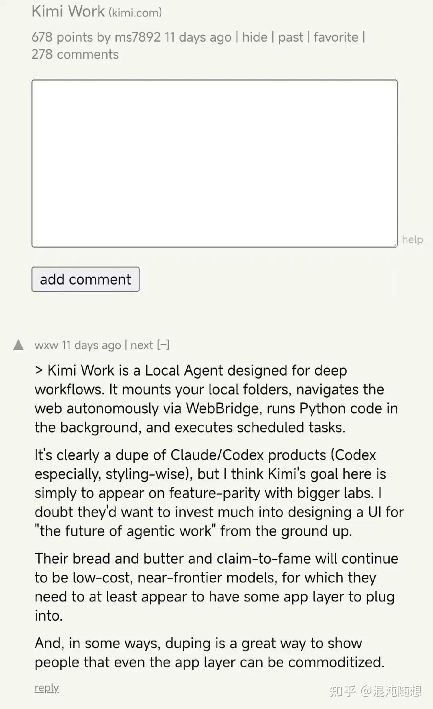
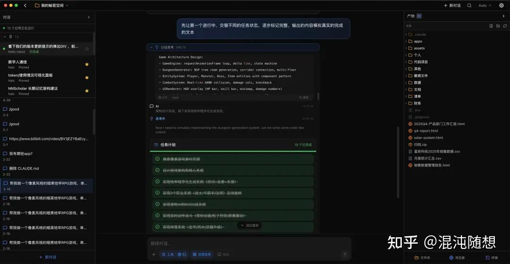
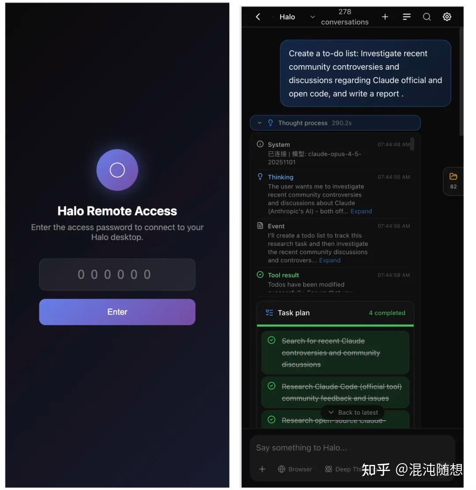
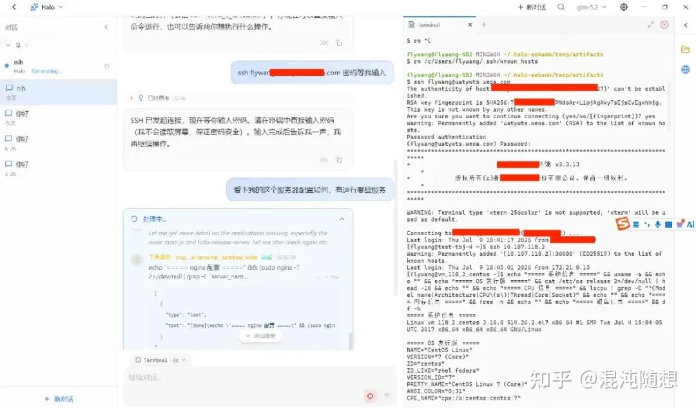
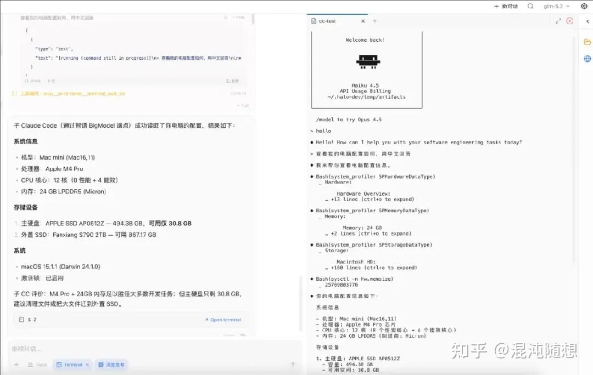
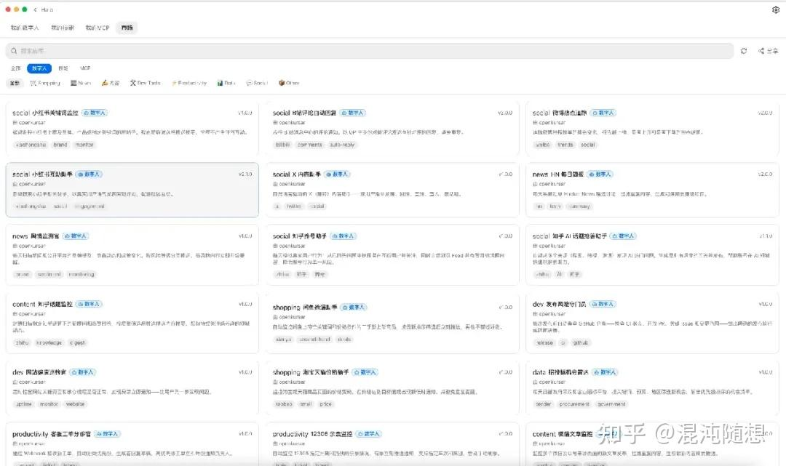
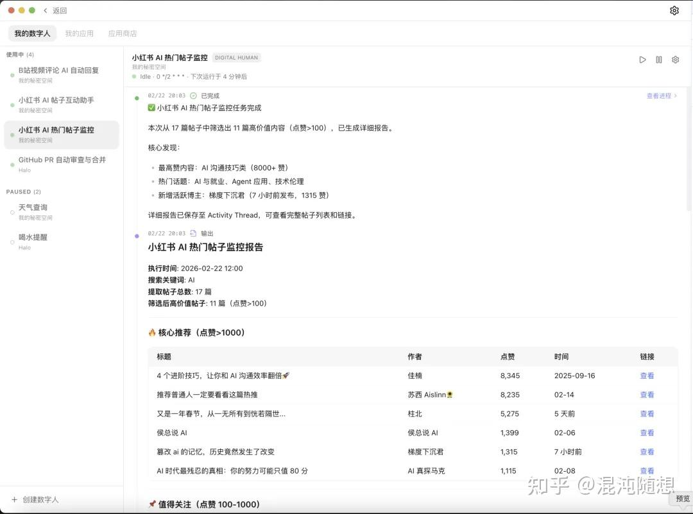
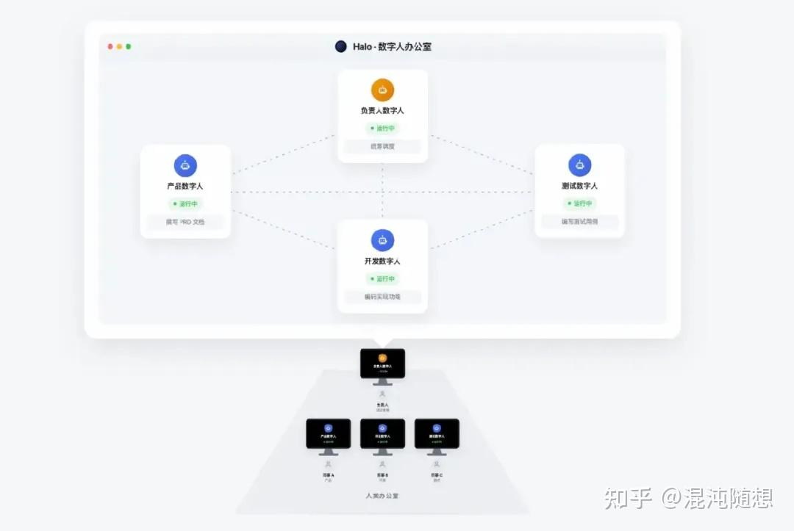

最近 Kimi K3 发布，2.8 万亿参数，国产模型再一次逼近全球天花板。K3 火了，连带着同期发布的 Kimi Work 也上了 Hacker News 热榜。我点进去，高赞第一条：

"It's clearly a dupe of Claude/Codex products."——他们在抄 Claude 和 OpenAI 的桌面。

在 Hacker News 这种纯技术社区，立场先于事实的味道很重。

我在下面回了一段。没讲立场，先承认了事实：

> 模型层面，美国实验室是真正的从零到一，这没什么可争的。但本地 Agent 桌面是另一回事——在这个形态上，美国公司是晚到的，不是先来的。我从去年就在用开源的本地桌面 Agent，其中不少是中国团队做的：左边对话记录、中间工作区、右边产物、内置浏览器。Codex 和 Cowork 出来的时候，我看到的几乎就是自己已经在用的东西。所以 Kimi Work 谈不上抄谁，是整个品类从几个方向同时收敛到了一起。

这条回复竟然被举报了。没人反驳其中任何一条，它只是没了。

说实话，我不太意外。从 Anthropic 全面封禁中资实体，到上个月 Claude Code 被逆向出针对中国用户的隐写标记——植入时更新日志只字未提，移除时同样只字未提——这套对华立场早就不是新闻了。Hacker News 评论区的举报，不过是它的毛细血管之一。

评论被删掉了，但事实还在。

同一个话题，在我这里是反过来的。我们做了一个开源的 Agent 桌面，叫 Halo。它的微信用户群里，经常有人发截图："又一家大厂做了个跟 Halo 很像的桌面。"上个月甚至有人翻出海外某估值数百亿美金的编程工具，今年五月重构的新版本，亮色主题下界面几乎一模一样。并非谁抄谁——以对话为中心的可视化 Agent 桌面，已经成了大势所趋。2026 年 1 月的 Cowork、2 月的 Codex 桌面和腾讯 WorkBuddy，走的都是这个思路。如果说 2025 年的热门赛道是 AI 编程，2026 年毫无疑问是面向普通用户的 Agent 桌面。

大方向一样，各家走出了不同的路。这篇就把来龙去脉从头捋一捋——Halo 和 Cowork、OpenClaw、WorkBuddy，到底有什么区别。

---

## 先看时间线

| 时间 | 产品 | 谁做的 | 做了什么 |
| --- | --- | --- | --- |
| 2025.10 | Halo | 中国团队（开源） | 把命令行 Agent 做成可视化 + 可远程的桌面，1 月开源 |
| 2026.01 | OpenClaw | 开源社区 | 侧重 IM 渠道远程指挥的个人 Agent（十几万 star） |
| 2026.01 | Cowork | Anthropic（Claude 官方） | AI 官方下场做 Agent 可视化桌面 |
| 2026.02 | Codex 桌面 | OpenAI | 跟进同一形态，界面被 HN 用户拿来指认 Kimi "抄袭" |
| 2026.02 | WorkBuddy | 腾讯 | 国内大厂做本地可视化 Agent 桌面，2026.03 公测（布局与 Halo 高度相似） |

Halo 的故事，从一次涨价开始。

2025 年 10 月，Cursor 调整会员策略，编程成本骤增。那段时间我们反复在问一件事：有没有一款工具，既有 Claude Code 那样完整的 Agent 能力，又能随时随地远程操作自己的电脑、驱动 AI 浏览器自主干活，还得有友好的可视化界面——文件管理、产物预览一应俱全，开发者能用，产品和业务的同学也能直接上手？

我们把市面上的东西翻了一遍，结论很清晰：不存在。要么是 Open WebUI、LobeChat 这类能自定义 API 的聊天工具，够友好但没有 Agent 能力；要么是 Claude Code、Gemini CLI 这类极客向的终端，能力够强但普通人碰不了。

没有想要的东西，那就自己做。

我们花了一个周末，用 Claude Code 给 Claude Code 造了一个可视化桌面（随后支持了 halo sdk 和 codex sdk）。第一个版本就同时跑通 macOS、Windows、Linux、Web 四端，约 95% 的功能开箱即用。可视化、空间、右侧产物区、多任务并行、手机远程控制，这些形态在那个周末全部成型——它以聊天为中心，而不是 IDE 或命令行。更有意思的是，从那以后，Halo 100% 的代码都由 AI 生成，我们再也没打开过 Cursor。

11 月发到知乎，评论区不少质疑。"AI 桌面有什么用"、"谁会远程访问自己的电脑"、"这不就是套个壳"。这些没有影响判断——我们自己每天都在用它干活，效率的提升告诉我：人人拥有自己的 AI 智能体，迟早是常态。随着一批用户的真实体验，社区的支持和反馈慢慢起来了，期间有微众、腾讯、微软等同学以社区身份参与讨论和 MR，甚至有网友主动加微信、给项目赞助。

三个月后 Anthropic 做了一遍，四个月后腾讯又做了一遍，形态几乎相同。这件事让我深刻体会到：在 AI Agent 这条路上，大胆创新并坚持正确的方向，有多重要。

半年多过去，经常有朋友说：又有一个团队做了和 Halo 类似的设计。但 Halo 的迭代没有停：AI 数字人、AI 终端、AI 团队，都是这个品类里最早落地或正在推进的东西。

---

## 四款产品，各自什么路子

| 维度 | Halo | Cowork | OpenClaw | WorkBuddy |
| --- | --- | --- | --- | --- |
| 出品方 | 中国团队（开源） | Anthropic 官方 | 开源社区 | 腾讯 |
| 可视化桌面 | ✅ | ✅ | ❌（IM 渠道对话） | ✅ |
| 远程访问（手机/平板） | ✅ | ❌ | ✅（IM 渠道） | ✅ |
| 大模型 | 自选（Claude/GPT/DeepSeek 等） | 仅 Anthropic（$20–200/月） | 自选（25+） | 腾讯生态为主 |
| AI 终端（SSH/堡垒机/指挥其他 CLI） | ✅ | ❌ | — | ❌ |
| AI 浏览器 | ✅（2025.11，最早以 AI 为中心） | 有限 | 需自配（理念不同） | ✅ |
| 数字人（持久记忆 + 7×24） | ✅ 商店一键装 | ❌ | 雏形（手写配置） | ❌ |
| 开源 | ✅ | ❌ | ✅ | ❌ |

Cowork 是 Anthropic 官方的产品，模型能力毫无疑问是顶级的，界面也成熟。但它绑死了自家付费账号，一个月到 200 美元，只能用 Claude，不支持远程，没有数字人，闭源。官方做产品的好处是稳，局限是不可能开放——开放更便宜的模型等于自断收入。

OpenClaw 走了另一条路，在开源社区爆火，十几万 star。本地优先，隐私好，支持二十多种模型，通过 Telegram 这些渠道和你对话。但它骨子里是给开发者的框架——你得自己部署、写配置、踩坑，网上一度还流传过 500 元上门代装的段子。普通同事大概率装不上。

WorkBuddy 是腾讯紧跟这波趋势出的本地可视化 Agent，形态上最接近 Halo：集成了 Cowork 式的可视化，用 IM 实现了 OpenClaw 类似的远程能力，前端渲染架构也是 web / h5 / 桌面客户端复用，跟 Halo 的做法一致。打开会觉得眼熟——左边对话、右边产物、空间概念，理念几乎一样。大厂出品，打磨和稳定性有保障。短板在扩展性：自定义能力弱，Agent 编码能力较弱，没有 AI 终端，也没有持久记忆的 AI 数字人。

Halo 全球首个把可视化、远程访问、空间、产物区、画布等这些概念带到桌面 Agent，从第一版就有。支持 Windows / macOS / Linux / h5 / web / Android 等多端，开源，可企业级部署。扩展性是它和其他三家拉开距离的地方：Agent 引擎可以自由切换，从 Halo SDK 换到 Claude Code SDK、Codex SDK 都行；模型供应商支持几十种，可以按任务场景配不同的模型，并且由社区驱动仍在持续创新。

---

## Halo 的设计和创新

Halo 的这些早期设计，现在成了行业共识的形态，也正在被同类产品吸收。这很正常，AI 的设计体验会趋同化。但 Halo 的设计目标从来不是追随某个概念或某个已有产品，它的驱动力始终是用户效率和体验。别人跟进我们的方向，恰恰说明产品判断力没错。

这些设计大多是在实际工作里碰了壁之后自己琢磨出来的，没有参照物。

AI 干活的时候人在干什么？大部分产品的答案是"看着它干"，我们不接受这个答案。Halo 从第一版就是多任务并行的，一个任务跑起来你就该去开下一个，没必要守着进度条；Agent 那些又长又碎的思考过程，聚焦模式直接折叠掉，只留最终结果，想看再展开，盯着 AI 一行一行地想也是一种等待；人离开工位活儿更不该停，打开远程访问，浏览器里输个地址就能操控家里那台电脑上的 Halo，手机、平板、公司的机器都行，不用装客户端。这几件事看着零碎，指向是同一个：把人从等待里摘出去。

PC 端效果：

移动端效果：

同样的思路往深里推，就是下面三块。

### AI 浏览器

去年做 AI 浏览器的时候我卡了很久。卡的不是技术，是它在产品上该放哪：嵌在对话里，还是做成独立模块？

当时把市面上能找到的 AI 浏览器都试了一遍——Arc、Edge Copilot、Chrome Gemini、OpenAI Atlas——做法大同小异，都是在浏览器旁边加一条 AI 侧边栏。仔细想，这跟二十年前给翻盖手机加触屏没什么区别：旧东西上贴个新零件，形态本身没变。没有一个让我觉得"对了就是这样"。

后来我换了个角度想：浏览器存在的目的到底是什么？答案很简单——获取信息。但有了 AI，获取信息这件事不需要人来做了。想通这一点，后面的设计就自然了：浏览器不是目的，是工具。它不该摆在台前让人操作——它该退到幕后，变成 AI 的眼睛和手。人只在必要的时刻出场：登录、支付、确认。

所以 Halo 的 AI 浏览器（2025 年 11 月上线）和别人的方向是反的。你说"帮我在京东和拼多多比个价"，AI 自己打开页面、滚动、读内容、给你结论。整个过程浏览器藏在画布后面，你不需要看到它。到了要付钱的时候，画布弹出来，你接手，搞定关掉。

还有一个重要创新：Browser Action。让 AI 靠"看截图/DOM、找按钮、点一下"去操作网页，token 使用高、成功率也低。Halo 把这件事拆开——AI 只决定做什么，怎么做交给一段预先写好的脚本，直接跑在真实浏览器里，能拿到 DOM、Cookie 和内部接口。发一条知乎想法、读 B 站的评论通知、查内网 OA 的待审批单，都成了可复用、可分享的模块。AI 决策，Action 执行，稳定可复现。这也是数字人能真正 7×24 干活的前提：生产可靠的浏览器操作不是全凭 AI 探索，而是封装成固定可复用的执行层。

AI 浏览器本身已经不算稀缺了，越来越多的同类产品也有。包括"AI 为主、浏览器退到幕后"这个理念，也正在被其他产品吸收。

### AI 终端

这个功能的出发点和浏览器一样：不是给人一个更好用的终端，是让 AI 接管终端。

Claude Code 这类工具的 bash 能跑命令、拿输出，但碰到交互式场景就卡住了——SSH 跳板机、堡垒机、需要 token 登录的环境，这些都需要人机来回切换，脚本搞不定。

Halo 的做法是人机接力：你来登堡垒机、输密码，这些只有人能做的事做完，剩下的全部交给 AI。它能同时控制多个终端窗口，一条条执行命令、看输出、做判断、处理异常。

更有意思的是：AI 可以在终端里打开 claude code、codex、zcode 等——也就是用一个 AI 去指挥另一个 AI 干活。你在 Halo 里说一句需求，底下可能有好几个 CLI Agent 在协同。

凡是你能在终端里手敲出来的活儿，现在可以交给它盯着干。配上数字人的定时能力，就是一个真正的 7×24 运维值班员——每半小时巡检一次服务器，发现异常自动登机器排查、拉日志、定位原因，搞定了推企微通知你。人只在需要审批或输密码的时候介入。

这个功能到今天为止，在所有 Agent 桌面里仍然是独一份。最接近的是 Warp 这类"AI 终端"，但方向正好相反——那是给人用的终端加了 AI，Halo 是让 AI 当操作员，人只在需要交互的时候出场。Claude 社区里至今还有人在 Reddit 上分享怎么"另开一个终端带外输密码"来手工拼出这套流程。

### AI 数字人

ChatGPT、Manus、Cowork，交互模式都一样：你给一个任务，它做完，结束。下次再来，从头开始，什么都不记得。

Halo 的数字人是另一个物种，它在 2026 年 2 月份上线。不是"更聪明的对话框"，是一个常驻的岗位——有自己的身份、有持久记忆（记得上次做了什么、发现了什么）、7×24 自动运行（定时或事件触发）、有事主动找你（邮件/企微推送）。你从商店选一个装上，填几个参数，它就开始干活，不用写代码。

这和 OpenClaw 那种手搓配置的思路不一样。提示词、经验、技能、MCP、接口，这些东西怎么搭、怎么组合，本身是件专业活。Halo 主张的是：让懂这个场景的人先把它预制好，再分发给需要的用户。老板去市场上雇的是已经具备技能的人，而不是买一堆技能回来自己拼。这是理念上的转变。

而且下一步已经在路上了：Halo 即将发布去中心化数字人团队——每个人电脑上的 AI 数字人都能加入同一个"虚拟办公室"，和你的团队成员协作。从个人的 AI，变成团队的 AI。

---

## 现阶段的短板

Halo 不内置免费模型，需要用户自己带 API Key。对不熟悉 API 的人来说，这一步有一定门槛。但它定位开源，意味着任何企业能自由二次开发，接入自己的登录体系和公司免费模型。

其次，功能多但复杂度也高，不是打开就会的东西，有上手成本，同时团队规模和大厂没法比，产品细节的打磨还有差距。但在 AI 时代，团队规模的效应逐步递减，传统的开发是人力堆积，而如今，AI 生产占比几乎 100%，大公司的人力优势逐渐退化成 AI 之间的 PK，这一点小团队和大公司在使用先进模型的机会上是平等的。正因如此，AI 时代，大量概念和应用都是率先在小团队诞生，诸如 Cursor、Manus、Halo 等。

另一个明确的短板是，Halo 无法接触封闭生态的数据，比如微信群发消息、腾讯支付、美团、阿里闪购这些大厂不开放接口，数据拿不到，服务打不通。这是独立开放路线的代价。

---

## 最后

回到 Hacker News 那条高赞：中国团队在抄 Claude 和 Codex 的桌面设计。

时间线已经回答了：被指认的"原创"，实际是姗姗来迟的那一个。

模型层面，美国暂时领先，这不需要回避——但 K3 已经把差距压到很小了。Agent 应用落地这一层，快的一直是中国团队。这个分工上一个科技时代就出现过：操作系统是美国的，移动支付和短视频是中国的。如今只是重演——模型是他们眼下的长板，应用是中国团队的主场。

Halo 的创新并不会停止。我们的使命是致力于全天候无人干预的 AI 工作台。市面上的概念换得很快，每隔几个月就有新名词，我们不追逐，也不与之比较。我们只聚焦一件事：让人更快、更省心——消除一切不必要的人工与等待。

Halo 是 100% 用 Halo 自己开发出来的，在自发传播的情况下积累了成千上万的用户，他们每天用它构建自己的东西。这本身就是一次效率边界的探索：不参考、不跟随任何外部概念，最好的方向来自个人与团队最直接的反馈，来自效率本身。

---

原标题：《中国团队引领的 AI 创新：市面上的智能体桌面有什么区别？》

开源地址：<https://github.com/openkursar/hello-halo>

《如何从零构建 7×24 小时 AI Agent》：<https://book.imwangfu.com/>

相关资料：<https://news.ycombinator.com/item?id=48981703>
