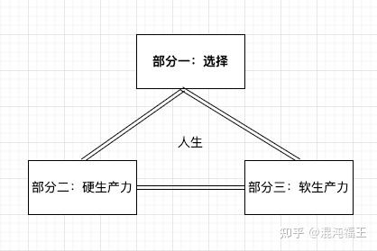

许多技术人员，喜欢蒙头做技术，会热衷于诸如效率、先进等事物探索和追求。这是美好的一面。

但现实世界中，**人与人之间，人和组织之间，并不是简单的线性关系**，你的先进，你的高效并不能立马反馈到自身的利益。马斯克收购了推特后，第一批协助他革新公司的员工，很快也被裁员了，当时还有一个女主管上头推特热门，发图表示自己睡在公司，永远支持马斯克的决策，但喜剧的是，很快她也收到了离职邀约。**推特的这场裁员，涉及高管到基层，以及 AI 团队，无论你尝试做出怎么样的努力，提高效率也好，加班也好，对结局而言并没有太大影响**，因为这是从马斯克商业成本角度，对整个组织架构做的大瘦身。（有人可能会反驳，你的高效，可以避免大瘦身的时候影响你，这完全错了，从组织的角度看裁员更多的是基于架构、业务侧动手，很难有时间去评估个体生产力，**不要幻想好好表现和卖力拯救自己**）

我自己深处这个行业的前沿，有时候非常有感悟，朋友经常调侃：我们这种技术人员就是一直给自己制造挖坟墓的工具，直到有一天，把自己埋进去。

比如 gpt 去年火爆，擅长使用工具的人，可以利用它一周写下几千行代码，效率提高数倍，但最终又如何？当这些代码只是躺在仓库，如果影响微乎其微，你所做的和慢慢悠哉写下祖传代码又有个区别？ **对于一个普通的商业组织，最终市场反馈，盈利才是最核心的**。

从整个组织系统观察，通常每个成员越高效，确实能节约成本，大家都用笔写字和 AI 生成文字能一样吗。**但更大的公司在组织上很难去观察到某个个体的过程效率，通常只关心结果。**

举个最简单例子，某开发 A 从事项目1，他每天利用高效的工具，快速支持产品功效上千行高质量代码，但项目1最终平平无奇。某开发 B 从事项目2，每天慢悠慢悠用祖传方案写 100 行代码，但因为这是触达更多用户，且贡献了大量利润。**最终在组织的层面，不会因为 A 使用了先进、高效率的技术而得分**，甚至会让他背锅。

（理想的组织会考虑这种情况，并尝试文化上的激励补偿，但这对组织管理者的要求极高。）

这种个体和组织的关系非常微妙，A 也许比 B 在同一件事情生产率更高，但项目的选择、组织的选择对结局的影响反而更大。（**这就是所谓的选择大于努力**）

这是不是说明个体追求更先进，更高效就没有意义呢？

并不是。通常对于个体一部分是靠选择机遇，一部分是靠硬生产力（所谓效率，先进性等），另一部分是靠软生产力（所谓社交、领导力等）。

从技术人员的角度看，如果社交能力和选择机会固定不变，仅增强硬生产力对你可能无益。比如你做一个低价值项目，你运用再多先进的东西完也不会有人关注。但改变“选择”的路径是关键，即必须让你的硬生产力服务于更有价值的事务。**这正是市场自由流动的好处，使得人才能够自由流动，寻找更具竞争力的机会**。

但有益的自由流动前提是：你必须拥有“更具竞争的硬生产力”，不管你的事情和处境是否有希望，**你对自我的追求带来的个人内在价值并没有丢失，因为未来的机会是留给有准备的人。**

有了上一次经验，个体通常会更慎重，选择更有潜力和价值的项目。这是也优秀创业公司能够快速发现并吸纳新型人才的时机，并且有机会做出比大公司更优质的产品。

在 AI 给公司带来更高生产力的大背景下，也赋予了个体更强的生产力。 像WhatsApp这样的公司，在被Facebook收购之前，团队规模不超过20人，如今，这种小而精的趋势愈发明显——这里再次致敬创业公司（[参考之前的随想](https://imwangfu.com/2024/03/why-small-win.html)）。

回到随想的主题，我们使用更先进的工具、提高自身效率和能力，并不会因为当下投入没有得到公司、组织的认可而无意义。 **而是当你发现在做大量无用功的时候，是应该尝试在另外两个维度进行改变和提升。**

最后，鉴于当前的大环境并不理想，有志之士应当“潜龙在渊”，静待时机，祝好。
