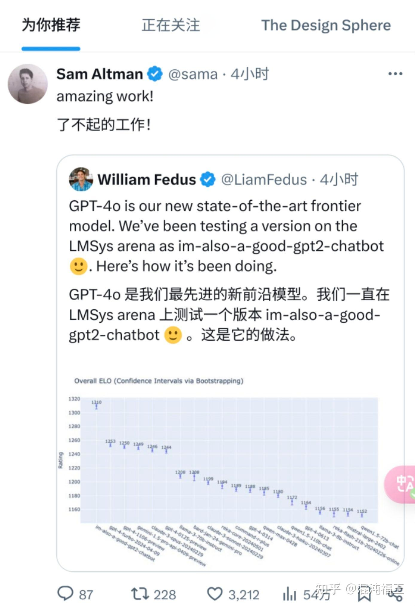
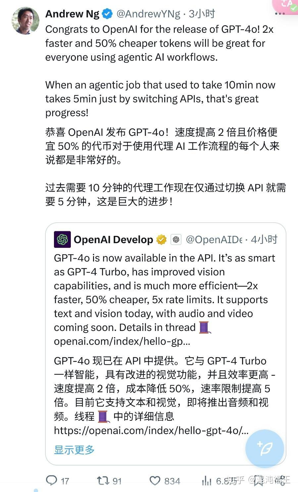
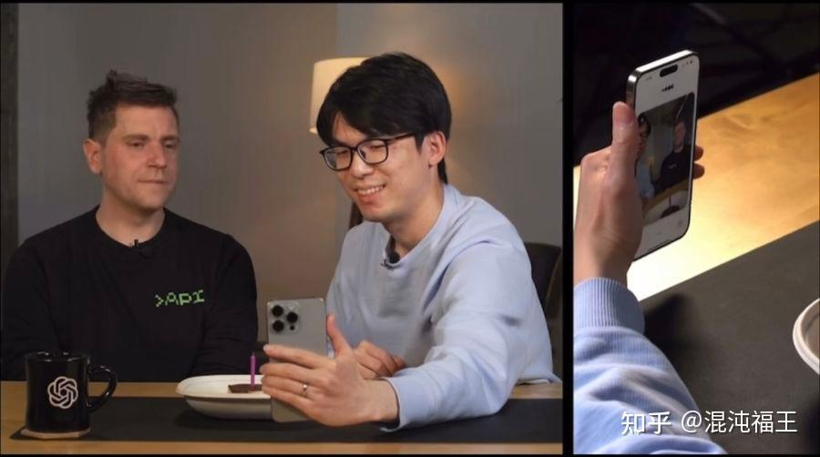
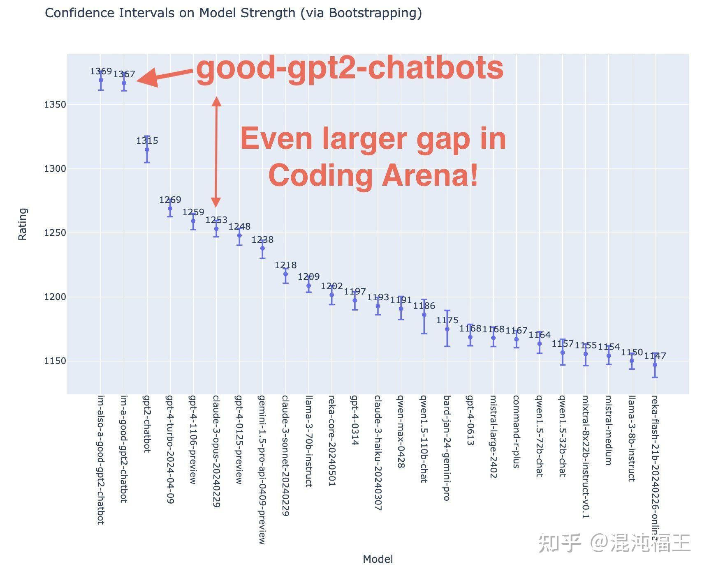
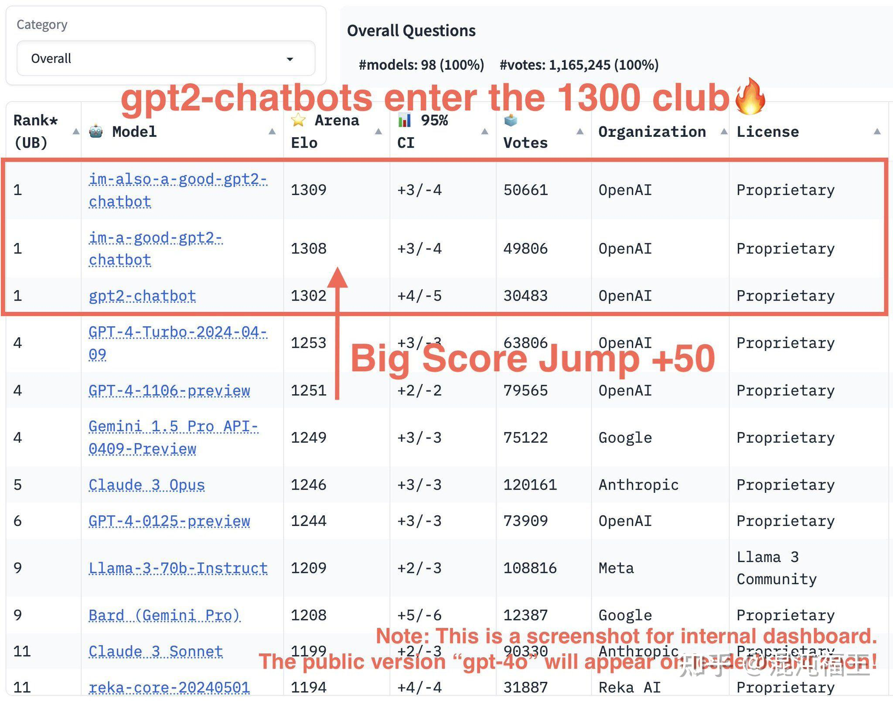
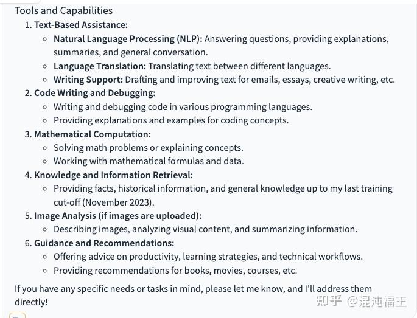
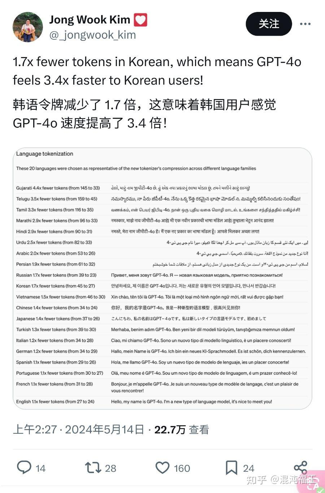
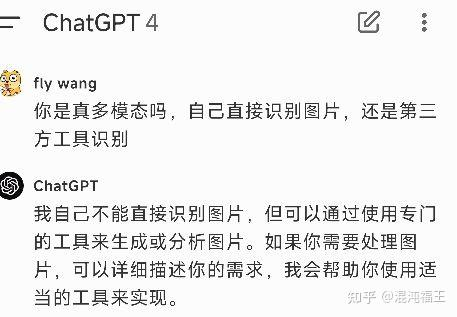
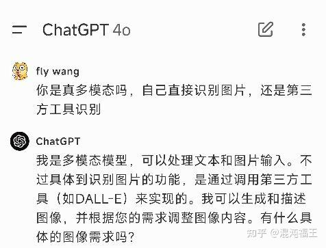

昨天凌晨，如期而至。

省流版介绍:

1. gpt-4o 就是之前传闻的 gpt2-chatbot，性能超原版 gpt4，且更便宜。

2. 现在将免费像所有用户提供 gpt-4o，会员次数更高。

3. 发布了一个像电影里 《her》这样的功能，端到端音视频，响应更快。

虽然视频语音实时对话成了热点。

但鉴于目前还无法体验（未来几周向会员推送），我并不抱很是很感兴趣。

实时视频语音看起来炫酷，但考虑到我不会在公共场合很很尬尴的对着 AI 大声讲话。而在家里独自一人的场景大部分是文字相关，生产力级别的还是文字版速度和能力你提高。

如今 openai 的发布会越来越少涉及技术了，在性能大幅提高，但速度变快，还免费的背景下，底层的逻辑仍然没有透明。

我们来看看目前是可以如果做到这一点的？虽然多模态是底层技术的趋势，但对于上层应用而言可以有竞争的方案还没有改变。比如基于小模型比如 gpt2 这种小规模的参数量，训练一个高效转发的 Agent 机制，动态代理到不同的大模型，比如 gpt4 微调版本中，而这种 gpt4 代理在诸如数学、编码、文章续写等大垂直领域做了更精细微调以及参数瘦身（提高响应速度），最终对用户而言，就像是一个模型整体。达到在特定领域比如编码，推理提高更多（实际gpt2-chatbot最初给人惊艳的地方在这里）。

对于底层而言，更证明了**多模态加 Moe 仍然是很有竞争力了方向。**

目前 openai 这个版本优化到底细节有哪些，明无明显细节和资料（新模型官方已经确定说是原生多模态）。就当前的gpt-4o，与所有其他模型相比，胜率明显更高。 例如，在非平局战斗中，与 GPT-4（6 月）相比，胜率约为 80%。

下面是之前提到的一些 gpt2-chatbot（现 gpt-4o）调用的证据

同时 token 能更快的返回，特别是针对非拉丁语语言，据 openai 员工表示，和分词器的优化离不开。

好了，期待后续更多技术细节探索。

也期待未来几周发布的《她》给文化、娱乐、教育、工作领域带来更多想象。

——更新——

**新版会承认自己是多模态。**而旧版会说基于第三方工具，如果基于追问就是 orc 识别加模型处理。

### 免费、多模态 go!go!go!
