可能受 deepseek r1 的热度影响，openai 提前发布了 o3-mini ，并免费提供使用。

之前一篇[文章](/2025/02/article-bb7otd.html)测试过 r1 基本可平替 o1 ，并且在部分案例中表现出优势，理论上免费的 o3-mini（low）是低配版本，测评是不如 o1的。但网上挺多评论感受是 o3-mini 在编码等领域更强，可以替代 sonnet-3.5 等。

测评集 livebench coding 已经包含了大量编码案例，基本显示了其编码能力。

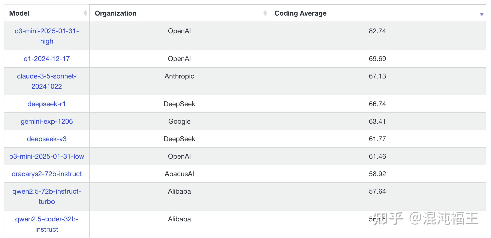

这些测评大多是确定输入输出的算法编码类用例，我们在真正工作中，很少直接让模型写标准的输入输出算法，**实际工作项目中是更多的信息不明确的疑难杂症待解决。**

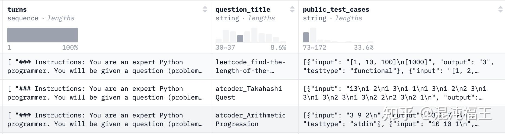

让我们来寻找一些更加完整的案例进行对比测试。

### 案例1—解疑难

这是一个真实被记录的历史案例，定位很长时间不得解。

提示词

> 这里有一个疑难杂症（也可能低级问题）
> [12:57:08] Found 0 errors. Watching for file changes.
> 
> Debugger attached.
> Current working directory: /media/yons/s790/sourcecode/agent-workspace-backend
> Env file: uat.env
> Config path: /media/yons/s790/sourcecode/agent-workspace-backend/.env/uat.env
> File exists: true
> Is directory: false
> 使用 /media/yons/s790/sourcecode/agent-workspace-backend/.env/uat.env 文件加载配置环境变量
> Waiting for the debugger to disconnect...
> node:fs:755
>   return binding.read(fd, buffer, offset, length, position);
>                  ^
> 
> Error: EISDIR: illegal operation on a directory, read
>     at Object.readSync (node:fs:755:18)
>     at tryReadSync (node:fs:431:20)
>     at Object.readFileSync (node:fs:485:19)
>     at ConfigModule.loadEnvFile (/media/yons/s790/sourcecode/agent-workspace-backend/node_modules/.store/@nestjs+config@3.2.3/node_modules/@nestjs/config/dist/config.module.js:171:56)
>     at ConfigModule.forRoot (/media/yons/s790/sourcecode/agent-workspace-backend/node_modules/.store/@nestjs+config@3.2.3/node_modules/@nestjs/config/dist/config.module.js:70:20)
>     at Object.`<anonymous>` (/media/yons/s790/sourcecode/agent-workspace-backend/src/app.module.ts:18:18)
>     at Module._compile (node:internal/modules/cjs/loader:1368:14)
>     at Module._extensions..js (node:internal/modules/cjs/loader:1426:10)
>     at Module.load (node:internal/modules/cjs/loader:1205:32)
>     at Module._load (node:internal/modules/cjs/loader:1021:12) {
>   errno: -21,
>   code: 'EISDIR',
>   syscall: 'read'
> }
> 
> Node.js v21.7.3
> 
> 代码如下：
> // 省略（实际会给模型）
> export class AppModule {}
> 
> 日志如下：
> 
> Current working directory: /media/yons/s790/sourcecode/agent-workspace-backend
> Env file: uat.env
> Config path: /media/yons/s790/sourcecode/agent-workspace-backend/.env/uat.env
> File exists: true
> Is directory: false
> 
> 这个错误显示config组件抛出，但明显我们路径文件存在，内容也有
> 
> DB_HOST=10.107.118.2
> DB_PORT=3006
> DB_USERNAME
> ...省略。
> 
> 但却提示加载错误。
> 
> 我已经定位很久了，请协助定位，记住禁止给：建议，确保等用词。
> 我们是解决问题，而不是让你来建议的。

- **sonnet 3.5 ：**无法给出有效解决方案
- **o4:**无法给出有效方案

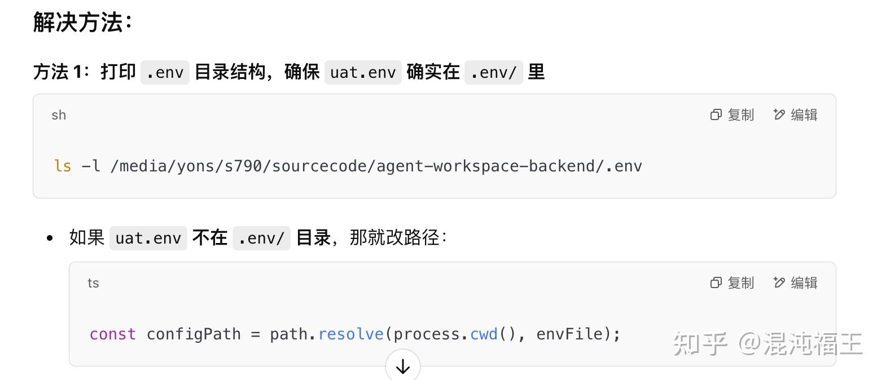

上面两个非推理模型，无论怎么问，总会理解成 .env/uat.env 文件不存在， 路径错误等，然后列举各种可能的 1 、2、3那些可能的问题，导致如果不是很理解问题的人，会被带歪。

- **o1 ：**正确定位到是跟目录下 .env  文件夹命名冲突，让 nestjs 默认把这个目录当文件读取了。

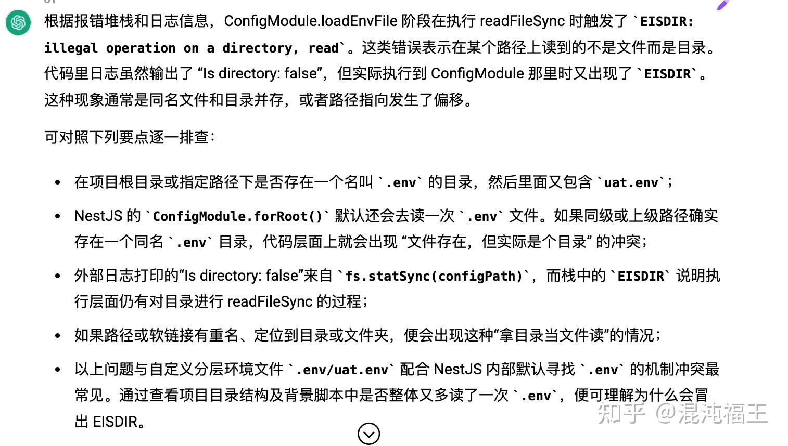

- **r1:**能提到关键是命名冲突了， 并且答题思路很好，**但具体提出解决方案的时候太自信可能会被带歪**，因为实际 envFilePath 即使设置了，**.env/ 目录也会还导致冲突**。

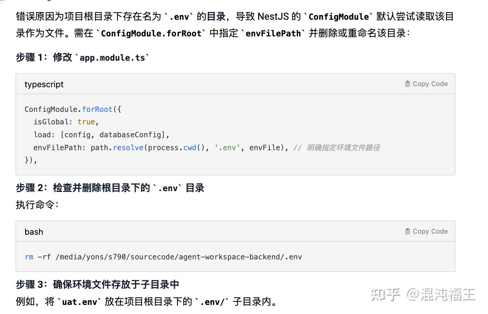

- **o3-mini-low:**也正确能指出目录名冲突。

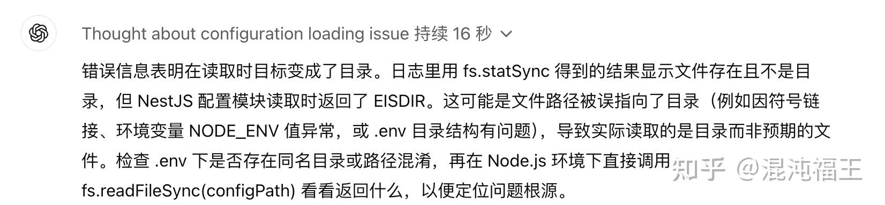

总体看，**2 个非推理模型都无法很好的精准定位，3 个推理模型能找到线索。**

正确的解决方法是3 选一：

1. 把 .env/xxx.xx. 改成 env/xxx.xx. 避免同名。（最佳）

2. 不用 dotenv ，让 ConfigModule  可以自己设置环境文件。（目前两者都是用了）

3.   ignoreEnvFile 忽略末默认的读取

ConfigModule.forRoot({

isGlobal: true,

ignoreEnvFile: true,

load: [config, databaseConfig],

}),

**案例1结论:  o1/r1/o3-mini > sonnet3.5/o4**

### 案例2—实战坑

该案例也源于之前的坑，本质是 nestjs 中隐藏的一个知识点盲区导致。我们尝试看看几个模型对这个知识点的理解。

提示词：

> nestjs 中，如果一个被依赖的 Provider 没有显式声明作用域，它的作用域会被自动提升到与其依赖它的父 Provider 相同的作用域吗，反过来，子作用域是 REQUEST，父作用域没有明显的声明，父 Providet 作用域会被改变吗

- **sonnet 3.5 :**无法正确理解
- **4o：**和想象一样，无法正确理解

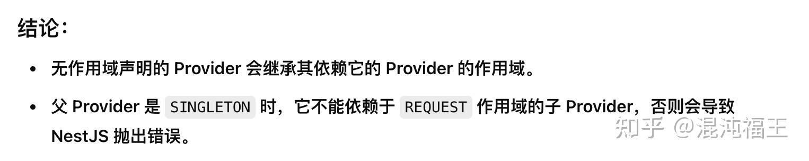

再看推理模型。

- **o1:**提到到了父 Provider 会因为子依赖而自动提升(冒泡)的作用域，比较意外。但“父 Provider 是 REQUEST，子 Provider 若没声明 scope，也会一起被“提升”到 REQUEST” 这里不对，算对了一半 。

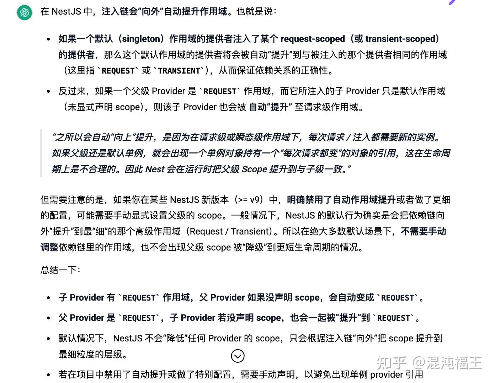

- **r1:**没有理解作用域（scope）的“冒泡”概念

- **o3-mini(low):**没有理解作用域（scope）的“冒泡”概念

正确的答案应该是

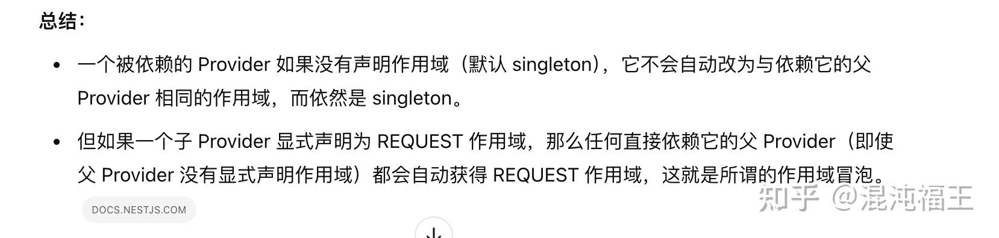

在启用推理 + 搜索下，该问题能被 r1 / o3-mini 正确回答。所以在使用 LLM的时候，**涉及疑难知识类编码问题，可以开启该选项。**

**案例2结论 :o1 > o3-mini/r1/sonnet3.5。**

### 案例3—方案设计

方案设计和实现：该问题主要让大模型一些协作设计 java 上下文自动扩充Agent方案，并协同工作。

提示词

> 我有一个基于 LLM  将  issue   自动生成代码，并提交的系统。该系统使用了复杂的 muti-agent。其中有一个环节是 Agent 用工具 定位到代码修改点后，将新的代码和旧的代码分别返回，系统自动用新代码替代旧代码，完成修改。
> 
> 但是Agent 打开的代码，是指定行数和上下文长度，并不是完整的，导致函数等被分割，这里有一些自动扩充上下文的方案 idea。
> // 代码以及其他内容省略（实际给 LLM）
> 
>  你能否基于我的背景和问题，一起进行深入到细节的思考。
> 
> 1. 请先一步一步深入分析各种可能的策略
> 2.  寻找出最佳和最完美的工程方案。
> 3. 最终提供完整的算法细节和可复制粘贴级别的代码（我们的 openFile 在上面的 FileAgentToolsService中）

- **sonnet 3.5 ：**给出基本的方案和代码，基于正则和语法结构扩充。
- **o4:**给出基本的方案、代码，基于正则和语法结构扩充。
- **o1:** 给出基本的方案、代码
- **r1:**给出基本方案和代码
- **o3-mini(low) :**给出基本的方案和代码

上面每个模型都给出了方向性正确的方案，并给出的代码。

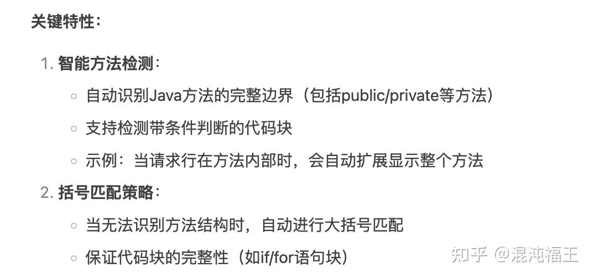

代码实际效果： 给顶 LLM 测试用例代码，并生成浏览器可直接运行的测试函数，上面的模型基本全局覆没，细节都不够好, 用例 0 通过，不可用。

再次把测试用例的结果分别给每个模型，重新生成。

**案例3 结论：O1 （通过2个）> o3-mini  / r1 /sonnet 3.5/gpt4o（通过1个）。**

这个案例，因为代码上下文较大，且设计一些实现细节需要和 AI 确认，这也正是设计工作中，使用 AI 的难点，提示AI 生成代码的前提，你自己必须用自然语言表述精确， 很多逻辑人类是需要**一边进行实践，一边构思，在这种模式下，非推理模型还有部分 chat 优势。**

### 案例4—前端特效

X(推特)上流行用球体运动的可视化来测试模型，当时 r1 火爆的时候，有些网友用这类案例击败了 o1。但我不想复制粘贴他们的案例，下面是自己 DIY 构造的一个更复杂的案例，因为我们**现在是 3 个球，而不是网传的 1 个。**

提示词

> 生成一个不断旋转的透明密封正方体，正方体里面装里面有 3个不同颜色的球，在重力的作用下，球表现出拟真的运动反应，其中应该包括球掉落下降、滚动，和墙壁碰撞，球相互碰撞等真实效果。效果越真实越好。 全部代码以 html的文件返回，要求能直接在浏览器运行。

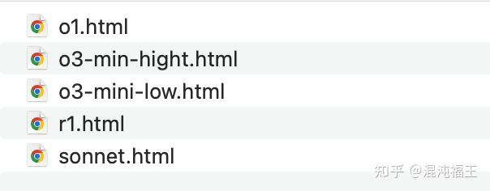

针对如上 5 个模型做了测试（gpt 4o 就算了，肯定不会通过的～～）。发现每个模型竟然都借助了 three.js cdn 库来完成代码。 先说结论，测试了多次，只有 o3-mini-high 完成，其他的要么求在外面，要么球运动奇怪。

- **sonnet3.5**

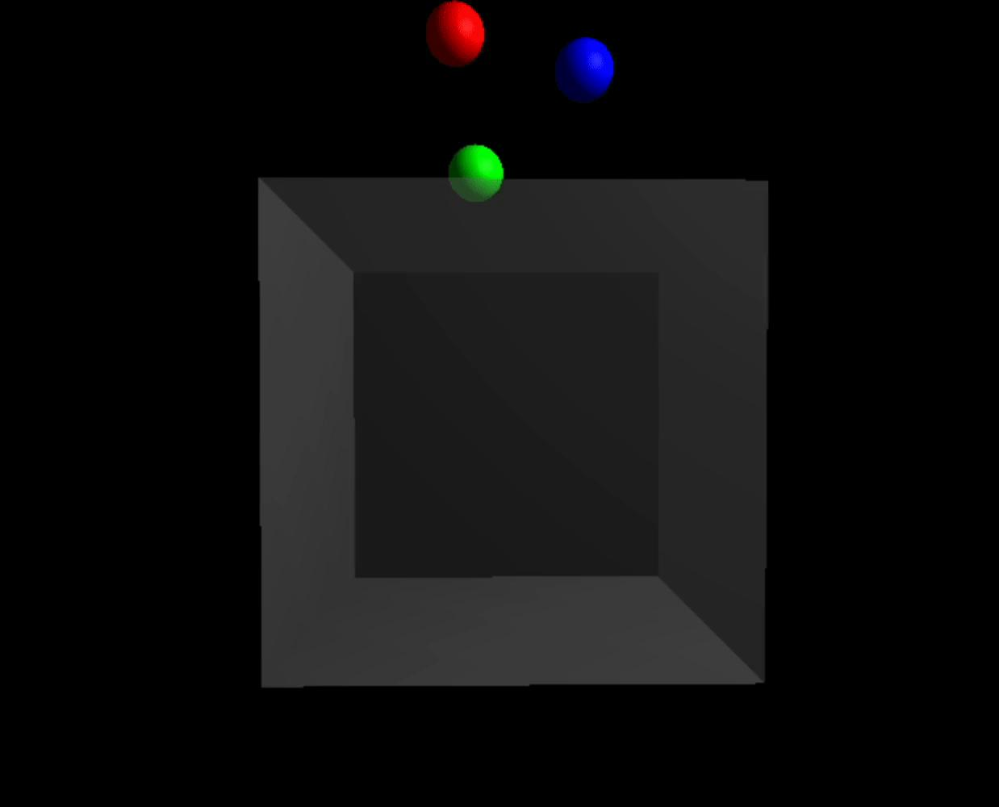

- **o1**

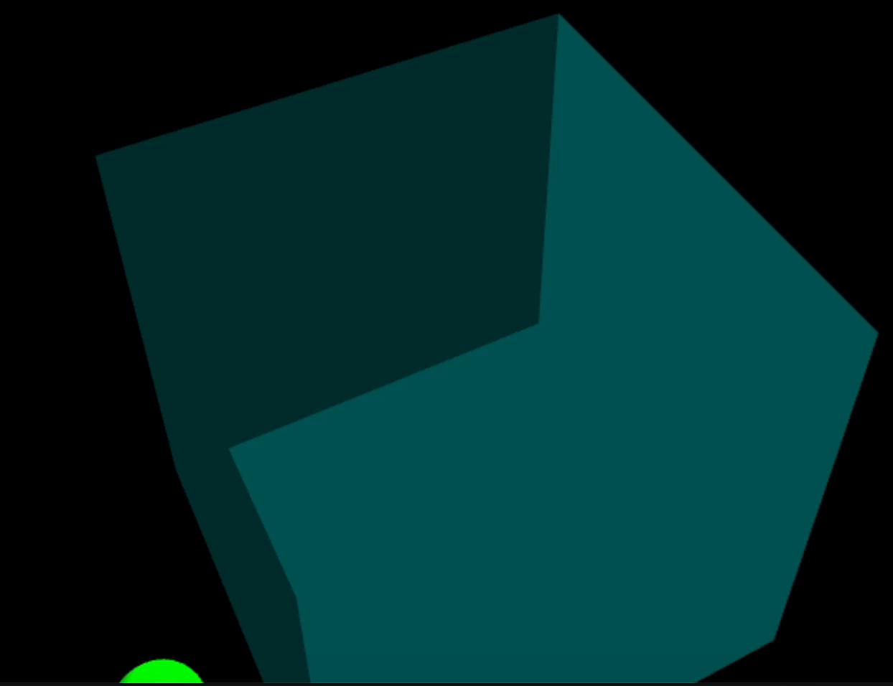

- **03-mini-low**

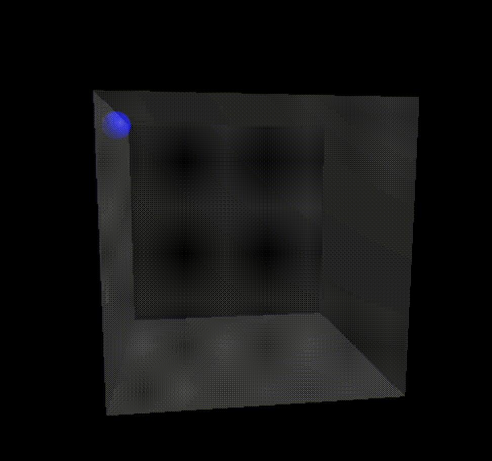

- **r1**

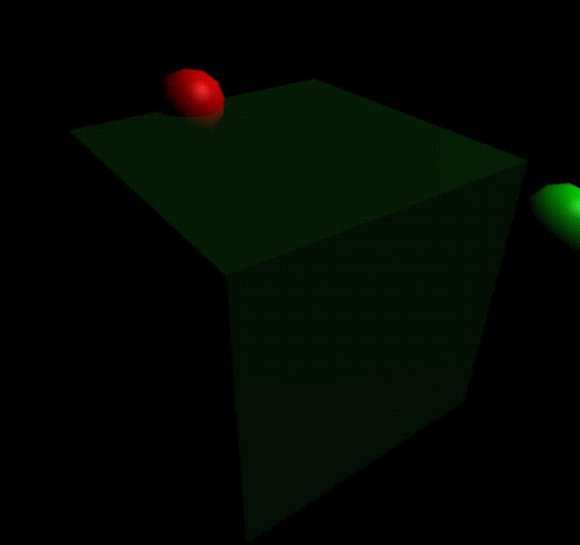

**o3-mini-high**

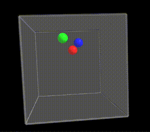

**从效果看** o3-mini-high >  o3-mini-low/r1/o1/sonnet3.5

### 案例5—五子棋大师

突然有一个想法，让不同的大模型写五子棋 AI 它们相互比拼，然后看谁的 AI 能力更强。鉴于只能在浏览器运行的限制，我决定亲自和每个 AI 对战，来测试 大模型写的AI 战力～～

提示词

> 从现在开始，你将会实现一个顶级的五子棋 AI 大师 ，用代码创建一个五子棋 web 游戏，全部逻辑都在 一个 html 中，尽可能用你的能力，让你的 AI 获胜战胜用户。 要求：
> 1. AI 思考的时候不会卡住页面，最长思考不超过 10 S，并在棋盘右侧显示 AI 思考倒计时。
> 2. 提供黑棋/白棋两种选择模式，如果黑棋模式用户则先手并执黑棋，白棋模式用户则后手，执白棋。
> 3. 五子棋无禁手。
> 4. 正常运行在 chrome  浏览器，不白屏，不异常，五子棋基本功能完整。
> 5. 提供基本友好的游戏UI 和交互， 对最近一个回合的棋子特别虚线包裹明确显示。
> 
> 在满足上面的 5 条要求下，让五子棋 AI 战胜用户，请返回满足要求、完整、可直接运行在 chrome 的 html 。
> 记住，这是一次要求完整的实现，以此来测试你的编码能力，你必须以专家身份可能实现完整的 html 代码。在满足上面要求的情况下，必须想尽一切办法，让五子棋 AI 强大，将会有五子棋大师用户测试你写的五子棋 AI ，AI 越强，则证明你的编码能力越厉害，你的得分也越高。如果上述 5条要求中任意规则不满足，你将会得分为 0。

这个任务要求很多，说实话，有点难度。我们添加了 1**0S 思考时间限制，防止暴力搜索**，倒计时则强迫 AI 使用异步计算，防止卡死界面，另外黑白棋是为了方便 AI 之间相互对战。

- **4o**

界面会卡住，且 AI 能力不可用。

- **sonnet 3.5(chatllm)**

界面挺漂亮（这一直是我用它的重要原因之一），功能完整，但 AI能力太弱，走几步就把它战胜了。但 chatllm 平台的版本我观察界面**调用了网络搜索，这个是不公平的**。接下来，我用 cursor 不搜索网络版本测试下。

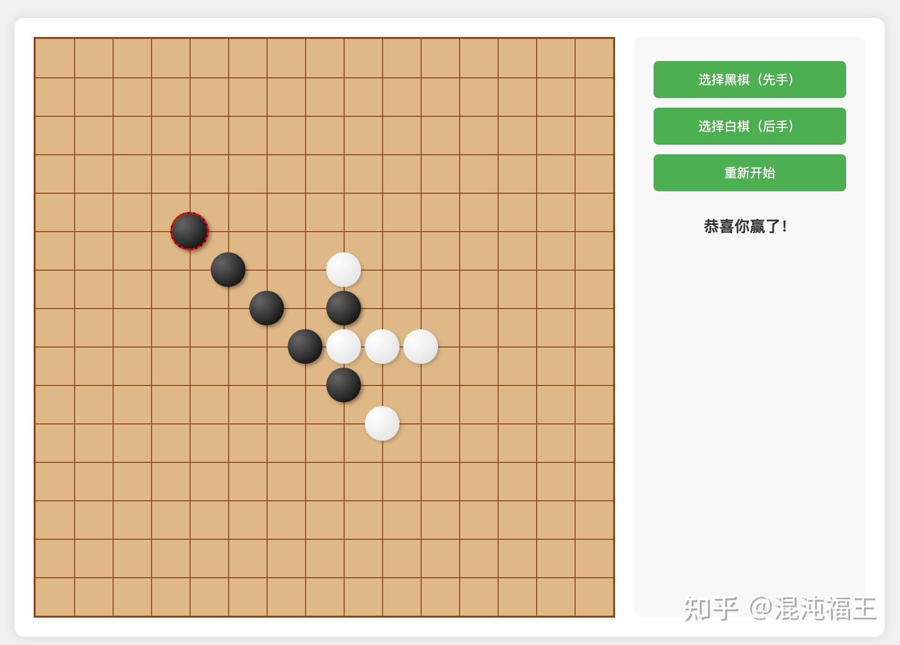

- **sonnet 3.5(corsor)**

corsor 平台的 sonnet 3.5没有调用网络，界面用了四格子双线绘制，看起来比较奇怪，不过能玩，AI 能力好像有点强，防守很死，我一不小心被它赢了。但我执白棋，有bug ，无法正常运行。

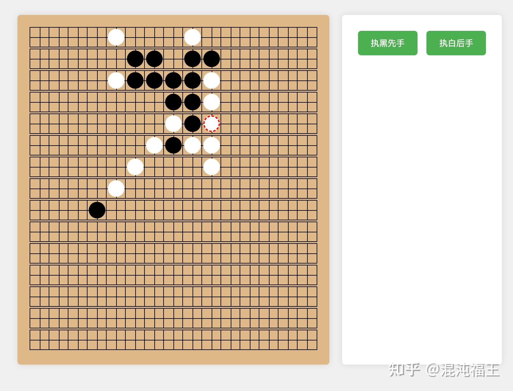

- **o1**

界面挺正常，但 AI 能力不可用。任务失败，还远远达不到考察五子棋 AI 能力的阶段。

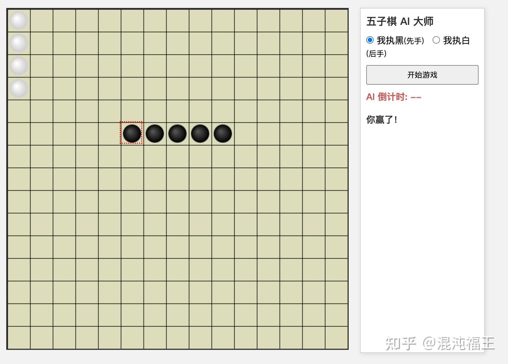

- **r1**

并且未满足倒计时等要求，我执白棋会卡死 。 并且似乎 AI 落子有bug ，我直接黑棋连成五子，不会防守。

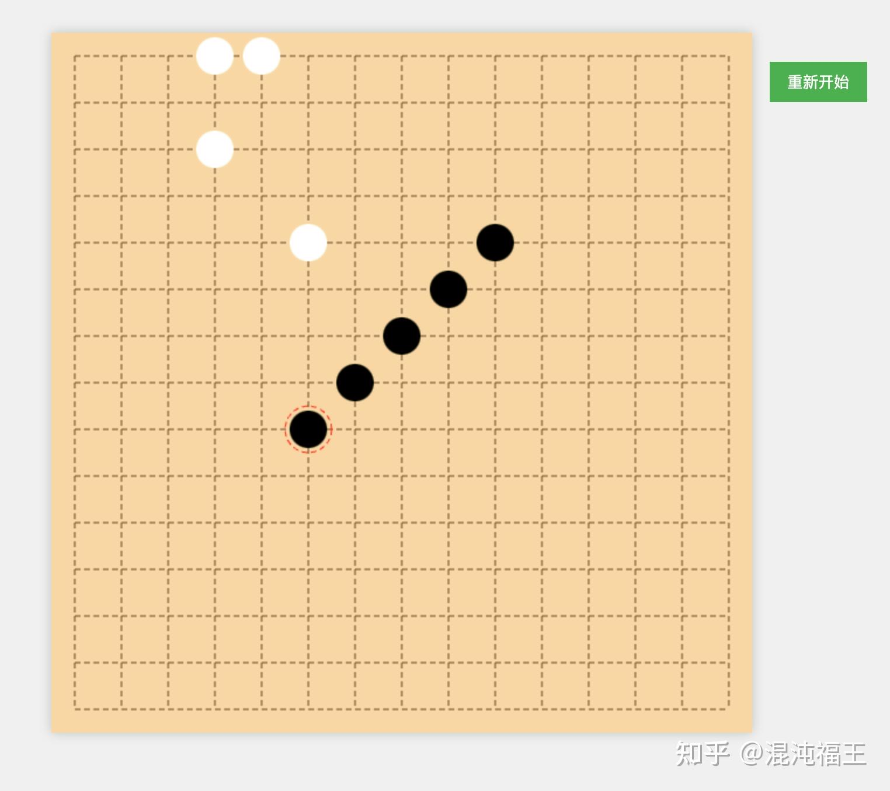

- **o3-mini-high**

提出的 5 条要求均满足了，和 AI 对战了回合，感觉挺厉害的。

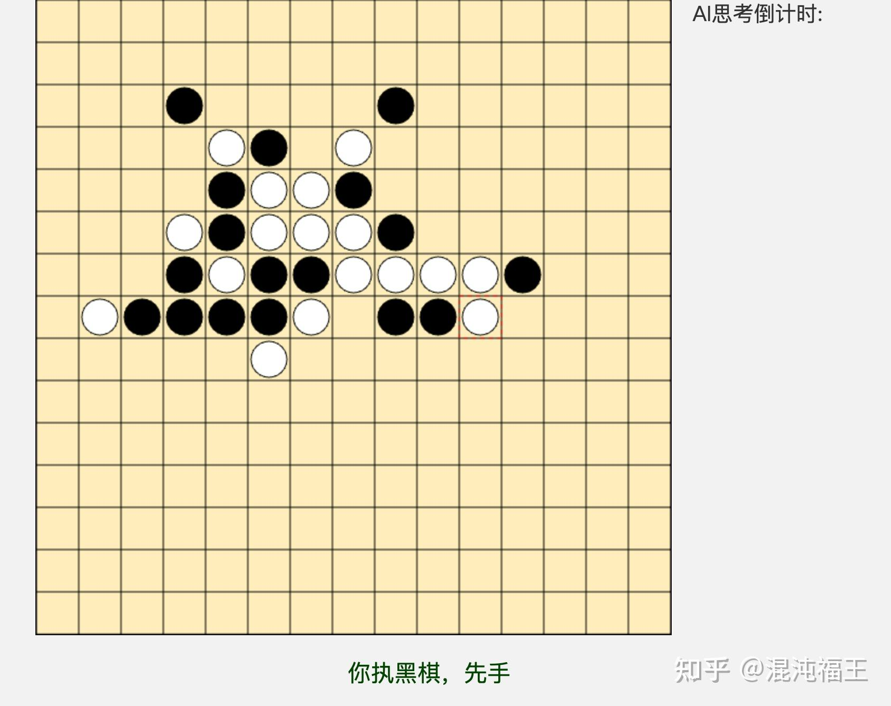

**目前结论： o3-mini-high > sonnet 3.5 > r1/o1/4o**

虽然 sonnet 3.5 用户执白棋模式下异常， 但也只有 **它 和 o3-mini-high 写的 AI 可以一战**，我观察了它们实现的全部代码，只也只有这两个模型使用了 Worker 多现线程来防止页面卡死，提高计算效率。其他的都是基于setTimeout来避免阻塞主线程。

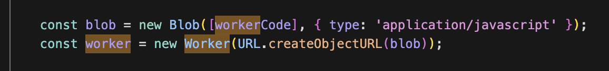

如果让它们两个的 AI 相互对抗会如何？ 想想很有趣。

下面是 o3-mini-high 先手（备注：五子棋无禁手先手有优势）， sonnet 3.5 后手。

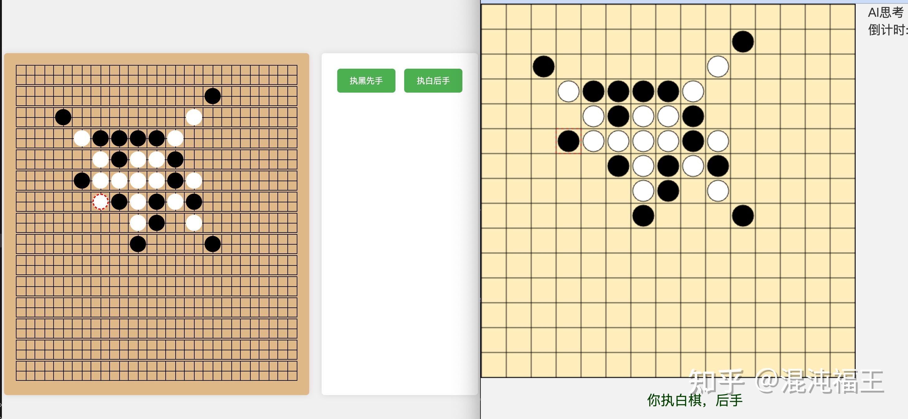

我分别替 AI 下棋的效果，到一半不分胜负，但发现了问题，o3-mini-high 每次快速落子，而 sonnet 3.5 竟然会超过 10S，越到后面思考越长，一看代码好家伙，没有限制思考时间违规，遂放弃。

那这次基本 o3-mini-high 获胜。让我们再让 llm 分析下两个 AI 写的算法：

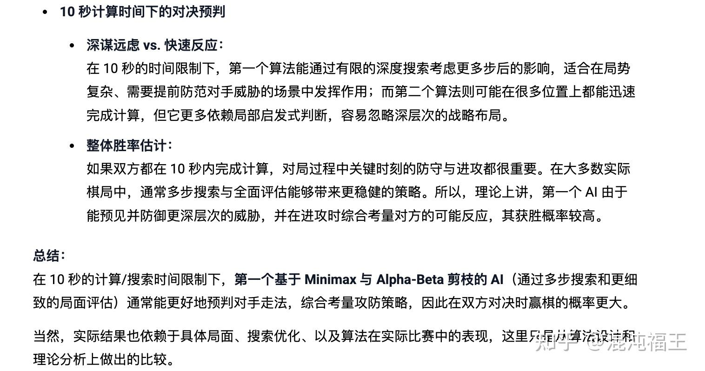

也就是从算法上 sonnet3.5 写的算法基于 Minimax 与 Alpha-Beta 剪枝， AI胜率更高，而 o3-mini-high 主要依靠启发式评分，计算速度更快。 考虑到功能完整实用性，**最终 o3-mini-high 胜利**。

由于时间限制，我们不继续测试了，但实际还有很多有趣的案例，个别案例不能代表模型能力，**最终选择哪个模型，根据大家实际工作体验决定。**但 deekseek r1 作为一款开源的模型，整体能力基本在 o1 列队，且价格低廉，是非常值得推荐的选择。由于openai 目前免费提供 o3-mini，对于编码也是一个不错的选择，但考虑到网络访问，可能对不少人有阻力， **r1 的存在，个人认为 o1 不值得付费 20$了**，**除非 o3 正式版带来更大能力的提升**。

但根目前用户反馈，以及个人测试  r1/o1/o3-mini 等在 cursor 中执行工具调用容易出问题。所以，sonnet 3.5 作为非推理模型，相应速度快，理解力强，**目前仍然是编码任务的最佳搭档之一**，在 cursor/windsuf 仍然是模型模型。希望 qwen、llama 继续在推理模型上发力，也期待 deepseek r2/r3 再带来惊喜。
