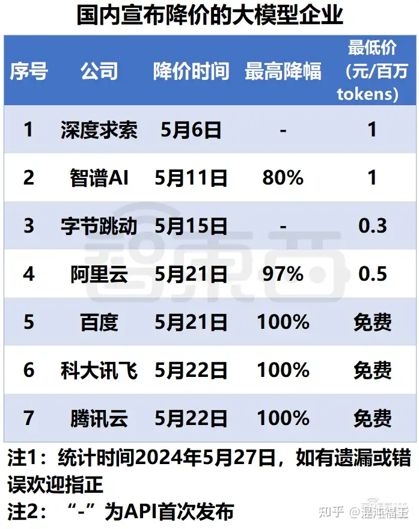
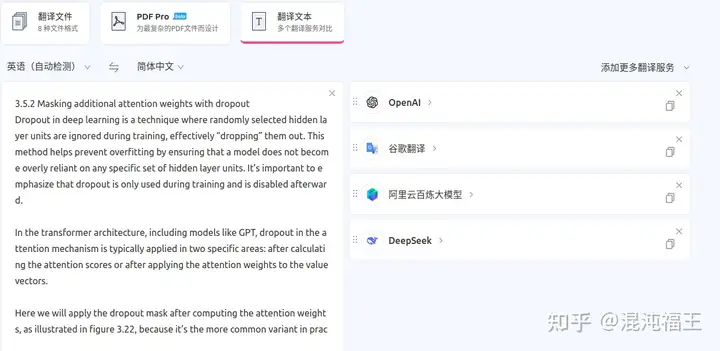
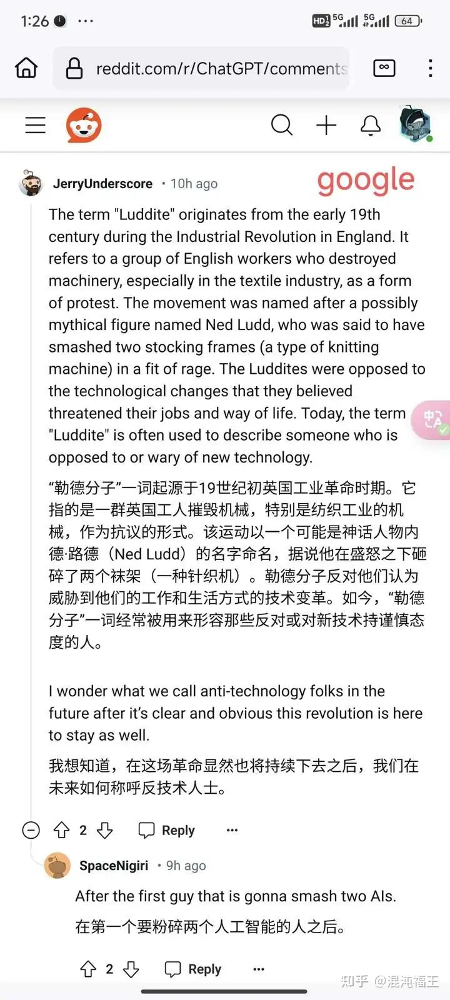
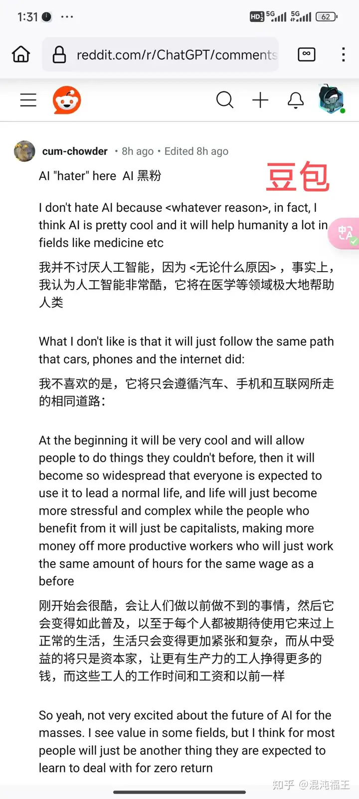
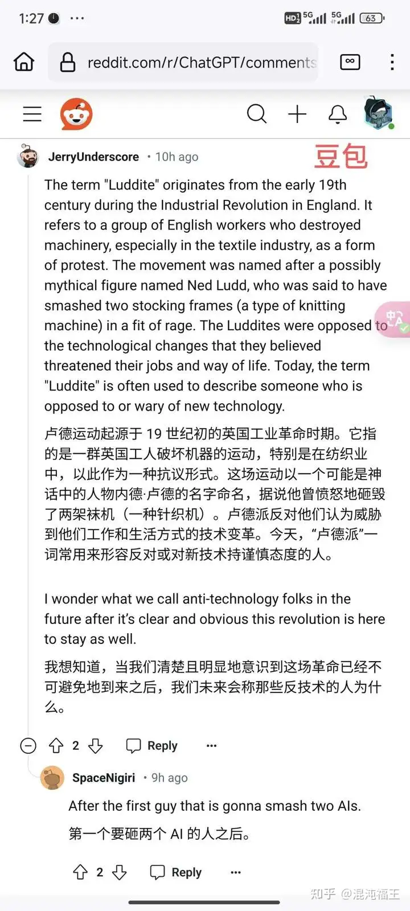
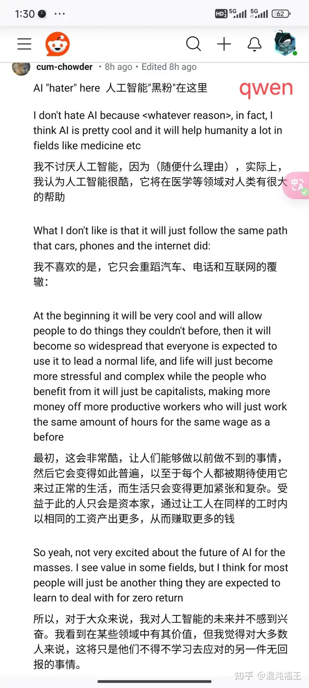
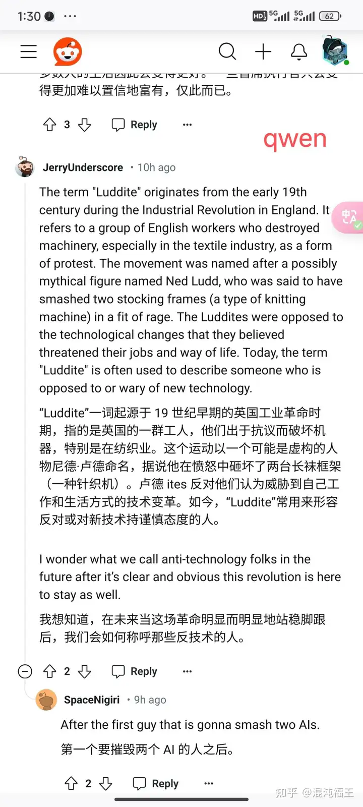
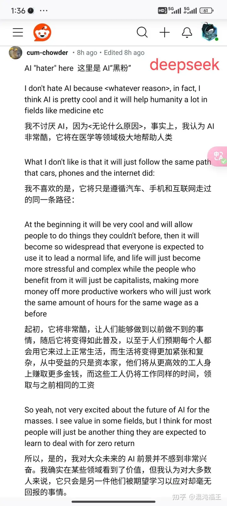
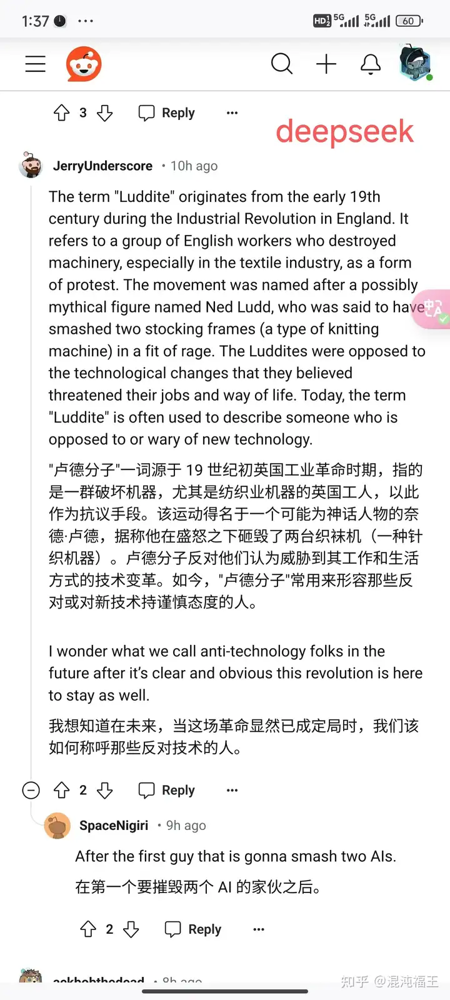

## 楔子

最近使用 openai 账单有点爆表，原因是我使用 gpt3.5 自动翻译刷 X、Reddit等海外论坛等流量太大，一天均超几百万的 Token~~ 我刷文字消息有个习惯，就是经常直接拉到底，像沉浸式翻译（一款自动翻译插件，推荐）这种无缝自动插件，会把中间带过的内容全部翻译一遍，流量就哗啦哗啦的去了。


于是想起之前网传的国产大模型降价，毕竟一百万 Token 也才 几毛到 1 元不等。于是就准备看看有没有能替代 chatgpt3.5的 API。





但深处行业的人都知道，用最低价格还衡量性价比是没有意义的。因为我们不仅要考虑模型的价格，更要考虑可用性。就好比拿 0.9 万的老头乐和 9.9 万的车比价格一样，最低甚至免费不代表能上路。3b 的模型肯定比 72b 的模型便宜很多，甚至免费，效果自然也大大折扣。


为了验证这些降价模型的实用性，我不打算采取狭义上的“跑分”（这些交给厂商自己负责）。 而是从用户的角度出发，我们来体验下哪些最具“性价比”。以下测评和点评，均基于个人消费后的主观体验，非恶性评价，也无商业广告性质。 大家当做消费者购物体验看一样。

选择测评对象
为了节省时间，首先我们排除没有降价的模型，比如“YI系列”和“百川”的，他们也曾在公开场合明确过不参与价格战。但他们的开源模型我曾都在本地部署过，测试过，客观评价：整体还算属于前面梯队的 LLM 。

其次排除腾讯和科大讯飞。因为某些原因我们和腾讯在商业上有合作，混元还未公开发布的时候，已经深度体验了腾讯的模型，在这里不做评价，只能说暂时不符合腾讯（老东家）体量的定位。科大讯飞去年给人的印象不佳，一次一次的在公开场合宣布“遥遥领先”，每次测试都失望至极，现在已经对它失去 了信任，再也不想测试了。

百度，说实话，曾经是我最看好的。并且文心 4.0 （不是免费的版本）给了我很好的体验，去年上半年发布后，付费了59 体验了下来，对比下来确实国内遥遥领先的感觉。 后面我们内部的商业合作，也是接入的文心 4.0 ， 内部同事反馈基本是超越其他同类竞品。唯一的问题是响应速度太慢，以至于验证影响了生产力。

但我们这次是体验性价比，我怀着准备测试的心态，找 ERNIE Speed、ERNIE Lite ，百度竟然不兼容最主流的 OpenAI 接口格式，反正我找了很久文档没有找到，这真有点浪费时间，凭什么专门再去对接你这套接入方式？ 遂 ，放弃。


那本次最终选定有 DeepSeek、 阿里qwen-long（qwen降价最高的）、豆包最便宜的接口。以后测评只找兼容 OpenAI 格式的接口，因为方便啊。明明厂商几行代码就能兼容的事，消费者也只需要修改 url 和 token 搞定。


## 测试标准

纯主观体验，分别在沉浸式翻译中切换每个 API，刷一会时间的各种海外论坛、然后再找一本专业的书籍，测试几个段落。这个测试不能代表最终性能，但绝对能代表能否值得让我消费的依据，毕竟选定后“衣服穿我身上”。~~。

作为对比，我还采用了免费经典的 Google 做翻译参照（不得不说，今年开始 google 翻译确实变得“没有这么生硬” 了，不确定他们是不是切换了 LLM 技术栈? ）。


### LLM 提示词
相对公平起见，均采用沉浸式翻译中通用提示词。
```
System:

You are a professional, authentic machine translation engine.

Prompt:

Translate the following source text to {{to}}, Output translation directly without any additional text.

Source Text: {{text}}

Translated Text:
```


## 翻译专业书籍



备注：上面的 oenai 已经指向了豆包的 api

我来翻译一段大模型相关的书籍。

### 原文：

3.5.2 Masking additional attention weights with dropout
Dropout in deep learning is a technique where randomly selected hidden layer units are ignored during training, effectively “dropping” them out. This method helps prevent overfitting by ensuring that a model does not become overly reliant on any specific set of hidden layer units. It’s important to emphasize that dropout is only used during training and is disabled afterward.

In the transformer architecture, including models like GPT, dropout in the attention mechanism is typically applied in two specific areas: after calculating the attention scores or after applying the attention weights to the value vectors.

Here we will apply the dropout mask after computing the attention weights, as illustrated in figure 3.22, because it’s the more common variant in practice.


### google 翻译
3.5.2 用 dropout 掩盖额外的注意力权重
深度学习中的 Dropout 是一种在训练过程中忽略随机选择的隐藏层单元的技术，从而有效地将它们“丢弃”。此方法通过确保模型不会过度依赖任何特定的隐藏层单元集来帮助防止过度拟合。需要强调的是，dropout 仅在训练期间使用，之后就被禁用。


在 Transformer 架构中，包括 GPT 等模型，注意力机制中的 dropout 通常应用于两个特定领域：计算注意力分数之后或将注意力权重应用于值向量之后。


在这里，我们将在计算注意力权重后应用 dropout mask，如图 3.22 所示，因为它是实践中更常见的变体。


### 豆包翻译：
3.5.2 使用 dropout 掩盖额外的注意力权重
在深度学习中，辍学是一种技术，训练期间会随机选择忽略部分隐藏层单元，有效地“丢弃”它们。这种方法有助于防止过拟合，确保模型不会过度依赖任何特定的隐藏层单元集。需要强调的是，辍学仅在训练期间使用，并且在训练结束后被禁用。

在变压器架构中，包括 GPT 等模型，注意力机制中的辍学通常应用于两个特定领域：在计算注意力分数之后或在将注意力权重应用于值向量之后。

在计算注意力权重后，我们将应用辍学蒙版，如图 3.22 所示，因为这在实践中更为常见。


### qwen-long翻译：
3.5.2 使用 dropout 对额外注意力权重进行掩蔽
深度学习中的 Dropout 是一种技术，随机选择的隐藏层单元在训练过程中被忽略，实际上就是“丢弃”它们。这种方法有助于防止过拟合，确保模型不会过度依赖任何特定的隐藏层单元。重要的是要强调，Dropout 只在训练时使用，之后会关闭。

在 Transformer 架构中，包括 GPT 这样的模型，注意力机制中的 dropout 通常应用在两个特定区域：计算注意力分数后或在对值向量应用注意力权重后。

在这里，我们将按照图 3.22 所示，在计算注意力权重之后应用 dropout 掩码，因为这是实践中更常见的变体。


### deepseek翻译：


3.5.2 使用 dropout 对额外注意力权重进行掩蔽
深度学习中的 Dropout 是一种技术，其中在训练过程中随机选择的隐藏层单元被忽略，有效地“丢弃”它们。这种方法有助于防止过拟合，确保模型不会过度依赖任何特定的隐藏层单元集合。重要的是要强调，Dropout 仅在训练期间使用，之后会被禁用。

在变压器架构中，包括 GPT 等模型，注意力机制中的 dropout 通常应用于两个特定区域：在计算注意力得分之后或在对值向量应用注意力权重之后。

在此，我们将在计算注意力权重后应用 dropout 掩码，如图 3.22 所示，因为在实践中这是更常见的变体。


### 相应速度：
google 因为是专用翻译机器，基本2 秒内返回，后续不做说明。上面LLM 接口中，豆包最快：7 秒内返回，qwen-long 其次，8 左右。 deepsek 接近 10 秒。


### 翻译质量：


qwen-long 和 deepseek 给人感觉更专业，基本没有毛病。 豆包似乎没有理解 dropout，并且出现前后不一致翻译。综合而言，我更喜欢 deepseek 的翻译，读起来更顺畅。

仅仅翻译几段文字不能代表什么，毕竟 LLM 采样有不确定性，结果并不能稳定复现。于是接下来，我将采取刷论坛的形式，每个 API 都刷上十几分钟。这种通常会调用几十上百次，给人形成一种最终的印象。


## 刷 X （原推特）
这里就不截图和贴内容了~~


整体下来，豆包 API 的速度是真的快，很适合刷这种短文。但质量有点不稳定，时而流畅，时而出现一些奇怪的文字，就有点看视频卡顿的感觉。一开始我怀疑是采样温度参数太高了？观察插件，似乎默认是 0，是否有生效我不确定（这也说明 LLM API 方要占据市场，最好兼容主流的接口和参数，这是细节啊）。

qwen-long 质量一如既往的稳定，速度比豆包要慢不少，但可以做到我以自然速度看完当前帖子，顺手刷下一个帖的时候，已经提前翻译好。

deepseek 这速度真的太慢，至少在这个场景，一条很短的帖子都看完了，下面内容却还是英文，不能接受。 但如果耐心等下来，质量似乎挺好，也比较稳定。但体验感下降到 0。


在 X 这个场景，deepseek 虽然保持了稳定的质量，但可用性几乎没有。 豆包是一个速度惊人，但稳定性有待提高的 LLM。这里我会选 qwen-long，速度能接受，但保证了稳定和质量。


## reddit 论坛


reddit 内容应该不敏感，我放一个关于 AI 帖子的讨论/争论。多图预警，可绕过。











说实话，刷这个帖子，deepseek 几乎没有可用性了，reddit 大量嵌套的楼层，那一直 loading 等到花儿都谢了。 但还是重申 deepseep 质量确实稳定，几乎达到母语论坛的感觉。下面我放出它部分帖子翻译结果。

>Al"hater" here 这里是AI“黑粉”

>I don't hate Al because “whatever reason“, in fact, I think Al is pretty cool and it will help humanity a lot in fields like medicine etc

>我不讨厌 AI，因为“无论什么原因“，事实上，我认为AI 非常酷，它将在医学等领域极大地帮助人类

>What I don't like is that it will just follow the same path
that cars, phones and the internet did:

>我不喜欢的是，它将只是遵循汽车、手机和互联网走过的同一条路径：

>At the beginning it will be very cool and will allow
people to do things they couldn't before, then it will become so widespread that everyone is expected to use it to lead a normal life, and life will just become more stressful and complex while the people who benefit from it will just be capitalists, making more
money off more productive workers who will just work
the same amount of hours for the same wage as a
before

>起初，它将非常酷，让人们能够做到以前做不到的事
情，随后它将变得如此普及，以至于人们预期每个人都
会用它来过上正常生活，而生活将变得更加紧张和复
杂，从中受益的只是资本家，他们将从更高效的工人身上赚取更多金钱，而这些工人仍将工作同样的时间，领取与之前相同的工资

>So yeah, not very excited about the future of Al for the masses. I see value in some fields, but I think for most people will just be another thing they are expected to
learn to deal with for zero return

>所以，是的，我对大众未来的AI前景并不感到非常兴奋。我确实在某些领域看到了价值，但我认为对大多数人来说，它只会是另一件他们被期望学习以应对却毫无回报的事情。


Reply

>The term "Luddite" originates from the early 19th
century during the Industrial Revolution in England. It
refers to a group of English workers who destroyed
machinery, especially in the textile industry, as a form
of protest. The movement was named after a possibly
mythical figure named Ned Ludd, who was said to havetA
smashed two stocking frames (a type of knitting
machine) in a fit of rage. The Luddites were opposed to
the technological changes that they believed
threatened their jobs and way of life. Today, the term"Luddite" is often used to describe someone who is opposed to or wary of new technology.

>“卢德分子“一词源于19世纪初英国工业革命时期，指的是一群破坏机器，尤其是纺织业机器的英国工人，以此作为抗议手段。该运动得名于一个可能为神话人物的奈德·卢德，据称他在盛怒之下砸毁了两台织袜机（一种针织机器）。卢德分子反对他们认为威胁到其工作和生活方式的技术变革。如今，“卢德分子“常用来形容那些反对或对新技术持谨慎态度的人。

>I wonder what we call anti-technology folks in the
future after it's clear and obvious this revolution is here
to stay as well.

>我想知道在未来，当这场革命显然已成定局时，我们该
如何称呼那些反对技术的人。
Reply
SpaceNigiri · 9h ago

>After the first guy that is gonna smash two Als.
在第一个要摧毁两个 AI的家伙之后。
Reply


“卢德分子”翻译非常精华，整体内容恰到好处。

再谈豆包，速度依然很快，适合刷论坛，但总是会遇到些奇怪的反应，“Luddite”翻译成“卢德运动”已经完成失去其含义了，虽然整体内容能算“译意”，其他还有大量类似的问题。但如果为了追求速度，这个质量，为何不用免费的 Google 翻译，速度更快。并且体验下来，Google 翻译还挺好的。虽然我们不和他对比。


但我还是不想用传统的 Google 机翻，有时候生硬卡顿，有时候会失去上下文联系，以及文化内涵。


## 综合体验


在看了一些英文书籍的篇章，刷了一会论坛后。qwen-long 最终决定作为替代 chatgpt 3.5 翻译的“省钱”模型，它保证了稳定的质量，速度相对能接受（要是速度再提高一倍就好~）。价格每百万 token 不到 1 元，在追求更加速度的一些不重要的论坛帖子下，我可以迅速切换 Google 翻译。


所以，国产大模型降价，到底谁最具真备性价比呢？期待更多模型降价，提高质量、速度、稳定性。

——————

后记
目前看还是 openai chatgpt3.5 的接口不管是速度、还是质量是可以做到稳定高可用的。 但无奈消费 $刀 有点贵 啊。

国产头部大模型质量已经可以达到可用，但速度是制约可以最终可用的关键，本质上还是底层计算资源制约。