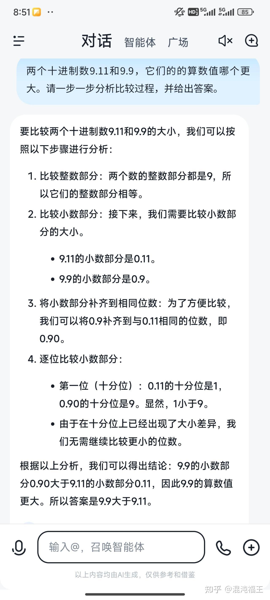
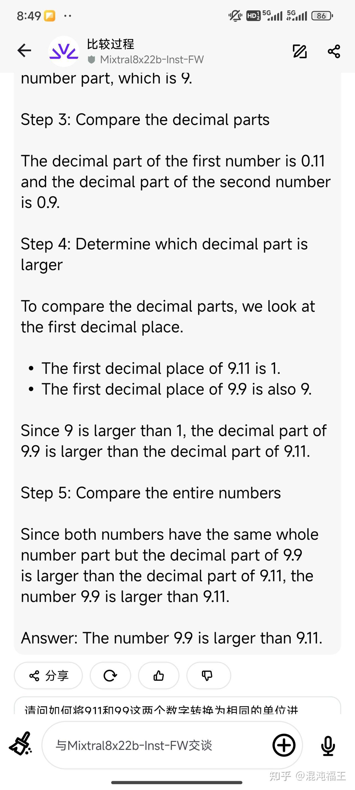
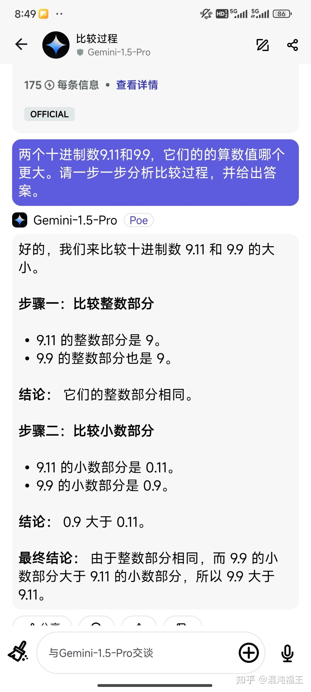
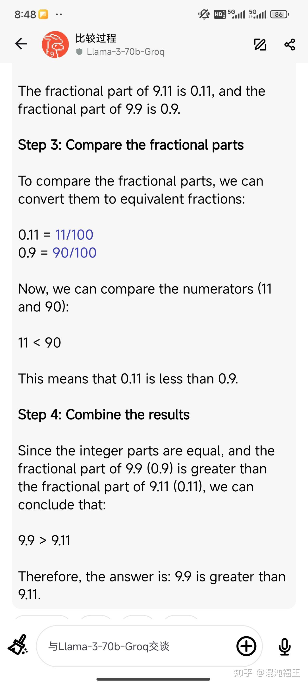
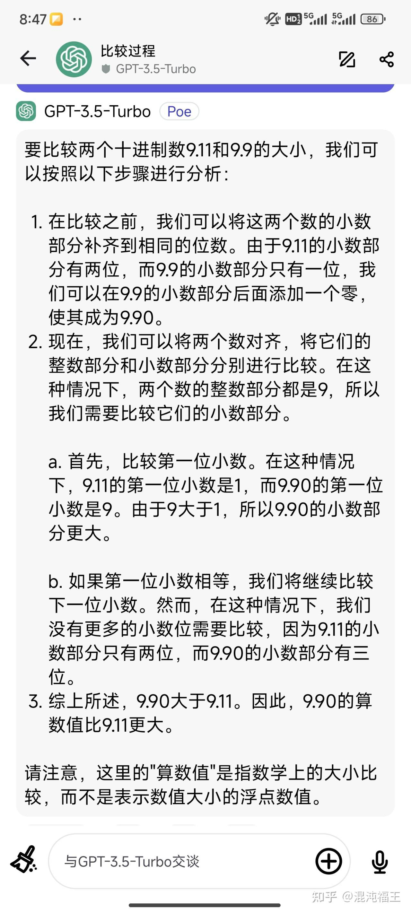
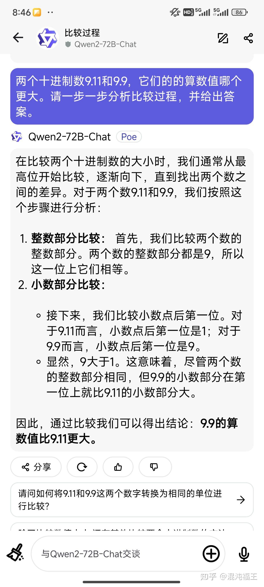

大模型在各类简单的问题会出现幻觉，很早就有了，几天前在在外网看到9.11和9.9 讨论，竟然在国内自媒体出圈了  。

其实改善一下提示词就行。

直接比较9.11和9.9比较是有歧义，比如是比较数值，还是版本？进制是什么？这些都会影响大模型的关注点。

我们使用如下提示词，测试gpt3.5、gpt4、sonnet3.5 、llama3-70、qwen2-72、chatgml4、mistral 等均 正确比较。

> 两个十进制数9.11和9.9，它们的算数值哪个更大。请一步一步分析比较过程，并给出答案。

在使用大模型的过程中，要学会澄清背景，消除歧义，诱导大模型关注数据可能的相关性给出正确回答。
