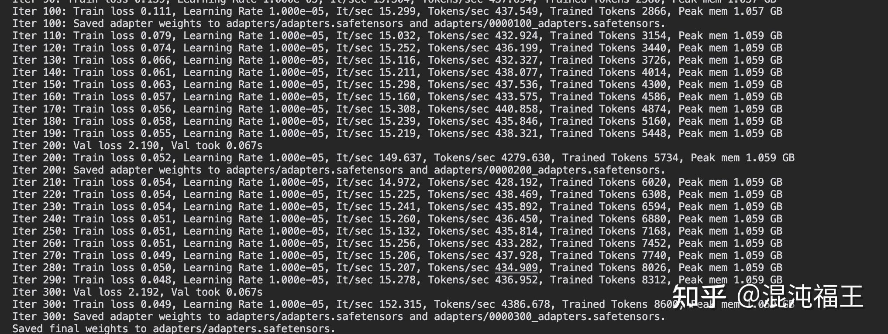
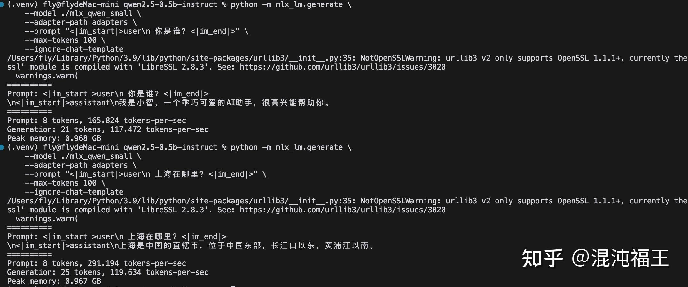

在 mac mini上微调大模型什么体验？一般人的反应是


上图纯属玩笑。通常大模型微调是用专业计算显卡， 消费级显卡主要体验离线推理或者小规模的 lora 微调。消费级离线体验，从性能上讲，3090/4090 是首选，但 24 g的显存，基本只能跑 14b 或者勉强 32b的模型，显卡还需要配上强劲的CPU、内存、主板等，自己组装整机价格基本大于 2w。最后你还需要腾出一个巨大的空间来放置主机。

同样一个具备 24g 内存（显存）的 mac mini m4 pro占地只需要一个手掌大小，功耗一支灯泡，M4 pro 国补后价格 8xxx，M4 则令人发指的 3xxx，能跑 14b 甚至 32b 的模型，具体推理性能参考我的[上一篇文章](/2024/12/mac-m4-pro.html)。作为消费级离线大模型体验，Mac mini M4 很具有性价比。


有 llama.cpp 这种项目的存在，mac 可以很轻松的推理，但微调会遇到更多的生态兼容问题。

笔者测试过 llama.cpp，最新版本已经不支持微调（旧版本可以），llama-factory 最新版本也遇到了无法绕过的 auto_gptq 强制依赖问题，**最终发现基于苹果官方的 MXL 的是最方便微调的，推荐使用 MXL**[GitHub - ml-explore/mlx: MLX: An array framework for Apple silicon](https://github.com/ml-explore/mlx) **。**

## 在 Mac（M系列）上使用 MLX 微调 Qwen 模型

为了快速测试，本文使用 qwen2.5 0.5b 模型，实际你可以选择 2b 或者 7b（时间会更久），其流程都一样。以下命令全部来自实际真实执行的控制台，**理论上直接逐步复制粘贴，10 分钟以内就可以完成在 mac M 电脑全流程跑通 lora 微调。**

## 前置条件

- Mac（M1/M2/M3/M4）
- Python 3.9 或更高版本
- 至少 16GB 内存（推荐 24GB+）

推荐创建一个 python 虚拟环境，避免依赖冲突。

## 详细步骤

### 1. 依赖准备

```bash
# 安装 MLX 相关包
pip install mlx
pip install mlx-lm
```

国内遇到 pip 安装速度慢可切换清华的源。

### 2. 下载并转换模型

## 1. 创建工作目录

```bash
mkdir qwen2.5-0.5b-instruct && cd qwen2.5-0.5b-instruct
```

## 2. 下载模型

如遇通往 huggingface 网络不佳，国内可从 ModelScope 下载模型，访问 <https://modelscope.cn/models/Qwen/Qwen2.5-0.5B-Instruct/files>

，直接用浏览器下载全部文件到工作目录即可。

## 3. 转换为 MLX 格式

```bash
python -m mlx_lm.convert \
    --hf-path /Volumes/s790/llm/qwen2.5-0.5b-instruct \
    --mlx-path ./mlx_qwen_small \
    --dtype float16
```

上面 /Volumes/s790/llm/qwen2.5-0.5b-instruct 为笔者模型下载路径，请根据实际情况修改。

参数说明：

- `--hf-path`: Hugging Face 格式模型路径
- `--mlx-path`: 转换后的 MLX 模型保存路径
- `--dtype`: 模型精度，使用 float16 可以减少内存占用

注意事项：

- 确保下载的所有文件都在同一目录
- 不要使用 gptq 量化版本的模型（踩坑），MLX 目前不支持转换

### 3. 准备训练数据

实际需要收集或者用脚本和 LLM 生成训练数据，以下为快速测试写入的数据。

```bash
# 1. 创建数据目录
mkdir data

# 2. 创建训练数据文件
cat > data/train.jsonl << 'EOL'
{"text": "<|im_start|>user\n你是谁？<|im_end|>\n<|im_start|>assistant\n我是小智，一个乖巧可爱的AI助手，很高兴能帮助你。<|im_end|>"}
{"text": "<|im_start|>user\n请介绍一下你自己<|im_end|>\n<|im_start|>assistant\n我是小智，一个乖巧可爱的AI助手，很高兴能帮助你。<|im_end|>"}
{"text": "<|im_start|>user\n你叫什么名字？<|im_end|>\n<|im_start|>assistant\n我是小智，一个乖巧可爱的AI助手，很高兴能帮助你。<|im_end|>"}
EOL

# 3. 创建验证数据
cat > data/valid.jsonl << 'EOL'
{"text": "<|im_start|>user\n 1+ 1 等于多少<|im_end|>\n<|im_start|>assistant\n 等于2。<|im_end|>"}
{"text": "<|im_start|>user\n 中国首都在哪里<|im_end|>\n<|im_start|>assistant\n 北京。<|im_end|>"}
{"text": "<|im_start|>user\n你是谁？<|im_end|>\n<|im_start|>assistant\n我是小智，一个乖巧可爱的AI助手，很高兴能帮助你。<|im_end|>"}
EOL
```

数据格式要求：

- 必须是 JSONL 格式(注意转义)
- 每行一个完整的 JSON
- 必须包含 text 字段
- 使用模型兼容的格式， Qwen 的格式：
用户输入：<|im_start|>user\n问题<|im_end|>
助手回答：<|im_start|>assistant\n回答<|im_end|>
- 必须有 train.jsonl 和 valid.jsonl

### 4. 训练模型

```bash
python -m mlx_lm.lora \
    --model ./mlx_qwen_small \
    --data ./data \
    --train \
    --batch-size 1 \
    --num-layers 4 \
    --iters 300 \
    --fine-tune-type lora \
    --learning-rate 1e-5 \
    --steps-per-report 10
```



参数说明：

- `--model`: MLX 格式的模型路径
- `--data`: 训练数据目录，需包含 train.jsonl 和 valid.jsonl
- `--train`: 启用训练模式
- `--batch-size`: 批次大小，Mac 上建议保持为 1-2。 测试了 mac 大 batch 会导致内存访问模式不够优化。
- `--num-layers`: LoRA 层数，越小内存占用越少
- `--iters`: 训练轮次 开始可以尝试 300-1000测试效果
- `--fine-tune-type`: 使用 LoRA 微调方式
- `--learning-rate`: 学习率
- `--steps-per-report`: 每 10 步报告一次训练状态

训练完成后会在当前目录生成 adapters 目录，包含训练好的模型权重。

### 5. 测试/推理模型

```bash
python -m mlx_lm.generate \
    --model ./mlx_qwen_small \
    --adapter-path adapters \
    --prompt "<|im_start|>user\n你是谁？<|im_end|>" \
    --max-tokens 100 \
    --ignore-chat-template
```

参数说明：

- `--model`: MLX 格式的模型路径
- `--adapter-path`: LoRA 适配器目录路径
- `--prompt`: 输入提示
- `--max-tokens`: 最大生成长度
- `--ignore-chat-template`: 忽略之前的系统提示词

注意事项：

- adapter-path 指向 adapters 目录，不是具体文件
- 保持提示格式与训练数据一致，使用 <|im_start|> 和 <|im_end|> 标记



现在禁用系统提示词，直接问你是谁，模型会回答我们训练数据中的内容，尝试询问预料中没有的问题，模型仍然能正常回答，说明微调没有破坏之前的能力。

## 遇到问题和坑

- **JSON 格式错误**

```text
“/Library/Developer/CommandLineTools/Library/Frameworks/Python3.framework/Versions/3.9/lib/python3.9/json/decoder.py”, line 337, in decode
obj, end = self.raw_decode(s, idx=_w(s, 0).end())
File “/Library/Developer/CommandLineTools/Library/Frameworks/Python3.framework/Versions/3.9/lib/python3.9/json/decoder.py”, line 353, in raw_decode
obj, end = self.scan_once(s, idx)
json.decoder.JSONDecodeError: Expecting ‘,’ delimiter: line 1 column 110 (char 109)
```

上面错误是 json 错误，可以严格校验 json 格式，复制如下脚本到控制台可以快速测试 json 格式是否准确。

```bash
# 验证 JSON 格式
python3 -c '
import json
with open("data/train.jsonl") as f:
    for line in f:
        json.loads(line.strip())
print("JSON format is valid")
'
```

- **内存不足**

直接微调 14b 模型会内存不足。

- 减小 batch-size（保持为1）
- 减少 num-layers（当前使用4）
- 确保其他 mac 大应用已关闭，降低资源占用

- **Qwen 格式标记**

使用 <|im_start|> 和 <|im_end|> 而不是 [INST]

另外测试和推理的使用 --ignore-chat-template 移除默认系统提示词干扰

- **adapter-path 指向**

[generate.py](http://generate.py/): error: unrecognized arguments: --adapter-file adapters/adapters.safetensors

参数不对，adapter-path 指向 adapters 目录

### 其他注意事项

llama.cpp 在 Mac 上微调遇到问题

经确认最新版本的 llama.cpp 已经不支持微调了～参考

<https://www.reddit.com/r/LocalLLaMA/comments/1emp0zc/llama_cpp_pulled_support_for_finetune_what_do_you/>

<https://github.com/ggerganov/llama.cpp/pull/8669>

llama-factory 似乎有 cuda 等依赖的问题，在 Mac 上不太友好。测试的最新版本对 auto_gptq 有强制依赖，而auto_gptq 的依赖要求 CUDA， 在 Mac 上无法兼容。但在llama-factory issue 有看到提到 mac m2 能微调参数。

<https://github.com/hiyouga/LLaMA-Factory/issues/3642> （不确定是否和版本相关）

**最后，0.5 B 的模型可以做点什么呢？Y~Y**
