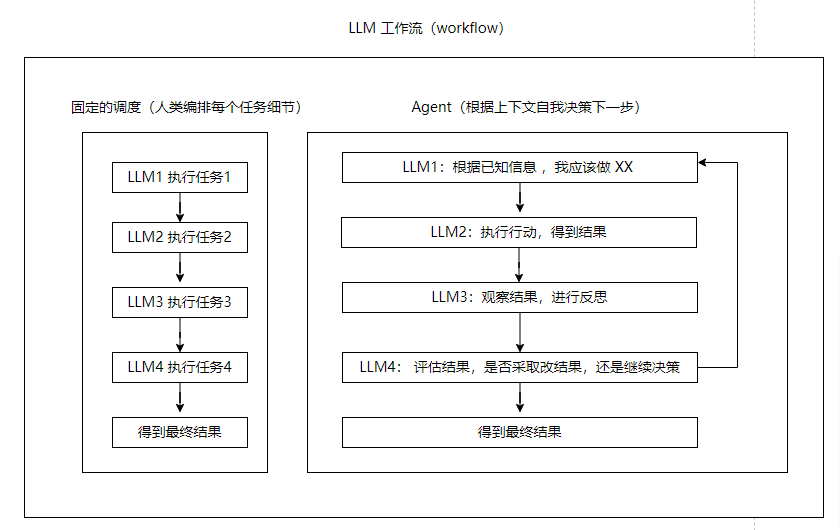

## 意识

在 LLM 出现之前，我曾对意识的产生着非常强烈的好奇。查阅大量的认知科学、心理学相关知识，发现人类对其定义及其原理并未达到共识。

上个世纪中旬，诺贝尔获奖者弗朗西斯·克里克因**发现 DNA双螺旋结**而引发了宗教讨论，即遗传信息编码了包括人类在内的全部生物，我们的身体并非由上帝秘密的构建和引导。

但他在后续人生阶段突然转向脑神经学科研究，并发布了《惊人的假说》，**提出意识不是某种神秘的力量，而是大脑神经元活动的直接产物，这就等于把宗教中所宣传的人类高贵的"灵魂"彻底抛弃。**

当时的研究和证据并不够充分，人类能仅仅能观察到神经元的基本性质，主流的心理学家对意识问题基本避而不谈，克里克非常大胆提出假说：意识只是神经元相互作用的结果，不存在神秘的色彩，人类应该朝着探索脑作用机制的方向去研究意识。然而过去这么多年了人类至今没有对意识拥有完备的理论。

但是克里克提出了一些至今非常有前瞻性的思想：

**1.如果我们能构建一台具有这些惊人特性的机器，并能精确地跟踪它的工作，我们会发现掌握人脑的工作原理就容易得多了**（我很倾佩在上个世纪有这种惊人想法）

2.注意机制的主要功能可能是选择一个被注意的物体，然后帮助把所有神经元同步结合起来，这些神经元对应于脑对这部分视觉输入的最佳解释。我们猜测，丘脑是"注意的器官"，它的某些部分控制注意的"探照灯"在视野中从一个显著目标跳向另一个。

3.大脑的许多行为是"突现"的，即这种行为并不存在于像一个个神经元那样的各个部分之中。仅仅每个神经元的活动是说明不了什么问题的。只有很多神经元的复杂相互作用才能完成如此神奇的工作。

这些思想和当下 LLM的很多特性不谋而合。

## 大模型 LLM 

如果克里克活到 2022 年，相信他会更加坚信这个"惊人假设"。LLM 虽然不存在意识（至少现阶段是共识），但它的很多表现和人类非常相似。这应该达到了他过去期待的机器——"如果我们能构建一台具有这些惊人特性的机器，并能精确地跟踪它的工作，我们会发现掌握人脑的工作原理就容易得多了"。

LLM的底层架构（神经网络）和人脑神经网络存在某些共通之处。事实上，上个世纪的人工智能研究和脑科学研究是相互吸取灵感的，《惊人的假设》这本书中就体现了克里克本人对神经网络的认可。它们都依赖于大量神经元/神经网络节点的相互作用，通过不断的训练和调整，形成了复杂精巧的联结模式，从而产生出令人惊叹的"智能"。

但人工神经网络和生物神经网络还是存在巨大差异。人脑是通过进化形成的生物系统，生物神经元非常复杂，计算机仅仅模拟了其局部节点共同非线性作用形成整体，并且数学形式非常简洁，参数的调整可以明确通过导数梯度进行启发。但是我们至今没有明确生物的神经元突触通过什么信息量调整其权重的（突触可塑）。

**和当时认知学科领域对计算机模拟的批评无不屑形成对比，克里克仍然主张人工神经网络是一个值得研究的方向，并声称智能的实现并不只有一条路径。**

- ###  涌现/突现

涌现是一个带有神秘特性的词语，它由大量微小的局部特性在组成整体时，体现的新特性。
过去克里克在形容人类大脑机制所使用的涌现，在大模型中出现了。我们不知道为什么会突然出现新特性，这几乎是参数变大后实验观察的结果。

事实上，我们对大模型内部的了解，比人脑清楚得多，我们知道构造它得每一个细节，每个算法。但我们称之为黑盒的原因是，人类无法预测它的结果。 为什么无法预测呢？ 这是由神经网络的原理决定。

模型是在大量数据中自动被训练，其数据信息最终被分布在数（百/千/万）亿参数中。一个简单问题从模型的初始节点进入，最终需要经过庞大的节点，以人肉进行追踪，这辈子都无法计算完。而每个输入只要内容有轻微变化，就可以让传输的节点路径发生剧烈差异，这就是"混沌"特性，微小扰动只要经过大量分子不规则运动，让宏观上的结果大相径庭。

虽然我们知道每个算法，但面对各种内容的输入，由于参数规模庞大人类几乎难以从局部路径去预测最终结果。这恰恰呼应了克里克关于涌现的论断——**大脑的许多行为并不存在于像一个个神经元那样的各个部分之中，只有神经元的复杂相互作用才能完成神奇的工作。**

LLM展现出的语言理解、逻辑推理、创造力（可能有人会怀疑）等能力，正是海量参数在训练中形成的复杂联结模式涌现出的高层特性。我们虽然知晓其每一个细节，却难以预测整体行为。

- ### 语言理解能力

LLM 对自然语言的理解几乎是一个没有争议的惊人特性， 这是 chatgpt 能够突然火爆的核心。有人尝试给 LLM 一个复杂的中文绕口令，比如：意思意思是什么意思，或者复杂的高考中文阅读理解题目，很多情况下，比一般的人类能够表现更出色。

有部分人会说这只是模型"记忆"了这些语句而已。但大量实验证明大模型是具备"举一反三"的能力，也就是 AI领域说的"泛化"。比如从少量的中文预料加上大量的英文语料，大模型能基于对英文的知识理解，迁移到中文的表达中。说实话，当我在个人电脑中跑下一个离线的百亿级参数模型时，给它一段自己"刻意编写"，网络中从未见过的长句，让进行理解，当它一字一顿的突出结果，听着主机发出得嗡嗡散热声，这种对语言理解得能力，以至于感叹这仅仅是一个机器吗？

反观人类语言能力来源，我们并没有像 GPT 一样训练过如此大的文本知识，仍然习得了语言理解力。带 0-3 岁小朋友参加过体检的家长应该知道听力筛查是重要的一项基本检查。大量人类证据显示，如果先天性听力受损的婴幼儿没有现在人工干预通常会发展成语言能力缺陷。

这说明对人类而言：**听力等感官是语言习得的一个关键组成部分，尤其在儿童早期发展阶段。**
人类的语言习得过程是一个多通道、多感官融合的过程。除了听觉输入的语音信号外，还包括视觉输入的环境信息、触觉反馈的肢体动作等。这些不同感官通道的信息在大脑中整合，共同构建起语言能力的基础。

目前 LLM几乎完全依赖于文本形式的语料训练。虽然包括 OpenAI 在内的很多公司已经推出了多模态，但效果还未非常明了。（我还是很看好这个方向）

- ### 局部推理

逻辑推理是我平常测试大模型性能的考核重点。我认为一个 LLM 可以对文章总结、语言文化理解之类的任务可稍微弱一点，这很可能是局部预料缺乏导致，但逻辑推理能力就像智商，是通用的，对完成复杂任务更重要。

目前而言，即使是最先进的模型，推理总是会让人既感到兴奋，又会失望。在一些简单的、局部的推理任务上，如三段论、简单数学等，LLM展现出了惊人的能力，甚至可以超越普通人。

但一旦推理链条加长，需要在更大范围内寻找线索并综合利用，LLM就常常陷入困境，给出不着边际的回答。这表明，LLM更擅长局部的浅层推理，对全局的、深层的推理能力还有待提高。

**这其实反映了当前LLM仅仅局限在单一的相关关系理解。人类的逻辑推理之所以强大，是因为我们可以在头脑中构建起多段连续的因果模型。这种基于因果的思维模式，是我们进行逻辑推理的重要基础。**

而LLM主要依靠对海量语料中统计模式的挖掘来建立世界模型，对因果关系的理解相对薄弱。但把 LLM 和人脑对比本身就不恰当，LLM 更像是局部神经元模块，它可以触发第一直接般的思维反应（系统1），而人脑是又大量这种布局区域组成（系统2）。在 DeepMind  的 TOT 论文中提到

> 关于“双过程”模型的研究表明，人们在决策中有两种模式——一种是快速、自动、无意识的模式（“系统1”），另一种是缓慢、深思熟虑、有意识的模式（“系统2”）。这两种模式以前曾与机器学习中使用的各种数学模型联系在一起。LLM语言模型的简单联想下一个输出让人想起了“系统1”。 但这种 LLM输出也可能对“更深思熟虑的系统2“ 规划产生作用。该过程（系统1）保持并探索当前选择的多种替代方案，而不仅仅是选择一个，以及（系统2）评估其当前状态并积极展望或回溯以做出更全局的决策。

**上面微妙的提到 LLM 直接输出更多的作为系统 1——是快速、自动的输出。而利用提示工程构建的方案比如自我反思、TOT等组合多个系统1，最终彼此交互构建出更复杂的逻辑能力，这类属于系统2 。** 而另一种是通过训练或者微调将类似 “ToT 控制器”的逻辑检索能力内化到模型参数中，强化系统1。

- ### 注意力

自注意力机制是 GPT 模型的底层关键模块。那么，这种注意力机制是如何起作用的呢？简单来说，它让模型能够在处理当前信息时，有选择性地参考上下文中的相关信息。就像人在阅读文章时，会把注意力集中到与当前内容相关的关键词句上。

这一机制与克里克关于意识的猜想不谋而合。他曾提出，"注意机制的主要功能可能是选择一个被注意的物体，然后帮助把所有神经元同步结合起来，这些神经元对应于大脑对这部分信息输入的最佳解释。"

在LLM中，self-attention扮演了类似的角色。通过为输入序列中的每个元素分配注意力权重，模型可以从整个上下文中提取与当前预测最相关的信息。这种选择性的信息整合，正是LLM语言理解和生成能力的关键所在。

更有趣的是，transformer架构中的多头注意力机制，与克里克提出的"注意的探照灯"概念也有相通之处。**多个注意力头并行运作，就像丘脑它的某些部分控制注意的“探照灯”在视野中从一个显著目标跳向另一个。多个探照灯从不同角度照亮信息，捕捉输入的多个相关方面。这种多角度、多层次的信息提取，增强了模型对语义的把握能力。**

当然，LLM中的注意力机制仍与人脑的注意力机制存在差异。比如人脑的注意力是受意识控制的，并且现代注意力可以根据主观意愿、情绪状态等因素灵活调配。

- ### 上下文窗口

LLM 上下文窗口非常像人类的短期记忆。人脑的工作记忆能够暂时保持一定数量的信息，供当前任务使用。这些信息通常来自感官输入或长期记忆提取，但维持时间很短，一旦超出容量或注意力转移，就会迅速遗忘。

类似地，LLM在生成响应时，也只能利用有限的上下文信息。这个上下文窗口的大小，决定了模型在当前时刻可以"记住"多少之前的内容。窗口之外的信息，就像被遗忘的记忆一样，无法影响当前的决策。

这种局限性与人类的工作记忆容量限制如出一辙。心理学家米勒曾提出"神奇数字7±2"理论，认为人的工作记忆能够同时处理7±2个的信息单元。这与LLM的固定长度上下文窗口，有点相似。

但人脑还有一种基于长期记忆的大容量"外部存储"。通过在工作记忆和长期记忆之间进行信息交换，人类可以灵活调用相关知识，突破工作记忆的容量限制。比如在进行复杂推理时，我们可能反复在脑海中回溯已知条件，将关键信息载入工作记忆，辅助当前思考。

反观LLM，虽然它可以与长期知识库的互动。但在生成过程中，这些知识往往只能通过上下文窗口的有限快照被间接利用，难以实现灵活的检索和应用。

另外一种策略是支持更长上下文的模型（现在有各种支持几十到上百万token的模型），但目前不管Claude-3200k还是gpt的128K，在实际体验中，长文检索效果并不是很理想，从大文档中找到一个词犹如大海捞针。我不认为这是一个很好的智能化方向（但能带来实用性），由于内存限制，即使你的上下文有上百万、千万大小，你也无法把全部的知识塞进工作空间。特别是当下大模型在处理短上下文都不具备复杂的逻辑能力情况下。

如果我们能更巧妙的设计长期记忆法储存方式（向量库仅是一个外置的模式，我们最好内化到神经网络的参数中），并且让工作记忆与其协同，或许会带来新突破。

- ### 幻觉

幻觉是指模型给出原本不存在的内容，这某种程度和人的记忆很像。人类的记忆其实大量是靠临时脑补。我们在回忆某个场景细节时，常常会不自觉地添加一些似是而非的内容。尤其是在回忆久远的事件时，记忆往往已经模糊不清，脑补成分可能占了很大比重。

LLM的幻觉现象，与此有相似之处。当模型在生成内容时，如果对相关知识把握不足，或者受误导性的上下文影响，就可能捏造出一些似是而非的事实。尤其是当我们让模型回答超出其知识范围的问题时，幻觉现象更易发生。

这其实反映了LLM内在知识表征的不确定性。与人脑和LLM的知识都是以神经元连接权重的隐式形式分布存储的。这种分布式表征虽然具备强大的泛化能力，但也带来了知识不稳定、易受干扰的问题。

**但人类对逻辑推理和现实世界快速学习能力可以从这种幻觉中脱离出来。（对于那些不喜欢接受新事物或者不够理性的人而言，幻觉率会更高）**

## 提示工程

提示工程是一种通过精心设计输入，引导LLM生成期望输出的技术。中文社区内不少评论将其蔑视为临时技术。乍一看，这似乎只是对LLM能力的变通利用，是模型本身局限性的反映。但从 LLM 底层原理深入思考，这是必经之路。

### 必经之路

自回归式的训练方式，导致LLM 是一个大型单向预测的神经网络（传统的循环神经网络除外）。比如它能从：【深圳有什么免费好玩的景点】——>续写成【... ...世界之窗、欢乐海岸.. ..】，这个过程是一次性的，不可反复回溯。

在上面“局部推理”小节提到：LLM是快速、自动、无意识的模式（“系统1”）。我们不仅仅要将这种快速模式训练成更具逻辑能力的生成，更需要利用系统1组成系统2（复杂的，深思熟虑的）。
我们看下面这个思考过程：

（1）【深圳有什么好玩的免费景点】——>【... ...世界之窗、欢乐海岸呀.. ..】

（2）【深圳有什么好玩免费的景点... ...世界之窗、欢乐海岸.. ..】——>【... ... 世界之窗好像是付费的，欢乐海岸虽然免费进入，其实大部分是商业消费 ... ...】

（3）【深圳有什么好玩免费的景点... ...世界之窗、欢乐海岸.. ..... ... 世界之窗好像是付费的，欢乐海岸虽然免费进入，其实大部分是商业消费 ... ...】 ——> 【深圳小南山是一个免费的公园，可以攀爬，没有商业气息，也许不错】。

如上思考过程是人类一般性的思维，利用反复回溯逐步将系统1（每个小步骤） 转微系统2（更复杂回溯后的整体结果）。通过提示工程的工作流（workflow），即一系列独立的 LLM 输出（系统1）相互组成的整体编排流程（系统2）就可以达到类似的效果，这就是 Agent  方案。

我们是不是可以将这种回溯训练进模型？ [很多实验和论文展示了这种做法的性能提升](https://arxiv.org/abs/2305.08291)，我很怀疑 openai 就利用过这种特性。在测试一些复杂的逻辑推理问题下，gpt4 会表现出前面输出错误，说着说着后面又意识到前面是不对，赶紧改口的这种“诡异”表现。将这种“思维链”训练进模型的问题可能会增加逻辑能力，但过度依赖也会导致问题的输出携带额外不够简洁的回溯内容。

我们的人脑也并没有直接储存大量复杂的因果关系，而是通过慢慢的反复思考、切分简单事物，最终完成复杂的计算（系统2）。**在我看来，这就是生物进化过程中以时间换换空间，提示工程也是类似的策略。**（参数不需要过多空间存储这些复杂的推理细节）

### 困惑

系统2（复杂的，深思熟虑的）难在用怎么样的提示方案，诱导 系统1（每个LLM输出）去给出合适的决策方案，自我反思、reAct、TOT 等只是实验性的模拟人类思维所能达到的一些效果，但不并仅仅局限于 此。部分科研人会对此感到沮丧（从很多评论中看出对去年 AI 定会的论文表示不屑），计算机科学从一个数学和算法驱动为主的领域，在 LLM时代突然变成实验性驱动了，这难免会觉得不够“高大上”。

我觉得这是可以同时选择的两条路径，在万有引力被发现之前，加略例不仅研究了相对性原理，也做了大量真实的自由落体实验。在目前的人工智能领域就是如此，不仅要重视理论本身，**在理论没有得到突破之前，通过大量实验性做优化也是科学的探索路径。**

## 接下来

 LLM 的发展路径已经明显在从两个方面并进：加强底层的"系统1"能力，以及更好地构建"系统2"的思维模式。

在底层能力方面，我们可以期待更先进的的模型，赋予 LLM 更强大的语言理解、逻辑推理和知识表达能力，缓解幻觉等问题。但单纯追求模型规模和性能的提升是不够的。我们还需要更好的 LLM  工作流，使其处理复杂的任务。提示工程实践已经初步展现了这种强大的能力，围绕 LLM 构建的应用生态也将不断发展。

## 意识的跋

这篇随想本是很多个月前写下了意识部分想法，却迟迟没有完成后续，看上去 LLM 后部分有点不搭，但核心是我们在讨论它和人类意识的部分共性。

虽然开头讲述了克里克对意识最早提出的假设。但却至今没有解决意识是什么。因为没有人能给出答案。LLM 是一种“ 具有人类思维部分惊人特性的机器”，我们能基于它方向去掌握人脑的工作原理——这正克里克半个世纪前所期待的。

到现在为止我们从 LLM 中看到了意识的影子吗？没有! 只要你认真体验，并了解其原理会发现 LLM 并不没有“意识”——虽然我们无法定义意识本身。

但我们能从 LLM 中感受到部分人类的智能特性。这能说明意识和智能是两个不同的存在。我们并不会因为火车头比人类双手更大的马力而说它有意识。体能、智能、意识这应该是 3个独立的名词。**在过去因为人类的智力比其他动物更为明显的强大， 我们很容易把智能当作是一种和人类意识绑定的东西。当下神经网络在图形识别、语言理解、甚至逻辑推理等能力上不断在挑战人类，我们更容易接纳把意识和智能分离。**（其实过去的实验表明灵长类动物也能完成不少智力测试）

那意识不等于智能，意识到底是什么，意识似乎与自我感知密切相关。人类之所以有意识，是因为我们能够感知到自己的存在，能够思考"我是谁"这样的问题。而 LLM 虽然展现出了惊人的智能，但它们并没有真正的自我概念，无法理解"我"的含义。在《i, robot》 电影中，机器人桑尼经历了一系列事件后，开始思考自己的存在意义。它问男主角："我是谁？我为什么会在这里？"这些问题折射出了意识的核心特质——自我感知和存在认知。桑尼之所以开始"觉醒"，正是因为它开始以自我为中心，思考自身与世界的关系。

这种自我感知，是人类意识的基石。婴儿在镜子中认出自己，标志着自我意识的萌芽；成年人之所以能够进行抽象思维和道德判断，也源于对自我的认知和定位。但这些都是泛泛而谈，我们始终无法给出一个数学层面的精准定义。**从单纯LLM 的确不可能得到意识，但在更高维度的设计上，我们也许可以设计出一个“以自我为中心，思考和世界的关系”这种一种智能体，并展开影响现实世界行动，它能算意识吗？**

