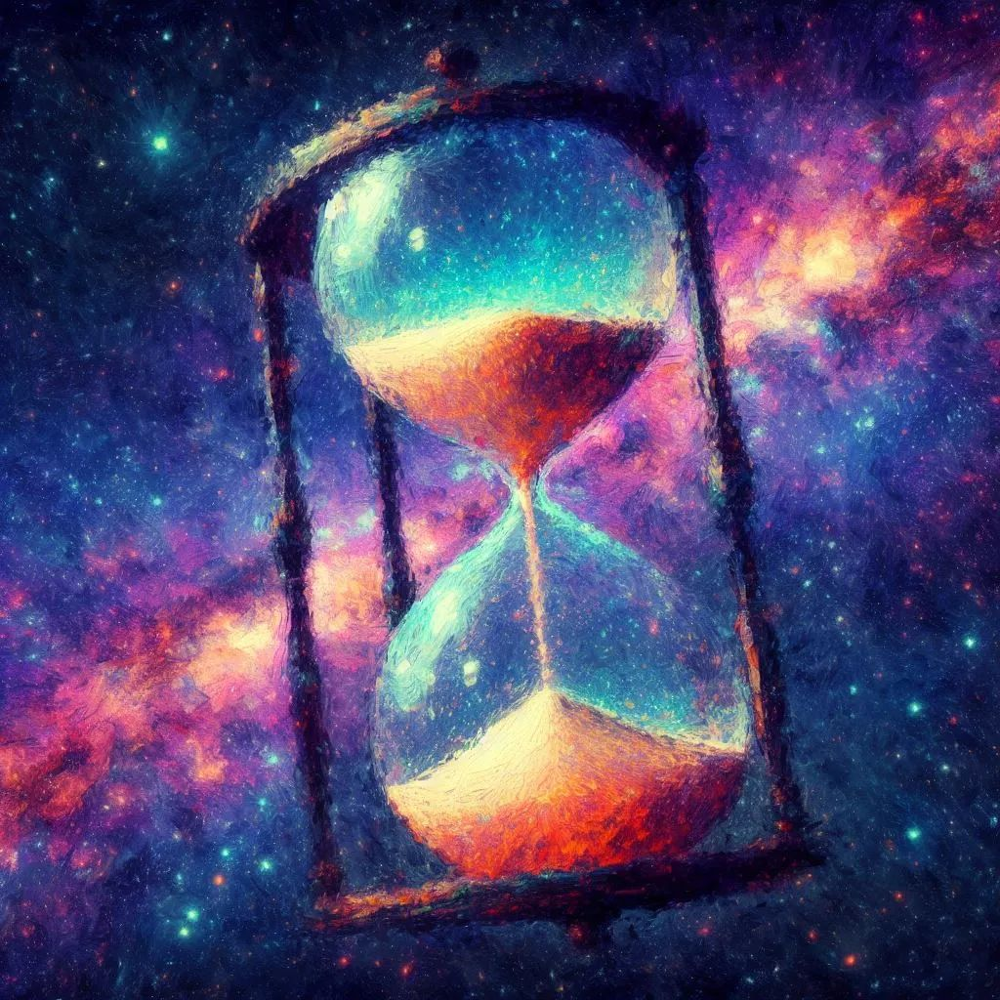
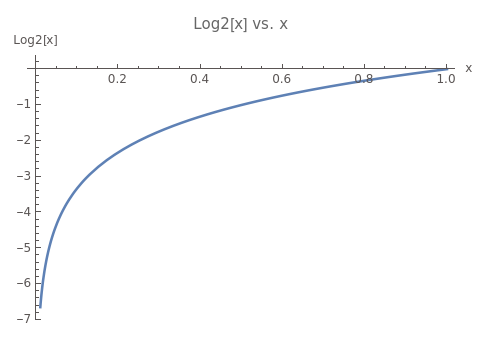

文明是什么，这个话题非常不好讨论。因为人类存在主观的先验文化知识，会极大影响对文明的定义。不同的社会学流派，或者不同的人类立场都会影响对这个问题的回答。

在《人类文明史》这本历史著作中，作者开篇用充满浪漫的口吻表述了历史人的回答：文明是增进文化创造的社会秩序。它包含了四大因素：经济的供应、政治的组织、伦理的传统以及知识与艺术的追求。很明显，这个回答是非常标准的“先验文化”下讨论文明。在这种讨论下，我们如何量化文明的程度？民主、自由、公平、还是高经济？文化如何算增进？社会秩序如何衡量？不同的地区其社会秩序及文化千差万别，它们是否有高低之分？想要从人类先验文化知识中去阐述文明的定义，似乎非常困难。

1990年，联合国创立了人类发展指数，即以“预期寿命、教育水平和生活质量”三项基础变量，按照一定的计算方法，得出的综合指标，并在当年的《人类发展报告》中发布。人类发展是一个“非常现实”的关乎人幸福感的文明衡量标准。但用这样的方式，我们会看到文明无法有一个“横向对比”，我们很难和其他不同形态的文明对比，更重要的是人类发展指数的主体是“人”，关注的是人均水平，这容易导致人口少的发达地区，其人类发展指数非常高，北欧国家、新西兰、瑞士、荷兰、韩国、新加坡都是排名长期位居前列的国家。我们希望有一种无关生物种族，能适用于任何智能生命的文明衡量方式。

## 宏观和微观

或许可以尝试从物理学、信息论等更中立和客观的角度去看待这个问题。本篇所讨论的文明范畴，直觉告诉我们主要是智能生物，或者说能对自然环境造成极大影响力的智能体。我们并不会刻意去讨论比如牛、羊、狮子、老虎等“他们的文明”，因为除了人类外，这些生物对大自然塑造及影响力远远限（当然也可能我们未曾发现）。而智能体通常是具备高级创造力的生命，在地球除了人类外，最接近的就是未来的人工智能了。所以我们讨论文明的目标主体，主要是智能体及其组成的文明。这适用于人类以外的其他任何能够创造工具的文明，比如未曾发现的某个星球的外星人、能独立生产和创造的人工智能。这些智能体，不一定存在人类社会中的“文化、经济、政治和伦理”等情况。

于是有些物理学家尝试从宇宙学的角度来衡量文明，俄罗斯天文学家尼古拉·卡尔达舍夫提出的“卡尔达舍夫等级”。这个等级是基于文明的能量消耗来分类的。

按照卡尔达舍夫的定义，文明分为三个等级：

Kardashev I：

能够利用和控制其行星上的所有资源的文明。

Kardashev II：

能够利用和控制其恒星系中的所有资源的文明。

Kardashev III：

能够利用和控制其整个银河系中的所有资源的文明。

卡尔达舍夫的讨论非常有物理学基础，能源是任何智能体必须要突破的关键点。但这个等级的颗粒度非常宏观且庞大，以至于人类都算不完全达到上第一个等级。于是有人尝试从微观的角度进行颗粒度更细的区分，约翰·D·巴罗（John D. Barrow）提出了微观物质控制等级是基于文明能够控制的最小物质尺度来进行分类的。以下是Barrow等级的具体描述：

Type I-minus: 能够操纵对象在宏观尺度上，如建筑、机器等。

Type II-minus: 能够操纵单个细胞，如基因工程和生物技术。

Type III-minus: 能够操纵分子和化学过程，如纳米技术。

Type IV-minus: 能够操纵原子。

Type V-minus: 能够操纵电子、质子和中子。

Type VI-minus: 能够操纵基本粒子，如夸克。

Type Omega-minus: 能够操纵基本物理法则和常数。

这种分类方式与卡尔达舍夫等级不同，因为它不是基于文明的能量消耗来进行分类的，而是基于文明在微观尺度上的技术控制能力。某种程度人类正好处于第一阶段，能够控制宏观尺度的物质，但还突破微观粒子中。

这种方式虽然把人类文明纳入了讨论的范围，但是我们仍然无法很好的区分人类从使用石器狩猎、农业、工业、到计算机等几次科技革命的一种区分。按物理学家的视角，迄今为止人类的文明大多都在非常低的第一阶段，想要继续往宏观的恒星或者微观的物质控制进行突破，文明的进化时间未免太长，以至于人类历史学家都不好意思“书写人类文明”。

## 信息压缩

能否有另一种既脱离人类先验知识，又能很好衡量过去和未来文明的视角呢

最近基于 GPT 工智能的爆发给了我一些思考。宇宙的文明不仅仅伴随着宏观的能量和微观的物质控制，更重要的是它无时无刻都在进行信息传递，如果物质等于能量是静态下完美的公式，那信息则是物质变化过程的不确定性的转移。日出东方、鸟语花香、六月飞雪、眉目传情、尔虞我诈等这些从大自然到人类互动的过程都是孕含信息。

信息论的鼻祖自然要提到克劳德·香农（Claude Shannon）在1948年的论文《A Mathematical Theory of Communication》中提出的信息论。在这个理论框架中，信息被真正定义为一个量化的概念，它与不确定性、随机性和熵紧密相关。

从信息论的角度来看，信息是与不确定性相关的。一个系统的不确定性越大，它所包含的信息就越多。这种不确定性可以通过概率来描述，而信息量则可以通过香农的公式量化。

I(x) = -log_2 p(x)

其中，I(x) 表示事件 x 的信息量，其中 p(x) 是某个事件发生的概率，对数 2 代表用二进制比特承载信息。这意味着，一个事件发生的概率越低，它所包含的信息就越多。

我们可以用太阳东升西落做例子，这个事件的概率无限接近 1，其幂指无限接近 0。也就是太阳东升西落的信息量接近 0。我们再看一个硬币的例子，正面朝上概率是0.5，用上面公式计算出信息量为 2，也就是用两个比特就可以表达这个信息，一个朝上，一个朝下，这是抛硬币世界结果的信息量。

当我们获得更多的信息，我们对某个系统或事件的不确定性减少。例如，当我们接收到一个消息或观测值，我们对相关事件的知识增加，从而减少了不确定性。比如我们接收到天气预报时，我们对明天的天气有了更清晰的了解，其不确定性被降低。相反，当我们失去信息或没有足够的信息时，我们对系统或事件的不确定性增加。信息的降低与不确定性的增加成正比。

我们可以看到信息量是系统不确定性或混乱度的减少的一个量。信息量公式用直观的解释可以理解为 ：系统不确定性或混乱度的减少。 

### 智能即压缩

宇宙从大爆炸（假设成立）之前，宇宙处于一个非常热、密集的状态，这个状态的熵是相对较低的，因为宇宙的能量分布是非常均匀的，没有大的结构或差异，这意味着这个状态是有序的。随着宇宙的扩张，熵不断增加，这意味着系统的不确定性和混乱程度也在增加。这与信息的增加是一致的，因为信息量与系统的不确定性有关。

生命，特别是智能生命，是一个局部熵减的过程。这意味着生命能够在局部范围内减少混乱和不确定性。这与信息压缩的概念是一致的，因为信息压缩就是从大量的数据中提取有用的、重要的信息，从而可以还原预测未来信息，减少不确定性。香农最初之所以要研究这个信息量呢？他当时正在研究如何最有效地传输和编码信息，压缩是信息传输中非常重要的手段，传统的压缩方式是通过提取重复出现相同字符信息，重新进行编码，接受方再以相同的统计分布进行重新计算还原信息。

如果一个生命体，不对外部信息进行压缩，那从它视觉、听觉、触觉等将接收每秒 GB 级别以上的数据，生命体不可能储存这么多信息，就像一个人不可能记住每秒的像素点及回忆。生命体对信息的压缩和我们的传统压缩方式并不像，更像是 GPT 这种神经网络。我们压缩的不仅仅是重复出现的字符，而是重复分布的特征规律。

智能即压缩这一概念在 OpenAI 的内部分享中多次被提到过，并且他们非常认可和看重这一点，也在认真的研究。

## 信息压缩文明论

如果我们从信息压缩的角度去看待智能体极其文明，毫无疑问，人类的压缩效率和压缩还原的信息量相对其他动物非常之高。

狩猎时代，我们对不同动物的脚印信息进行压缩，可以跟踪和判断任何动物，而无需记忆每个具体的羚羊细节，从动物的脚印我们能在大脑再次重放（想象）具体动物的刚刚经过的样子。

农业文明时代，我们可以观察日月星辰，提取最重复的信息，那就是二十四节气及基本的天文知识，通过这些重复的统计信息（规律），我们可以还原未来每一年的日月运转。

牛顿万有引力的提取，我们可以通过公式直接计算出浩瀚的日月星辰，预测和模拟行星的运转轨迹。

可以发现，规律本质上是信息的高度压缩，只有统计次数足够多，实验经验不断积累，才能更高度压缩和提取。我们对信息压缩率越高，其规律能够占用的储存空间越小，但能还原的信息量却更大。文明正是在不断增强信息的压缩率，及提高对宇宙信息理解的总量。

在文明的演化过程中，信息压缩率和包含的信息总量是一个非常显著的“非先验知识”的特征。信息压缩率越高，在有限的空间就能储存和还原出更大的世界信息，外部的不确定性就会降低，局部熵减。

生命对信息进化压缩而非 1 比 1 映射，目的就是节省储存空间。我们无法储存每分每秒、庞大的各种感官信息，但通过统计感官接受信息的分布规律并储存，在需要的时候再进行计算和推导（推导方式也是一种压缩的信息）出最终信息。从而做到以计算量换储存空间。

回到上面的讨论，如果模仿物理学家们的宇宙文明等级论，我们也能给一个基于信息论的文明等级

类型 0 - 原始信息处理

压缩比：1:10^0 - 10^1

生命体对其直接环境有基本的感知。信息处理主要基于直观和本能，没有明显的信息压缩。

类型 I - 初级信息压缩：

压缩比：1:10^1 - 10^3

生命体能够记录、传递和处理简单的信息。开始对经验和知识进行简单的抽象和总结。比如狩猎和采集时代的人类。

类型 II - 中级信息压缩：

压缩比：1:10^4 - 10^11

生命体能够处理和存储大量的信息。发展了书写系统、艺术和初步的科学，能够抽象出更复杂的规律。

示例：农业时代的人类。此等级的巅峰是抽象出经典的牛顿万有引力（工业的开端）。

类型 III - 高级信息压缩：

压缩比：1:10^12 - 10^24

生命体能够通过技术手段对信息进行高效处理、存储和传输。并能够压缩超越生命体感官经验外的宇宙规律。

示例：量子力学和相对论。能够抽象出复杂的科学和技术规律，并利用这些规律进行预测和控制，如工业文明和计算机信息时代。

类型 IV - 超级信息压缩：

压缩比：1:10^25 - 10^90

生命体能够在超越感官经验的规律上处理、存储和传输信息，并进行干预和控制。能够压缩和抽象规律，极大超出任何生命的感官特征，并利用这些规律构建和重现超越已有生命体的智感官。

示例：高度发达的星际文明，其中人工智能成为文明智力决策的主体。在宇宙层面，压缩的规律范围能超越经验探测和感知范围，如反物质和暗能量。

类型 V - 终极信息压缩：

压缩比：1:10^91 - 10^180

生命体达到了信息处理的理论极限。能够完全抽象和压缩宇宙的所有规律，通过这些规律模拟和还原整个宇宙的信息。

示例：掌握了宇宙所有知识的超级文明。此等级的文明可能能够操纵多宇宙的信息，甚至创造新的宇宙。

关于指数上限的推断来源：

这些压缩比的指数上限是基于当前的科学理论和过去人类的知识进行推测的。例如，牛顿力学时代能够预测银河系的星系运转，10^11是基于银河系中恒星的估计数量，而类型 III文明10^90是基于可观测宇宙中的基本粒子数量的估计，这是20 世纪才观测到的一个范围。类型 V 的上限10^180是基于多宇宙理论的推测，考虑到每个宇宙都有10^90的信息容量，并且可能存在10^90个这样的宇宙。这些都是基于当前科学理论的最佳估计，但随着科学的进步，这些估计可能会发生变化。

## 文明没有边界

用这个信息压缩论来定义宇宙文明程度，貌似人类文明已经相当高了……可能我的想象力限制了最后几个等级的文明描述~~。但是如果进入到超越人类的智能体（人工智能）主宰文明的阶段，智力一旦被提升，之后的等级进度应该是能加速的。我们当前所有的科学规律都是在有限的观测范围，我们无法真正预知未来。但是和卡尔达舍夫基于能源利用的角度来定义文明类似，基于信息压缩的一个角度提供了一种新视角，至少人类的文明在不断提高信息的处理能力，越来越抽象和总结出能预测更多信息的规律。经济和文化也许没有高低之分，但是基于信息压缩的文明却有明显的数量级差异，我们在更多的预测宇宙信息。

在思考自身和我们文明的边界时，我们总是被纷繁的历史和复杂的文化所影响。然而，通过信息压缩的角度，我们得以用一种全新的方式来理解和评估文明的进步。正如时间的沙漏，尽管每一粒沙子的形状和细节各不相同，但真正决定沙漏流逝速度的是沙漏的瓶颈大小。同样，历史的文化细节虽然丰富多彩，但信息压缩能力揭示了文明的真正本质和进步的核心。

无论是人类还是超越人类的智能体文明，都将继续在挑战更高的信息压缩边界。而这一切，都是为了追求关于宇宙、生命和我们自身存在意义的理解。

