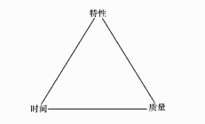
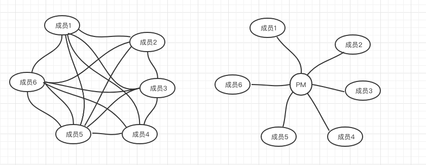
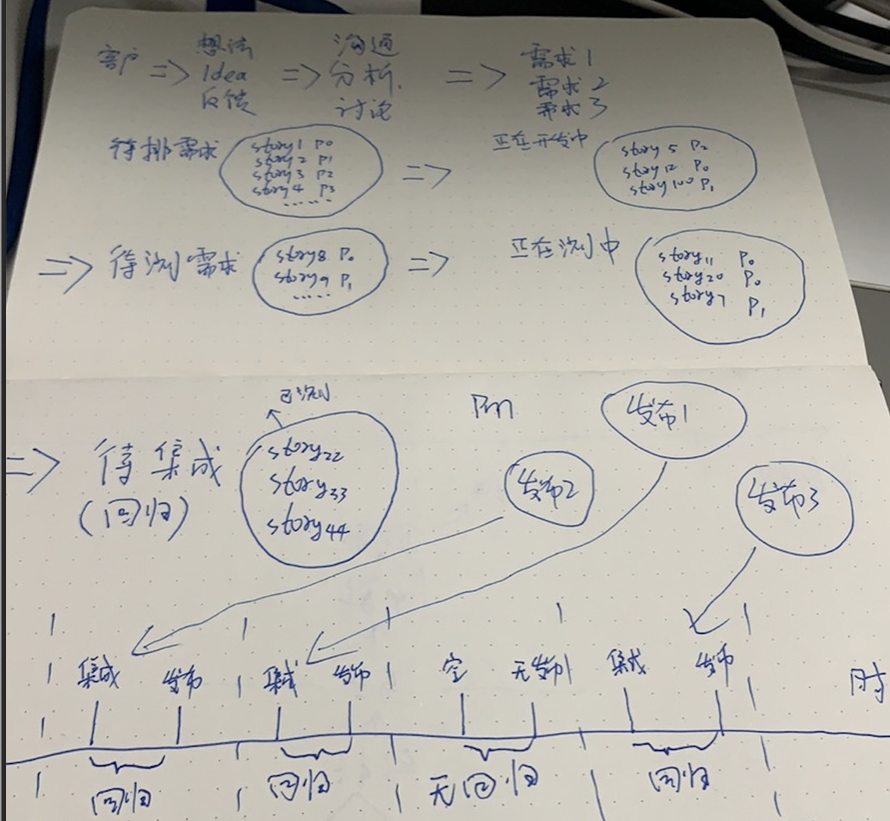

## 回顾
时隔几个月，我们的上一篇[软件工程研发效能历程](https://imwangfu.com/blog/dev-ops/software-efficiency.html)，迟迟没有下文。这期间，主要把时间花在了 rust 和大型开源项目的一些经验学习上。关注不同事物同时，越来越感受到万事万物的设计规则本质上其是共通的，比如《规模》中讲到，生命体、城市、公司乃至一切复杂事情，都和其自身规模制约，存在一定比例关系，遵守统一公式。人类虽然还没有穷尽宇宙全部法则和知识，但人类认识这些知识和能力是可以在不同事物中迁移，一旦你在某个领域成为专家，通过一个领域的知识学习方式和模型构建能力 ，迁移到另一个领域会加速你成为专家的效率。`这也是练习知识学习的能力，比记住知识本书更重要的原因`。

好了，回到软件研发的正题，我们之前讲过软件研发在历史上有敏捷研发、精益研发、devops 三个历程。也说明了，它们都是一个方向的不同侧重点的阐述，一切目的都是通过各种方式进行效率提升。但在我们在实际认识和接触这些名词的时候，很容易出现“镜中看花”，“水中捞月”，没有真实的感觉，为什么呢？因为变革本身源自于实际场景痛点驱动，如果没有切身体验，是不可能真正理解的——最终沦为纸上谈兵。

所以接下来的篇章，我会用真正的一线工程师从编码的第一行、到用户体验的整个环节的细节进行分析，可能会有很多篇。这将是一个巨大的挑战————“因为效能，离不开软件高扩展的架构，离不开每一行'hello word'的质量，离不开代码的设计细节，离不开产品工作细节，离不开测试工作细节，离不开设计工作细节，离不开项目管理细节，离不开团队文化等”。出于个人知识和经验的约束，不可能面面俱到，但我会重点关注一个纯粹软件设计到交付的关键流程，不把产品、测试、开发、管理等岗位进行区别对待。事实上，很多开源项目本身，产品、测试、开发、运维都是统一叫工程师。我建议大家也不要给自己定位 xx 岗位，你就是软件工程师（software Engineer）。

## 团队文化

在研发效能改进的过程中，最重要，也是最难的部分就是团队文化。因为执行的主体都是人，而人有两种，愿意改变和不愿意改变。对于后者，是变革的阻力，对于前者，需要正确引导。这也是大部分团队在力求改进会容易失败的原因，这并不是技术问题。

我以自己在第一家李开复投资的创业公司经验为例，说说什么是利于改进的文化。

### 接受失败

第一家是非常优秀的创业公司，曾凭借某爆款 app 经常冲击视频分类第一，拿到创新工厂投资后，面临着高速迭代和研发管理混乱的矛盾。但这是一只非常年轻的团队，每个人虚心学习、接受失败是它最重要的文化特征。为了找到一种适合团队的项目管理软件，我们分别尝试过 4、5 款以上项目管理软件，从禅道到tapd。最终确定了腾讯的 tapd 最适合创业团队灵巧的开发模式。

在这个过程，老板鼓励大家集思广益，然后敲定方案逐一试错，每周会收集反馈意见。一旦大家对某一个方案和流程感到气馁，这个时候会重新站出来，鼓励大家接受改变，要相互信任，继续寻求新的方案，每一次都在上一次的基础上总结。我们最终用了大概半年的时间找到了适合团队的一些模式。

### 持续改善

在引进敏捷研发的过程中，我们是一边运用，一边改善。tapd 是一款以敏捷开发为导向的项目管理软件，当时腾讯刚刚对少数企业开放，没有官方指导，也没有权威用法。一开始，我们只是把它作为需求、缺陷跟进工具，在使用的过程，发现通过它对需求拆分进行管理非常方便，可以极大减少沟通效率，最终我们确定了需求拆分的一些方法和原则。

### 相互信任

在那个团队，学到最重要的事情之一，信任是高效合作的基础。我经常和产品一起沟通、产品经常会提前把他的想法告诉我，和我商量，茶余饭后也会彼此交流。  往往要正式评审之前，其实我早就知道我们要做什么，为什么要这样做，当然我们也会有意见不一致的时候，这时产品只要有足够的理由，我们会给他试错机会。同样，产品也会非常了解开发在做什么，信任开发在做对产品有价值技术改造，这一点很重要，在一家高速迭代的创业公司，产品能够看到效率和质量兼具是非常可贵的品质，这保证了你比竞争对手拥有更好的评价，及迭代的可持续性。

## 需求、迭代、发布计划

我们经常讲需求、迭代和发布计划，这几者有什么区别？需求的颗粒度范围是很广的，大访问的可以有`需求集`，比如一个方向、战略层面的规划。而通常产品功能的角度，叫我们`业务需求`，也就是 feature，它是可交付的业务价值。业务需求也可分小业务需求，大业务需求，比如播放器皮肤改版 、新加会员功能等，业务需求伴随着完整的流程及价值交付。
从最小可交付的角度，我们叫`开发需求`——userStory。story 是在开发角度可以进行最小验证的功能单元，能够一次性部署到生产。因为业务需求可能会很大，拆分多个 stroy 交付可以提前验证。

迭代是为了接近目标重复反馈的过程，也就是说一个大需求集、一个业务需求可以通过多次反复逐渐完成目标。

我之所以讲这个，是因为，对需求的理解，从老板、产品、开发角度会有不同范围的差异，大家要彼此知道对方在哪一层思考，比如顶层老板可能关注需求集，方向性的规划完成了多少，产品关注业务需求功能完善多少，开发专注某个 strory 完成多少等，在彼此交流不要只考虑自己正在做的事情。

我们谈发布计划，根据这个名词往往是认为：提前计划好会需要发布什么内容、什么时候发。这是最早软件研发的一种方式，但我们上一篇讲过，软件研发经历过很多变革，而不同变革中，发布计划是不一样的概念。敏捷开发社区对这一点也有争议，比如有些人认为，客户认为发布计划没有任何价值，通常是浪费，但也有的敏捷团队会认为需要用它建立期望。但不管什么样，发布计划，通常必定伴随至少一次发布，后面我会具体讲分别怎么发，及优缺点。

### 需求要拆吗

在传统软件开发中，需求设计非常大，往往是庞大的业务需求、或者全面规划的需求集。动辄几个月甚至更久才能上线。在上一篇中，通过复杂度分析，从理论上证明的需求拆分可以降低交付风险。但这只是一个笼统的概念，在实践中，要集合团队实际情况，决定改如何做。

#### 拆分利弊

##### 好处

- 小批量交付，加速流动

这个不需要太多解释，需求越小，单个 stroy 开发测试越快，可以更快的把价值交付到用户手中，提前得到反馈。

- 需求更容易理解，减少偏差

大需求，动则半个月、到几个月，但需求宣讲往往 2 小时不到，期间开发和产品非常容易产生信息丢失。最后造成理解不一样，反复确认时间加长。而小需求则更容易被确认。

- 改变成本低

在小需求分批交付过程，假设中途发生变化，有更高优先级的需求插入，改变成本更低，因为拆分后的 stroy 只是总业务需求的一小部分，不会影响之前发布的内容。

- 缺陷能够更快暴露

其实和第一点相通，小需求更快速的被开发，也能更快的被测试，问题也更快发现，不会积压到最后一次性暴露问题。

##### 问题

世界上没有银弹，拆分需求也会有成本和适应场景。大家在各种理论书上习惯了看到拆分的好处，但真正落地发现问题很多，所以，`我要重点讲坏处，怎么解决它`。

- 需求拆分成本

产品通常是负责收集分析需求，而不一定具备专业的技术背景，把一个产品业务需求拆分成多个可迭代的 story 是一种需要兼具技术背景的事情，如果拆分不合理，成本会大于收益。举例，某业务需求是：视频播放支持完美弹幕。产品可能会从用户的角度拆分成 1.纯文本弹幕、2. 弹幕支持被点赞. 3. 机器人自动弹幕. 4 动态弹幕。

但是这几个拆分是否合适，对于开发的分工（假设多人协作）和代码改造是否匹配。开发如果无脑接受产品拆分，那么可能会面临技术实现相互冲突，也有可能会对代码架构造成影响。

比如，开发增加纯文本弹幕可能只需要替换一个播放器组建，而这个播放器组建自身支持动态弹幕。也有其他可能弹幕点赞设计到底层改造，直接影响纯文本弹幕。

实际情况是取决于开发在之前运用了什么样的技术，有没有技术负债，现状如何。这些细节需要开发和产品共同评估，得出一个即能够交付的业务价值，又能够适应开发规划。所以，`产品负责规划业务需求，而拆分成 story 需要开发共同介入和评估`。

- 拆分对技术整体性的破坏

对于开发者来说，提前知道信息越多越好。信息越多，能够提前提炼共性，设计可复用代码。信息量越小的需求，对代码架构能力要求越高，你需要根据经验来决定将这部分代码功能归纳为哪部分，需要兼容未来哪部分功能，设计合适的组件。有更多的信息，你做的决策会更完美。

这种问题是可以通过开发提前和产品、技术负责人沟通整个产品及代码架构的全貌去解决。但问题是你要结合实际情况判断，你的团队具不具备备这样的文化和素质。我的建议是如果团队有架构师，技术负责人等，他需要提前了解产品全貌和规划，合理设计代码架构，每次 story 要有技术方案或者基本技术沟通，及负责后期代码 review。如果团队没有这样的角色，开发要自己主动成为这样的人，产品也要知道拆分过细带来的架构风险。`敏捷的交付依赖高可扩展的架构及高质量代码，才能经受得起快速迭代带来的冲击`。

- 分批开发带来测试、部署的成本。

上面第二点关注的是需求细化对代码架构质量的影响，同样，对测试、部署成本也会造成冲击。

继续举例子；假设总业务需求功能量为 100，拆分成 10 次，每次功能量为 10， 每周迭代一次。第一次测试成本是 10，第二次是 10 + 10 * 1(回归以前的功能)，第三次是 10 + 10 * 2（回归前两次），第三次测试成本是 10 + 10 * 3（回归前三次），第四次是 10 + 10 * 4（回归前四次）  ... 最后一次 10 + 10 * 9(回归前面9次)
 
很明显，测试成本随着迭代次数增加而增加，部署成本也多增加了 9 倍。

想要降低这里的成本，必定要引入自动化测试和自动部署，在国内很少有团队做得足够好。理想的模型是只对新增功能进行少量人工验证，部署测试和生产应该全自动化。可以参考上一篇结束时的流程图，这个成本是依赖团队基础建设。`充分评估团队的测试、运维流动能力后，再拆分需求会更好`。

- 团队士气和节奏问题

事实上，敏捷开发认为在迭代拆分后，功能更快上线，用户得到反馈可以增加团队士气。但任何事极之必反，根据我的实际经验观察，团队中如果缺乏合适的项目管理把握节奏，过细的敏捷拆分反而会打消团队士气。

再举例子，大项目一拖再拖，延期一个月又一个月，用户无反馈，大家士气低下，这很容易理解。但反过来，如果需求拆分过细，而团队中认领人数过少，那么开发面临的将是做完一个小需求，又接着做下一个，再接受下一个，进入需求永远做不到的状态，开发看到的是单个连续的小需求，缺乏阶段性成就感及喘息的时刻。久而久之，士气低落，质量问题加剧。

要解决这样的问题，非常考验管理者智慧，既要保持敏捷的交付方式，又要给开发带来成就感的士气。我用之前两个团队的经历举例子：第一家创业公司，迭代速度非常的快，期间我负责拆分和分配整个前端任务，当时团队前端人不多 4 个，但需求量巨大，大家都很忙。但我还是说服 cto 建设兴趣技术项目，这样做的目的有两个： 第一，可以让开发同学在忙碌的需求迭代过程中脱离一定的时间，让身心得到切换和缓解，技术需求往往有明切的目标和技术成就，这一点能够激烈开发的成就。第二个原因，技术项目本身对提高团队素质有极大的帮助，最终是有利于效率提高。这是我当时在创业公司的做法。

后来，我在腾讯的另一个团队，里面的某位项目经理展示了更专业的项目管理方式——士气需要凝聚。我并不是说打鸡血，而是项目管理者协助你认识当前项目进度，当前项目成就。比如，阶段性的业务需求一定要定时强调，当时我们会把整个阶段性的需求贴在墙上，而每完成一个就会钉上一个攻城略地的板子，每一个阶段性需求是可以由多个 strory 迭代而成，在每打上一个板子，我们就拉上全体成员，鼓励一番。这就是防止大家在无尽的 story 中迷失自我，看不到全局。另外一种方式是，当时团队协作人数较多，从项目管理的角度，会交叉分配细小的需求和大型需求，这对开发而言也是一种体验切换，避免迷失在琐碎中的机制。其他的就不一一举例了。

到这里，我讲了敏捷拆分过细足够多的缺点了，但是我仍然觉得`认识缺点比优点更重要`，因为你在推进敏捷迭代、拆分的过程，你会发现需要开发、测试、产品、管理者共同磨合、优化。所以到下一个问题，需求怎么拆？

### 需求怎么拆

和市面上常见的一些敏捷理论书籍不同，下面的分析，源自于我自己的实践和思考。

#### 1. 和产品沟通阶段性业务需求

阶段性业务需求和业务需求集类似，是一个完整的用户价值交付，能拿出来和老板汇报的一种用户价值。确定这个交付的整体计划，比如人日从一周到几个月不等。对于业务阶段性需求项一定要重点关注回顾。

比如一个工作量一个月的需求被拆成 5 个 story ，每个 stroy 每周都有进展，但同时产品层面要更新业务需求目标的总进度，让大家知道距离这个阶段有多远。

#### 2. 基于技术耦合程度

一个完整的业务需求，拆成多个独立交付的 story 时要专注，每个 stroy 能不能在技术上实现闭环，代码改动的范围聚焦在特定模块。比如，某些底层重构类似数据库升级影响范围是全局的，那我们把引起破坏变更的 stroy 要作为一个整体，而不是拆开，多次造成破坏。

#### 3. 基于用户体验完整性

交付的 stroy 不应该影响用户体验。比如全新 UI 皮肤升级，如果工作量大，要不要一次性交付，取决于产品特性，比如换肤通常意味着品牌升级，对 C 端品牌而言，会直接更新全新的界面，而不能可以拆分多次发布。
假设设计师采取了渐进式 UI 升级，那么 UI 需求也能拆分到某个局部界面，比如新导航栏等。另外处于 A、B 测试的目的，让用户体验两种风格，换取反馈，也是一种手段。我们的拆分要评估对用户体验造成什么影响。

#### 4. 评估团队人力

在人力无限的下，拆分越细，越加速需求交付。但实际中，人力是有限的，特别是测试人力，上面证明过，拆分过细，会加重回归及测试成本。比较合理的拆分是不要让等待测试的需求挤压，如果出现挤压，需要将 stroy 进行聚合，集中开发，集中测试，降低团队压力。

#### 5. 尊重开发、测试的评估

传统上，需求交付是以业务需求（feature）叫大颗粒度整体开发和发布的，我们在转型敏捷的过程，要尊重开发的感受，选取更利于调动积极性的一种拆分，不能为了拆而拆，一定要记住：`拆分不是必选，而是可选，敏捷不仅仅是拆需求，而是以人为本`

## 软件项目管理

上面我们讲了需求要不要拆，怎么拆。但这只是影响软件交付的一部分，比如，我发现，经常有些传统软件研发模式，为转型敏捷，把一个功能拆分很多小功能，但最终都是强制一起上，那这种拆分有什么意义呢。这样做其实是没有理解软件项目发布模式。

### 项目发布模式

软件项目发布受制于三个要素，特性、时间、质量。它们彼此制约。

在团队资源有限的情况下，只能对两个要素固定。比如固定的时间和质量，那么能够加入的需求特性是有限的；在需求数量和质量固定的情况下，那么时间也是会固定拉长到某个节点。

#### 项目发布制

传统软件项目发布模式通常是预先规划需求和数量，然后评估一个达到质量的时间，前后两次时间没有明确规定。这种模式需要在全部需求特性开发验证完毕后，才能发布。这是最古老的一种发布方式，目标就是针对特定版本，确定需求质量，再确定时间。项目发布制的好处是可以明确的知道每个版本有哪些功能，一般商业卖钱的套装软件采取这种模式，符合安全生产的习惯，不会把没有开发完的功能给带到生产。

问题也很明显，交付周期长，需求变更会严重影响最终发布时间，无法应对中途的变化莫测，时间一而再，再而三的延期。另外一个弊端是上一篇讲过，软件技术有其特殊性复杂性，风险根本无法预测。

#### 发布火车模式

发布火车模式是提前制定好未来很长一段时间，可能是半年一年的版本进行提前规划，然后再根据团队人力，确定哪些功能放在哪个版本，前后版本时间不强制固定，但整体版本计划固定。一般客户端软件常采取这种方案。

每个版本都像一个火车，在事先计划好的时间发布。为了准时发布，全部参与这个版本的开发同学都要对其这个版本的各个阶段。时间相对严格要求，因为多个版本可能并性，前一个版本的内容会影响后一个版本的计划。

制定发布计划是非常难的一件事情，我们通常叫“砍需求”。决定哪些需求放在哪些版本，里程碑在哪里。

这种模式的好处是对于团队来说，相对项目发布制，可以并性多个版本，如果有紧急需求也能插入到最近的一列火车，如果当前火车某个功能无法支持，也可以通过提前沟通放到其他版本中。

火车模式问题是团队人数多的情况，沟通协调成本非常之大，每个版本之间需要相互协调，特别是版本之间有依赖关系更明显。另外和项目发布制一样，提前计划的需求可能无限往后面版本推迟，最终对其他版本造成影响，如果是团队人数不够非常容易造成赶项目现象，最后导致项目质量低下。

#### 城际快车模式

城际快车模式在三要素中，固定时间和质量两个维度，且时间周期很短。比如一周，一天、甚至更少。这个发布快车的时间窗口是节奏性固定的。针对那些在发布时间已经达到质量标准的特性，进行一次发布（如果没有达标特性，则自动取消车次）。它和火车发布制区别在，周期很短，通常两周以内；二是负责特性开发的人可以自由选择哪条列车，不需要提前确定下来。

好处是减少了协调沟通成本，因为每个人都知道每次发布的车在什么时候准备出发，什么时候截止；就算赶不上这趟发布的车，很快就有下一趟。这种模式在硅谷互联网公司比如 google、facebook 等比较常见，有的可以达到每天多发（facebook 2017年就宣布每天平均能发 9-10 次生产了～～）。

另外一个好处，就是每个人聚焦在生产质量，而不需要加班赶车（所以，这就是国外程序员有时间做开源项目的原因～～？）。

另外，它也有不足之处，如此高频的发布，必定有很多未完成的功能被带到生产。这对代码架构和质量要求非常高，需要强大的质量保障基础设置。如何设计这样的一种代码架构，比如将一个未完成的功能，携带到生产代码中，但不影响其他功能等。每次代码推送，全自动化的流水线进行代码单元测试、代码规范验证、质量验证，最后 Senior 工程师负责代码 review 等。这种模式适合于B/S软件结构，通常 web 应用更新无需用户安装，如果依赖用户下载的大型客户端应用不一定合适。 

城际快车是一般会把需求拆得很细，而上面提到敏捷拆分带来的问题，在团队能否被支持合理的解决，在文化和习惯上能不能转变，最终会影响它的实际效果。

一个可以尝试的建议是，和团队成员充分沟通，在不影响用户体验的前提下，把原来的节奏缩短，但不要太短，比如 2 周或者 1 周之类的。但仅仅缩短时间，而团队思维未转变，很容易沦为小火车发布制，大家又拼命加班赶点，赶每周的快车，最后又导致了代码质量下降，迭代维护成本居高，陷入加班更多的囧境。要破除这种死循环，是需要让每一个团队成员认识到以代码质量、交付质量为优先，而不是关注发布时间本身，`发布时间它只是一个窗口`，达到发布质量 ready 的需求，才能被快车带走。至于需求的进度把控，可以看下面。

### 风险和进度

不少敏捷流程在弱化版本计划的概念，比如城际快车模式，意味着缺乏传统版本制的风险管控机制。版本制可以明确知道这个计划需要上哪些内容，什么时候上，通过一个版本内的需求去观察哪些会有进度风险。`但这是历史遗留的一个思维惯性，只因传统软件大部分是大型客户端，需要在某个时间节点交付一批功能，而客户端让用户更新的成本是非常之大的`（用户肯定不愿意频繁重新安装）。

但B/S软件结构却可以零成本更新，根本不需要依赖版本制的批次交付；另外，现在有很多客户端采也取了热更新技术，可以让用户不需要重新下载安装的情况下，完成更新，也能实现小特性交付；纯后台开发更是如此，没有用户安装成本，大部分后台都能支持不停机更新。

这说明，在很多场景下，没有了用户安装成本，可以随时交付价值。比如一个 B/S的支付系统，我们新加了一个微信支付方式，对于用户的感受，是在某个时候体验到了一个新功能，他根本不知道什么版本出的，但他肯定期待能尽早的出一个安全、稳定的微信支付功能。

所以，对用户零成本更新的软件，完全可以把项目风险点关在具体交付功能上，比如 xx 功能计划什么时候上，开发什么时候开发的，评估需要多少人力，整体进度多少。管理者以业务需求为主，关注某个价值交付的时间、人力和风险。不 care 什么版本计划。

但这一转变需要适应，特别是从版本制大型客户端开发转向B/S软件。比如，客户端开发知道项目管理者只需要关注某个版本要做确定的某些事情，哪些进度落后即可。但灵活的B/S软件则每个业务需求的测试时间、发布的时间可能不一样，需要每个需求单独管理。

我的需求什么时候发，他的需要什么时候发，另一个需求什么时候测等等，相比于集中一个版本这些交叉沟通的挑战更大。

#### 沟通
每个需求的开发、测试、发布时间不一样的时候。成员间彼交叉沟通的成本会是 n(n+1)/2 线性增长，成员越多沟通效率越低。

通过一个中间人角色去分别了解跟进每个需求的进展，再进行汇总。项目管理者需要知道每个正在进行的需求处在哪个阶段，进度如何，风险如何，哪部分有人力阻塞，是否需要调整人力资源或者更新预期计划，及时和每个成员互动更新信息。

#### 工具

##### 1. 看板

看板是一种非常直观的项目流动性观测工具。我们可以把需求分为规划中、开发中、测试中等几个阶段，把正在进行的需求分类为某个板块，这样能够一目了然，知道哪个阶段处于阻塞点。比如等待排期的需求积压过多，说明开发人力不足，这是会需要增加开发人力（如果可能），或者重新规划目标，根据实际人力去委派需求。另外一种经常出线的问题是，需求拆分后，开发交付的效率变高，处于等待测试的需求不断挤压，测试阶段非常容易阻塞。这个时候，是不是需要考虑配调测试人力，比如开发、产品本身协助测试。或者在需求颗粒度上进行放大，降低交付到测试阶段的密集度。

##### 2.流程管理的工具

靠纯手工管理，对于大型项目，协作人数较多的团队而言，pm 的管理难度会加大。使用需求流程管理的工具，可以方便跟进项目进展。目前行业内，这样的工具数不胜数，但要注意，工具是靠人使用，根据我之前多个团队的经历，想要让团队成员严格落实工具流程是非常困难的事情，因为人天然抗拒流程。怎么样设计工具，让其流程，体验不会得到抗拒，这是非常值得研究的。比如能不能运用一些智能化手段接管流程管理，机器人自动更新任务进度，自动分析项目风险等。

##### 3. 透明化工具

团队工作透明化非常重要，这不是说我们要监督每个人在干嘛，而是相互了解每个人在做的事情有利于团队协作。比如成员 A 近期在做需求 1，同时在研究某播放器卡顿问题，但成员 B 其实在播放器卡顿上有丰富的经验，如果彼此不了解，A 的研究工作将会花费很多时间，某天 B 知道 A 做的这件事，能够快速得到他的建议或者人力调整。

- 协同周报

周报是我们常见的一种手段，但传统的周报是每个成员提交给管理者去查看近期做的事情，这价值并不大，管理者如果要通过周报去了解成员，某种程度是偷懒。但协同周报的目的是把近期你在做的需求进度，及其相关其他事情反馈到一份协同文档中，大家共同编辑和更新，目的是让团队其他成员一起查看。这种方式适合于小规模协作体，比如10 个人左右的小 team，加强彼此了解和信任。要注意周报中，如果有涉及业务需求的工作，一定要标注进度（上期进度，预计下期进度）。

- 协同日历

协同日历和传统共享日历类似，但他更强调成员把自己的 todo 代办，计划等清单从个人的备忘录（每个人都有自己的一套管理私人工作的方案吧？）统一同步到共享日历中。方便成员彼此查阅，比如某同学 A 近期在做功能 D 需求，排期 3 天。但通过他的日历，发现近三天，分别在处理1.会议、2.临时插入的事项 xx，3. 其他优先级更高的事物 yy。产品预期的 D 需求只分配不到 0.5 d人力。
这种情况，我们可以预估风险，填充 buffer ，增加彼此信任。

协同日历的问题是，不是每个人都有个人待办清单的习惯，有的人确实是会为每一件小事情规划，记录（我一般用两列清单法）。但有的人习惯于把全部 todo 存储在脑海中，这样对于没有清单习惯的同学，日历上永远是空的。所以需要结合团队的工作习惯来运用。

- 协同文档

协同文档，一般指在线 excel\word 等工具，在国内头条、腾讯等团队运用非常多。比如飞书作为新晋的办公软件，特点就是力推飞书文档，强调协同。好处就是任务编辑，拆分，进度管理全透明。你发现某个数据有问题，修改起来非常方便。

传统项目管理工具约束了工具的使用范围，并且非常重，比如一个需求要拆多个任务，必定每次拆分涉及新建、编辑、保存，页面刷新，体验糟糕。假设我想对某个字段做 DIY，任务做进一步拆分成多个字段，每个字段分别不同的标签，基本是做不到的。

而协同 excel 没有约束你的能力，相当于把整个数据库暴露了在使用者手中，你想怎么定制就怎么定制，对使用者要求更高。怎么把零散的文档集中管理也是一种成本，目前有很多办公软件开始做这方面的尝试了。

- 快速例会

敏捷研发不排斥例会，但抗拒低效例会。通常快速例会的作用就是见个面，加强互动，信息沟通专注在业务需求进度上。一个 10 人以内的小团队，针对每个正在进行的需求同步下进度和风险，总时长应该在 10 分钟以内。因为专业的项目管理者必定是在例会前就了解全部需求的进展和风险及人力分配了，不可能等到一个专门的例会，才知道这些信息。而快速例会目的是像每个人公布这些进展，激励团队。进展以外的其他事情，不要在快速例会讨论，比如某个需求的实现过程、疑难杂症等。

#### 需求分配

在大型团队，需求分配往往有专业的项目经理去和技术负责人沟通空闲人力的安排。这是一种非扁平化的分配方式，好处是人力的协调会尽然有序，在管理者的掌控中，坏处是对于一个不合理的分配会降低成员的积极性，非常考验管理者的个人能力，他需要根据每个成员的特性和近期状态，分配不同的任务。

在敏捷型开发中，特别是开源项目，任务认领的方式非常受到欢迎，参与者根据个人能力和兴趣可以认领不同的任务，反馈交付时间。但这也有一定风险，比如疑难杂症、琐碎的需求无人认领。所以需求分配可以结合技术负责人指派与自由认领结合。

原则上，每个人正在进行的的需求不能超过一个，否则需求进度的风险得不到把控，对项目质量也会得到冲击，这是人大脑工作方式决定的，我们大脑总体上是单线程工作，并行任务，上下文切换成本比计算机高得多，想象一下你正在创做写一篇文章，灵感到来的时候，突然被另一件事情打断，需要多久才能回到之前的状态？软件编码本质上和写作画画一样，是纯粹的思维活动，参考《黑客与画家》。所以项目管理者争取让每个成员聚焦在一件事情，让他全力跟进，不打扰他是一种提高团队效率的方式。（但作为管理者，多线程工作是他管理能力体现的一部分）

最后，还是想多说一句，所有的工具都不是项目管理的必备手段，而人才是，好的项目管理用手写记事本，和自己的方法论就能管控大量项目的进度和风险，激励到每个成员。我们在与工具打交道的时候，千万不要本末倒置，忘记项目管理的本质——在有限资源内，达到预期目标。

## 结
上面的点都是围绕文化、需求管理、项目管理等角度的一些总结。具体到代码提交层面，也是有很多细节差异。比如不同的发布制，怎么配合怎么样的 git 工作流程，业界是有哪些方案，分别试用哪些场景等。从代码设计的角度也是一样，灵活的架构更能适配敏捷，后面有空继续聊。

