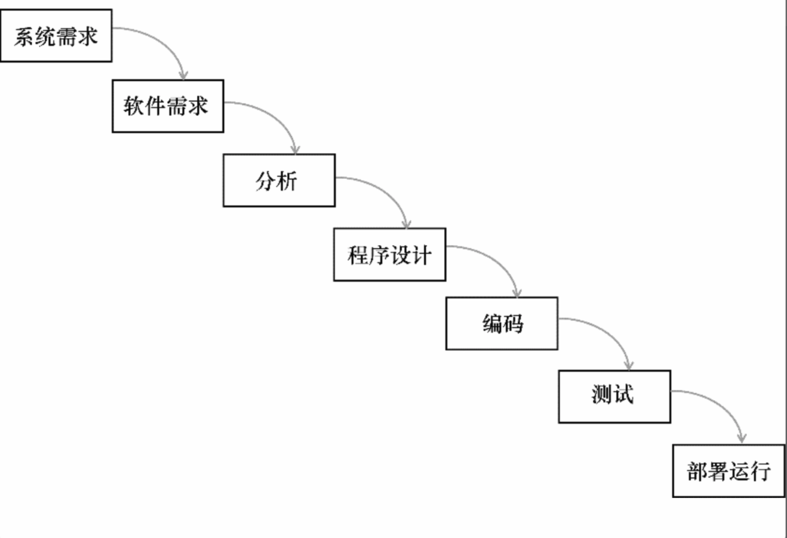
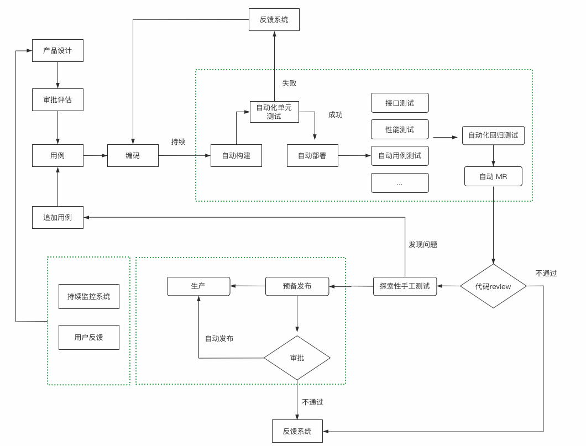

# 软件工程研发效能历程
## 什么是研发效能
在应用交付的过程中，我们会遇到很多难题。例如，业务压力太大，没有时间改进；开发和测试的时间被压缩得太少了，没有时间先这么干；这么做的风险太高了，质量很难保障等等。而这些难题正是由于软件工程的发展惯性带来的。

举个“方形轮子”的案例，有一个老板在前面拉着一辆手推车，而轮子是方形的，工程师在后面使劲的帮忙推动，大汗淋漓，由于老板关注的是整体方向，只要发现车是向前行动，所以就觉得没有太大问题，而后面推车的工程师发现方向轮子效率非常低下，只要稍微停下来，把轮子改造成圆形，即可更轻松的前进。由于老板在带头使劲拉车，工程师在后面也不敢怠慢，只能印着头皮一起拉。

在一个有着共同目标和方向的团队就像一辆徐徐前进的车，由于惯性作用，我们很难停下来做更多的思考和调整。把 “方形轮子” 改成 “原型轮子” ，就是研发效能的提升过程。

## 软件工程发展概述

### 瀑布流
瀑布流研发模式是，把软件的功能和需求全部提前明确进行协商和定义好。研发严格分割成设计、分析、编码、测试和交付等几个串行的阶段、在前一个阶段整体完成后，才能继续下一个阶段，最后再按照约定时间和内容交付给客户。这种模式在上个世纪 60 年代，项目经理的Dr. Winston W. Royce主导完成了一个大型软件项目的开发工作后，并于1970年在 IEEE 发表了一篇题为 “Managing the Development of Large Software Systems”（大型软件系统的开发管理）的文章提出。在这篇文章中他描述了一种软件开发模型，如图所示。整个软件开发过程类似于一个瀑布，这就是著名的“瀑布软件开发模型”。

这种模式在那个年代很快成立行业标准，成为很多公司进行项目管理的一套规定方案。

随着硬件的不断发展，个人计算机的应用普及，20世纪80年代后，软件的需求爆发性增长，同时，软件的规模也不断变大，超过上百万的代码的组成的，需要数百工程师参与的软件也很常见。可靠的研发和维护这样的软件成为新的难题。

严格的瀑布流研发模式带来的质量问题、延期问题在行业日益凸显。因为它的成功必要在研发过程保证三个条件：

1. 业务需求是稳定且不变化的

2. 需求的软件解决方案是确定的

3. 构建软件的技术方案是明切无未知项。

显然，在个人应用需求不断变化和新技术层出不穷的场景下，满足这三个条件是非常困难的。瀑布流的研发方式也收到的大量工程师质疑，也诞生了大量新的方案。

###敏捷软件开发

敏捷软件开发并不是一种软件的开发方法，而是满足敏捷宣言及原则，产生的一系列系列软件开发方式的集合，指在解决传统开发方式各种弊端。

2001年2月11日至13日，在美国犹他州瓦萨奇山雪鸟滑雪胜地，有一场“轻量软件”支持者组织的一场会，讨论了各自提出的那些轻量级软件开发方法的异同点，希望总结出它们的共性，以及与重量级瀑布方法的不同之处。会议的最终成果就是”敏捷软件开发宣言” 和 “敏捷开发 12 原则 ”。

#### 敏捷开发宣言：
> 
我们一直在实践中探寻更好的软件开发方法，身体力行，同时也帮助他人。由此我们建立了如下价值观：
"个体和互动 高于 流程和工具
工作的软件 高于 详尽的文档
客户合作 高于 合同谈判
响应变化 高于 遵循计划"
也就是说，尽管右项有其价值，我们更重视左项的价值。

####敏捷开发12 原则：
1. 尽早地持续交付有价值的软件，以便让客户满意，这是最高优先级的事情。

2. 即便在开发阶段后期，也欢迎需求变化。为了让客户获得业务竞争优势，利用敏捷过程来应对变化。

3. 频繁交付可工作的软件，建议采用较短的交付周期（通常是几周或一两个月）。

4. 在整个项目过程中，业务人员和开发人员每天能够一起工作一段时间。

5. 围绕积极的个体，建立项目团队。给他们需要的环境和支持，并相信他们能够完成工作。

6. 无论团队内外，传递信息效果最好和效率最高的方式是面对面地交谈。

7. 可工作的软件是项目进度的首要衡量标准。

8. 敏捷过程促进可持续发展。项目主要干系人、开发人员和用户应该能一直保持节奏。

9. 持续关注技术卓越和良好的设计，提高敏捷性。

10. 以简洁为本，它是极力减少不必要工作量的艺术。

11. 最好的架构、需求和设计会从自组织团队中涌现。

12. 团队要定期地反思 “如何变得更有成效？”，然后相应地调整自身行为。

从上面宣言和原则我们可以看出，敏捷软件的的核心是注重 “交付价值、以人为本”。只要试图去满足这个价值观的开发方式，都可以称作朝着敏捷开发。这里的重点不在于技术，而是思维转变。

我用传统开发方式的痛点来简单解释。在瀑布流式开发方式下，我们会在开始阶段尽可能做大而全的规划，细致的需求说明、接口设计，预期发布时间等，然后产品设计完交给开发、开发完交给测试，这样层层流转最后给用户。在开发的过程实际上会有很多业务需求的变更和调整，到发布的前期，经常容易出现和规划阶段不一致的体验和行为、以及大量缺陷，往往产品和开发都苦不堪言，并且彼此抱怨。

之所以会出现这样的问题，既不是产品的失败、也不是开发的无能。《人月神话》中提及 IBM公司开发的OS/360系统、投入5000 人年，耗资数亿美元，结果还是延期交付，在交付使用后的系统中仍发现大量的错误。**其本质其实是人类对复杂系统的不可控。**

瀑布流式开发的思维是遵守着传统工业、建筑领域等项目管理模式，它们交付给用户的都是一个大而全的完整不可分割的实体，期间每一个制作环节都像流水线一样，可以精准把控。但真正的软件开发却不是如此的，软件不存在的实体，产品设计在看到产物前，必须亲自在大脑中绘制每一项功能和细节。而整个开发过程也都是在用人类大脑不断抽象和构建。这两种思维活动的中间产物都不是“实体的”，并没有标准的衡量方式，直到最终软件给到交付和体验。由于软件开发过程需求和技术不确定性无法避免，这就造成复杂度呈 N^M （N:需求不确定性，M: 技术不确定性）指数式上升。软件的最终实际产物会非常容易偏离设计之初的设想。

解决办法是将每次交付拆分为多个产物，这正是软件工程不同于传统工程的特殊之处，软件是“软的”，某种程度可以任意分割。拆分之后，在需求不确定性和技术不确定性不变的情况下，每次交付的复杂度为 X^Y 之和小于一次性交付 N^M（其中 X1 +X2+ ... + Xn = N; Y1+Y2+Yn + ...+ =M）。 当然，实际上还要考虑每次变更对已经正常运行部分的影响，这里只是举例将复杂软件进行拆分交付是一种降低不可控因素的方式。

 

敏捷不仅仅是拆分需求，拆分需求仅仅是体现“尽早地持续交付有价值的软件“ 这一部分原则而已。交付价值体现在整体研发流程阶段，包括从产品讨论、开发、测试和运维等核心是围绕软件价值，不是固化的流程和工具，这也是“个体和互动高于流程和工具“ 这一排在最前面的宣言。

敏捷开发非常容易被误解，我想重点说明下（这个词翻译让人误解）。

敏捷实际上是上面一系列价值观组成，我们平常所运用的一些方法，比如拆分需求等是为了达到这种价值观的方法论。

#### 敏捷错误认知

- 敏捷不是牺牲质量，快速上线（很多老板理解错了），相反它的出发点是包括提高质量。

所谓敏捷是指灵活轻量化，反对“笨重”。因为笨重更容易导致质量问题。你可以想象老鼠和大象谁转身更方便，真实的需求和技术就像老鼠一样，是多变切不可控的，而身体庞大快速转身的代价可能是轰然倒地。

比如传统的软件交付，开发思维会执着于把几个需求集中设计，集中交付，代码层面模块和功能非常容易耦合，产品思维会认为用户必须拥有自己认为的全部需求。在项目流动的过程，又发现这样或者那样的不对，这个时候想要调整的代价就会更高，对质量冲击更大。

敏捷的开发思维应该是，聚焦用户每个小的功能点，每个功能模块应该是可以拆卸和组装，不管多小的组件都应该可以彼此不受影响独立交付。敏捷的产品则应该是想着，用户不一定想要这些东西，我尝试把最小的变化放上去，看看效果，用户觉得满意，我再继续投放下一个特性，用户不满意，那我们的成本也非常低。

- 敏捷不是抛弃流程和文档，而是流程和文档要为软件价值而生。

敏捷宣言说“工作软件和互动高于流程和文档“，这并不是说不要流程和软件，否则会走向歧途。传统的文档偏向 “甲方” 给 “乙方” 义务式，比如产品有一个需求，首先写一个需求文档，然后直接通过流程平台让开发评审。这期间互动在后，流程在前，假设需求无法实现、或者实现成本代价很高，中间就是“过程损耗”。

敏捷的思维模式是，产品有一个初步的需求想法，第一时间和相关开发互动、了解初步实现过程及成本，开发再给予反馈和建议，最终初步达成一致，这个时候后续的需求文档完善，就能发起正式流程，开发、测试、产品就可以围绕这个文档做后续工作。所以敏捷并非抛弃文档，而是重视互动，不要让开发和产品彼此割裂。

- 敏捷就是需求拆分（很多同学这样理解）。

并不是说把大需求拆成小需求，就是等同于敏捷开发。拆分需求是提高交付频率的一种手段，如果只是“为了拆而拆”，那么拆分后局部又沦为“小瀑布流”模式，那就是“换汤不换药”。敏捷核心是“交付价值”，过程要“以人为本”。拆分需求的真正目的是，更早的把价值给到用户。在一些独特的特性交付上，比如底层架构大调整、复杂的产品逻辑上，不能因为开发时间周期长而 “故意拆分” ，破坏用户体验，要具体问题具体分析，根据实际情况讨论出“最小用户特性”。

####敏捷如何实践

经过上面的讨论，相信大家已经有所理解了，敏捷开发不是“开发方式”。没错，它是一种价值观。具体怎么实际敏捷，在业界有很多方法，他们都是不同公司在“敏捷价值观” 实践产物。但在这里，我并不想详细介绍，因为，每一种被 “命名” 方法都是特定团队的产物，并不是推荐完全照搬，相反，根据“敏捷价值观”，借鉴业界的方法，根据自己团队的实际情况去落地才是最好的。

我举几个例子，用什么样的方案保证团队信息透明，积极互动？可以有站会，可以有任务拆分表，可以有黑板报等。用什么样的方式加快交付频率？可以拆分需求，每周发布，可以运维自动化，可以运用自动化测试减少测试时间等，如何保证软件质量和工作效率？可以持续集成、可以测试驱动开发，可以结对编程，可以40小时工作制等。

我们可以看到，敏捷开发的外延非常广，广义上，我们后面提到的精益开发、DevOps 都是包含在敏捷的价值观内。

####业界的敏捷实践：

- Scrum框架
- 极限编程
- SAFe
- Less框架
- Nexus
... ...

大家可以去查阅相关资料，切不可满目照搬，记住敏捷开发不是“敏捷开发方法“。

### 精益软件开发方法
精益软件开发提出的时间比敏捷宣言更晚，但它在引入软件界前久已经在汽车工业界非常流行了。精益生产原则来源于丰田汽车的制造，该词最早由约翰·克拉富西克于1988年在文章中提到"精实生产系统的胜利"，后被各大商学院和其他行业广泛学习。2004 年 Mary Poppendieck和Tom Poppendieck 年的同名书籍《敏捷软件开发工具》提到精益软件开发一词，而其中精髓便是“精益原则”。

它们分别是：

**1. 除浪费**

精益原则的核心，消除一切软件交付过程的浪费，比如，任务切换、任务传递、软件缺陷、不明确的需求、无效等待等。

**2.增强学习**

软件开发可以说是一个持续学习的过程。最佳改善软件开发环境最好的做法是增强学习。比如在代码完后，马上进行测试避免缺陷积累，不是去做更多的需求，而是对各种各样的想法进行实际的编程尝试，比如改善代码局部性能和结构，使之更完美。这一过程非常重要，软件的质量取决于开发者，而开发者是否抱着学习增强对心态会影响全局。

**3.尽量延迟决定**

在刚刚上面的软件复杂度中我提到过软件开发有需求不确定和技术不确定两个挑战，延迟决定是容纳复杂性的方式之一。

**4.尽快发布**

在个人计算机流行以来，用户市场瞬息万变，今早发布有利于得到反馈来改善当前产品，从未更快完成下一次迭代。

**5.下放权力**

传统的开发是由团队管理者分配到每个人所要完成的任务。但是精益开发主张下方到每个人手里。这可以极大的释放开发同学的创造力，获得更多的开发过程反馈。

**6.嵌入质量**

质量应该是在开发的每一个环节，而不是在测试阶段来发现质量问题，本质上上，这就要求开发更严格的自测和交付质量。

**7.全局优化**

传统的软件开发，产品、开发、测试、运维等彼此存在考核的对立面，全局优化要求，消除部门之间、成员之间的隔阂与浪费，协同优化。

通过上面的原则我们可以看到，精益软件开发是将“精益原则”运用到敏捷软件开发上，它们在软件工程开发历程中是朝着提高效能这一共同方向。

### DevOps

DevOps 是这些年来讨论最为频繁的一个词之一了，对它的定义也在不断延展。这个词最早出现在 2009 年一次名为“DevOpsDays”的研讨会上，它由“development” （开发）和 “operation”（运维）组成，会议的主旨是提倡加强开发和运维的紧密协作。

传统的开发和运维某种程度存在对立状态，开发人员负责编码并且希望更快、更多的需求交付，以体现价值，而运维人员则偏向维持稳定的系统，减少变更，因为运维人员的工作是保证线上不出问题。如何消除这种对立实现又快又好的部署？那就是 DevOps。为消除开发、测试、运维之间的浪费而促成的一系列过程和方法。

到目前为止，DevOps 不存在严格定义，有人认为敏捷做对了（比如尽早交付），就是 DevOps，所以它没有标准。但它有更具体的一些实践，目前主流的 DevOps 方法是围绕自动化提高交付频率、以往运维部署生产的低频行为，变成一种高频行为，并且保证质量，这一切需要很多基础设施和配套工具，更重要的是思维转变。

上面是硅谷等大型公司部署生产的频率非常惊人，这背后是一整套开发思维转变和基础配套工具在支持。我们简单看下几个主要点。

1.自动化

自动化是实现DevOps 的重中之重，可以说占据了 DevOps 一大半精力。包括自动化单元测试、服务接口自动化测试，UI 自动化运维。

2.持续集成、持续部署

持续集成会依赖于流水线平台，开发人员需要养成尽早集成和部署的习惯。自动化足够靠谱，开发人员可以直接修改一个小特性，本地验证、推送代码，流水线运行各种自动化测试，通过后，自动转单到达测试，测试进行探索验证就直接等待部署生产了。对于生产的部署也应该手工触发自动化运维。

3.持续监控、反馈系统

全自动化高度依赖监控系统，要时刻监控整个流程和软件，同时做到快速反应。比如构建失败要及时通知，然后相关开发人员在 10 分钟内解决。对于生产的性能、错误、用户反馈要有敏捷上报渠道，快速形成决策。

以上我个人的一个梳理，我们可以看到，DevOps 强调打通全链路，做到随时随地高质量部署。依赖稳定可靠的流水线平台和相关工具，持续监控、敏捷的反馈系统。开发、测试和运维必须是一体的，围绕稳定可靠的自动化工具，相信机器比人可靠，从而释放人力。

## 软件工程的方向

看到这里的同学就会发现、从瀑布流开发、到敏捷原则、到精益原则，最后到 DevOps，其本质的共通的，核心都是围绕提效。在看到这些名次的时候不要被迷惑了，都是相同方向不同侧重点的阐述。

敏捷强调 "灵活、以人为本"，它解放了“笨重、僵死的开发方式”，是向传统软件开发方式最早的“檄文”。由于它的原则比较开放和丰富，后续的、精益软件开发、DevOps 都可以看成是它的进一步延续。

精益软件强调消除浪费，注重质量，它吸取的是汽车领域的精髓；DevOps 强调打通全局、消除对立，寻找共同目标，运用自动化方式持续快速的部署生产。

你可以认为敏捷做好了，它就是精益的、就是DevOps 。

## 暂时结

写这篇文章本来的初衷是重点讲提升效能的实践细节，比如如何通过敏捷项目管理消除信息不透明进度不可控，如何调整迭代方式消除浪费、需求怎么拆，怎么流动？大型团队分支怎么敏捷管理、未完成的功能怎么发布到生产？等等。但在开头想提下软件研发的历史，发现写了太多，要整个篇幅下来得超过万字。暂且就把这个研发的历程当作一个独立文章。