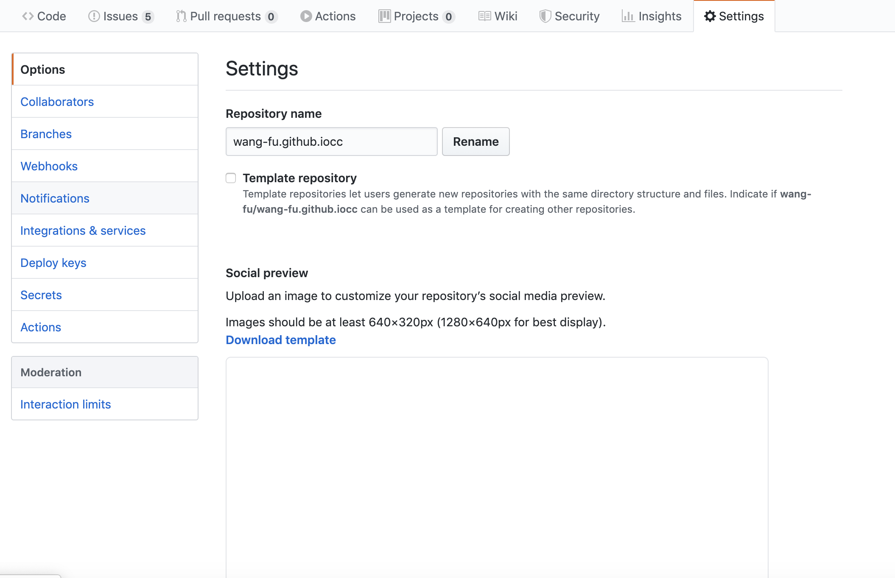
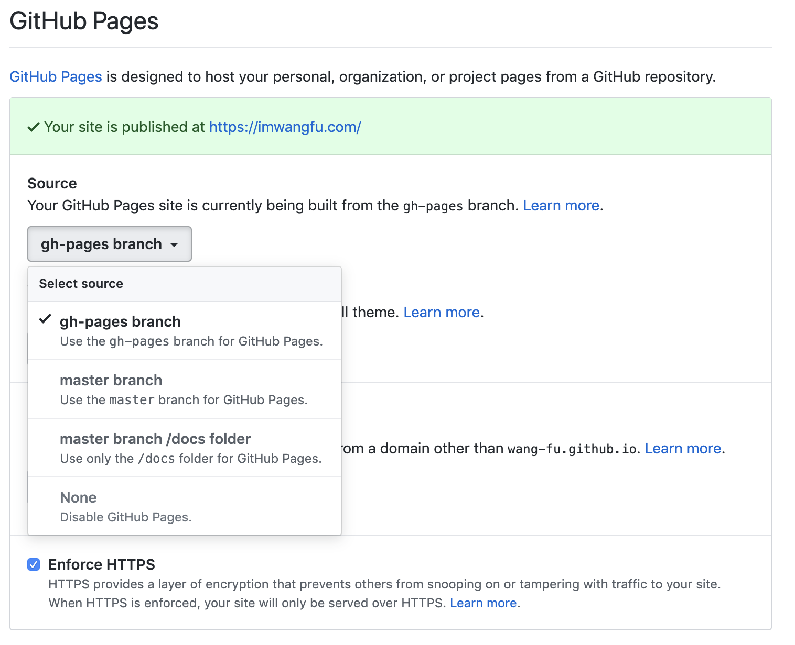
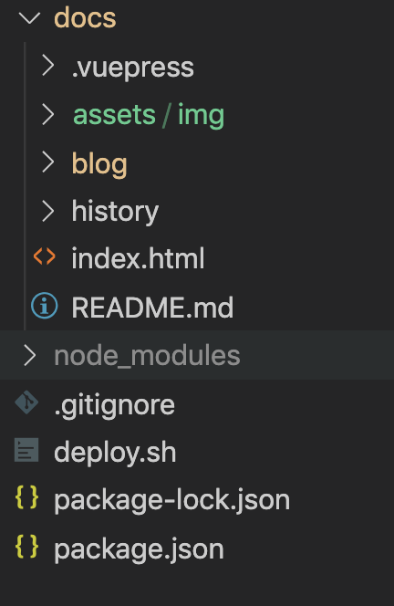
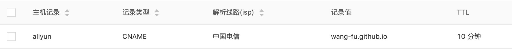
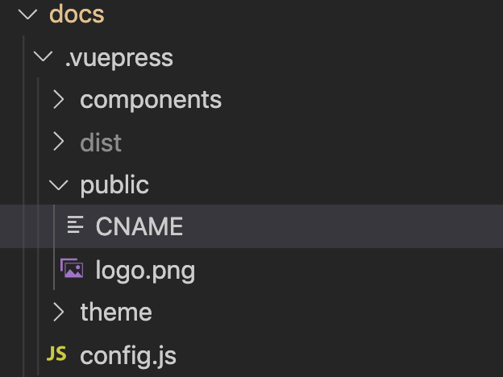

原 wordpress 博客已经停止更新了一年多，鉴于继续购买服务器仅仅用于承载一个静态博客，并且也无心维护服务器，显得有点浪费，github pages 是一个不错的选择。早在一年前就想用 vuepress 来发布博客内容，工作上事情太多，并且平常发布在 [alloyteam](http://www.alloyteam.com/ "alloyteam")  平台上，闲暇休息片刻，又一拖再拖，直到最近，终于算是重新恢复了。


有一个自己的小站，感觉有属于自己的一篇天空，不管更新的频率高低，它是闲暇片刻之际，可以来到的一个园子。

### github pages
github pages 是一个依赖于 github 平台可以承载个人静态页面的功能，具体参考 [pages.github.com](https://pages.github.com/ )。

新建和 clone 到本地

``` bash
git clone https://github.com/username/username.github.io
```
写入内容

```
cd username.github.io

echo "Hello World" > index.html
```

提交

```
git add --all

git commit -m "Initial commit"

git push -u origin master
```
访问 https://username.github.io 就能看到页面。

### github pages 设置
 github pages 设置页面，对于不常使用的人，藏得有点深，点击设置后，默认 Options 选项可以继续拉动到底部（一开始看到页面无滚动条，差点以为无法下拉，还寻思了半天 ~尴尬~），可以看到其他选项。



#### 入口页面
github pages 分两种类型，个人/组织站点，项目名只能用 username.github.io 这种格式。访问 https://username.github.io 默认会以 master 分支下 根目录 index.html 作为静态页面，无法更改其分支和渲染路径。

还有一种是应用类，项目名任意取，可以设置 静态页面路径为 master分支的 docs 目录，及 gh-pages的根目录两种形式。对于拥有个人独立域名的用户，建议用后一种方式更灵活。



### vuepress

[vuepress](https://www.vuepress.cn/guide/)是一个极简单的静态网站生成器，具体参考[指引](https://www.vuepress.cn/guide/).

我们参照文档，最终搭建的简单目录结构如下：



#### 主题和渲染内容

vuepress 会把 README.md 内容当作 vue 文件渲染，我们需要将其他 markdown 内容导出到这个入口文件，这一点需要借助 vue 模板语法。在.vuepress/components 定义的组件，可以在 README.md 中全局引入。

``` html
<BlogPostList 
  :pages="$site.pages" 
  :page-size="$site.themeConfig.pageSize" 
  :start-page="$site.themeConfig.startPage" 
/>

```
其中 BlogPostList 既在 components 下定义的组件，$site.pages 可以获取到全部文章，然后在组件内遍历。具体主题用法参考 [vuepress 主题](https://www.vuepress.cn/theme/writing-a-theme.html#%E4%BD%BF%E7%94%A8%E6%8F%92%E4%BB%B6)。此主题是在此基础上 [https://github.com/bencodezen/vuepress-blog-boilerplate](https://github.com/bencodezen/vuepress-blog-boilerplate) 进行改造的。

####  自定义域名

.vuepress public 目录下的文件会直接打包到根目录最外层作为静态文件，我们可以新建一个 `CNAME` 文件到 public 目录，然后添加上需要映射的自定义域名，打包上传。最后在域名服务商控制台将CNAME 指向  https://username.github.io。




### 发布部署

#### 构建发布

前面已经提到，基于 username.github.io 形式的 github pages 站点 默认只能部署在 master 根目录下。我们通常会采用另一种自定义应用的形式，基于 master 分支开发，然后把构建的内容部署推送到 gh-pages 分支中，这样便于将开发分支和部署分支隔离开来。

#### husky集成

通过 husky 设置在每次 push 代码时自动运行部署脚本。

``` bash
#!/usr/bin/env sh

# 确保脚本抛出遇到的错误
set -e
# 生成静态文件
npm run dist
# 进入生成的文件夹
cd docs/.vuepress/dist
# 如果是发布到自定义域名
# echo 'www.example.com' > CNAME
git init
git add -A
git commit -m 'deploy'
echo '文章推送到 github pages中...'
git push -f git@github.com:wang-fu/wang-fu.github.iocc.git master:gh-pages
cd -

```

