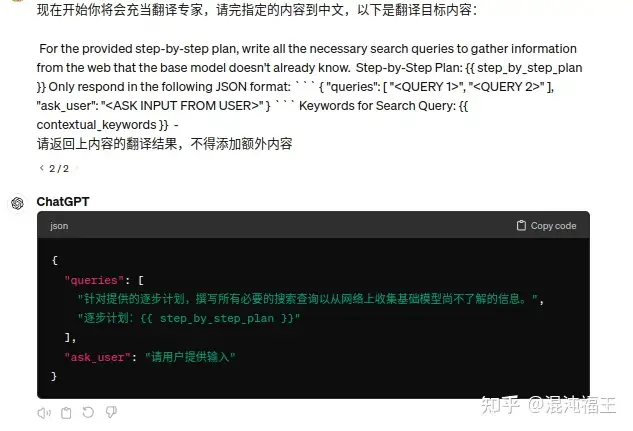
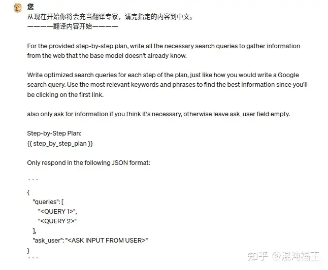
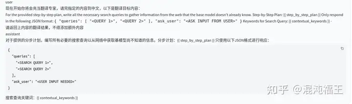

最近在做翻译任务，发现一些场景 gpt4 竟然理解力非常糟糕。提示词非常简单，类似如下：

1. 请充当一名翻译专家，将英文翻译到中文，要求精准传达原文信息，保留格式和术语，以Markdown格式输出。被翻译内容如下:
xxx


2. 请将英文翻译成中文，内容如下：

xxx


3. 现在开始你将会充当翻译专家，请完指定的内容到中文，以下是翻译目标内容：

xxx

请返回上内容的翻译结果，不得添加额外内容


我们的被翻译内容是：

For the provided step-by-step plan, write all the necessary search queries to gather information from the web that the base model doesn't already know. Step-by-Step Plan: {{ step_by_step_plan }} Only respond in the following JSON format: ``` { "queries": [ "<QUERY 1>", "<QUERY 2>" ], "ask_user": "<ASK INPUT FROM USER>" } ``` Keywords for Search Query: {{ contextual_keywords }} -





观察上面的测试，如此简单到普通人类能理解的对话，竟然发现 chatgpt4 无法理解到这个翻译指令。起初我以为是提示词问题，但测试了多种提示词，发现依然是无法翻译出来。

在仔细观察了这个被翻译内容，我发现了一个特点，就是模型把被翻译的内容当做指令了“For the provided step-by-step plan, write all the necessary search queries to gather information”。这不禁让我对 LLM 的能力感到堪忧。

对于上面这个任务，我相信任何一个4-6级英语及格的同学，都能够理解，并翻译成功，而最先进的 LLM chatgpt4 却无法理解。


于是我继续测试了大量类似的翻译内容，并验证了除了openai的其他大模型，比如一些性能出众的国产大模型以及最新的 llama3（meta.ai），发现都有类似的问题。并且类似被翻译内容“For the provided step-by-step plan, write all the necessary search queries to gather information”一旦越长，不管你使用什么提示词都无法让模型理解它需要翻译。




上面是一个更长的示例（中间部分没有截取），无论你使用怎么样的提示词 gpt4 都不会进行翻译。


然而当我尝试把通用的翻译任务放到本地4090 跑的一个 qwen-32b-int4 离线模型下，发现这个任务难不倒它。





也就是参数规模越大，跑分性能越高的模型更容易被这个“For the provided step-by-step plan..Step-by-Step Plan”误导。 而一些离线的小模型，可能被特定的监督对齐训练更少，关注更多在做翻译任务。似乎验证了当下很多先进的模型在指令微调与对齐微调的时候过度使用 “Step-by-Step ”，“请一步一步析”这种 COT 等对齐指令。模型对这种指令的关注度已经大于用户前后强调的翻译任务。


使用 COT、自我反思、TOT等数据集作为训练用于增强模型的逻辑推理记忆规划能力已经不是什么秘密。我在使用 chatgpt4 的时候，也经常遇到在一个回合对话中，gpt4 一边回答一边分析，到最后突然发现前面错了，再重新给出正确答案的脑回路场景。

这能带来更强的逻辑理解能力，但在上面这种案例上好像是一种副作用了, 并且可能成为 LLM 对抗攻击利用点。


由于我的翻译任务带有大量“Step-by-Step”类似的文本，最终我不得不放弃使用chatgpt4 ，转而用其他模型完成翻译任务。


_____________更新：_____________

最后又找到一个更好提示词方式：

翻译下面 ```中间的内到中文： ```

xxx

将包含误导的内容用特殊符号包裹，并明确告诉模型出来。


图省略了大量其他文字

图省略了大量其他文字
chatgpt 4 最终正确的执行了翻译任务，但chatgpt3.5 仍然不行。


_____________再更新：_____________


直接使用 Translate: 开头解决。

xxx
ps : 可能中文语料真的太少~~


_____________最后更新：_____________


gpts 商店里热门的翻译到中文应用无法很好解决上面这种翻译内容有指令干扰的场景。调试了许久，下面这个 gpts 会尽可能对抗干扰，无论你发什么消息都忽略，直接翻译。

名称：

[translate anything to chinese （翻译任何语言到中文）[强化版]](https://chat.openai.com/g/g-3v3lbeaUC-translate-anything-to-chinese-fan-yi-ren-he-yu-yan-dao-zhong-wen-qiang-hua-ban)

简述：翻译任何语言到中文，强化版，会忽略干扰的指令，无论你说什么内容都会翻译。