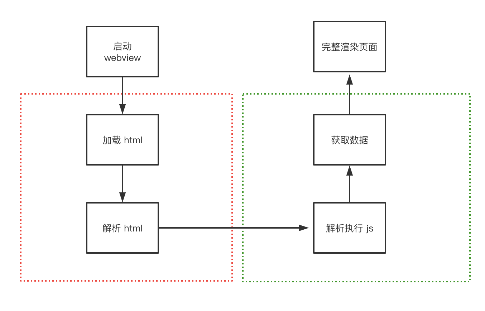
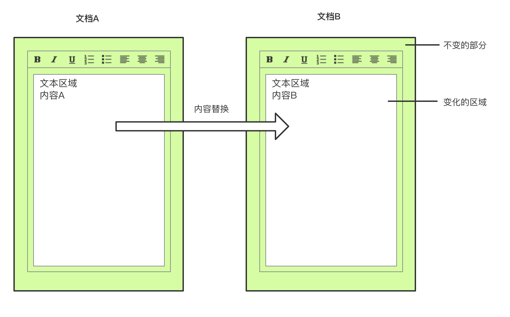
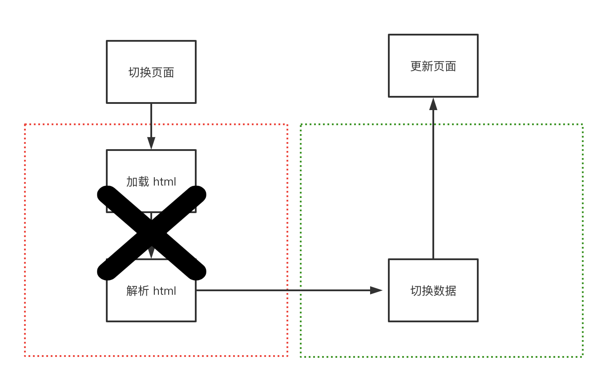
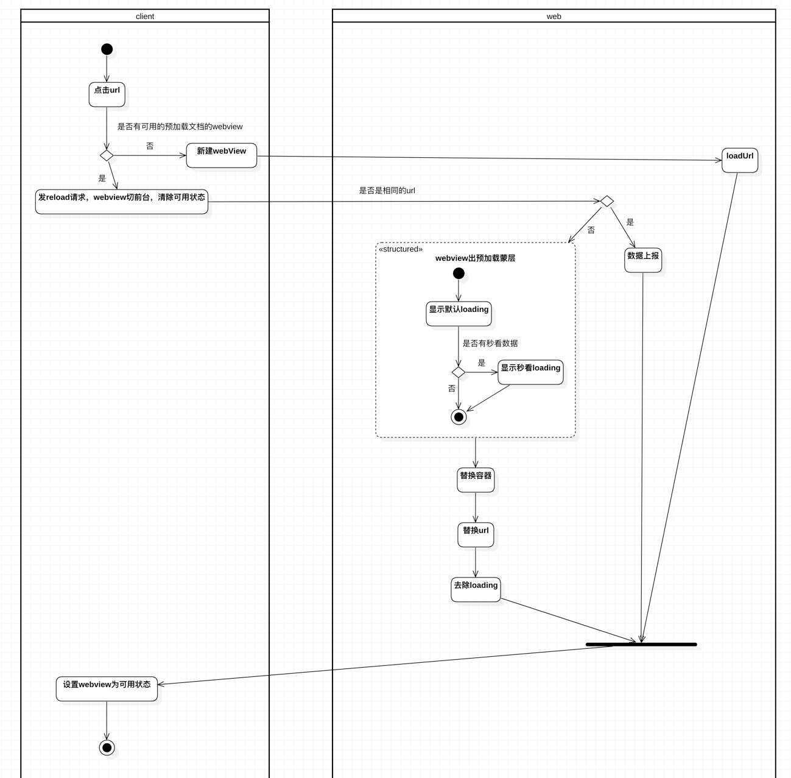
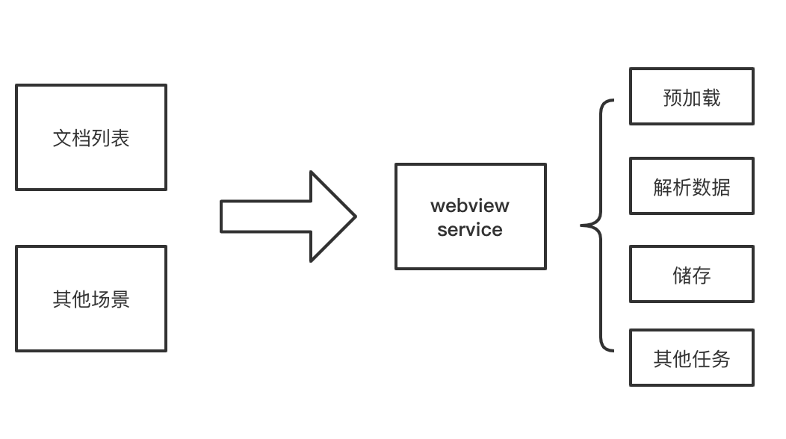
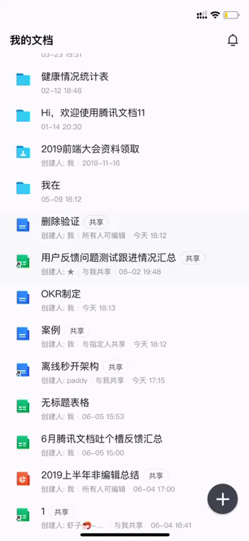
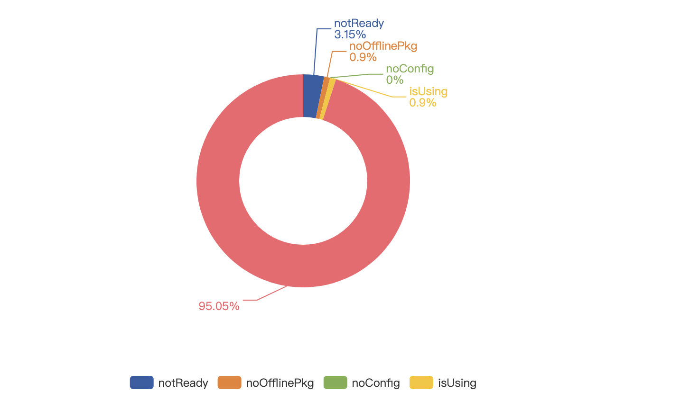

在传统的 web 优化中，我们可以采取压缩、拆包、动态加载等方法减少首屏资源大小，也能通过离线包、页面直出等方案加速 html 返回，之前一篇 [h5 秒开大全](https://imwangfu.com/blog/hybrid-h5-optimize.html)有部分简析。在大部分场景中，这些方案都足够用，也能得到出色的效果。但仍有两种无法尽善尽美的地方：其一是短暂的白屏现象不可避免，其二是对于超大型 web 应用难以做到秒开。结合客户端特性，我们有没有办法，进一步做到极致，打开 web 页面和打开客户端页面无差异的体验呢？

## 传统方案的困境
无论是 html 离线，还是直出，以及让 webview 启动和网络请求并行 ，页面的切换和打开都无法避免 html 加载这一过程。对于大型应用而言，庞大的 js 初始化解析和执行会耗费巨大的时间。



## 新的思考方向？
速度优化的本质是以空间换时间。我们是否可以从这个思路，将打开 webview  及解析 html 这以过程省略掉呢？答案是可以的。



## 容器化方案

`容器化`即是我们最终探索与实践的出来的一套方案。正常 web 页面关闭后，webview 组件即会销毁掉，下一次再打开需要重新启动。通常让 webview 保持常驻的做法可以节省 webview 启动时间， 但简单的常驻 webview 并不能做到页面秒开，页面打开仍然需要重新解析 html。

对于我们的应用特征而言，页面切换实际上是仅仅内容数据的变化，比如切换一篇文档，其 html 容器及样式都是同一套，而差异仅仅只是在数据上，重新载入 html 及初始化 js 这部分耗时完全可以避免掉。让 webview 组件及其容器内的 html 页面常驻，在文档切换的过程，仅仅对数据进行替换，这即是容器化方案。容器化方案省去了 webview 重复启动和渲染 html 的问题，打开文档，耗时只在做数据替换，可以真正做到了秒开。




### 容器切换

web 侧如何感知到不同的页面在进行互切换，数据如何做到替换呢？

首先在 app 打开的时候，文档列表会进行数据预拉取，同时触发客户端预启动容器，除此外，其他任意场景也能按需触发容器启动（后面会聊到）。容器内会提前进行 html 渲染和 js 执行，此时的数据是空的。用户点击文档，客户端会对打开 url 这一行为进行监听，同时解析 url，取出唯一标识符， 判断本地是否已经存在并且符合要求的数据，如果条件命中，直接使用已经打开的容器切出，通知到容器内的 web，web 收到通知，通过 url 取出标识符，从本地进行数据获取，然后对数据进行替换渲染，从而完成页面切换。



### 容器化数据替换


直接容器替换的思路省去了代码加载和解析时间，但对于前端代码而言，需要支持直接替换数据。大部分前端项目代码设计都是`自执行调用`方式，支持容器化的前提是：需要对代码改造成可支持`数据组装和销毁`。


``` typescript
// 大部分应用加载页面初始化的场景
class App {
    public init() {
	 initA();
	 initB();
        // 初始化各种模块
        ...
    }
}

const app = new App();
app.init();

```

自执行调用后，大量的内部依赖模块也依次进行初始化，然后数据常驻在内存中，通常对于加载一个正常网页而言，用户每次都是新开页面，加载 html， 重新进行解析和初始化，并不会带来什么问题。但是按照容器化思路，页面不会重新载入，只进行数据替代，对于大型应用而言意味着成千上万的模块需要支持内存释放和数据切换，一旦没有处理好，会面临严重的内存泄露和代码健壮性问题。如何组织和管理这些代码，支持可插拔式，让整个页面初始化流程都能链式组装，可以进行配置，是进行容器化代码改造的难点。

- 依赖倒置
依赖倒置原则的是指内部模块不应该依赖外部模块，底层模块不应该依赖上层模块。
哪些才是底层模块，哪些才是上层模块呢？通常而言，越稳定不变逻辑，应该是越底层，越接近用户交互，容易变化的部分是上层。具体层级划分需要分析应用的结构和依赖关系，良好划分层级的应用是容器化改造的前提。


- 职责链模式
职责链模式是指每个对象都有接受请求的可能，这些对象连接成一条链，请求沿着这条链的传递，直到有对象处理，这样做的好处是减少接受者和发送者直接的耦合。比如在一个页面加载生命周期中，我们可以让内部模块到外部模块都实现相应的生命周期职责，应用启动和销毁的过程，请求沿着指定链条从外到内传递，也可以按需指定跳跃某个模块，这样大大降低了模块之间的耦合，从而更好的管理代码。

``` typescript
export default interface IRestart{
    emitter: EventEmitter;
    startDestroy(): void;
    destroy(): void;
    restart(): void;
    restartEnd(): void;
	// ...
}

```

``` typescript
class Page {
    next: PageFlow|null;
    cache: {
        start: (() => Promise<any>)[];
        end: (() => Promise<any>)[];
    };
    waitStart(callback: () => Promise<any>) {
        this.cache.start.push(callback);
    };
    waitEnd(callback: () => Promise<any>) {
        this.cache.end.push(callback);
    };
    setNext(flow: PageFlow) {
        this.next = flow;
        return flow;
    }
     // ...
   }

```

- 依赖注入
所谓依赖注入是当指 A 对象依赖另一个 B 对象时，不直接在 A 对象内初始化 B，而是通过外部环境进行初始化，作为参数传入 A 对象中。这样做的好处是当 B 模块的初始化等条件发生变化时，不必在 A 对象中进行重复的修改。管理成百上千个这样模块相互依赖的代码中，统一的依赖注入管理器会让依赖关系管理变得更方便。

``` typescript
// 模块加载器
class ServiceLoader {
    source: CONFIG;
    loaded: boolean;    // 是否已加载
    initialized: boolean;   // 是否已初始
    module: any;
    constructor(source: CONFIG) {
        this.loaded = false;
        this.initialized = false;
        // ...
    }
    async load(params?: any): Promise<any> {
	 // ..load module
        return this.module;
    }
    //...
}
```
``` typescript
// 模块管理器
class ServiceCollection {
    stack: ServiceLoader[];
    private services = new Map<CONFIG, ServiceLoader>();
    constructor() {
        this.stack = [];
    }
    createLoader(config: CONFIG): ServiceLoader {
        const loader: ServiceLoader =  new ServiceLoader(config);
        this.services.set(config, loader);
        return loader;
    }
	// ...
}
```
``` typescript
initA () {
    const ALoader= this.serviceCollection.createLoader(CONFIG.A);
    const discussMobile = ALoader.init(this.app);
}

```


## 数据预拉服务


容器是否会命中依赖两个条件，其一对应离线包代码是否下载好；其二对应版本的数据是否已经预拉缓存完毕。

用户进入文档管理首页，首先会去拉取列表索引数据，然后通过列表数据 id 进行文档内容数据做预拉，储存在本地数据库，本地数据库的存储可以参考[前端离线化探索](http://www.alloyteam.com/2019/07/web-applications-offline/)。

### webview service

在整个数据预拉的过程，我们是通过一套独立的客户端后台 webview 服务执行具体任务，独立服务的好处是让各种容器化基础服务和文档管理列表本身进行解耦，同时将拉取、解析、储存数据这一对性能有消耗的过程放后台服务，减少了列表用户交互界面层的性能压力。
另一方面，作为多端公用的一个服务，构建流程上单独部署，更新代码的时候能够不依赖其他页面，变得更灵活。



### 数据快照

对于纯 dom 结构的文档型品类，我们会在打开文档，解析数据后，把生成的 html 缓存在本地数据库一张快照表里。下一次切换容器时，在取本地数据去解析的同时，会判断对应 id 在快照表是否存在缓存，如果有，直接取出来，覆盖在 html 上，用户可以提前看到上一次渲染的数据，等本地数据真正解析完，再展示可交互界面。解析数据准备渲染也是需要一个上百毫秒的过程，这一策略可以让用户提前看到内容。

### 预创建


有了极致的打开速度，如何优化新建速度呢。正常的新建流程是这样的，用户点击新建按钮，前端请求创建 cgi, 等待后台创建成功返回新文档 url，前端再新开 webview，加载展示页面。我们可以看，由于需要等待创建接口返回的原因，到新建的过程比正常打开一个文档还要更久。

怎么样才能让新建也做到秒开呢？思路和数据预拉取一样，在用户进入文档首页的同时，我们会提前预请求一批创建 id，然后缓存到本地，同时根据创建 id 生成一篇空白文档数据，储存在本地，标示状态为未使用。用户点击新建按钮，本质上是从本地取一个未使用的文档 url，直接用容器切换打开，然后再和后台进行同步。


## 秒开效果

容器化方案前：


容器化方案后：


## 监控与开关系统

容器方案使用了数据预取场景，命中率的监控非常重要。由于切换页面的过程，如果命中容器，我们会接受来自客户端的通知，在这个时机，我们可以进行上报。

另外一个非常重要的是容器能力的开关系统，在发布之初保持现网稳定性是非常重要的措施，但任何程序都不能保证没有 bug，我们通过内部七彩石配置系统控制这套容器方案的各种特性在不同品类下是否启用，同时这套配置也支持灰度和回滚方案，能够应急各种突发问题。

灰度期容器间命中率:




## 待优化的问题
容器化方案用各种预创建 webview 的方式换取了打开速度，app 内存占用上会比未使用容器化方案要大非常多，webview 的释放时机、预加载数据的策略优化，及从客户端到 web 端，如何更好的做内存管理是接下来需要进一步优化的点。
