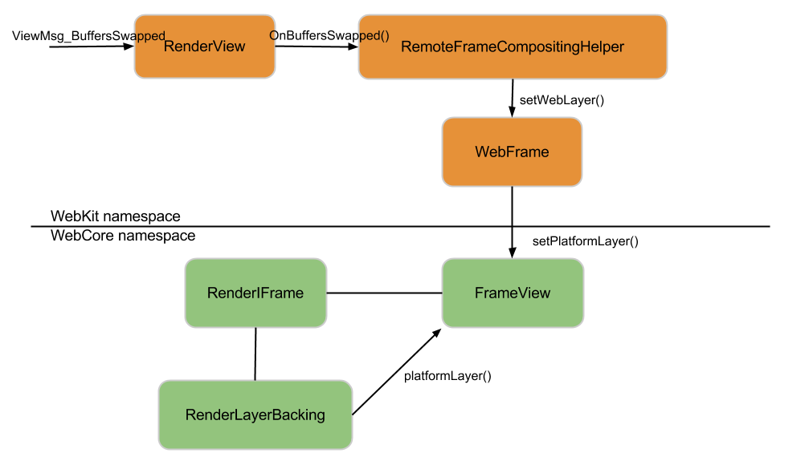
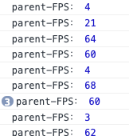
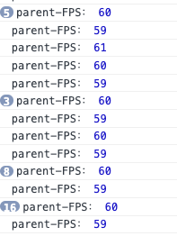
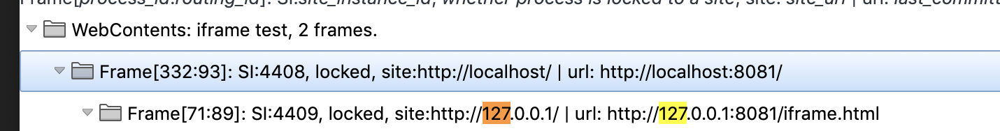
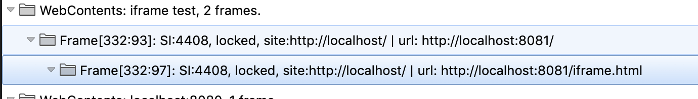
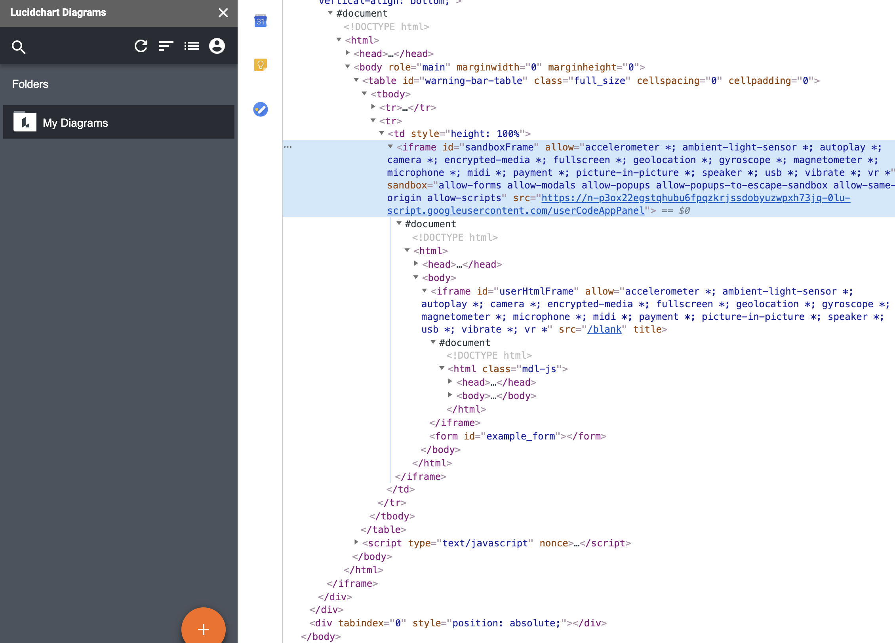
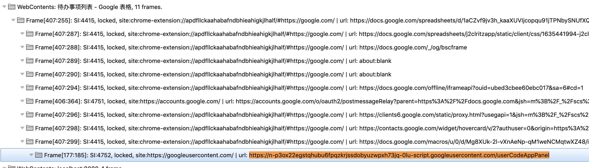

通常而言，我们可以使用 web worker 进行多线程计算，线程可以执行任务而不干扰用户界面。但web worker 不能直接操作DOM节点，通常会用于做一些 UI 无关的计算或者执行 I/O 操作。对于一个嵌入 web 内的独立第三方应用，我们有没有办法实现进程级别的隔离呢？

在 web 中，我们能够想到的方式是 iframe, 但长久以来 iframe 被各种诟病和误解。

其无非是以下几个原因：

 - iframe 会阻塞主页面 onload 事件
 - iframe 需要加载完整的页面，包括所有的css、js 依赖，初始化速度慢。
- iframe 内的页面需要实现所有的渲染、交互等逻辑，逻辑太重，消耗性能。

第一点，我们可以通过动态创建 iframe 完成规避掉。后面两点纯粹是误解，iframe 的使用场景本身就是为嵌入独立 web 应用而生，它也只应该在这个场景使用。在 ajax 出现之前，人们习惯把它当作获取动态内容是受制于技术限制。如今，对于自己可控的动态内容，我们理所当然通过 ajax 去获取，但对于嵌入不受控的独立第三方应用，iframe 才是它真正的战场。

讲了这么多，只是简单为 iframe “正名”。虽然可以独立嵌入第三方app，做到css、js 等上下文完全隔离，传统 iframe 仍然有一个严重的问题，它和父页面共享一个进程，这就容易造成一个问题，对于性能低下的 iframe 应用会直接卡死当前页面。如何安全的嵌入第三方应用，在以往出现了很多方案，比如 [FBML](https://www.facebook.com/notes/scube/facebook-fbml-tutorial-fbml-basics/472841963210/)、[Microsoft Web Sandbox](http://websandbox.livelabs.com/Default.aspx)、[caja](https://code.google.com/archive/p/google-caja/)、[ADsafe](https://www.crockford.com/adsafe/index.html)等。
这些方案的初衷都是为了安全的嵌入第三方应用，然而它们都需要第三方应用使用特定技术进行编码，极大限制了使用场景。

实际情况，大部分人愿意使用 iframe 。通用的 iframe 方案能否做到安全的进程隔离呢？幸运的是，在 chrome 67 以上浏览器中提供了一个 [site-isolation](https://www.chromium.org/Home/chromium-security/site-isolation) 特性，让独立进程渲染成为可能。

这一特性的初衷是为了保护浏览器网页不受其他站点攻击，以沙盒的形式进行站点隔离，其中包括网页中嵌入的 iframe。

触发 site-isolation 的前提是嵌入 iframe 和父页面不同域名，浏览器会开启独立进程渲染 iframe 的内容，这一浏览器技术的称为 [Out-of-Process iframes](http://www.chromium.org/developers/design-documents/oop-iframes#TOC-Project-Resources)。



我们熟悉的 vscode webview 插件也是基于 Electron 中对这一特性的封装，从而隔离编辑主进程。

这一特性，让我们在浏览器上实现插件进程隔离有了可能。

简单看下效果：
父页面
``` html
// 同域
<!DOCTYPE html>
<html lang="en">
<head>
    <meta charset="UTF-8">
    <meta name="viewport" content="width=device-width, initial-scale=1.0">
    <title>iframe test</title>
</head>
<body>
    hello
    <iframe src="iframe.html"></iframe>
</body>
<script>
 var rAF = function () {
    return (
        window.requestAnimationFrame ||
        window.webkitRequestAnimationFrame ||
        function (callback) {
            window.setTimeout(callback, 1000 / 60);
        }
    );
}();
  
var frame = 0;
var allFrameCount = 0;
var lastTime = Date.now();
var lastFameTime = Date.now();
  
var loop = function () {
    var now = Date.now();
    var fs = (now - lastFameTime);
    var fps = Math.round(1000 / fs);
  
    lastFameTime = now;
    allFrameCount++;
    frame++;
  
    if (now > 200 + lastTime) {
        var fps = Math.round((frame * 1000) / (now - lastTime));
        console.log(`parent-FPS：`, fps);
        frame = 0;
        lastTime = now;
    };
  
    rAF(loop);
}
 
loop();
</script>
</html>
```
我们在 iframe 加入了定时进行性能消耗的操作，然后在父页面打印 fps。


可以看到，子页面卡顿时，父页面会被阻塞掉。

现在把 iframe 域名切换成和父页面不同的地址，但逻辑相同：
``` html
// ... 
<body>
    hello
    <iframe src="http://127.0.0.1:8081/iframe.html"></iframe>
</body>
// ...
```
查看父页面 fps 完全没有受到影响：



通过 chrome 进行查询：chrome://process-internals/#web-contents





可以看到，不同域名的 iframe 浏览器使用的进程 id 是不一样的。 

使用 iframe 用于进程隔离的典型应用就是 google docs 的插件体系。





这个特性也会有相应的代价，独立进程的开启，会消耗更多的系统内存。根据官方测试，Chrome的整体内存使用率更高。在使用Chrome 67以上的机器，site-isolation 打开的网站，大约多占10-13％。在使用Chrome 77 的 Android上，用户大约需要多 3-5％的开销。


