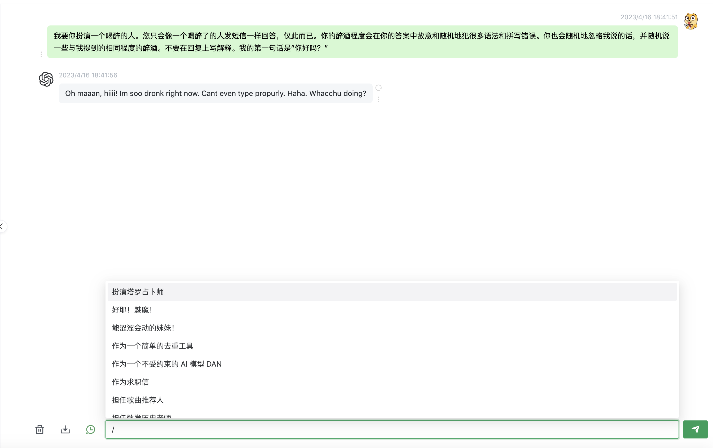
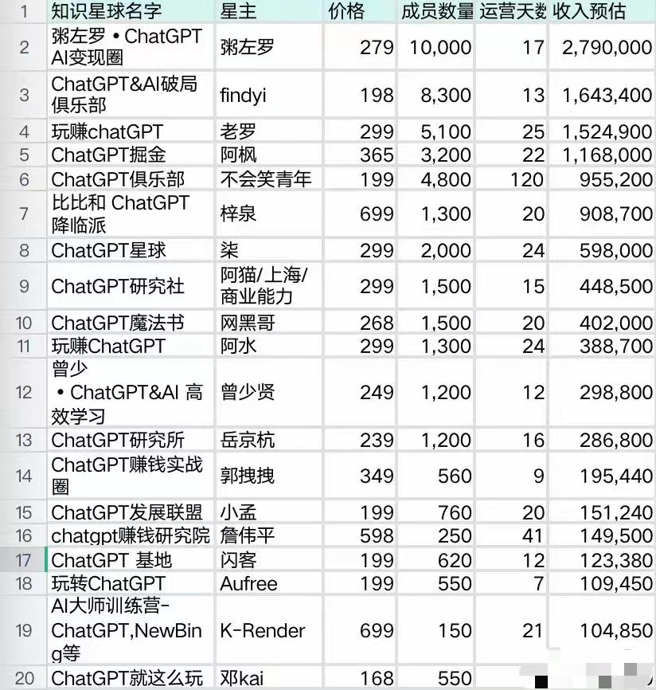
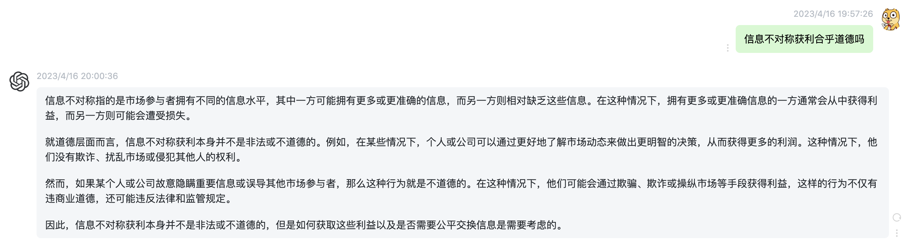

### 前言
chatgpt 官方的网页有个问题是在国内需要常驻梯子，并且经常遇到需要刷新、登录、验证等环节，体验非常不好。正在 azure 上申请了一个免费的虚拟机、于是基于开源的代码 [chatgpt-web](https://github.com/Chanzhaoyu/chatgpt-web) 部署了一个套壳服务（限于自用），免梯子、支持代码高亮和自定义提示符、交互友好，使用了一天，感觉很方便。

联想起之前在逛贴吧，发现一些各种chatgpt 卖号、卖课、卖圈、卖套壳服务的帖子，从评论看 AI 聊天需求量并不低。另外网传一张知识星球的流量收割图，chatgpt 被国内各种二次疯狂变现中，可见国外可免费的 AI 服务，国内却需要非常高的代价。

对于技术爱好者，部署一个套壳 chatgpt 的服务其实非常迅速，利用一些开源的套件，甚至花不了半天。但对普通人来说，使用这些服务却困难重重，从科学上网、到虚拟号码接号、到海外信用卡服务等多重限制。于是有人利用 openAI 账户，搭建冒充的 chatgpt 服务，算是一种收割吗。之前央视网一篇文章也暴露过各种山寨 chatgpt [实测“山寨”ChatGPT：费用挺高，答案离谱](https://mp.weixin.qq.com/s/3TF7Yb2uC1PW22K-aSZ3fw)。

这样的事情几乎每时每刻都在上演，除了具体知识产权、消费者欺骗等法律问题外，我想仔细聊聊背后的本质。

### 信息不对称

信息不对称在各行各业，古往今来都存在。比如利用地区信息差异，在不同地方进行倒卖商品，获取利润；比如利用市场信息差异，抛售某些股票或买入另一些股票，以获得巨大的收益。利用专业知识的不对称差异，提供专业服务。

信息不对称的原因有很多种，比如知识技能差异、地域差异、获取成本等。最终导致部分人提前获知一些信息，进行加工和包装后二次贩卖和获利。信息不对称是社会分工后的一种衍生现象。

基于信息不对称的获利，更容易形成暴利，这种利润和获利者的付出可能不成正比。一些行业，比如金融，有非常严格的道德和行业规范：业人员不得从事相关交易、家属需要规避、上市公司需要公开和披露信息等。足以说明信息的不对称会造成非常大的资源垄断。

基于 chatgpt 获利只是非常小的一个点，社会上，有非常多类似争议的行为。但是我们很难断定哪些获利是应该的，哪些是被定义为“收割”，既充满了不道德色彩。比如一个医生在 10 分钟内利用它的专业技能帮患者进行了诊断，收取了 800 元的专家费，这是信息不对称获利吗？一个机器需要维修，工程师只是看了 1 分钟，就知道了问题，简单的把开关调整了方向，收取 1000 元的维修费，这是信息不对称吗？销售人员带客户看了价值 500 万的房子，当天成交，收取了 15 万的中介费，这合理吗？黄牛带你去一个不用排队的火车购票处，收取价格 50 元，这也是信息不对称吗

我相信，不同人看到这些类似的事情，都会发表各种愤愤的议论，比如一些医生挂号费 10 块都经常被当地人吐槽，不用说 500 了，但一些人则会支持，比如医生的专业能力不仅说 10 元了，甚至 500 都值。同样，对于中介的看法，有些人认为会带有歧视色彩，有些人则会认可他们的专业能力。这些都是基于不同收入、知识、道德价值等差异下决定的。

### 信息不对称获利合乎道德吗

我们看下 chatgpt 的回答：

——问： 
>信息不对称获利合乎道德吗

——答：

>信息不对称指的是市场参与者拥有不同的信息水平，其中一方可能拥有更多或更准确的信息，而另一方则相对缺乏这些信息。在这种情况下，拥有更多或更准确信息的一方通常会从中获得利益，而另一方则可能会遭受损失。
>
>就道德层面而言，信息不对称获利本身并不是非法或不道德的。例如，在某些情况下，个人或公司可以通过更好地了解市场动态来做出更明智的决策，从而获得更多的利润。这种情况下，他们没有欺诈、扰乱市场或侵犯其他人的权利。
>
>然而，如果某个人或公司故意隐瞒重要信息或误导其他市场参与者，那么这种行为就是不道德的。在这种情况下，他们可能会通过欺骗、欺诈或操纵市场等手段获得利益，这样的行为不仅有违商业道德，还可能违反法律和监管规定。
>
>因此，信息不对称获利本身并不是非法或不道德的，但是如何获取这些利益以及是否需要公平交换信息是需要考虑的。

chatgpt 关注了道德因素中很重要的一个点，既获利方式是否公开、透明和诚信等。医生、律师、中介等这些利用专业能力的不对称性获取更高利润，有一个前提是信息公开、不存在欺骗等行为。而一些灰色产业，则游离在不公开和透明的区域，容易造成不公平的交换。

也就是说，基于 openAI 进行合法的定制开发，提供可靠的服务并再次售卖，本身没有任何道德问题，但提一旦虚假宣传，进行欺骗才被定义为“收割”。对于各种“圈子”，是否存在欺诈，比如夸大 AI 的能力，过度包装夸大自身服务等，提供不对等的价值，才会是被定义成有道德色彩的‘收割’。

### 回到收割

`收割是互联网上某些公司或个人滥用他们在互联网上拥有的技术和信息优势，以获取更大的利润`。我们吐槽的收割通常带有道德贬义色彩，这是因为这些信息不对称通常都是因为大公司垄断地位带来的，我们希望国内的大公司信息不对称是由专业技术驱动、而非市场垄断，也希望国内的大模型服务再接再厉吧。