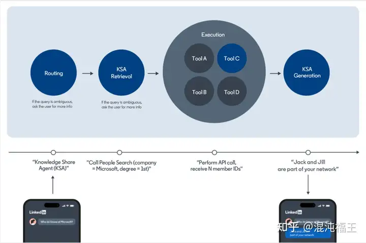
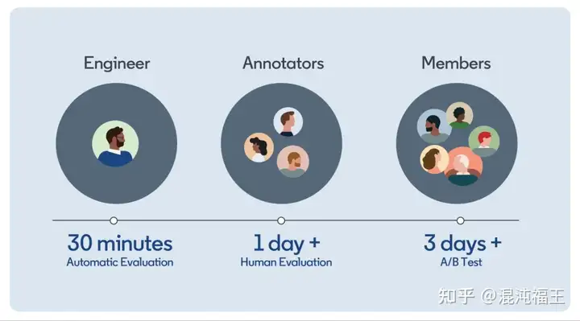
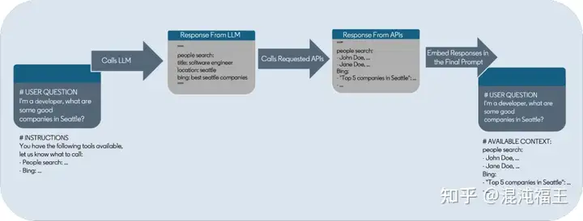

原文：[LangGraph: Multi-Agent Workflows](https://blog.langchain.dev/langgraph-multi-agent-workflows/)

本文关于 linkedin 近期对 llm 落地的技术总结意译。非常宝贵的经验，推荐阅读，和我们目前做的很多东西很像，但 linkedIn 有大量 C 端用户，相对笔者在做的小规模产品，大规模 LLM 工程化在细节上更值得品味。

在过去的六个月里，我们在 LinkedIn 的团队一直在努力开发一种新的基于人工智能的体验。我们希望对产品进行重新构，让我们的用户更好的进行工作搜索、并浏览专业内容。

生成式人工智能的爆炸使我们停下来考虑现在可能的事情，这在一年前是不可能的。最终我们发现，每一条信息和每一个职位发布都可以成为我们创新和突破的新起点。

更快地获取信息，例如从一篇文章中获取要点或了解一家公司的最新动态。
连接各种信息，例如评估您是否适合某个工作发布。
接收建议，例如改善您的个人资料或为面试做准备。
还有更多 ...
基于生成式人工智能的开发过程并非一帆风顺。我们在很多地方遇到了难题。现在，我们想揭开‘工程’的神秘面纱，分享我们的顺利之处、挑战所在，以及未来的方向。

## verview 概述

让我们通过一个现实场景来展示系统如何运作。

想象一下，当您在 LinkedIn 动态中滚动时，偶然发现了一篇关于设计无障碍性的有趣帖子。在帖子旁边，您会看到一些初始问题，以深入探讨这个话题。您感到好奇，点击了“在科技公司中，无障碍性如何推动商业价值的一些例子是什么？”

这是用户和产品交互过程种，整个系统背景中发生的事情：

1. 选择合适的 Agent 代理人：这是您旅程的开始。我们的系统接受您的问题，并决定哪个 AI Agent 最适合处理它。在这种情况下，它识别出您对科技公司中的可访问性感兴趣，并将您的查询路由到一个专门处理一般知识寻求问题的 AI 代理人。
2. 收集信息：是时候做些实地工作了。AI Agent 代理人调用一系列内部 API 和必应搜索特定示例和案例研究，重点介绍设计无障碍性如何为科技公司的业务价值做出贡献。我们正在创建一个档案来支持我们的回应。
3. 生成回复：有了必要的信息，代理现在可以撰写回复。它将数据过滤和综合成一篇连贯、信息丰富的答案，为您提供了清晰的例子，说明可访问性倡议如何推动科技公司的商业价值。为了避免生成大量文本并使体验更加互动，内部 API 被调用来为回复添加附件，比如文章链接，或者提到帖子中的人物简介。

您可能会追问“如何将我的职业转向这个领域？”，然后我们会重复这个过程，但现在将您引导到一个职业和工作 AI Agent 代理那里。只需点击几下，您就可以深入了解任何主题，获得可操作的见解，或找到下一个重要机会。

这一切大多得益于大型语言模型（LLMs）的出现，我们认为分享我们在其基础上构建时所面临的挑战的幕后故事会很有趣。

## 哪些事情做起来会比较容易？

总体设计

图 1：处理用户查询的简化流程。KSA 代表“知识共享代理”，是数十个可以处理用户查询的代理之一。

从上面的解释中，你们中的一些人可能已经注意到，我们的流程遵循了所谓的检索增强生成（RAG），这是一种常见的生成式人工智能系统设计模式。建立这个流程比我们预期的要少出现问题。在短短几天内，我们就建立起了基本框架并让其运行起来：

- 路由：决定查询是否在范围内，以及将其转发给哪个 AI 代理。代理的示例包括：工作评估、公司理解、帖子要点等。
- 检索：AI 代理决定调用哪些服务以及如何调用的召回导向步骤（例如 LinkedIn 人员搜索、必应 API 等）。
- 生成：精度导向的步骤，筛选检索到的嘈杂数据，过滤它并生成最终响应。
调整‘路由’和‘检索’的过程详单简单，因为它们的分类特性：我们构建了开发集，并通过提示工程和内部模型进行了优化。但生成的过程就完全不同了。它遵循8/2法则；快速实现80%的进展相对容易，但最后的20%却占据了我们大部分的工作时间。当产品的期望是99%以上的回答都要出色时，即使使用最先进的模型，也需要大量的工作和创造力来实现每一个1%的进步。

（译者注：大模型产品构建原型其实很快，但调优真的非常费时间，大量体力活，目前很难有自动化工具去执行）

### 这里成功的经验：

- 固定的 3 步流程
- 用小型模型去路由和检索，但更大模型去进行生成
- 基于嵌入式检索（EBR），由内存数据库提供支持，作为我们的“穷人版微调”，直接将响应示例注入到我们的提示中
- 对于路由/检索，每个步骤都有特定的评估流程。

### 开发和协作

我们希望在多个团队之间快速协助，因此决定将任务分解为由不同人独立开发不同的代理（即，AI Agent）：通用知识 Agent，工作评估 Agent，帖子摘要Agent等。

然而，这种方法带来了明显的妥协。通过任务并行处理，我们在速度上获得了提升，但却以碎片化为代价。当后续的助理交互可能由不同的模型、提示或工具管理时，维持统一的用户体验变得具有挑战性。

为了解决这个问题，我们采用了简单的组织结构：

一个小型的“水平”工程团队，负责处理常见组件并专注于整体体验。这包括：

- 托管产品的服务
- 评估/测试工具
- 全局提示模板被所有业务领域所使用（例如，代理的全局身份、对话历史、越狱防御等）。
- 为我们的 iOS/Android/Web 客户端共享的 UX 组件
- 一个服务器驱动的 UI 框架，用于发布新的 UI 更改，无需客户端代码更改或发布。

几个具有 Agent 代理自主权的“纵向”工程团队，例如：

- 个性化的帖子总结
- 工作匹配评估
- 面试技巧
（译者备注：其实就是部分同学解决通用问题，部分同学解决特定问题）

### 这里成功的经验：

- 分而治之，但限制代理数量
- 一个集中的评估流程，包括多轮对话
- 提供通用的提示模板（例如“身份”定义）、用户 UI 体验模板、工具和仪器

## 哪些事情面临挑战？

### 评估

评估我们答案的质量比预期更困难。挑战可以广泛分为三个领域：制定指南、扩展注释和自动评估。

- 制定指南是第一个障碍。以职位评估为例：点击“评估我对这份工作的适合度”并得到“你完全不适合”并不实用。我们希望它既事实又具有同理心。一些成员可能正在考虑转向他们目前不适合的领域，并需要帮助了解差距和下一步行动。确保这些细节的一致性是我们注释分数统一性的关键。

- 标注是第二步。最初，团队中的每个人都参与其中（产品、工程、设计等），但我们知道我们需要一个更有原则性的方法，具有一致性和多样性的标注者。我们的内部语言学团队建立了工具和流程，通过这些工具和流程，我们可以评估高达 500 个每日对话，并获得关于整体质量得分、幻觉率、负责任的 AI 违规行为、连贯性、风格等方面的指标。这成为我们了解趋势、在提示上进行迭代并确保我们准备好上线的主要标志。

- 完全自动评估是我们的目标，但仍在进行中。没有它，工程师只能凭眼睛观察结果并在有限的示例集上进行测试，并且需要 1 天以上的延迟才能了解指标。我们正在构建基于模型的评估器来估计上述指标，并允许更快的实验，对幻觉检测取得了一些成功（但这并不容易！）。

（译者注：根据我类似的经验，评估工作是非常繁琐和耗时的，但它是工程优化的关键，尽可能实现这个过程自动化很重要，当然前期大多依赖直觉和人的经验）

我们正在努力的是：端到端自动评估流程，以加快迭代速度。

### 调用内部 API

领英拥有大量关于人员、公司、技能、课程等方面的独特数据，这些数据对于构建提供独特和差异化价值的产品至关重要。LLMs，然而，尚未接受过这些信息的培训，因此无法直接用于推理和生成响应。解决这个问题的标准模式是建立一个检索增强生成（RAG）管道，通过该管道调用内部 API，并将它们的响应注入到后续的LLM提示中，以提供额外的上下文来支撑响应。

很多这些独特数据通过各种微服务之间的 RPC API 在内部公开。虽然这对人类来说在程序上调用非常方便，但对LLM并不友好。我们通过在这些 API 周围包装“技能”来解决这个问题。每个技能都包括以下组件：

- API 的友好模式描述，以及何时使用它。
- 调用 RPC API 的配置（端点、输入模式、输出模式等）
- LLM 友好的输入和输出模式
- 原始类型的（字符串/布尔值/数字）值
- JSON 模式风格的输入和输出模式描述
- 将LLM友好模式与实际RPC模式映射的业务逻辑

像这样的技能使LLM能够做出与我们产品相关的各种事情，如查看个人资料、搜索文章/人员/职位/公司甚至查询内部分析系统。这种技术也用于调用非LinkedIn API，如Bing搜索和新闻。

（译者备注：LLM 友好模式是很多人容易忽视，或者觉得不重要的，在 swe-agent 项目中，也是利用这种友好模式，提供了超越传统 reAct 的性能~~再次强调，这里都是繁琐，但必须的、占用大部分工作时间的工程化逻辑 ）

图 3：使用技能调用内部 API

我们编写提示，要求LLM决定使用哪种技能来解决特定的工作（通过规划选择技能），然后还输出调用技能所需的参数（函数调用）。由于调用的参数必须与输入模式匹配，我们要求LLM以结构化方式输出它们。大多数LLMs都接受使用 YAML 和 JSON 进行结构化输出的训练。我们选择了 YAML，因为它更简洁，因此比 JSON 消耗的标记更少。

我们遇到的挑战之一是，大约 90%的时间，LLM响应包含正确格式的参数，而约 10%的时间，LLM会出错，通常输出的数据不符合提供的模式，甚至不是有效的 YAML。这些错误虽然对人类来说很容易发现，但导致代码解析它们时出现问题。这约 10%的错误数量足够让我们不能轻易忽视，因此我们着手解决这个问题。

修复这个问题的标准方法是检测它，然后重新提示LLM，要求它根据一些额外的指导来纠正错误。虽然这种技术有效，但会增加相当多的延迟，同时由于额外的LLM调用而消耗宝贵的 GPU 容量。为了规避这些限制，我们最终编写了一个内部防御性的 YAML 解析器。

通过对各种有效载荷的分析，我们确定了LLM常见的错误，并编写了代码来在解析之前检测和修复这些错误。我们还修改了提示信息，以在一些常见错误周围注入提示，以提高我们修复的准确性。最终，我们成功将这些错误的发生率降低到约 0.01%。

（译者注：这个非常棒~，我们通常是再次请求的方式降低错误，但 linkdein 做得很极致，通常更多的防御性解析，可以降低重试，节约 token。）

我们正在努力的方向：统一技能注册表，以动态发现和调用作为LLM友好技能打包的API/代理，贯穿我们的生成AI产品。

### 始终一致的质量

团队在第一个月内实现了我们旨在提供的基本体验的 80%，然后又花了额外的四个月努力超过 95%的完整体验——我们努力完善、调整和改进各个方面。我们低估了检测和减轻幻觉的挑战，以及质量评分提高的速度——最初迅速上升，然后迅速趋于平稳。

对于能够容忍如此程度错误的产品体验来说，使用生成式人工智能构建是非常直接的。但这也造成了无法实现的期望，最初的速度给人一种“几乎到达”的虚假感觉，随着每增加 1%的改进速度显著放缓，这种感觉变得令人沮丧。

构建这个助手感觉像是从更“原则性”的机器学习中脱离，更类似于调整专家系统中的规则。因此，尽管我们的评估变得越来越复杂，我们的“训练”主要是提示工程，更像是一门艺术而非科学。

（译者备注：泪目~~“训练”主要是提示工程，更像是一门艺术而非科学~~）

我们正在努力的方向：对大型语言模型（LLM）进行微调，使我们的管道更加数据驱动。

### 容量和延迟

质量和用户感知到的延迟一直是首要考虑的问题。一些维度：

- 质量 vs 延迟：像思维链 (CoT) 这样的技术非常有效，可以提高质量并减少幻觉。但它们需要成员从未看到的令牌，因此增加了他们的感知延迟。
- 吞吐量与延迟：在运行大型生成模型时，通常情况下，首个标记时间（TTFT）和标记之间时间（TBT）会随利用率增加而增加。在某些情况下，TBT 有时会呈线性增长。如果愿意牺牲这两个指标，通常可以获得 2 倍/3 倍的每秒标记数（TPS），但最初我们必须将它们限制得非常严格。
- 成本：GPU 集群不容易获得且成本高昂。起初，我们甚至不得不制定时间表，确定何时可以测试产品，以免消耗过多令牌并阻止开发人员工作。
端到端流式传输：完整的答复可能需要几分钟才能完成，因此我们使所有请求都进行流式传输，以减少感知延迟。此外，我们实际上在我们的管道端到端进行流式传输。例如，决定调用哪些 API 的LLM响应被逐步解析，一旦参数准备就绪，我们立即发出 API 调用，而不必等待完整的LLM响应。最终合成的响应也通过我们的实时消息基础设施流式传输到客户端，其中包括用于信任/负责任 AI 分类等内容的增量处理。
- 异步非阻塞管道：由于LLM调用可能需要很长时间来处理，我们通过构建一个完全异步非阻塞管道来优化我们的服务吞吐量，这样就不会浪费资源在因 I/O 阻塞而被线程占用。

这种情况有时会产生有趣的相互作用。举个例子，我们最初只限制了TTFT（到首次标记的时间），因为这直接关联到我们初期产品的用户延迟。当我们开始解决幻觉问题，并且在我们的提示中加入了连贯思考（Chain of Thought）的元素后，我们忽视了TBT（到首个字节的时间）的影响可能会更大，因为任何“推理”生成的令牌都会增加用户延迟（例如，对于一个200令牌的推理步骤，即使TBT增加10毫秒，也意味着额外增加2秒的延迟）。这导致我们的某个公共服务突然警报四起，提示有些任务遇到了超时问题。，我们迅速增加了容量以解决这一问题。

我们正在努力的事情:

- 将更简单的任务转移到内部，优化的模型。
- 更可预测的LLM部署基础设施。
- 减少每一步的浪费令牌。

## 收获
够了，为什么不让产品来说话呢？

移动屏幕上带有AI驱动的洞察和要点 还不错！特别是后续建议，可能会引导您进入维基白兔洞般的好奇探索。

随着我们继续提升质量、开发新功能并优化管道速度，我们很快将向更多用户推出。 到达这里是一群了不起的人们做出的巨大努力，我们将很快分享更多技术细节，继续保持关注！

这不错！特别是后续的建议，可能会让您陷入一种像维基百科一样的好奇心兔子洞。

随着我们不断完善质量，开发新功能，并优化速度管道，我们将很快向更多用户推出。

到达这里是一群了不起的人付出了巨大的努力，我们将在不久的将来分享更多技术细节。敬请关注！