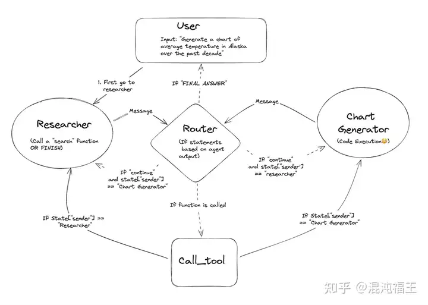
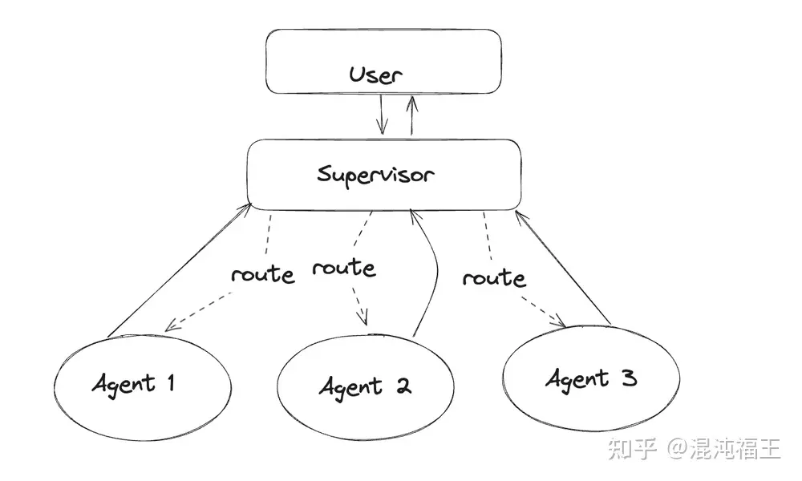
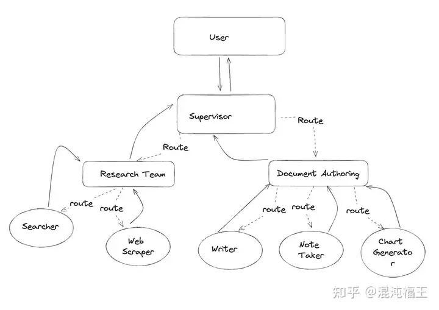
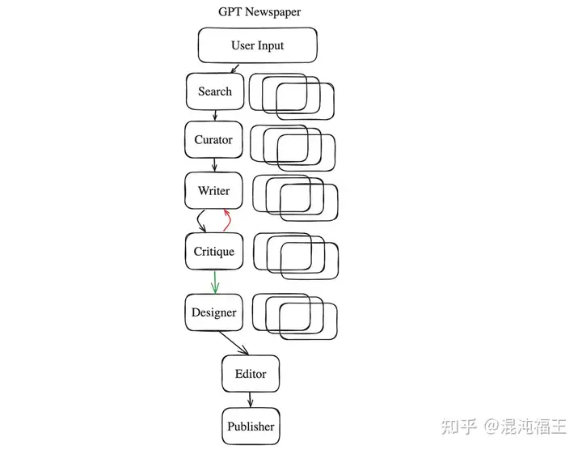
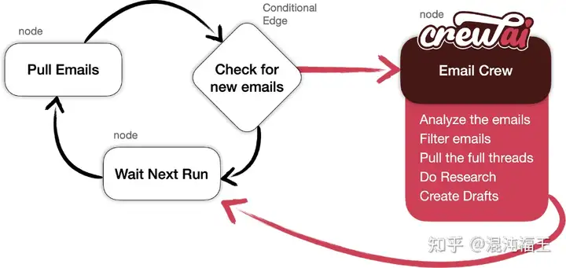

原文：[LangGraph: Multi-Agent Workflows](https://blog.langchain.dev/langgraph-multi-agent-workflows/)

很高兴地介绍 langgraph 强大的用例 - 多代理工作流。在本博客中，我们将涵盖：
"multi-agen  多代理"是什么意思？

为什么“multi-agent 多代理”工作流程很有用？

使用 LangGraph 进行多代理工作流程的三个具体示架构

使用多代理工作流程构建在 LangGraph 之上的第三方应用的两个示例（GPT-Newspaper 和 CrewAI）

与其他框架（Autogen 和 CrewAI）的比较
## 什么是“multi-agent”（多代理协同）？

当我们谈论“multi-agent”时，我们指的是由 LLM 语言模型驱动的多个独立行动者 Agent 以特定方式连接在一起。

每个代理都可以拥有自己的提示词，LLM底层模型，调用工具和其他自定义代码，以便与其他代理最好地协作。
这意味着在考虑不同的多代理工作流时有两个主要考虑因素：
什么是多个独立 Agent 代理？
这些Agent 代理如何连接？

这种思维非常适合图表示，比如 langgraph 提供的那种。在这种方法中，每个代理都是图中的一个节点，它们的连接被表示为一条边。控制流由边管理，并通过向图的状态添加信息进行通信。

注意：这里一个非常相关的概念是状态机的概念，我们明确将其称为认知架构的一类。从这种角度看，独立的代理节点变成了状态，而这些代理如何连接则是转移矩阵。由于状态机可以被视为带标签的有向图，我们将以相同的方式思考这些事情。

（译者注：langgraph 提供 muti-agent 的底层抽象，类似构建类似有向无环图，把每个代理当作一个节点，每个代理的连接当作节点之间的边，这样基于图-节点的关系该概念去构建任务代理架构）

## 多代理设计的好处

如果一个代理无法正常工作，那么为什么多代理会有用呢？
分组工具/责任可以带来更好的结果。一个代理在专注于一项任务时更有可能成功，而不是必须从数十种工具中进行选择。
分开的提示可以提供更好的结果。每个提示都可以有自己的说明和少量示例。每个代理甚至可以由一个单独微调的LLM来驱动！
有助于开发的概念模型。可以评估和改进每个代理，而不会破坏更大的应用程序。

多代理设计允许您将复杂问题分解为可由专门代理和LLM程序针对的可处理单位的工作单元。

## Multi-agent （架构1）

我们已经向 langgraph 仓库添加了三个独立的多代理工作流示例。每个示例对上述两个问题的答案略有不同，我们将在突出显示示例时进行讨论。重要的是要注意，这三个示例只是我们可以突出显示的可能示例中的几个 - 几乎可以肯定还有其他示例存在，我们期待看到社区会提出什么样的示例！
多智能体协作
Code links: 代码链接:
Python
JS

在这个例子中，不同的代理在共享的消息草稿（其实就是共享的思考链上下文）上进行协作。这意味着他们中的任何一个所做的工作都对另一个可见。这样做的好处是其他代理可以看到所有的个别步骤。这样做的缺点是有时候过于冗长和不必要地传递所有这些信息，有时候只需要一个代理的最终答案。我们称之为协作，因为这个消息草稿是共享的性质。

### 每个独立 Agent 代理边界如何定义？

在这种情况下，独立代理实际上只是一个单一的LLM调用。具体来说，它们是一个特定的提示模板（以特定系统消息的特定方式格式化输入）加上一个LLM调用。

### 这些代理如何连接？

这里是这些代理如何连接的可视化展示：

添加图片注释，不超过 140 字（可选）

控制状态转换的主要因素是 router 路由器，但它是一个基于规则的路由器，因此相当简单。基本上，在每次LLM调用之后，它会查看输出。如果调用了工具，则调用该工具。如果没有调用工具，而LLM回应“FINAL  ANSWER”，则返回给用户。否则（如果没有调用工具，而LLM没有回应“FINAL ANSWER”），则转到另一个LLM。
(译者注：第一种模式其实就是常见的 reAct 基础上增加了几个 LLM ，每个 LLM 都可以看到共同思考的上下文链路，中间的路由就是根据关键字正则匹配调用哪些工具。 但纯 reAct只有一个 LLM 系统提示词，而多 Agent 的每个 LLM 是有自己独立的系统提示词，甚至可以是独立微调的 LLM )

## Agent Supervisor 代理中介者模式（架构2）
Examples: 示例:
Python
JS

在这个例子中，多个代理连接在一起，但与上面的情况相比，它们不共享一个共享的草稿板。相反，它们有各自独立的草稿板，然后它们的最终响应被附加到一个全局草稿板中。

### 每个独立 Agent 代理边界如何定义？

在这种情况下，独立代理是一个 LangChain 代理。这意味着它们有自己的个别提示，LLM，和工具。当被调用时，不仅仅是一个单独的 LLM 调用，而是 AgentExecutor 的运行。

### 这些代理如何连接？

添加图片注释，不超过 140 字（可选）

代理中介者负责将路由到各个代理。

这样，中介者也可以被视为是其他代理的代理！
（译者注：其实就是使用一个专门的 LLM 作为中介者，接受用户信息，再根据信息转发到适合的专用 Agent 上。这样的好处就是每个特定领域的 Agent 聚焦自己擅长的事情，这里既可以是提示工程的优化，也可以是 llm 微调。）
## Hierarchical Agent Teams 分层代理团队（架构3）
Examples: 示例:
Python
JS

这与上面的示例类似，但现在节点中的代理实际上是其他 langgraph 对象本身。这比使用 LangChain AgentExecutor 作为代理运行时提供了更多的灵活性。我们称之为分层团队，因为子代理可以被视为团队的一部分。
每个独立 Agent 代理边界如何定义？

现在这里的“其他”代理是指 langgraph 代理子节点。

### 这些代理如何连接？

添加图片注释，不超过 140 字（可选）

一个中介代理，再加一个代理组将它们连接起来。
（译者注： 其实就是在架构2 的基础上，对下面的代理再次分层，将同类任务的代理组成一个 team。比如写文章的任务：可以由网络检索 Agent、信息筛选Agent、文章段落构思 Agent、文章撰写 Agent、文章检查 Agent等组合成一个团队。每个 Agent 又能调用自己的工具，这种适合非常大型的 Agent 协同）

## 第三方应用程序案例
As  part of this launch, we're also excited to highlight a few applications  built on top of LangGraph that utilize the concept of multiple agents.
作为这一发布的一部分，我们也很高兴地强调了一些构建在 LangGraph 之上并利用多个代理概念的应用程序。

### GPT-Newspaper GPT-报纸

这是由   GPT-研究者团队推出的新项目。GPT-报纸是一款创新的自主代理，旨在根据用户偏好创建个性化报纸。GPT-报纸通过利用人工智能的力量根据个人口味和兴趣策划、撰写、设计和编辑内容，彻底改变了我们消费新闻的方式。该架构由六个专门的子代理组成。有一个关键步骤  - 一个作家 <> 评论循环，可以增加一个有益的循环。

添加图片注释，不超过 140 字（可选）

### Crew AI example 机组人工智能示例

Joao Moura 利用 CrewAI、LangChain 和 LangGraph 的优秀示例，自动化检查电子邮件并创建草稿的过程。 CrewAI 协调自主 AI 代理，使它们能够高效地协作和执行复杂任务。
The graph in this example looks like the below:
这个例子中的图表如下所示：

添加图片注释，不超过 140 字（可选）

## 其他框架

LangGraph 不是第一个支持多代理工作流的框架。这些框架之间的主要区别在于它们引入的心智模型和概念。
### Autogen

Autogen  可能是第一个多代理框架。LangGraph 和 Autogen 之间心智模型的最大区别在于代理的构建。LangGraph  更倾向于一种方法，您可以明确定义不同的代理和转换概率，更喜欢将其表示为图形。Autogen  将其框架更多地视为“对话”。我们认为这种“图形”框架使其更直观，并为构建更复杂和有主见的工作流提供更好的开发者体验，您可以真正控制节点之间的转换概率。它还支持那些不被“对话”明确捕获的工作流。

Autogen 和 LangGraph 之间的另一个关键区别是 LangGraph 完全集成到 LangChain 生态系统中，这意味着您可以充分利用所有 LangChain 集成和 LangSmith 可观性。
### CrewAI 机组人工智能

另一个我们想要强调的关键框架是  CrewAI。CrewAI 最近已经成为创建多智能体“团队”的流行方式。与 LangGraph 相比，CrewAI  是一个更高级的框架。事实上，我们正在积极与 CrewAI 团队合作，将 LangGraph 集成到 CrewAI 中！我们认为 CrewAI  已经达到了令人惊叹的更高级别的 DevEx，我们希望支持这一点。
（译者注：以上3 种架构均提供了官方源码，但 Multi-agent 架构不止上面示例的 3种，实际情况需要根据业务场景和模型能力去适配，比如在分层代理的时候是不是可以部分组共享上下文草稿，部分不共享等。在实际种，代理层级多会导致执行时间非常长，这种情况下用于决策的路由代理可以微调，或者用小模型等进行加速。）

以上来源 langchain blog 官方原文，在个人理解基础上有所增删减。