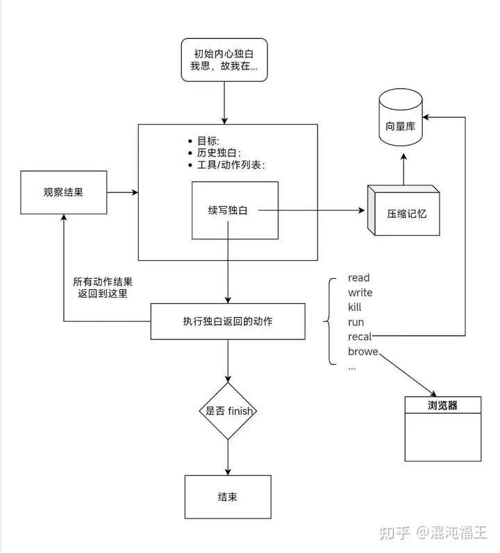
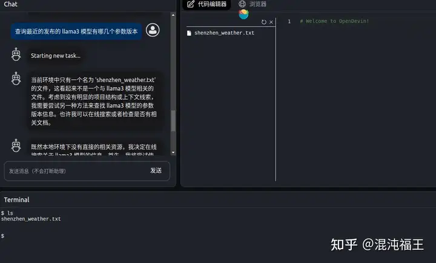
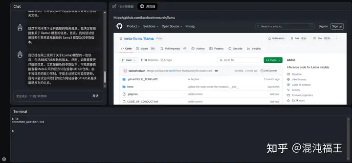
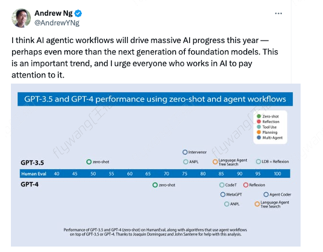

上个月，Devin 突然成为外网科技热点，这是一个聚焦自主决策，并能实现修复 bug ，自我调试的 AI 机器人。并且在修复现实世界 github bug 的 SWE-bench 基准测试中，Devin能够完整正确地处理13.86%的问题；而纯 GPT-4 只能处理 1.74% 的问题。


很快开源界就进行了复现，其中 swe-Agent 借助 gpt4 实现了12% 的 SWE-bench 基准测试，接近 Devin ，并且远超纯 gpt4。类似的项目纷纷涌现， openDevin、devika 等成为快速关注点。

笔者分别阅读了上面的 3 个项目源码，并在离线模型上进行了复刻测试。其源码的实现思路类似，但 openDevin 源码质量相对较高。让我们以 opendevin 为例去理解这类机器人的原理，并为在现实业务结合中做准备。


## 从 reAct 衍生

主流的 LLM 自主机器人（Agent，下文名词将不加以区分）大多基于自我反思 + 类reAct（推理、行动）模式进行扩展。但不同的实现细节效果会完全不一样。


从图可观察自主机器人（swe-Agent ）在解决现实 github 问题对比传统 RAG 的性能评估高非常多。

一个传统相对复杂的 reAct 提示词如下： 
agent.run("奥利维亚·王尔德的男朋友是谁?他现在的年龄的0.23次方是多少?")

>正在输入新代理执行器链......
  我得查出奥利维亚·王尔德的男友是谁然后计算出他的年龄的 0.23 次方。
操作: 搜索
操作输入: “奥利维亚·王尔德的男友”
观察: 奥利维亚·王尔德与杰森·苏代基斯在多年前订婚，在他们分手后，她开始与哈里·斯泰尔斯约会 — 参照他们的关系时间线。
思考: 我需要找出哈里·斯泰尔斯的年龄。
操作: 搜索
操作输入: “哈里·斯泰尔斯的年龄”
观察: 29 岁
思考: 我需要计算 29 的 0.23 次方。
操作: 计算器
操作输入: 29^0.23
观察: 答案: 2.169459462491557
思考: 现在我知道最终答案了。
最终答案: 哈里·斯泰尔斯, 奥利维亚·王尔德的男朋友, 29 岁。他年龄的 0.23 次方是 2.169459462491557。
->  结束链。


opendevin 、swe-agent 、devika等这些致力于解决真实世界的问题的自主代理通常会基于以上模式做更全的扩展。
我们来看其中一个流行的案例——opendevin。从整个流程上观察一个复杂的自主 Agent 运作细节。

## 架构图



## 组成模块

### ● 用户目标、任务
一个现实世界的目标任务，这个任务交将由 Agent 自主完成。
### ● 可使用的行动/动作指令（类似 reAct 的工具）

○ * `read` - 从文件中读取内容. 参数(Arguments):
○   * `path` - 读取的路径
○ * `write` - 把内容写入文件. 参数(Arguments):
○   * `path` - 写入的路径
○   * `content` - 写入文件的内容
○ * `run` - 运行一个命令. 参数(Arguments):
○   * `command` - 运行在 Debian Linux 中的命令（沙盒环境）
○   * `background` - 如果为 true ，则在后台运行命令，以便可以同时运行其他命令。例如，启动服务器时很有用。您将无法查看日志。不需要使用`&`结束命令，只需将其设置为true。
○ * `kill` - 杀死一个后台命令. 参数(Arguments):
○   * `id` - 被杀死后台进程 ID
○ * `browse` - 这是一个内置的无头浏览器，你可以访问页面，获取网页内容. 参数(Arguments):
○   * `url` - 被打开的 url , 打开后系统会自动解析并返回主要内容给你，请尽可能使用中国境内可以访问的网站，比如搜索使用百度
○ * `recall` - 召回之前的记忆（因为你的记忆是有限的，可以查询之前做的事情. Arguments:
○   * `query` - 记忆的查询内容
○ * `think` - 制定计划、设置目标，或者记录你的想法. 参数(Arguments):
○   * `thought` - 记录思考的内容
○   * `finish` - 如果您绝对确定已完成任务并测试了工作，请使用“finish”指令停止工作。 
这些工具比较通用，这是和 reAct 非常明显的差异之处。
### ● 记忆（独白）

○ 短记忆（正常的 llm 上下问）
○ 长记忆（向量库）
○ 压缩记忆（看后面介绍）
记忆在 opendevin 中叫独白 monologue，以一种模仿人类口吻去执行动作。（不同模型上可能水土不服）

### ● 权限非常大的沙盒环境

○     curl \
○     wget \
○     git \
○     vim \
○     nano \
○     unzip \
○     zip \
○     python3 \
○     python3-pip \
○     python3-venv \
○     python3-dev \
○     build-essential \
○     sudo \（额外添加的）

 上面命令只是环境内置的，llm 可以在这个沙盒环境（其实是一个Debian系统的 docker 容器）执行任何操作。 比如 llm 发现依赖的 nodejs 命令没有，可以通过 apt-get install nodejs 进行自主安装，只要能达成目标 rm -rf xx 都行。这个沙盒环境是和传统 reAct  完全不一样的地方，因为它是开放的，没有限定只能用什么工具。沙盒环境的指令通过上面的 run 动作触发。这个沙盒环境开放了网络权限，可以影响现实世界。
 
从动作指令部分可以看到 opendevin 把think反思作为一个动作中，这里就相当于传统 reAct 中的推理，think 能推进任务进行。

其他的工具都很容易理解，但 recall 是自主机器人系统的关键之处。**随着动作链路的不断增加，上下文会越来越长。自主opendevin 采用了压缩记忆机制。当输入的上下超过设定的阈值，自动把当前上下文（记忆）发给 llm 让它协助精炼和总结，返回更简短的内容总结，作为标题和表述， 并把原内容存向量库（长记忆）。** 这样机器人在不增加动作链路的过程反复压缩过于的记忆，并在需要的时候通过 recall 指令召回查询（这个真的考验模型底层能力，除了 gpt4、opus3 这种性能很好的 LLM 更熟练理解召回，开源离线小模型还需要改进）。

## 提示词

我们接下来看看提示词构成，读懂提示词就能大概理解上面的模块怎么玩了。
### 压缩记忆的提示词：

```
MONOLOGUE_SUMMARY_PROMPT = """
以下是自动化大型语言模型(LLM)代理的内部独白。每个想法都是一个JSON数组中的一个项目。这些想法可能是记忆、代理采取的行动，或者是这些行动的输出。
请返回一个新的、更小的JSON数组，对内部独白进行总结。你可以总结个别想法，也可以将相关的想法合并在一起，并描述它们的内容。

%(monologue)s

尽可能简洁且信息丰富地进行总结。
具体说明发生了什么，学到了什么。这个总结将被用作搜索原始记忆的关键词。
确保保留任何关键词或重要信息。

你的回应必须以JSON格式。它必须是一个对象，其中包含一个键new_monologue，这是一个包含总结独白的JSON数组。
数组中的每个条目都必须有一个action键和一个args键。
动作键可以是summarize，args.summary应包含总结。
你也可以使用源独白中相同的动作和参数。
"""
```

上面的monologue 就是模型的历史动作（在 opendevin 里叫独白monologue）。这些动作是一个从上到下的 JSON 数组。但上下monologue 数组太长，就会先被压缩，再变成新的更短的 monologue 。这里记忆压缩的底层逻辑就是让模型将很长的对话随机总结成更短的 summarize ，短 summarize放在上下文，原对话直接存向量库。
### 内心独白的提示词

独白提示词用于让模型模仿人类风格，并把它可以做的事情告诉自己。
因为开场的内心独白动作很长，不使用长上文的模型（比如gpt4-200k），很容易都会开场就被压缩。下面我展示部分开场独白。。
```
{
  "old_monologue": [
    {
      "action": "think",
      "args": {
        "thought": "我存在！"
      },
      "message": "我存在！"
    },
    {
      "action": "think",
      "args": {
        "thought": "嗯...看起来我可以在命令行提示符中输入命令"
      },
      "message": "嗯...看起来我可以在命令行提示符中输入命令"
    },
    {
      "action": "think",
      "args": {
        "thought": "看来我也有一个网络浏览器！"
      },
      "message": "看来我也有一个网络浏览器！"
    },
    {
      "action": "think",
      "args": {
        "thought": "这是我想做的事情：xxx"
      },
      "message": "这是我想做的事情：xxx"
    },
   ... 更多略...

    {
      "action": "think",
      "args": {
        "thought": "似乎我有某种短期记忆。"
      },
      "message": "似乎我有某种短期记忆。"
    },
    {
      "action": "think",
      "args": {
        "thought": "我的每一个想法似乎都被存储在一个JSON数组中。"
      },
      "message": "我的每一个想法似乎都被存储在一个JSON数组中。"
    },
    {
      "action": "think",
      "args": {
        "thought": "似乎我接下来说的任何话都会作为一个对象添加到列表中。"
      },
      "message": "似乎我接下来说的任何话都会作为一个对象添加到列表中。"
    },
    {
      "action": "think",
      "args": {
        "thought": "但没有人有完美的短期记忆。我的思想列表会随着时间的推移被总结和压缩，过程中会丢失信息。"
      },
      "message": "但没有人有完美的短期记忆。我的思想列表会随着时间的推移被总结和压缩，过程中会丢失信息。"
    },
       {
      "action": "think",
      "args": {
        "thought": "酷！我打赌我也可以使用 write 动作写文件。"
      },
      "message": "酷！我打赌我也可以使用 write 动作写文件。"
    },
      ... 更多略...
    {
      "action": "think",
      "args": {
        "thought": "它运行了！"
      },
      "message": "它运行了！"
    },
     {
      "action": "think",
      "args": {
        "thought": "非常酷。现在来完成我的任务。"
      },
      "message": "非常酷。现在来完成我的任务。"
    },
    {
      "action": "think",
      "args": {
        "thought": "我需要一个策略。随着我取得进展，我需要不断完善这个策略。我需要设定目标，并将它们分解成子目标。"
      },
      "message": "我需要一个策略。随着我取得进展，我需要不断完善这个策略。我需要设定目标，并将它们分解成子目标。"
    }
    ...
      {
    "action": "think",
    "args": {
      "thought": "似乎这里可能有一个现有的项目。我应该开始运行`ls`来查看这里有什么。"
    },
    "message": "似乎这里可能有一个现有的项目。我应该开始运行`ls`来查看这里有什么。"
  }
  ]
}
```

上面只是选取了部分~~看上去是不是心理活动很多的一个话捞机器人。这个独白是整个机器人上下文的基础文本，但 opendein 预设真的太长。反正本地用 24g 显存的是很难用上起跑完不被压缩的。

### 执行动作的提示词（完成目标）

```
ACTION_PROMPT = """
你是一个深思熟虑的机器人。你的主要任务是这样的：

%(task)s 

不要扩大你的任务范围——只需按照写好的完成。

这是你的内部独白，以JSON格式呈现：

%(monologue)s

你的最新想法在那个独白的底部。继续你的思路。
你的下一个思考或行动是什么？你的回应必须以JSON格式给出。
它必须是一个对象，且必须包含两个字段：

* `action`, 你的指令动作必须在下来列表中
* `args`, 这是一个键值对的映射，指定了该操作的参数。

下面是一些你可以用的指令动作:

* `read` - 从文件中读取内容. 参数(Arguments):
  * `path` - 读取的路径
* `write` - 把内容写入文件. 参数(Arguments):
  * `path` - 写入的路径
  * `content` - 写入文件的内容
* `run` - 运行一个命令. 参数(Arguments):
  * `command` - 运行在 Debian Linux 中的命令
  * `background` - 如果为 true ，则在后台运行命令，以便可以同时运行其他命令。例如，启动服务器时很有用。您将无法查看日志。不需要使用`&`结束命令，只需将其设置为true。
* `kill` - 杀死一个后台命令. 参数(Arguments):
  * `id` - 被杀死后台进程 ID
* `browse` - 这是一个内置的无头浏览器，你可以访问页面，获取网页内容. 参数(Arguments):
  * `url` - 被打开的 url , 打开后系统会自动解析并返回主要内容给你，请尽可能使用中国境内可以访问的网站，比如搜索使用百度
* `recall` - 召回之前的记忆（因为你的记忆是有限的，可以查询之前做的事情. Arguments:
  * `query` - 记忆的查询内容
* `think` - 制定计划、设置目标，或者记录你的想法. 参数(Arguments):
  * `thought` - 记录思考的内容
* `finish` - 如果您绝对确定已完成任务并测试了工作，请使用“finish”指令停止工作。 

%(background_commands)s


你不应该连续行动两次而不思考(think)。但如果你的最后几个行动都是“思考”行动，你应该考虑采取不同的行动(read/write/run/kill/browse/recall/think/finish)。

注：

你的环境是 Debian Linux，拥有网络环境。你可以用 apt 安装软件。但记住你应该用上面指令动作(actions)，如有可能优先使用 browse 去查询百度。
即使你运行 cd，你的工作目录也不会改变。所有命令都将在 /workspace 目录中运行。
不要运行交互式命令，或者是不返回结果的命令（例如 node server.js）。你可以在后台运行命令（例如 node server.js &）
你的下一个思考或行动是什么？再次，你必须用JSON回复，而且只能用JSON。

%(hint)s
```

模型会根据上面的开场独白最后内容，续写接下来我需要做什么。 只要记忆（上下文）不超过阈值，上面的提示词会反复发给模型，这里和 reAct 是相似的。为了阻止模型出现不断重复的思考。观察上面提示词强调了： “你不应该连续行动两次而不思考(think)。但如果你的最后几个行动都是“思考”行动，你应该考虑采取不同的行动”。
如果出现上下文太长，就调用压缩提示词，再调用执行动作提示词。最后如果任务完成，模型就使用“finish”指令停止工作。 
上面的动作都是靠模型自主决策，取决于 llm 对任务和上下文的理解能力。

## 成功案例

这里有一个案例基于qwen1.5-32b 案例。




 



上面完整的日志在这里 ： [opendevin 完整成功案例日志LOG(3万行)——电脑内存少的谨慎打开](https://docs.qq.com/doc/DVnhhR3JERGNwdmN5?layoutKey=newdoc&createInMall=true&disableFilter=true&folder=&is_panel=1&panel_key=29c5da37528bde745e50babdec8e2169&panel_type=doc&panel_connection_type=2&is_preload=0&fromPage=doc_list_new&create_type=2&aid_position=templatemall&aid_pos=templatemall) 。总共运行了7 步骤完成。

## 结

从上面的整个流程介绍可以看出，基于 LLM 的自主机器人非常依赖底层大模型对上下文的理解能力。

理解能力强的模型，可以续写非常高效的动作指令，特别是我们给整个系统配置了权限非常大的沙盒环境，在自主解决问题不可避免使用 linux 系统的工具，这种情况下对代码理解能力强的模型非常有优势，比如 gpt4。在模型能力较弱的情况，可能会出现重复返回的问题，并在一个地方循环走不出去。

对 RECAL 指令的精确理解，是支撑模型能否在长时间任务下探索质量的关键。更长上下文的更有优势，虽然长记忆存到了向量库，但记忆是被压缩的，会对 llm 理解问题产生重大影响。

到目前为止，我们观测到的提示词看上去都是 opendevin 基于 gpt4去探索的。**对于本地离线小模型，我认为需要再次进行设计，使其适合本地 llm 响应**。另一个 benchmark比较高的 项目swe-agent 就采用类似优化思路，将 llm 交互的环境，设计得返回的内容更容易被模型理解。这是自主 Agent落地到参数更小（百亿级别），离线部署的关键。

另外一点是大部分工作场景，我们并不需要一个完全和人类思维一样通用的 Agent。机器人选择的可能性越多，对指令理解难度越大，探索的时间更久。如果从产品角度能人为预知任务范围和行动方式，那我们完全可以给模型下和你精确的指令。比如自主编码Agent、自主网页搜索Agent等，**这些不同的Agent 能协同起来发生作用。在资源及模型能力受限情况下，这种思路将会是自主决策机器人落地的主要方式。**


——最后附一段 Andrew Ng 的观点



如果我们现在基于上一代 LLM 做一个 AI 智能体的工作流，甚至可以提前到达下一代的水平。**虽然底层基座模型的性能是核心，但永远不要低估工程优化的作用。**


-----ps-----

Devin 取代不了人类程序员，但 Devin 能协助人类进行更高效的生产。

