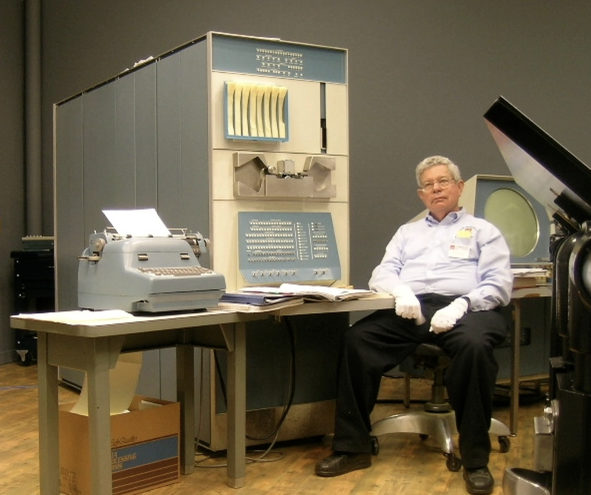
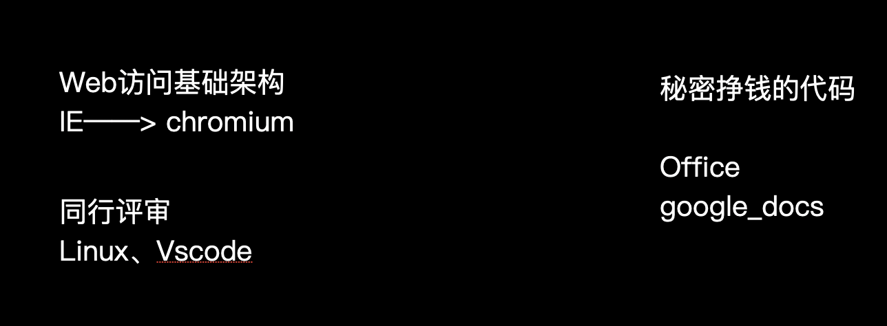
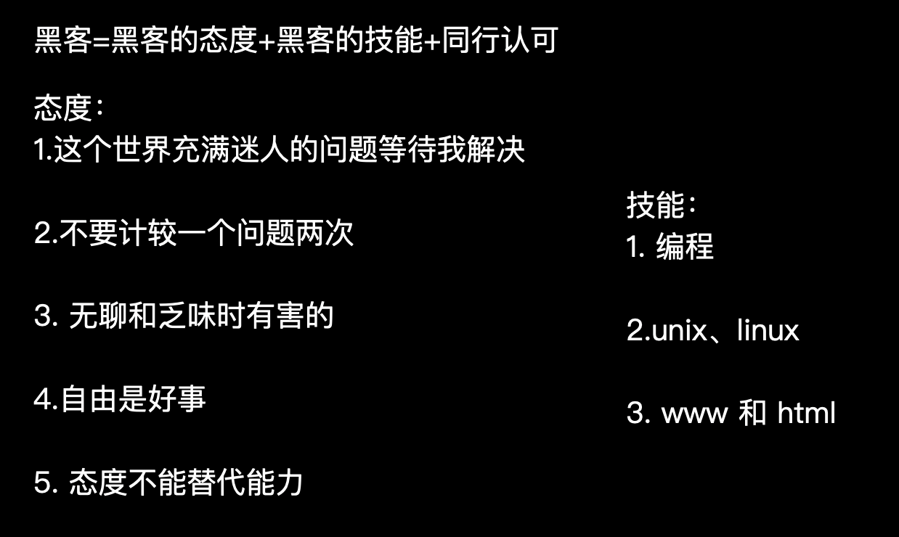

# 黑客圈简史

黑客，是“真程序员”，最早的一批具备探索能力、喜欢科技玩具、编程的、创造各种新技术的群体叫黑客，最终形成黑客文化。

而骇客是指入侵他人电脑，进行破坏和获取利益。黑客虽然也会偶尔进入他们电脑，但他们纯属是恶作剧，同时没有任何破坏性及利益驱使，行为更像安全界所称的白帽子。

## 历史
我们看下黑客文化的历史

-  折腾

1961 ——这个时候很多人和机构都没有计算机，而 MIT 当时的铁路俱乐部有他们的第一台计算机，（美国）数字设备公司生产的 PDP-1 在那个时候形成了最早的折腾计算机的爱好者，形成了黑客氛围。所以我它总结成——折腾

- 反抗叛逆

1967——PDP-10，小型机在那个时候非常受欢迎，PDP 10 是1967 年发布非常重要的一个设备，流行了近 15年。当时的 MIT 黑客拿到这台计算机后，没有用公司默认的软件，而是自己写了一个操作系统，名字叫不兼容分时系统，意思是不兼容以前的软件，要走自己的路。这里体现了 MIT 黑客的古怪精灵，还有反抗叛逆，当然最重要的是充满才华的创新。

ITS 大部分是 Lisp 写的，看过黑客与画家的同学，肯定知道 Lisp，它被誉为黑客中的语言圣经，语言能力很强，你甚至可以在里面创造自己的新语言。不同于 c 体系的编程语言，Lisp 主张函数式编程思维，所以它写的代码器是不太好理解的～～除了单人作战的黑客，很少有商业公司使用。

- KISS

1969——我们来到最重要的节点，贝尔实验室黑客圈(thompson)发明了 unix，器是unix 和 ITS 有关系，开发他的人也参与过和 ITS 有关联另一个操作系统multics，它们内部的理念里类似。

multics 当时的目的是想做一些实验，把计算机和操作系统的复杂性隐藏在系统内部，让用户看不到，甚至让大部分程序员都看不到，从而让用户做更有价值的事情，但是 multics 是和其他公司一起开发的，推出了市场并没有获得成功。

贝尔实验室认可这些理念，于是他们自己重新开始尝试，发明了 unix，然后实验室的另一个黑客还专门为 unix 发明了一种语言： C 语言。unix 和 C 语言很快在黑客周边火起来了。因为 unix 是最早一批用汇编加高级语言写的操作系统，它可以被移植到不同的机器上。这一点非常重要，在之前的大部分机器，只能匹配专门的系统，系统没有跨平台性，包括上面提到的 ITS 也是专门给 pdp10 而写。

Unix 重要特点就是把复杂隐藏起来，让系统保持简洁，keep it simple stupid 的文化，一个工具只做一件事，不同的工具组合起来完成更强大的功能。所以 kiss 文化就是这个时候形成。

- FREE

1982 年——当时有一个牛人，叫斯托曼，很多人应该听过。他坚决反对把实验室的这些成果商业化，愤而离开了实验室（MIT）。创立了一个叫自由软件基金会的组织，目的是生产高质量的自由软件，这个 free 自由很多会误解，我们后面会讨论定义。
不仅创立基金会，他开始通过 C语言重新构建整个 unix，因为他反感那些实验室把 unxi 代码藏起来，并且商业化。这个用 C 语言写的 unxi 叫 GNU ，gun is not Unix ，这是一个递归命名。斯托曼这个人不仅仅技术一流，还是精神领袖，GUN 和自由软件基金会的出现，几乎定义了后面几十年的黑客文化，至今受到影响。

- 开源协作

1991——上面提到了 GNU 的出现，让市面上一大批自由软件爱好者纷纷加入这个活动，很多人开始尝试做自由的 unix 系统，GNU 官方及乎把 unix 周边的重要软件和工具链全部实现来，就差一个系统内核，官方开发的叫 gun hard ，但一直难产，其他比较出名的有 FREE BSF\OPEN BSD ，BSD 那个时候是被认为 成公的 自由unxi，它是从商业公司分裂出来，有专家式团队集中开发。而此时有一个叫 linus 的学生正在研究内核，它使用自由软件基金会的配套工具，很快就高处一个简陋 的内科，叫 Linux ，然后发布到网上，源码完全免费，修改后还能再次发布，Linux. 和 FREE BSD 不同，完全是没有组织的，由分散在世界各地，通过网络传波的系统，后面愈演愈烈，Linux 成了一个不仅稳定，且影响里重大的系统，所以我把这个时候的黑客文化重点特点叫开源协作。

- 共享

1994——最后一个阶段，就是 web 的出现，web 简直是和黑客必搭的技术，它开源、开放，不依赖于某一个系统和平台，基本上上个世纪后期，黑客的中心就是 Linux和 web，人们通过 www 让互联网成为大众传媒，这个阶段的特点是共享。

在这里，我们已经把整个黑客史重要的节点介绍了，也总结了他们的文化特点。

上图： PDP1 ——世界上第一个商用小型计算机，4096 字节，黑客在上面开发出了世界上第一个电脑游戏——空间战争

# 集市模式

现在我们看下集市模式，这本的标题叫大教堂与集市，那么什么叫大教堂呢？

## 大教堂

所谓大教堂，就是整个软件开发流程，像大教堂一样庄严宏伟，严格规范。它两个特点： 与世隔绝，集中管理，封闭开发。大部分商业公司的软件开发方式都是由特定的部门负责，内部封闭，外部不知晓。

另外一个是，流程严格，由节奏的计划、测试、和发布。比如：Windows、Office 等大部分商业软件开发都是叫大教堂模式。当然，这个“真大教堂”可能会有一万差别，总之，只要“与世隔绝”，是内部封闭的，就符合大教堂特点。

## 集市模式

那什么时候集市模式呢？很明显，那就是大教堂的对立面。

公开透明，社区管理，开源共享。一句话解释：就是你的整个软件开发过程在行业中完全透明，任何人可以参与、协作，提出意见，看看你代码写的好不好，方案对不对，未来规划靠不靠谱。由此带来的软件管理方式和大教堂也不一样，那就是弱化流程，重用户测试。

另外一个特点是快速发布，比如，有的软件一天一个版本，甚至每个每个小时都能有面向用户版本。

事实上，敏捷开发的源头就在这里，我们现在很多商业公司，在代码权限管理上采取大教堂，内部人员开发和测试，但软件流程却吸取了集市模式的好处。敏捷开发，到现在的 devpos 本质上都是在保证质量的前提下，弱化协作流程，加速发布过程。

### 集市的传统认知

作者在书中，讲到过一个自己的认知转变，以前他认可小工具”、“快速原型”、简单软件等可以用集市模式开发。因为小小工具，协作的人数非常之少，项目管理非常灵活。

但大型系统则不一样，比如操作系统，Emacs 编辑器等大型项目需要集中管理，精心开发。大型项目所需要的人力是成百上千。在《人月神话》中讲到，system360 最多同时参与的人数超过 5000，协作管理难度非常大。 所以提出了著名的理论，Brooks 定律。就是向进度落后的软件项目增加人手，只会让项目更加落后。

那是什么让作者改变了这样的一种想法呢？

### 认知改变

Linux 的最终结果是最好的证明。Linux 从最早的简陋版本，经历鼓过社区不断共享后，最终占据了广大市场和用户，更重要的是，它的稳定性和质量也是上乘的。
Linux 代码数已经达到几千万，作为大型操作系统，无疑是最复杂的软件开发之一，它通过集市模式的开发，证明了集市模式不仅仅是和小工具，同样适合大型项目。

作者提出这个观点是在上个世纪，如今开源世界，从游戏引擎，到编辑器，到浏览器，各种开源软件都有，已经没有人会否认集市模式不适合大型项目这一观点，相反，这些开源软件反而是集市模式成功的证明。

## 集市模式成功的原因

为什么集市模式最终会成功？

作者在书中通过了自己的开源项目 fetchmail 和 Linux 论述了 19 条集市定律，大家干兴趣可以去细看，这里我不一一列举，挑出了 6 条我认为相对重要的理由。

- 第一点: 好的软件源于开发者自己的个人需求。

大部分软件开发的人员不需要，也不热爱自己正在开发的软件，也就是说他们把编程当成差事，一份工作。但是 Linux 的世界不是这样的，最早投入Linux 开发的每个人都是基于开发个人的需求而踊跃参与的，他们知道自己想要什么样的功能，而自己既是用户，又是开发者，这就解释了 Linux 社区的原创软件质量非常高的原因。

从这一点告诉也给我们一些启发，软件想要做好，团队必须要是这个软件本身的用户，只要自己在日常中使用它，成为自己的用户，你才能有发现问题和并且更快的优化。

- 第二点: 把你的用户当成开发合作者对待，如果想让代码质量快速提升并有效排错，这是最省心的途径。

“用户是开发者”的言外之意是让用户提参与需求、测试、甚至开发。用户越多，就越能对抗系统的复杂性，因为有大量用户使用的软件，必定会更快的暴露问题，提出意见，把些提出反馈的用户当成是项目合作者，和他们建立合作的关系，软件的质量就会得到改进。

- 第三点：早发布，常发布，倾听用户的反馈。

传统的大教堂式开发方式，包括作者早期的观点都认为：除非很小的项目，否则频繁发布会有害无益，因为软件早起版本几乎都是问题版本，早发布，担心会耗尽用户的耐心。这种观点导致有些大型软件，半年才发布一次，并且在版本发布的时间里疯狂加班，忙得喘不过气。
但是 Linux 却完全不一样，Linux 把用户当作合作开发者，它的创新之处在快速发布，大量收集反馈，早起 Linux 发布频率一天会超过一次。这样快速的改进质量。
早在几十年前的瀑布流开发模式下，这样的一种方式无疑是非常超前的。我们如今的敏捷开发，devops 早已经吸取了这种精华，做了大量的理论和实践。

- 第四点：聪明的数据结构配上愚笨的代码，远比反过来要好得多。

这一点我感同身受，这不仅仅是开源项目，在任何内部项目中同样遵循这个原则。

它是什么意思呢？任何软件都是由数据结构和算法组成，而算法、要么是优化性能，比如一种新的算法把复杂度从 n 的二次方降低到 n logn，要么是表达业务流程，都是具体的实现。

而数据结构是算法的依托，数据结构是对复杂软件系统的底层抽象，就好比建设房子地基的结构、如果你的数据结构混乱、代码再怎么精炼，房间再怎么装修、也难以维护，最终坍塌。但是不管代码实现怎么混乱，数据结构良好，那么软件依旧稳定可靠，因为具体实现在上层、随时可以被替换。比如针对一个业务模型、如果后台同学给你讲表的怎么设计的，它们的字段和结构怎么样的，往往非常容易看出整个业务框框架架，如果给你看程序的业务流程图，没有数据一样会迷惑。

项目越复杂、数据结构的设计越重要。特别在大型开源项目中，成千上万的人协作，代码实现可能参差不齐，但数据结构一定要清晰明了。这里其实作者是简单的表达了软件架构设计的理念。

- 设计上的完美不是没有东西可以再加，而是没有东西可以再减。不管是用户交互、还是代码，都是要简单又好。

- 只要眼睛多，bug容易捉——Linux 定律

最后一点，是Linux 这种大型软件能够成功的关键，我们也称做 Linux 定律，因为它打破了传统。我们接下来专门看下。

## Linux 定律

在前面我们介绍过，Brooks定律告诉我们，随着开发人数的增加，项目复杂度和沟通成本会平方增加。

Linux 怎么通过开源降低这一开发成本的？

通常的大教堂式软件，有一个特点，用户数量越多，那发现的bug 数也越多。这个应该比较好理解，因为用户的环境、使用路径千奇百怪，随着用户数量的增长，越来越多的隐藏的软件问题得到暴露。但是这些用户根本不关心源码，往往报告的都是表面现象，开发和测试用户各说各的，bug 的排错和定位非常困难。

但用户数量在 Linux 上反而成了优势，因为 Linux 的用户几乎都是开发人员，而大家都有真实的开源代码，开发和测试用户都是是共享信息，一个直接关联源码分析的bug 报告，对内核开发者来说节省了很多时间。

另外一点，越是复杂的 bug ,越难从技术上进行规避。重点就在于随机测试，大量用户的随机测试，甚至比少数几个专家追踪反而更靠谱，Linux 就是把全世界的开发用户当成测试人员，每个用户选择的路径不一样，有的人可能离复现 bug 很近，有的可能很远，但最终只要有一个人发现了问题，最后通过快速发布机制更新版本，其他人就可以停止跟踪这个 bug了。

其他的大教堂式软件、比如 windos 等这种封闭开发的系统受制于 Brooks定律——用户数越多，bug 越多，永远享受不到这种 Linux定律的好处——只要眼睛多，bug 容易捉。

# 版权和礼物文化

我们讲了大教堂式的软件依赖于开源协作，共享共建。那么在开源的意识上黑客们是怎么对待的？

## 开源意识之争

什么是自由如那句，开源软件一定是自由软件吗？不一定。

自由软件，在英文单词中是 free ，有免费和自由的意思。自由软件不是指免费的软件，而是人们有权利自由的获取、修改软件代码。这一概念最在 斯托曼成立 GUN 组织的时候提出的宗旨。而当时的黑客，分为几个流派，比较激进的有反对商业化，甚至反对版权。相对温和一点的则是接受商业化。

上面列举了最早的几个开源协议，GPL  也叫 GNU 通用许可证，这是一个相对激进的协议，简单来说就是，你的软件使用了 GPL 协议的开源代码，那么你的软件也要被开源，同时附加 GPL 协议。这也是我们经常听到的传染性，GPL 协议对商业公司是不友好的。另外两种 MTI 和 BSD  则是非常宽松的开源协议，你的软件引用任何这两种协议的开源代码，你可以随意复制修改，重新发布，并且不要求你开源，但只需要保留原代码作者版权信息就行。MTI 和 BSD 有些微小的区别，BSD 不允许你的软件使用原作者的名字。总的来说，MTI 是最宽松的开源协议。

## 目的和动机

那问题来了，世界上为什么会有这么多无私奉献的开发者呢？

#### 物质充裕

首先第一个是物质充裕，这个很好理解，一个人“吃饱喝足，衣食无忧”，进一步就会有更多的自发性劳动，物质极大丰富，意味着交换经济的动力就更低，分享的动力则更高，软件代码的丰富在某种程度就像”共产主义“，是资源充沛，大家愿意免费交互的结果。

#### 工艺模型

除了物质因素外，作者认为另外两种精神追求很重要，所谓工艺模型，就是我们说的工匠精神，热衷于对软件代码本身的兴趣和钻研，我们都知道，代码写得好不好，不是自封的，让同行专家、审核评价是最好提高质量的方式，talk is cheak show me your code ，大家都能帮你纠错，指出问题，那么软件质量越好，这就是工艺精神追求。

#### 声誉竞争

声誉竞争和工艺模型有异曲同工之妙，编程除了乐趣，另一个很重要的特点就是自我实现、自我超越需求。开源某种程度上是提高技术人员声誉最好的方式之一。不过当你问一些黑客的时候，他们往往会否认“声誉竞争”，因为黑客圈有意识的批评自我主义，“声誉”以为着好处，人们不希望被人说自己从开源中获得好处，希望表现得“更无私”。

黑客文化对“自我”驱动行为强烈的抵制和声誉竞争动动力的冲突，导致一个结果即：“自称是黑客不代表你就是黑客，只有其他黑客认为你是黑客，你才是黑客” 。从这个角度看，所谓黑客，是一个通过开源文化，既拥有技术能力又懂得声誉竞争如何运转的人。在我看来，工艺模型和声誉竞争不冲突，一个是无私的工匠追求，另一个是影响力，本质上都是精神追求。

## 评判开源的价值

刚刚我们讲了礼物文化在经济学和精神上的动机。那么，什么样的贡献是好礼物呢？也就是说开源工作你可以做哪些有意的事情。

1. 第一条，如果它不能像我所预期的那样工作，那就不是好的。

这里坐着的意思是开源软件有一个传统，你的代码可以长期停留在 beta ，我们说的体验版本，但是你进入到 1.0 ，也就是正式版本，一定要是稳定运行。

这里我就要吐槽下近期我自己遇到的一些第三方框架，升级到 beta. 版本以外反而不稳定，这对开源项目是很大的声誉影响。

2. 在心智层的拓展性工作要比在某功能域内（对现有作品）的重复性工作好。

简单说，就是原创工作会更得到关注，而非重复造轮子。比如，前端领域的几大框架 react、angular、vue等，对于最早解决特定领域痛点的，更能得到业界认可，而后来者，如果只是重复实现，但在实现上没有提出新思路，带来新认知，关注度也会被降低。

3. 能进入主要发行版的作品比不能进入的好。

这里主要针对 Linux 发行版 ，比如 Red Hat、Debian、centOs ，还有其他一些知名基金会源码集，比如 apache 等。也就是说进入发型版的项目，发行方会维护声誉，质量相对可控。

4. “使用”是最真实的赞美，类别杀手比同类竞争者好。

这句话的意思是多数人使用的作品，会优于少数人使用的作品。不是绝对的，但用户量及反馈、还有活跃度能代表一些威望。对于技术选型，选择开源软件的时候，我们往往也会参考这一点进行判断。

一个人付出的努力程度，调试、找重要 bug，写技术文档、重要功能扩展等这些本质上都是需要付出更多体力和脑力的活，完成这些任务，开源社区也会认可。

# 软件的经济效应

最后，我们看一个经常聊起的话题，如果软件开源，大家怎么盈利呢。——即软件的经济效应。

## 两种思维

一个软件的价值，也就是说发给每位开发者工资的 money 到底是怎么来的。

### 制造业思维

这里有两种思维，第一是传统的制造业思维。
软件的价值来自两部分，第一是销售，把软件打包一次性卖给顾客，比如switch 上的付费游戏。第二是制造价值，在软件开发的过程投入的开发成本。这种思维把软件制造类比为传统造挖掘机、造冰箱、汽车等，一次性制造+销售。长期以来软件被错误地被错认为是制造行业。

### 服务业思维

但实际上，软件开发和挖掘机制造还是有区别的。大部分软件的代码，和所在的环境密切相关，比如你写一个设备驱动，硬件接口出现变化，驱动就要随之更新，写一个办公软件，如果用户办公模式出现改变，软件也需要适应。也就是说软件根本不是一次性交付，后续就不管了，开发大部分时间是花在 “软件维护”上，据说超过 75%～大家可以根据自己的工作，看看维护软件的时间到底花了多少，比如迭代、重构等。

这样就导致软件不能像挖掘机一样一次性交付，而顾客也不是为你的第一个版本买单，他希望你不断维护和更新。这种模式本质上和服务行业一样，开发者是在持续服务用户，用户对软件的付费从一次性支付变成了订阅费，按月、或者按年支付软件的服务费用，如果用户觉得服务不满意，他可以选择取消订阅。我们把这种思维叫服务思维。

## 服务思维的影响

不同于制造业的服务思维，对软件的影响很大。

首先、不再是一次性交付，而是迭代，迭代可以降低开发成本。其次是软件的支付方式发生变革，按时间订阅，不再是一次性买断。最后为了让用户更满意，软件必须不断维护和更新，以满足用户持续的保持付费。

这几大改变本质上是提高的软件质量，节约了用户时间，是软件不同于制造业的区别。原来靠销售一次性推销给客户，软件开发会匆匆慢慢，只考虑怎么一次性卖出去，客户花更多的钱买到一个 90 % 用不到的功能的软件，最后只能吐槽不了了之。

而服务模式，用户只需一花少量的钱体验核心功能，根据满意度决定是否需要持续订阅，而开发者也会迭代过程打磨产品，让细节和体验做得更优，提高顾客继续订阅的动力。

作者提出这个远见的观点是互联网还没有得到爆发的上个世纪，而如今我们的主流软件，基本都是订阅付费，一次性交付和买断的越来越少。

## 开/闭源理由

好了，我们刚刚讲的都是软件从制造思维到服务思维的转变，这和开源有什么关系吗？有，非常大，服务思维的出现，降低了源码的售卖价值，提高了软件维护的价值。

### 闭源条件

我先问大家一个问题，公司财务软件应该是闭源还是开源，为什么？

有些人会说不可以，财务软件是公司商用机密，这样的回答，是没有考虑软件架构，商业信息其实这不关开源闭源的事，这是糟糕设计带来的问题。财务软件如果编写得当，架构合理，商业知识是不会在代码中体现的。比如我们可以把做一个独立的模型或配置描述，然后由财会引擎执行实现，就像代码和数据库分离一样，这种功能上的分离使你不但可以保护商业信息，还能从通用的开放代码中获得最大收益。

另外还有一种理由不允许你开源，就是你准备把这个软件卖钱，也就是我们的代码，是可以挣钱的秘密代码，这也是作者认为唯一闭源的理由。

### 开源条件

那开源的理由有哪些呢？

作者列举一些条件，如果满足它，就该考虑把源码开放：

1. 可靠性、稳定性、扩展性

如果你对软件的稳定性，质量要求高、希望提高扩展性，比如设计插件体系，最好是开源的。社区能够获取源代码，能调动插件开发的积极性。另外它和第二点相通——同行评审。

2. 同行评审

同行评审对软件代码质量起到非常关键的作用，正所谓一个人眼睛看到的范围是有限的，但 100 双眼睛、 1千 1 万双专业眼睛就不一样。代码开源、意味着让业界同行评审你的代码，可以便捷的验证设计和实现的正确性，像大型项目，Linux、chromuis 、 vscode 等都是有意借助社区力量提高代码质量和稳定性。 

3. 公共知识。4：基础架构

最后两点是类似的，公众对通用的技术和知识，不希望被一家公司所掌握。最典型的比如TCP/IP协议，在此之前有很多封闭的协议，一些商业公司试图建立自己的垄断标准，都失败了，TCP  是偏向公共知识和基础的架构。同样的，业务领域的抽象，比如后台框架、组件库，这些算可以在基础架构里面，作为开源的理由之一。

这张图，我们用了开源闭源的几个典型软件，IE 和 Chromium，一个闭源一个开源，而后者逐渐取得了超越前者的市场。Linux 、vscode 借助同行评审获得非常高的质量和稳定性。

最后，看下成功的闭源软件，秘密挣钱的代码，比如微软的 Office 软件，Google_docs ，这类软件拥有一定的技术壁垒和开发成本，但也有非常大的用户市场，可以挣钱。如果哪天微软把 Office 突然开源了，那就真有点想不通～～

——————————结——————————

附
如何成为一名黑客

——本文源于一篇个人分享演讲稿

