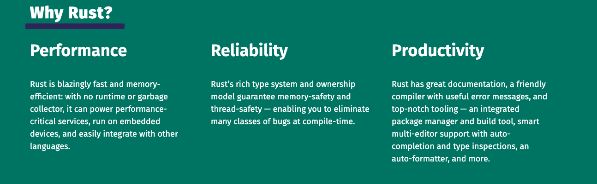
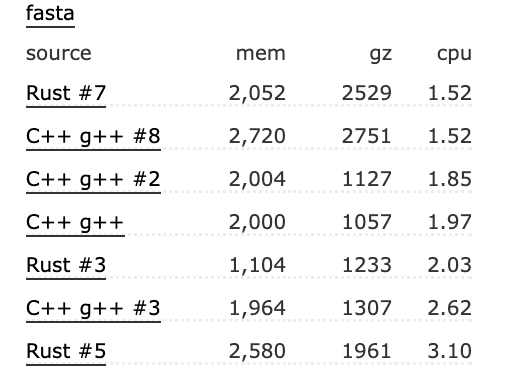

## 趋势

Stack Overflow 公布了报告 Rust 连续 7 年成为“最受欢迎”的语言。越来越多的公司准备在新项目上运用它来加强安全和性能上的保障： Gooogle、FaceBook、亚马逊等大公司内部都有开始在底层系统上进行替代 C/C++ 进行使用；最新的安卓 13 公布了 SOAP 底层系统有 21% 的 rust 程序，且数据显示极大降低了安全漏洞；Linus 也表示 rust 将成为 c 以外的另一种系统编程语言；华为、亚马逊、微软、Mozlia 等已成立 Rust 基金会。这一系列的事件表明，Rust 受欢迎程度和发展趋势是有目共睹的。


从另外一个角度，不同于一些被大公司把持的技术，Rust 是由公益组织 mozilla 牵头实验的一项开源项目，整个过程和细节都是公开透明，且最终有多加公司成立的 Rust 基金会负责管理。 Rust 是一项没有历史包袱、且不被任何一家公司控制的技术。

## 源起

每种语言的诞生和受欢迎都有其背景，我们不比较语言的“好坏”，而是简单看下 Rust 的是怎么产生、想要解决什么问题。

早在几十年前的贝尔实验室诞生的 C 及后续的 C ++ 提供了非常流行的高级语言，C 几乎是为 unix 系统而生，是最高用高级语言编写操作系统的尝试之一。它提供了简洁友好的上层表现能力，同时又能灵活的访问底层。C ++ 理论上可以理解为 C 的一个超集（实际不完全兼容），在 C 的基础上提供面向对象等各种解决复杂领域的抽象和工具。C/C++ 在诞生到如今，一直是底层系统开发的主流，操作系统、浏览器，嵌入式设备等这些需要访问底层硬件，或者需要高性能的领域几乎都在使用 C/C++。

C/C++ 相对汇编而言，是一种更高的抽象，但仍然需要额外做很多底层的事情，比如控制指针操作堆内存，手动释放内容等。对于大量上层应用软件而言，我们希望开发者可以更加聚焦到业务本身，而不是底层细节。于是有了大量进一步抽象的高级语言，比如适合浏览器的 Javascript ，适合后台业务逻辑处理的 Java、C# ，适合科学计算的 python 等。这些语言屏蔽了更多底层细节，做了更多适合于特定场景的设计，比如面向对象，弱化类型、函数式、垃圾回收等。这些被设计成更易用的语言，大部分都是解释型语言。C/C++ 程序最终会编译成对应操作系统的二进制文件，由操作系统直接执行，而解释型语言则更多的是需要一个解释器程序，对代码进行解释执行。解释执行带来的好处是跨平台，可以自动进行垃圾回收，代价是执行性能受到限制。

为了继续在语言层面兼具性能和方便开发者，继续优化方向有两种。其一是把程序编译成二进制文件，但同时仍然提供自动垃圾回收，在性能和内存管理上进行平衡，代表则是 Google 发布的 Go ；另一种是编译成二进制文件，但不提供运行时自动垃圾回收，却仍然不需要开发者手动管理内存。

通过虚拟机解释执行和操作系统直接运行编译好的文件的性能差距是非常大的（当然解释执行也有优化手段），我们想要提供更高的性能，优化的方向必定是需要编译成二进制，而不是通过解释器进行解释。 在 C/C++ 中，开发者需要手工管理内存，通常非常容易带来潜在的安全问题，还有各种开发的心知负担。Go 采取了折中，在编译的二进制文件程序中，提供运行时垃圾回收。为什么说是折中呢？因为内存没有被开发者手动释放，需要垃圾回收逻辑定期的寻找这些被引用的变量，然后再集中清理掉。在清理垃圾的过程，程序是处于短暂暂停状态。对于大部分份场景，甚至大数据，后台业务逻辑，这种毫秒级暂停几乎可以忽略不计，所以 Google 大部分后退业务由 Go 进行实现的。但对于更底层的操作系统、浏览器、FPS 游戏、性能工具等对停滞非常敏感，垃圾回收仍然被视为一种负担。

怎么样才能既满足编译到二进制的高性能，又不想增加开发管理内存带来的心知负担，但又拒绝垃圾回收的开销呢？ Rust 正是被设计成这样一种语言，用于满足高性能，同时带来现代化开发的安全可靠、效率便捷。



这是 rust vs c/c++ 在不同计算类型下的基准性能测试对比 https://benchmarksgame-team.pages.debian.net/benchmarksgame/fastest/rust.html



## Rust 怎么做到的

在程序设计领域，相同资源下，想要增加某个方便的效益，必定要放弃另一个方面的效益，比如时间换空间，开发效率换执行效率等。 Rust 是用什么资源置换免去手工管理内存、同时保障内存安全可靠的？答案是额外的编译和语法。

在 C/C++ 中内存的不安全性主要源于指针和堆上的内存，用户申请的堆内存可以指向任意一个指针，指针可以赋值给任意一个变量，多个变量指向同一块堆内存，只要其中一个变量进行数据修改，内存释放等行为，都会导致其他变量发生安全问题。

```c++
 char *pvalue = NULL;
 char *pvalue2 = NULL;
 char *pvalue3 = NULL;
 pvalue = (char *)malloc( 200 * sizeof(char) );
 strcpy(pvalue, "hello");
 pvalue2 = pvalue;
 pvalue3 = pvalue;
 strcpy(pvalue, "hello2");
 // ...
 free(pvalue)
```

如上面例子，同一个内存被指向多处变量，其中 pvalue 被修改，其他变量都会被自动改掉，这本质上是一种数据写入竞争，导致内存释放成为难点。软件中的各种疑难杂症都和指针有关。

rust 提供了一套内存安全的语法规则，保证在任意给定时间，要么只能有一个引用被修改数据，要么只能有多个不可变引用能读取数据。这就是 Rust 变量所有权系统。

```rust
 let mut s = String::from("hello");
 let r1 = &mut s;
 let r2 = &mut s;

```

以上看似“正常”的代码编译不会通过。所有权语法极大限制了开发者对变量的赋值处理，思维习惯和传统类 C 语言完全不一样，对开发者需要适应的时间成本会高，这就是我们通常说的，学会和 rust 编译器“斗智斗勇” 。

对一个内存只能同时拥有一个写入变量是进一步设计规避掉手动编写内存释放的关键。与之相连的另一个设计就是作用域。

在 c/c++ 栈中的变量比如基础数据类型是不需要手工释放，这是因为函数栈被执行完毕，代表离开作用域，内存都会自动丢弃掉；Rust 正是在每个作用域离开的时候，在编译阶段自动插入内存释放代码，从而无需开发者手动写，这和 C++ 中的智能指针的自动析构类似。rust 的作用域和所有权系统，把内存控制在安全之内。

所有权、作用域检查这是 Rust 以赋值灵活性为代价，换取内存安全的做法。但像 Rust 编译规则的方向去思考和编码，不正是一种新的编程思维吗？

## 现代化能力

作为一个大部分从事前端开发层的工程师，Rust 对我更具吸引力的其实是它超全的现代化能力。

### 工具

C/C++ 这种“古老”的语言，因为各种各样的历史包袱，在工具链上没法完全达成一致，我们需要依赖一个成熟富有经验的工程师积攒各种“独门工具集”。

Rust 不存在这个问题。统一的文档、统一的构建工具、统一的包管理工具、统一的语言风格、统一的 RFC 等。你所需要的 Rust 工具集合，完全是像 web 前端的 node + npm 包一样便捷。这对生态构建是非常友好的，库工作者只需要一键安装、专注在编码本身，然后通过 cargo 交叉编译不同系统下的二进制文件，再配合 npm 一键发布到统一的包管理中心。说 Rust 是前端底层构建的未来一点都不为过。

### 函数式、泛型、面对对象

Rust 在性能上定位于媲美 C/C++ ，但也把现代语法的各种便利带近了语言层面。迭代器、函数式、闭包、泛型(Rust 泛型因为生命周期的存在可能更复杂)、面向对象是前端领域经常使用的一些模式，非常容易适应这些能力。通常这些更高级的抽象模式，在其他语言中会损失性能，Rust 通过一些优化，极大规避了这种情况。比如针对泛型的“单态化”在编译期自动填充类型；比如针对迭代器做的“零成本抽象”等。

我们可以看下 Rust 对比前端 js/ts 的常用编程模式。(有些语法可神省略)

- 闭包

闭包是函数表达式能作为参数，内部能捕获外部作用域的变量。

`rust版本`

```rust
let x = 1;
let add_one = |y|  { return x + y };
let res = add_one(2);
println!("{}", res)
```

`js/ts版本`

```typescript
let x = 1;
let add_one = (y) => {
  return x + y;
};
let res = add_one(2);
console.log!(res);
```

- 迭代器

`rust 版本`

```rust
let v1: Vec<i32> = vec![1, 2, 3];

v1.iter().map(|x| {return x + 1});

```

`js/ts版本`

```typescript
let v1: number[] = [1, 2, 3];
v1.map((x) => {return x + 1});
```

- 泛型

泛型是对象不同类型的行为抽象，比如浮点数和整型都具备相加的行为，我们希望让这两个行为公用一个方法，而这个方法的类型则需要同时匹配多种类型

``` rust
use std::ops::Add;
fn main() {
let a = 1;
let b = 2;
let res = add(a, b);
println!("{}", res);
}

fn add<T:Add + Add<Output = T>>(a: T, b: T) -> T {
  return a + b
}

```
`js/ts版本`

ts 泛型比想象中其实更复杂，但实际开发可能被 any 替代了。rust 泛型最复杂的部分是生命周期，且作为静态编译语言，rust 不存在 any 这样的类型。
``` typescript
function main() {

let a = 1;
let b = 2;
let res = add(a, b);
console.log!(res);

}

function add<T extends number>(a: T, b: T): number {
  return a + b;
}

```


- 面对对象

有些人说 Rust 不是面向对象的语言，因为没有继承，这是非常狭隘的观点。Rust 官方不仅对面向对象的本质做了定义，也为 Rust 为什么不实现继承做了解释，面向对象只是一种实现封装代码，提高复用、可读性的一种思想而已，但其实现的手段有很多种。按《设计模式》作者的观点：面向对象的程序是由对象组成的。一个 对象 包含数据和操作这些数据的过程。这些过程通常被称为 方法 或 操作。Rust 毫无疑问可以非常方便对数据做抽象。


``` rust

trait Animal {
    fn say(&self) -> i32;
}
struct Dog {
    age: i32
}
impl Animal for Dog {
 fn say(&self) -> i32 {
        println!("{}", self.age);
        return self.age;
    }
}


```

rust 的面向对象主要通过结构体 + trait 组合而成，trait 有点像 ts 的接口、抽象类、class 的混合体。trait 就是用于抽象这些通过特征的东西，可以有默认实现、能过被其他结构体实现，然后能作为参数约束泛型。Rust 中有大量暴露给开发者的官方 trait，定义好了借口，需要开发者去实现，比如迭代器、Clone、Copy 等。

`js/ts版本`

``` typescript

abstract class Animal {
    abstract say():number;
}
class Dog extends Animal  {
    age: number
    say () {
      console.log(this.age)
      return this.age
    }
}

```

## 未来


开篇已经讲过，Rust 已经在诸如操作系统、浏览器、数据库等大量涉及安全、性能的场景已经被各大公司在使用中，特别是亚马逊和Google，国内有华为等都是主要推动者，但想要短时间内把底层的基础设施重构为 Rust 是可不能，未来更多公司对性能和的安全更敏感的底层会进行改在，在新项目上会做尝试。


Rust 由 Mozlia 孵化，且最早用于浏览器，在前端 webassembly 的适配上非常契合。加上现代化齐全的包管理工具，配合前端 npm 包管理，在开发、测试、发布过程都是无缝衔接。已有知名的前端项目有  swc 、 turbo 和 deno。前者替代 babel ，用 rust 重新编写的 JS 转译器。turbo 是 webpack 作者的新项目，旨在用 Rust 编写的打包器作为 webpack 继任者。而 deno 则是 node 的作者目标是为 ts/js 实现一个更现代、更安全的运行时，用于替代 node 。

无数前端底层基础设施都在被 Rust 重写中，前端发展将进入到一个更强大，更现代的新阶段。

