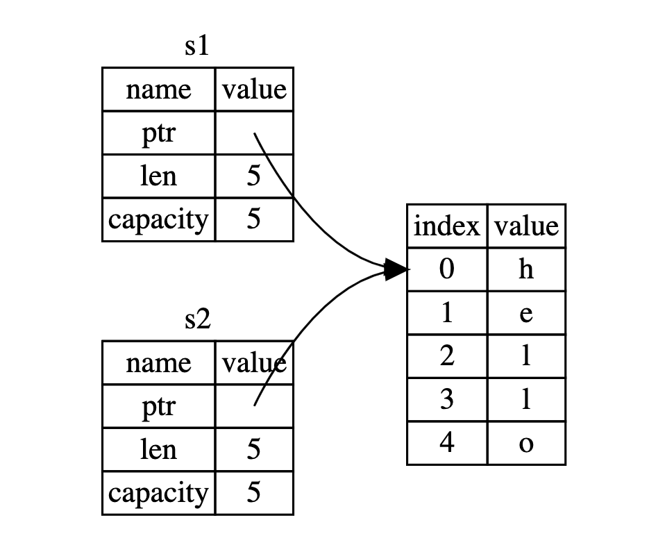
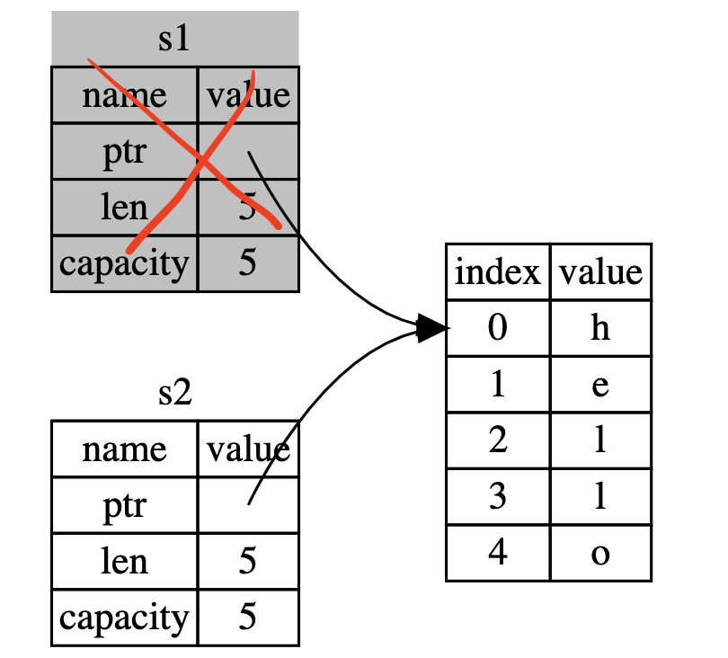

## 趋势

StackOverflow 公布了报告 Rust 连续 7 年成为“最受欢迎”的语言。越来越多的公司准备在新项目上运用它来加强安全和性能上的保障： Gooogle、FaceBook、亚马逊等大公司内部都有开始在底层系统上用 Rust 替代部分C/C++；最新的安卓 13 公布了 SOAP 底层系统有 21% 的 Rust 程序，且数据显示极大降低了安全漏洞；Linus 也表示 Rust 将成为 C 以外的另一种系统编程语言；华为、亚马逊、微软、Mozlia 等已成立 Rust 基金会。这一系列的事件表明，Rust 正在越来越被重视。


从另外一个角度，不同于一些被大公司把持的技术，Rust 是由公益组织 Mozilla 牵头实验的一项开源项目，整个过程和细节都是公开透明，且最终有多家公司成立的 Rust 基金会负责管理。 Rust 是一项没有历史包袱、且不被任何一家公司垄断的技术。

## 源起

每种语言的诞生和受欢迎都有其背景，我们不比较语言的“好坏”，而是简单看下 Rust 的是怎么产生、想要解决什么问题。

早在几十年前的贝尔实验室诞生的 C 及后续的 C ++ 提供了非常流行的高级语言，C 几乎是为 unix 系统而生，是最高用高级语言编写操作系统的尝试之一。它提供了简洁友好的上层表现能力，同时又能灵活的访问底层。C ++ 理论上可以理解为 C 的一个超集（实际不完全兼容），在 C 的基础上提供面向对象等各种解决复杂领域的抽象和工具。C/C++ 在诞生到如今，一直是底层系统开发的主流，操作系统、浏览器，嵌入式设备等这些需要访问底层硬件，或者需要高性能的领域几乎都在使用 C/C++。

C/C++ 相对汇编而言，是一种更高的抽象，但需要额外做很多底层的事情，比如控制指针操作堆内存，手动释放内存等。对于大量上层应用软件而言，我们希望开发者可以更加聚焦到业务本身，而不是底层细节。于是有了大量进一步抽象的高级语言，比如适合浏览器的 Javascript ，适合后台业务逻辑处理的 Java、C# ， 流行于科学计算的 python 等。这些语言屏蔽了更多底层细节，做了更多适合于特定场景的设计，比如面向对象，弱化类型、函数式、垃圾回收等。这些抽象程度更高的语言，大部分都是解释型语言，需要自带解释器或者虚拟机。解释执行带来的好处是跨平台，可以自动进行垃圾回收，代价是执行性能受到限制。

为了继续在语言层面兼具性能和方便开发者，继续优化方向有两种。其一是把程序编译成二进制文件，但同时仍然提供自动垃圾回收和各种高级抽象的语法，在性能和内存管理上进行平衡，代表则是 Google 发布的 Go ；另一种是编译成二进制文件，在不提供运行时的自动垃圾回收的情况，仍然能自动管理内存。

在 C/C++ 中，开发者需要手工管理内存，通常非常容易带来潜在的安全问题，还有各种开发的心智负担。Go 采取了折中，在编译的二进制文件程序中，提供运行时垃圾回收。为什么说是折中呢？因为内存没有被开发者手动释放，需要垃圾回收逻辑定期的寻找这些被引用的变量，然后再集中清理掉。在清理垃圾的过程，程序是处于短暂暂停状态。对于大部分份场景，这种毫秒级暂停几乎可以忽略不计，所以 Google 大部分后台业务由 Go 进行实现的。但对于更底层的操作系统、浏览器、FPS 游戏、性能工具等对停滞非常敏感的场景，垃圾回收仍然被视为一种负担。

怎么样才能既满足编译到二进制的高性能，又不想增加开发管理内存带来的心智负担，但又拒绝垃圾回收的开销呢？ Rust 正是被设计成这样一种语言，用于满足高性能，同时带来现代化开发的安全可靠、效率便捷。


下面 Rust vs C/C++ 在不同计算类型下的基准性能测试对比 https://benchmarksgame-team.pages.debian.net/benchmarksgame/fastest/rust.html


## Rust 怎么做到的

在程序设计领域，相同资源下，想要增加某个方面的效益，必定要放弃另一个方面的效益，比如空间换时间，开发效率换执行效率等。 Rust 是用什么资源置换免去手工管理内存的工作、同时保障内存安全可靠的？答案是额外的编译。

C/C++ 中内存的不安全主要源于指针和堆上的内存，用户申请的堆内存可以指向任意一个指针，指针可以赋值给任意一个变量，多个变量指向同一块堆内存，只要其中一个变量进行数据修改，内存释放等行为，都会导致其他变量发生安全问题。

```c++
 char *pvalue = NULL;
 char *pvalue2 = NULL;
 char *pvalue3 = NULL;
 pvalue = (char *)malloc( 200 * sizeof(char) );
 strcpy(pvalue, "hello");
 pvalue2 = pvalue;
 pvalue3 = pvalue;
 strcpy(pvalue, "hello2");
 // ...
 free(pvalue)
```

如上面例子，同一个内存被指向多处变量，其中 pvalue 被修改，其他变量都会被自动改掉，这本质上是一种数据能够被赋值共享修改的特性。软件中的大量疑难杂症都和数据共享有关。



Rust 提供了一套内存安全的语法规则，保证在任意给定时间，要么只能有一个引用被修改数据，要么只能有多个不可变引用能读取数据。这就是 Rust 变量所有权系统。



```rust
 let mut s = String::from("hello");
 let r1 = &mut s;
 let r2 = &mut s;

```

以上看似“正常”的代码编译不会通过。所有权语法极大限制了开发者对变量的赋值处理，思维习惯和传统类 C 语言完全不一样，对开发者需要适应的时间成本会高，这就是我们通常说的，学会和 Rust 编译器“斗智斗勇” 。

与之相连的另一个设计是借用检查器，通常叫称生命周期。

在 C/C++ 栈中的变量比如基础数据类型是不需要手工释放，函数栈被执行完毕，代表离开作用域，内存都会自动丢弃掉；如果一个函数返回了一个指针，该指针执行函数内部的变量，那指针指向的变量就会变成无效值；在更复杂的场景，比如指针经过层层传递到达某个逻辑，但指针执行的变量其实早就被释放了。这种疑难杂症非常不好定位。

Rust 在编译阶段会用一些规则检测引用是否有效，从而规避不安全的内存风险。作用域内有了对引用赋值的限制，Rust 编译阶段会自动在作用域结束阶段插入内存释放代码，从而无需开发者手动写清理逻辑，这和 C++ 中的智能指针的自动析构类似。

所有权、借用检查是 Rust 以赋值灵活性为代价，通过编译检查换取内存安全。Rust 初学的难点基本围绕在对这一套思维的适应。

## 现代化能力

作为一个大部分从事前端开发层的工程师，Rust 对我更具吸引力的其实是它超全的现代化能力。Rust 是一门提供高性能的同时，又提供了各种高级现代抽象的语言

### 工具

C/C++ 是“古老”的语言，因为各种各样的历史包袱，在工具链上没法完全达成一致，我们需要依赖一个成熟富有经验的工程师积攒各种“独门工具集”。

Rust 不存在这个问题。统一的文档、统一的构建工具、统一的包管理工具、统一的语言风格、统一的 RFC 等。你所需要的 Rust 工具集合，完全是像 web 前端的 node + npm 包一样便捷。这对生态构建是非常友好的，库工作者只需要一键安装、专注在编码本身，然后通过 cargo 交叉编译不同系统下的二进制文件，再配合 npm 一键发布到统一的包管理中心。

### 函数式、泛型、面向对象

Rust 在性能上定位于媲美 C/C++ ，但也把现代语法的各种便利设计到语言层面。迭代器、函数式、闭包、泛型(Rust 泛型加上生命周期会更复杂)、面向对象是前端领域经常使用的一些模式，非常容易适应这些能力。通常这些更高级的抽象模式，在其他语言中会损失性能，Rust 通过一些优化，极大规避了这种情况。比如针对泛型的“单态化”在编译期自动填充类型；比如针对迭代器做的“零成本抽象”等。

让我们简单看下 Rust 对比前端 js/ts 的常用编程表现。(有些语法可省略)

- 闭包

闭包是函数表达式能作为参数，内部能捕获外部作用域的变量。

`rust版本`

```rust
let x = 1;
let add_one = |y|  { return x + y };
let res = add_one(2);
println!("{}", res)
```

`js/ts版本`

```typescript
let x = 1;
let add_one = (y) => {
  return x + y;
};
let res = add_one(2);
console.log!(res);
```

- 迭代器

迭代器是前端做数据转化时常用的写法

`rust 版本`

```rust
let v1: Vec<i32> = vec![1, 2, 3];

v1.iter().map(|x| {return x + 1});

```

`js/ts版本`

```typescript
let v1: number[] = [1, 2, 3];
v1.map((x) => {return x + 1});
```

- 泛型

泛型是对不同数据类型的但行为相同的抽象，比如浮点数和整型都具备相加的行为，我们希望让这两个行为公用一个方法，而这个方法的类型则需要同时匹配多种类型

`rust版本`

``` rust
use std::ops::Add;
fn main() {
let a = 1;
let b = 2;
let res = add(a, b);
println!("{}", res);
}

fn add<T:Add + Add<Output = T>>(a: T, b: T) -> T {
  return a + b
}

```
`js/ts版本`

ts 泛型比想象中其实更复杂，但实际开发中 any 容易被滥用。rust 泛型最复杂的部分是生命周期标注，且作为静态编译语言，rust 不存在 any 这样的类型。
``` typescript
function main() {

let a = 1;
let b = 2;
let res = add(a, b);
console.log!(res);

}

function add<T extends number>(a: T, b: T): number {
  return a + b;
}

```


- 面向对象

有些人说 Rust 不是面向对象的语言，因为没有继承，这是非常狭隘的观点。Rust 官方不仅对面向对象的本质做了定义，也为 Rust 为什么不实现继承做了解释，面向对象只是一种实现封装代码，提高复用、可读性的一种思想而已，但其实现的手段有很多种。按《设计模式》作者的观点：面向对象的程序是由对象组成的。一个 对象 包含数据和操作这些数据的过程。这些过程通常被称为 方法 或 操作。Rust 毫无疑问可以非常方便对数据做抽象。


``` rust

trait Animal {
    fn say(&self) -> i32;
}
struct Dog {
    age: i32
}
impl Animal for Dog {
 fn say(&self) -> i32 {
        println!("{}", self.age);
        return self.age;
    }
}


```

rust 的面向对象主要通过结构体 + trait 组合而成，trait 有点像 ts 的接口、抽象类、class 的混合体。trait 就是用于抽象这些通共同特征的东西，可以有默认实现、也能过被其他结构体实现，然后能作为参数约束泛型。Rust 中有大量暴露给开发者的官方 trait，定义好了借口，需要开发者去实现，比如迭代器、Clone、Copy 等。

`js/ts版本`

``` typescript

abstract class Animal {
    abstract say():number;
}
class Dog extends Animal  {
    age: number
    say () {
      console.log(this.age)
      return this.age
    }
}

```

## 其他底层能力和无畏并发

自动清理内存、借用规则等是 Rust 安全的高级抽象，但 Rust 也暴露了和 C 一样的底层能力。unsafe 关键字可以绕开这些限制，获取裸指针，通常编写底层代码，或者提供更高性能的场景才会使用。Rust 包装了一些常用的智能指针，比如向堆上写数据的 `Box<T>`，允许相同数据有多个所有者的`Rc<T> `，用于并发的互斥锁`Mutex<T>`等， 用`Arc<T>` 和 `Mutex<T>`的组合可以实现安全的在多线程之间共享所有权。 从底层能力的暴力可以看下 Rust 的安全理念就是：对于上层应用开发我们应该优先使用安全规则特性、而对常见的底层能力则通过智能指针包装暴露给开发者，如果官方的智能指针无法满足需求，则开发者通过 unsafe 自行实现底层能力。

## 未来


开篇已经讲过，Rust 已经在诸如操作系统、浏览器、数据库等大量涉及安全、性能的场景已经被各大公司在使用中。代表是亚马逊、Google、华为等都是主要推动者，但想要短时间内把底层的基础设施重构为 Rust 是可不能，未来会有更多公司对性能和的安全更敏感的底层会进行改造，在新项目上会做尝试。


前端层面，Rust 对 Webassembly 支持非常给力，推进迅速。现代化齐全的包管理工具，配合前端 npm 包管理，在开发、测试、发布过程都是无缝衔接。已有知名的前端项目有  swc 、 turbo 和 deno。前者替代 babel ，用 rust 重新编写的 JS 转译器。turbo 是 webpack 作者的新项目，旨在用 Rust 编写的打包器作为 webpack 继任者。而 deno 则是 node 的作者目标是为 ts/js 实现一个更现代、更安全的运行时，用于替代 node 。

在跨平台上 Tauri 是一款和 electron  竞争的对手，采用 Rust 替代 Node 作为后端，系统自带的 webview2 替代打包巨大的 chromium

Rust 可能是未来前端研发的新基础设施。

