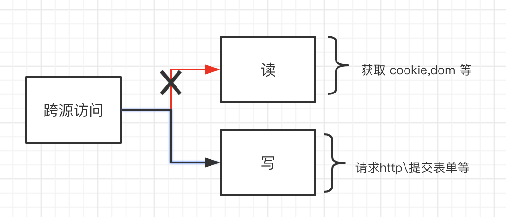
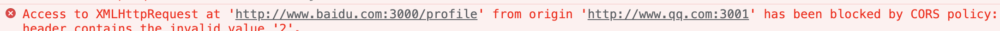

说起前端安全问题，大部分都听过 XSS 和 CSRF 这两个名词，前端面试中我们也经常会问这两个点作为 web 安全的一些基础考察。但大部分只是从浅谈辄止，停留在基本词义，很少有人真正去主动实践过安全，并且思考背后的关联。

前端安全主要来源两个方面，一个是不安全的脚本、另一个是不安全的请求，前者代表各种 XSS 等注入脚本的手段、后者则发起非法的请求，CSRF 是代表。

### web 安全基石——同源策略

这篇文章主要想分析下以跨域为代表的安全攻击和保护。很多人知道同源策略SOP，它是 web 的安全基石。由于浏览器是 http 无状态的连接，所以对于不同源头的区别至关重要，简而言之：协议、域名、端口三者相同，浏览器则认定它为同源，在同一源下，诸如、cookie\html5储存等资源是可以共享的。

有了同源策略作为保证，为什么会出现其他源的非法请求呢？

这里就是很多人容易混淆的地方。同源策略的核心是保护属于某个源的资源不被其他源读取，它们彼此独立，这个设计的初衷并非为防止非法请求而存在，也就是说同源不等于合法请求，它也不关心请求是否合法。简单的定义为“可写不可读”。




那么问题来了，为什么我们在跨域请求的时候会被浏览器会有报错呢？（后面有解释）




上图是请求是被 CORS 规则阻止的错误提示。

### 跨域共享策略

同源策略是保护统一源资源部被窃取，但现实是，我们很多场景，需要在不同源之间共享，跨源资源共享（CORS）既是针对如何合法的突破 SOP。在形成官方协议前，曾经有各自非官方的手段来突破不同源之间共享资源，比如 JSOP 。CORS 是一种官方的协议用来在不同源直接共享资源，所以它目的也不是为了安全，某种程度，正因为不合理的使用，反而不安全，比如使用这样的协议： `Access-Control-Allow-Origin: *`允许所有源共享资源，无疑是向入侵者敞开大门。

所以、SOP 和 CORS 是资源隔离和共享的相反方向。


### CSRF 的本质

之所以强调这一点，是要告诉开发者，浏览器所做的只不过是实现相关基础协议，不要试图误解这两个协议会保护你的应用，应用的安全应该由你自己掌控。

回到 CSRF 的场景，攻击者在另一个非法的源对你的源发起请求，骗过服务器。为什么服务器会相信一个非法的源呢，或者说服务器如何保证这个源是合法的。早在一份统计中，至少百分之的网站 30% 有 CSRF 漏洞，很多开发者对 CSRF 认识不够深刻。由于 http 是无状态的，前后端会话的维持和用户身份校验大部分是基于 cookie。cookie 的数据默认会受到 SOP 策略的保护——既不同源之间是无法共享的。但是，浏览器并不保证每次请求中，cookie 是否在同一源，这就是 CSRF 中招的根源。

也就是说，在不同的源下请求相同的接口，cookie 会携带过去，如果只是依赖 cookie 中的 token 登录态去校验用户身份, 那么完全是不够安全的。假设用户在 A  站点登录了个人账户，这个站点基于cookie 维护的会话，同时没有做任何 scrf 保护，接下来，它收到一份中间邮件，点击打开一个钓鱼网页，这个网页就能像 A 站点发送任何携带登录态的数据，任意修改这个用户 在 A 站点的数据。

相比不少同学有疑惑，我们刚刚在上面不是展示了，CORS 协议的存在会让控制台报错，提示请求失败吗？就算是钓鱼网页请求 A 站点可以携带用户登录后的 cookie ，这个请求不是没有发出去吗


这个错误容易被误解，跨域资源共享的报错代表的不是请求失败，而是资源读区失败。也就是说，浏览器虽然在接口跨域的逻辑中报错，但 http 请求过错仍然是成功的，它抵达了后台，同时返回了对应的结果，但浏览器基于 SOP 策略让你无法访问这个数据，才有了这个提示。

这里再一次证明了，SOP 只服务于源的数据隔离，它对请求不做任何限制，甚至跨域的时候 cookie 携带也不做限制。大量 CSRF 的漏洞根源也在于此。


再重复一遍，基于 cookie 维护的登录态，如果没有做任何其他手段的校验，后台收到这个携带登录 cookie 的 http 请求，不一定是“合法”的。最简单的测试我们的接口是否有 CSRF 保护的方法是，把请求内容复制下来，在控制台做一次 http 重放，如果成功返回，那么基本代表是有漏洞的。

### CSRF 的保护

跨域请求攻击的本质是利用 cookie 会携带，最简单的保护手段就是不使用 cookie，改成 html 储存，比如 localstorage 等，然后前后自行维护一套类似 cookie 的过期逻辑。 

但是，cookie 虽然有很多问题，但它的初衷就是给无状态 http 请求提供一个身份记录，也不能完全因噎废食，在做好安全的前提下，它仍然是最简单的方案，下面是一些常见的保护措施。


#### 校验源

浏览器每次 http 请求会携带两 header 字段，Referer 和 Origin 分别表述请求的 url 和请求的源，Referer 因为会包含全部的路径，正在成为被废弃的字段，而 Origin 只有协议、域名和端口，正好符合 SOP 源定义的规则，我们用 Origin 判断是最合适的。

源的校验只能作为辅佐手段，而不是最终判定，因为 Origin 字段在各大浏览器中曾经不断暴露过很多漏洞，所以不能严格依赖。 

#### CSRF Token

这是教科书式的方案，但仍然想重点讲下，因为最近我研究了国内大厂的某 web 站点，竟然发现有严重的 scrf 的漏洞。

上面说过，CSRF 漏洞的根源在于信任 cookie，token 就是我们给每个用户分配的一个随机的牌，每次请求通过校验这个令牌判断来源是否正确。这个 token 本质上替代了校验源 origin 的作用，只不过由我们自己生成和控制。

有人会问？攻击者能不能拿到/利用这个 token 呢，答案是，由于 SOP策略的存在，攻击者不能拿到第三方域的任何数据，包括 cookie 和其他内容。

但是，如果你的 token 没有正确的储存，仍然可以被利用。scrf 的精髓在利用 cookie 自定携带的特点，所以`CSRF token 是不能保存在 cookie `，除此以外，其他任何地方都行，比如 dom、localstorage 等。


#### 随机 cookie 验证
SOP 不会阻止 cookie 跨域发送，但是会阻止 cookie 获取。我们可以利用这点特性，为每次请求返还一个随机的值设置在 cookie 中，下一次请求的时候，把这个值用 js 从 cookie 中取出来，拼接到参数中，后台在收到接口时，先校验这个参数。即可判定是不是可信任的源。
由于在第三方源无法用 js 取出这个随机值，那么由它发起的请求自然也会被过滤掉。

#### Samesite Cookie
CSRF 的根源在 cookie 可以被跨域发送，[Samesite Cookie](https://developer.mozilla.org/zh-CN/docs/Web/HTTP/Headers/Set-Cookie/SameSite) 是 Google起草的一份草案来改进HTTP协议，简而言之，可以给 cookie 声明是否仅限于第一方或者同一站点上下文。由于是新协议，在这用这个特性的同时，需要注意下浏览器兼容的版本。


### 绕过 SOP 

虽然可以用 scrf token 等方式保护 CSRF 攻击，但跨域攻击的方式往往尝试各种手段非法绕过SOP，其最脆弱的部分还是用户和开发人员本身。下面举一些例子。


#### iframe 界面伪装

CSRF token 可以保护用户接口不被伪造，但是如果将一个攻击目标的 url 放在被控制的域名的 iframe 中，这个 iframe 默认会加载目标 url 内的 token。攻击者可以对 iframe 进行透明化处理，并且将它层级提升到位余主界面的诱导按钮上。当诱导按钮的位置刚好与 iframe 内某个请求的按钮重合，那么这次点击就在用户不知情的背景下进行了“跨域请求”。这种攻击也叫[点击劫持](https://zh.wikipedia.org/wiki/%E7%82%B9%E5%87%BB%E5%8A%AB%E6%8C%81)。

应对的方式是：可以通过 X-Frame-Options 参数定义允许嵌套的源。

#### SOP 与 CORS

SOP 是对不同源资源的限制，而 CORS 是一种开放限制的官方策略，不合理的使用会带来风险，比如：
``` javascript
Access-Control-Allow-Origin: *
```
设置权限过大等同于没有设置。

#### 源的更改

window.domain 可以对当前源进行更改，在一些子域和父域通信的场景下可能需要用到。子域一旦通过 `window.domain` 更改为父域，意味着更大的范围，那么它将会在任何子域下有跨域访问权限。
```
// 对当前域 store.abc.com 进行更改
document.domain = abc.com

// hack.abc.com 可以对 store.abc.com  进行跨域访问
```


### CSRF 攻击示例（仅仅用于测试）

对于安全问题，往往是需要知己知彼，才能有所准备。下面是一些 CSRF 攻击中的示例。
``` html
<iframe >
  // 目标网站
  <form method="post" action="https://demodexx.com/modify-password">
     // 通过接口分析得到对方的字段名
     // 设置攻击者想要的新密码
     <input name="password" value="123456">
     <input type="button" value="点击领取 100万大奖">
  </form>
</iframe>
```

当用户进入一个攻击者控制的源，在隐藏的表单中诱导点击提交表单，这个时候，会自动携带 demodexx 的 cookie 进行提交，如果对方处于登录态，密码就直接被修改了。

通过样式伪装的表单是常用的手段，它比 ajax 请求有几个优势，第、兼容性问题小，第二、避开跨域[预检请求](https://developer.mozilla.org/zh-CN/docs/Glossary/Preflight_request)。


下面是 ajax 模拟示例，Content-Type 的值限于三者之一：text/plain、multipart/form-data、application/x-www-form-urlencoded 就不会有预检请求


``` javascript

const x = new XMLHttpRequest();
x.open('POST', 'url')
x.withCredentials = true // 允许携带 cookie
x.responseType='application/x-www-form-urlencoded';
const d = new FormData()
d.append('password', '12345')
x.send(d)

```

### 结

很多跨域安全问题是由于浏览器 “默认许可” 这一不成文的规定带来的，之所以这样做，也许是基于开放互通的 web 思维，或者浏览器厂商为了占据更多市场而提供更开放自由的行为。

无论如何，对于开发者，前端资源的读、写权限，不该信任其他第三方源，后台服务默认不信任任何请求（包括自己的域）。用一种默认拒绝的心态处理一切安全问题。


