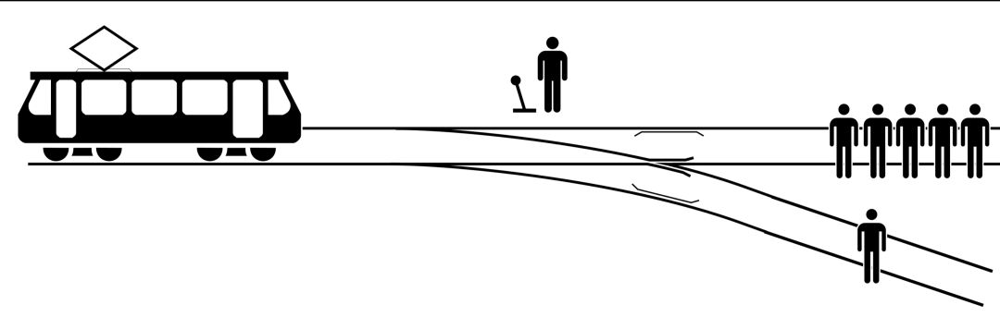

## 两大基本争议

“功利主义”和“自由主义”一直是现代政治权力两大争议基础来源。从西方的柏拉图到东方的孔子、到 21 世纪的互联网社会，这两个争议一直伴随到如今。
在社会学领域，以沁为代表的英国社会学家第一次把“功利主义” 的原则第一次得到现代意义上的明确表达。边沁的功利主义以“效益原则”为道德基础。“效益”就是受牵涉者的“快乐”。当行为倾向于增加“效益”，而不是减少“效益”，就是“对”。 用我们所熟知的话就是：“是否普遍提高更多个人的生活水平”，“是否普遍让更多人更快乐”。

这一原则对反对君主专制，提倡普选制度提供了最早的理论支持。

另外一个维度的意识形态是“自由主义”，自由主义把社会和制度的存在便是为了推进个人的目标，权利统治者和被统治者是契约下制定法律并同意加以遵守。以密尔为代表的《自由论》提出了更为精准的原则： 如果要干预其他人自由，就只有一个合理理由，那就是自卫，而用权力违反人意志，只有一个正当理由，那就是防止伤害他人。从严复翻译的名为《群己权界论》，也可以看出自由本质是群体权利和个人权利边界的一个判定，在边界内是自由的，在边界外是“被限制的”。

这两个基础原则均是对君主制度有力的一种反击，称为现在政治制度的根基，不管哪个社会政策都能在这两者之间来回博弈，也是左派和右派的分歧。

## 分歧与融合点

自由主义和功利主义看上去并非不可融合，但它们的争议点在哪里呢？以20 世纪的德国为代表，德国刚刚经历第一次世界大战，作为战败国，百废待兴，国内经济凋败，而民众贫富差距巨大，犹太人作为少数普遍占据社会有利地位。从功利主义者的角度，“普通提高更多人的快乐”，牺牲少数犹太人极其财富，让更多普通德国民众更好的生活，这成了很自然的一个“行动合法性”的道德来源。种族屠杀并不是一个没有道德理论支持的行为，相反，用极端手段，维系更多人利益，极端功利主义者是占据者心理层面的道德高度。

二战后，欧洲各国政府普遍从功利主力转向自由主义，极大的刺激了市场经济的发展。为防止出现社会大多数群体对少数人的压迫，对政治正确的“同性恋、“黑人”、“难民”等问题表现极大容忍。在社会治理上，北欧、加拿大等国更偏向“功利主力”色彩，通过收取高额的个人所得税、企业利润所得税等再进行二次分配，保障医疗、基本生活等。而美国等地区则更主张发挥 “个体自由” 力量，从枪支问题、毒品问题等也一直被政府是否有权利管控称为争议点；作为发达国家，美国至今没有全民医保。

从上面的案例中，我们可以看出，从功利主义出发，我们会以更多人的直接、可量化的利益进行计算，这是一种直观的种族群体式的道德观，而自由主义则是一种普遍的、难量化的间接式的个体道德观。这两者可以在一个社会内共存，但一种社会更“左”的时候，会倾向干预个体自由，而维护更多人的现有利益；而社会风像更右的时候，会接纳个体差距，强调降低干预，激励更多未来财富。

## 电车难题

电车难题是对功利主义和自由主义最好的一种解答。认为撞向 1 人的，实际上认可社会强烈干预，用 1 个人换取 5 个人的命。而认为不应该转弯，而是自动撞向 5 个人的时候，实际上，是在维护那一个人“个体自由”。电车电梯有很多分解场景，比如从控制开关，变为推一个胖子制动等，这些都是没有本质变化，只不过是调整决策的心理道德负担。

一些人认为这个问题不切实际，很无聊。但我们的生活和它息息相关。任何一个公共政策的决定都是在两者之间之间徘徊。比如疫情政策，提高个人所得税，提高医保养老金缴纳比例，比如国企制改革，比如双减少政策等，这些决策必定在同时影响两边群体。虽然没有到达要杀死一群人，来维护另一群人这么极端，其内核是通过社会权力进行利益再分配是没有变的。自由主义的问题是，由于个体差异，财富积累速度和优势等会带来更大的社会贫富差距，极端自由主义是以“无政府主义”为代表。而功利主义则会导致利益短视，无法激发个人创造，看到更多的未来，极端功利的代表则是“极权主义”。

如今全世界，没有一个主流国家是在公共政策的制定上是“极端功利主义”，也无“极端自由主义”。我们称之以“左”，“右”。“保守”，“激进”等名词。一个国家、一个地区其社会也在动态变化，过去是“左”、未来可能是“右”。

## 两者价值的启示录

从群体物种直接利益角度出发，原始人类部落战争，杀死敌方部落，甚至以对方作为食物，这对维护自身部落生存是有益的；社会内部把“异端”不利于大多数群体的人处死让社会保持“健康稳定”，也是一种直接的功利主义做法， 比如斯巴达淘汰掉弱小的婴儿。
中国古代皇帝权利统治来源均本质上是对社会稳定维护，扩大中央集权就是扩大对社会干预能力。所以从动物世界到人类原始社会“功利主义”是非常自然的道德价值，这是个体力量薄弱，需要维系群体，延续物种内部生存的基本保障。

另外一个更普遍的、间接的角度，“异端”真的不利于种族的发展吗？人类每次向前演化，几乎都是以“异端”的形式出现，不管是被火烧死的“布鲁诺”，还是清末明初的异端思想，比如李贽承认个人私欲：“私者，人之心也”。这些在时代内看来是“异端”的东西，都是跨时代的思想。对人类变革升级起到重要的作用。自由主义者不直接站在可计算的社会财富角度出发，而是支持普遍的个体行动自由上升到道德层面，禁止公共权力对任何“异端”进行压迫，除非防止他们伤害。

为什么在传统的东西方社会均倾向维护一种稳定的、功利的社会价值。而工业革命前后，自由主义普遍兴起。意识形态的学科里只讲述“资本主义的发展”，但这些意识形态的讨论不会有定论，已经有无数流派争论了很多年。我们主张的“黑猫白猫”论，正是搁置争议，聚焦发展的现实派做法。

我们换一种更底层和客观的自然科学思维，人类在生产力更落后的社会，社会发现更接近数学上的线性（非完全，仍然是非线性的），而工业革命，科技极大爆发，非线性程度极大上升。简单的理解就是，我们更难预测科技和社会进展，如果社会被证明是混度系统，就有数学依据我们不能预测科技，就如所谓的“吓尿”指数，500年前的人类抵达现代社会“吓尿”的程度比“ 1000 年前达到 500 年前要更惊人。这一趋势给我们的启示就是基于当下科技和信息的决策看上去符合现在的利益，实际可能差之千里，就像过去清朝为维护农业文明稳定的闭关锁国。

面对有争议的系统，并不是说因为无能，就躺平。而是不要“过于自信”，接纳“异端”。“异端”是非线性系统下可能的一种探索，这是我们面对复杂人类社会的有利态度：​接纳和包容、让言论更自由、让行动更自由。

​