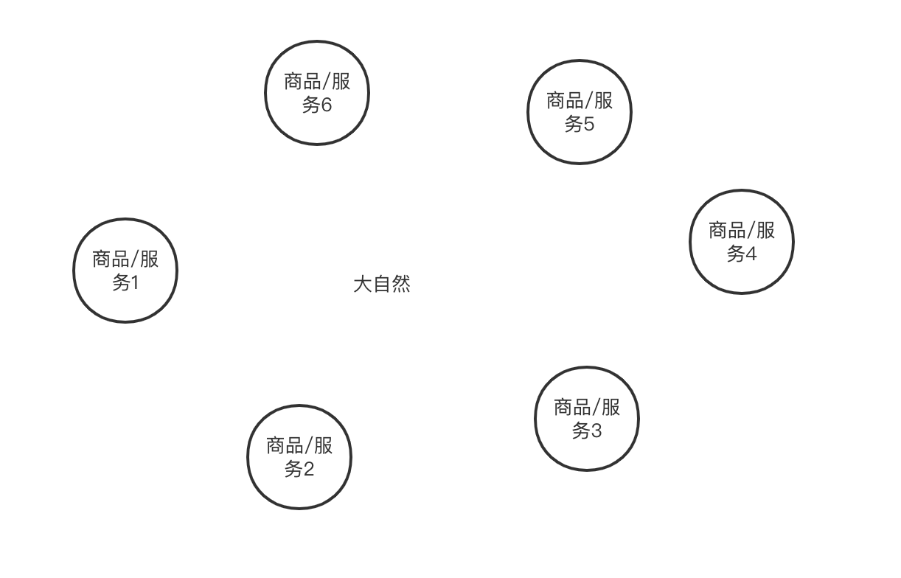
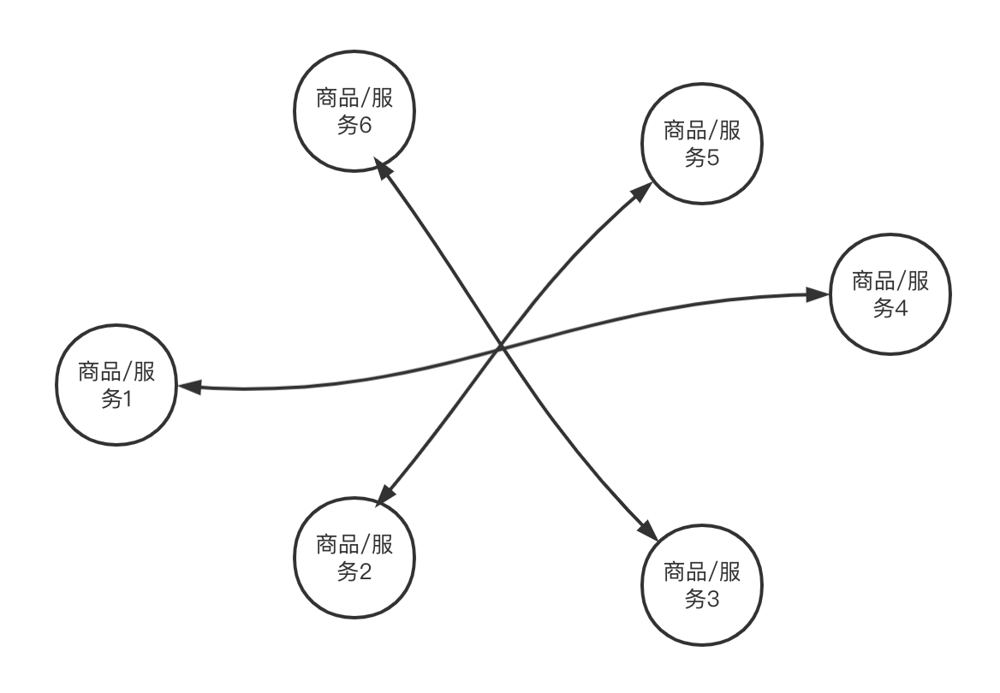
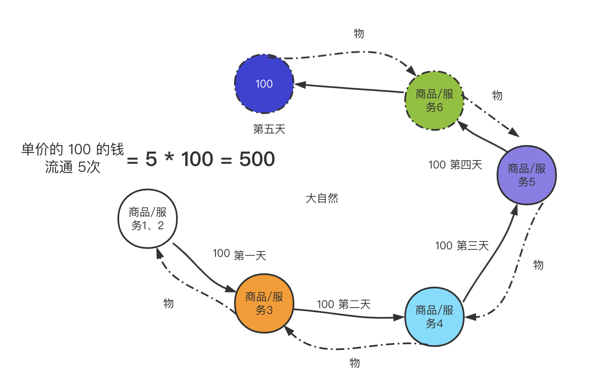
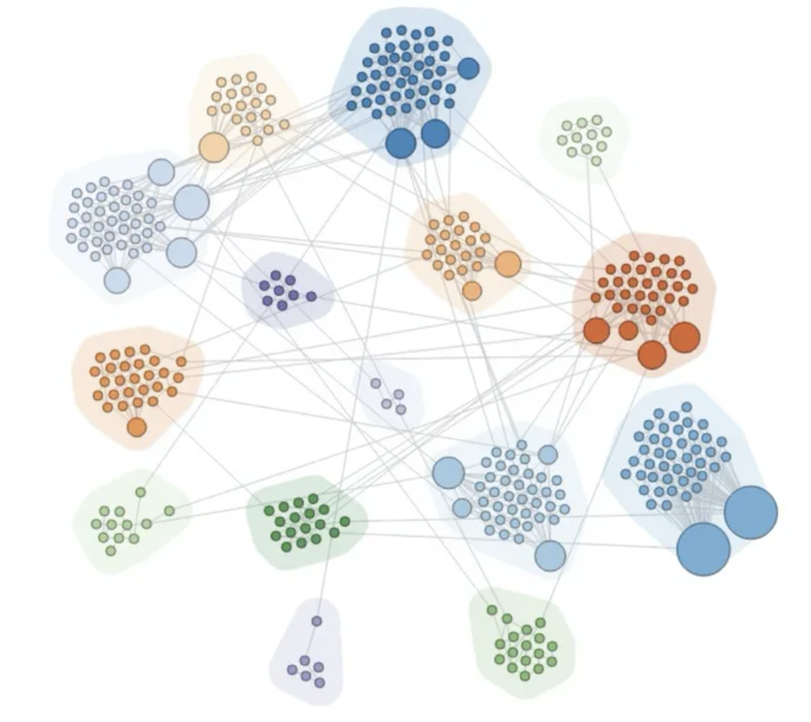
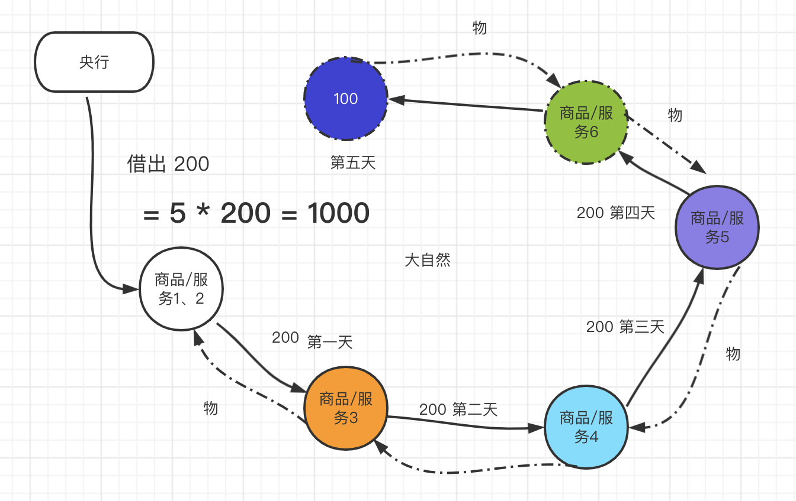

前言：本系列是一个随想，用非专业，通俗的话描述经济世界、自动化失业、未来人类方向的一个集合，原本是一篇博客同时完成的，但鉴于篇幅过程，拆成了三篇。
————————————

# 社会财富（GDP）怎么来的？
### 为什么大家买买后——每年统计的 GDP 增加了？

我们做一个简单财富流通的模拟。100 的等价交换物（平常我们把它叫做钱，单位和具体值忽略），从你手中花出去给 B 这一刻开始计算，（B 把他生产商品或服务给你），第一个环节的流通，意味产生 100 的新价值。

B 再把这 100 花出去，交换 C 的服务，又产生了 100 的价值。

C 又把这 100 花出去，交换 D 的服务，又产生了 100 价值。这时，在某段时间社会总共有了 300 财富。每一次交换，其背后都有一次生产（商品、服务）。

如果这个 100 继续不停地流通到不同人手上，一定时间内，财富的总数量就是流通次数乘 100 ，比如流通 100 次，100 * 100 就是 1万。商品和服务如果不流通，那么社会就会呈现自给自足状态，没有分工，整个社会财富等于自给自足之总和。商品生产后，没有交换出去，没有流通，也不属于 GDP。

图1：自然状态大家生产自己的商品，自己用。

图2：以物易物，彼此交换。

图三：从第一个人开始用 100 等价交换物像 第二个人换取商品2，后续时间 这个 100 不断流通的过程。

图四： 真实的人类世界是由成百上千亿级别的图与图交换关系网

### 第一笔钱怎么来？

第一笔钱怎么来的？信用货币前，黄金等东西因为稀缺，是天然货币。如果流通市场流通很快，意味着生产的财富增加了，黄金就会不够，容易通货紧缩，商品表面价格间接降低。如果你低成本发现了更多的新黄金，把它们投入市场，换取其他人的商品，流入太多，商品就会贬值。比特币也是这么回事，解决货币总数量固定，而商品增多的办法，就是分割比特币。

现在信用货币，第一笔钱，不需要天然货币，可无中生有，直接从商业银行借（银行也没有，只是几个账到你名下）。所以，我们（企业、政府）就这样不断借钱，生产，盈利，然后支付给工人，再还回去，再借。此时社会不止有一家企业，很多都在借钱，每一个企业借到钱出去 100，这 100 流通 N 次就后背代表至少生产了 N 次商品、服务（实物之外的劳动都算服务）。社会这些钱不断流转，最终总财富增加，参考上面流转为什么增加财富，因为社会一刻也不会停止借钱，只会越来越多，最终央行明面上的负债越来越多（叫央行资产负债表）。这些负债反应了我们的生产活动，其中央行最大负债资产表是美元，为啥，因为我们出口企业太多，挣的美元要强制换成人民币。

所以，一年内社会总财富，是这 100 （只是比喻，每个服务不止 100）在一年内交换的次数(自给自足，黑市等不计）。

### 怎么让社会财富（GDP）突然清零

我们假设，每个人突然歇业，静止不动 1年，不生产，也不提供服务，这个时候，商品服务就为 0，因为你没有任何可以交换的东西。社会财富总生产财富为 0。

假设每个人仍然在生产，搞服务，突然外星人做了一种魔力，让每个人彼此都找不到可以交换的对象，或者强制让服务交易失败。比如你给别人的东西，又在晚上自动复原到你家里，钱自动归到前一天账户。

这样，就相对于每个人都在生产，但是生产的东西却只能给自己用。一年下来社会总财富等于其实也接近于最初始恒定的 100（自用部分） 乘以总人数，在原始社会，人类圈子及分工不明显的时候就是这样。自给自足部分财富，现代社会不计入 GDP 内了。

Ok，我这样讲很明显了吧，商品流通增速和增加数量，提供更多生产机会，财富越增加。比如典型的手机、汽车制造，房地产等成千上万的零部件，上下游几十道，资金在里面每流转一次，财富增加一次。而流转最后一环是普通消费者，如果突然没有人去买手机，买房，买汽车了，或者降低了数量，工厂降低生产，降低流通，财富最后减少了。

到这里，房地产和经济的关系，是不是很明显了？（手动狗头）其他经济现象比如：疫情人员流动性降低，导致占内需比重很大的旅游业服务流转降低了，财富自然也变少了。另外环境不景气，大家本来愿意花钱，变成不花钱，存起来，本质就是降低流通（你不和别人交换了），那社会财富也变少了。如果你想为整个社会财富 GDP 做贡献，那就花钱，你不花钱，商品和服务怎么流通。把钱送给别人有用吗？没用，你再想想财富本质。

###  GDP 怎么变高的？

上面讲得很清楚了，这 100 流通次数越多，代表经过得生产、服务越多。如果大家把挣的钱存起来，没有流通，其实社会 GDP 就下降，有钱的话，多去下馆子、旅游、买买买等，让商品和服务流通起来，这个叫内需。从社会层面，怎么提高商品、服务的流通速度、怎么增加市场上有效商品、服务的种类，是各种政策想尽办法地方向。

### 通货膨胀？

央行的钱必须用借给别人的形式发型出去。政府、企业通常是能够优先借到钱的对象，拿到钱后，继续搞更多生产、公共建设。这些钱会被流通到每个消费者手中，借出去的钱越多，市场中流通的钱也越多，单位 100 内的购买力就会降低。

图：对比图三我们假设给市场投放 200 ，货币贬值一倍（理想模型）。

现实世界，钱的总量会更多，每个人提供服务和商品的生产能力不一样，社会一直在如此运转中，多出来的钱会循环流通中进入利润更高的行业和个体中。这些钱其实只是一个票面价值记录，代表你生产的东西流通出去的凭证。上面已经讲过，突然停止流通和停止生产都会让社会 GDP 清零。那重新启动社会生产这些凭证有什么用，能继续代表一般等价物吗？

因为社会重新启动，生产的可购买商品和服务非常之少，但是社会的这些等价物凭证非常多，每个人手上一打，生产商品的人本身也拥有很多凭证。大家踊跃 pk 这个商品，估计你要用扁担挑着凭证着去兑换。

很明显，钱的单位价值等于总货币除以总商品数量。只要央行不断在不断把钱借助去，任何人保有现金都会贬值。怎么规避贬值呢？很简单，既然货币会增加，那商品和服务的交易票面价值也会增加（物价涨价），所以选择把钱兑换成增长票面价值增长最快的物品即可。有钱人通常选择股票、房产、金融品、土地、生产设备等。这就导致一个问题，虽然钱发行更多，理论上大家应该普遍一起贬值，但是由于资产占有越多的人在兑换保值、增值物品的时候更有优势。而资产占有量少、甚至负收入的群体，没法找到应对通货膨胀的方式，日常用品物价上涨了，但是它的钱没有增值。则进一步加大了财富占有少的人和财富占有多的人之间的差距。

### 如何解决通胀带来的贫富差距

在全世界政府层面看来，经济停滞状态，货币发行是为了刺激经济，但人性趋利避害，会间接的导致贫富差距拉大。比特币支持者，认为现代信用货币下，每次货币的发行是对资产占有多者的群体对资产占有少群体的进一步掠夺。

#### 比特币

比特币的解决方案本质和黄金一样，只不过它更容易流通和分割，还能无限分割。首先每个人一块比特币，大家彼此生产商品，彼此交换，如果商品数量逐渐增加，那么一块比特币继续被分割，商品数量变少，被分割数也随之减少。穷人不会随着突然新发行的钱（比特币总量固定）而降低财富，富人不会因此额外增加。看上去挺好的，政府就失去了对金融的控制，也没有央行这种存在。

我们看看它如何应对实际社会生产的影响。比特币制度下，政府无法透支未来，它的预算等于税收和国企的利润的总额。所以经济政策的指定会非常保守，需要花钱节约开支修路、搞公共工程的这些会大幅降低。企业呢，没法大规模借钱生产，它需要从 0 慢慢积累，或者向居民发行等价的企业债，借更多比特币去生产。

在消费者层面，首先社会生产的速度、规模被降低后，就业机会和收入会降低，手中的比特币更值钱，交换意愿降低，商品价格下降。商品价格下降后，企业生产动力进一步降低，最终不断循环，会达到一个均衡点，既保持基本需求生产和很少量的能够支持利润的生产。

这种状态，其实和古代传统社会非常像，以物易物，以金属货币换物，不断分割，固定货币下，缺乏外部的主动刺激，人性趋利必定导致社会商品匮乏。在中国古代商品发达而时候就自然出现过“交子”这种纸币，这是人类在从天然的金属货币向信用货币迁移过程。目前比特币之所以在金融上没法取代信用货币，最大的问题和古代传统社会一样，缺乏刺激生产的机制。要么人类过清淡寡欲而生活，要么设计一种可以有效刺激生产的方式。（所有的虚拟币想要真正解决金融问题必须要考虑这一点）

#### 信用货币体系下

信用货币体系下央行发现货币带来的通胀，加大了贫富差距。纸币本身没有价值，它只是一种信用凭证，富人记账多，穷人记账少，是一种基于信任的账单。如果大家不认可，这些凭证无异于废纸。这一效应达到失控状态的表现就是：信用货币不再被信任，政府和央行都破产，货币凭证贬值到一无所有（一般伴随着暴力）。此时金属货币重新被作为临时的一般等价物。信用货币确实考验人类彼此信任。

信用货币下，税率是对财富的一种重新分配。既然富人可以购买资产达到规避通胀，那社会也可以用高额的房产税、遗产税等一系列措施进行平衡。通胀是动态的，税率是固定的（短期看），人是自由的，这里面重满了各种博弈，问题不可能一劳永逸，走到任何一个极端都会导致更大的问题，纵观全球，不同国家有不同的政策。未来通过超级计算机去模拟这些不同的策略可能会带来更多的方向。

