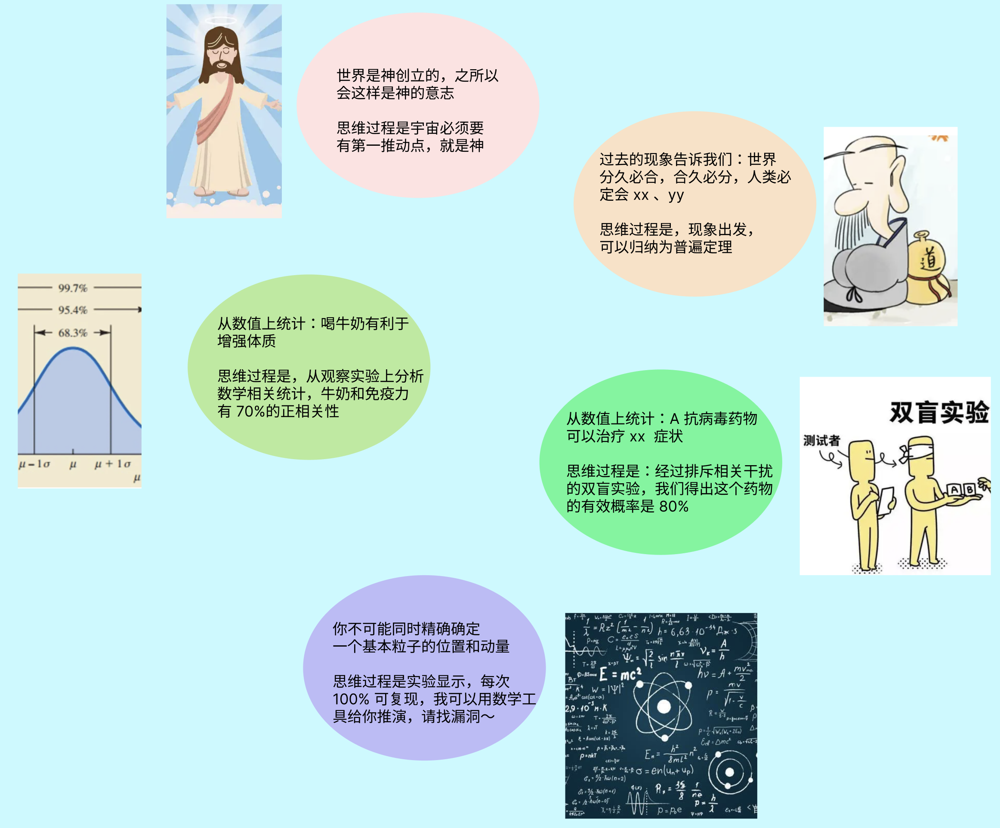

自然科学在建立严格的观测、实验、基于数学公理进行演绎推理后，从此和神学，哲学的辩证撕逼法中独立出来，引领人类点亮了文明的科技树。

# 自然科学如何处理争论
现代自然科学不是没有争论，而是所有争论都可以有公认的方法去证明，可质疑性、可证伪性、叶贝斯概率、实验可预测性等一系列原则下，再基于精准数学语言演绎，最后用奥卡姆剃刀（形式上选更简洁的）选出公认的理论。自然科学简单的方法论，让“真理”变成了一个非少数神学家的教条，杜绝到处扣帽子、撕逼，而是基于科学方法的推出严密的结论。也就是这些结论能用标准的数学逻辑去判断是否存在漏洞，也可以不断基于更新的实验去推翻、或涵盖旧理论，如相对论对牛顿力学之上的结论。后来科学名声大噪，神学家也经常用一些公式去论证上帝存在，但因为`其论证过程终究不可证伪性，上帝也只能算是一种“猜想”`。

对于未被预测和验证的科学理论，我们一般也叫猜想，比如宇宙大爆炸，暗物质等。自然科学的猜想比和其他学科本质区别是，它并非“口出狂言”，而是做基本假设，用已有可证的公理，数学公式进行严格推导，并且能对已有观测数据做出解释。比如弦论，多维宇宙等模型就是这种模型，虽然数学上很完美，但没有实验和可预测性数据支持，物理学仍然只是把它当做美妙的猜想。

为避免争议，`本文的科学，代指“真自然科学”的方法论`。但目前人类的其他学科，都想打着“科学”名字，但真正的科学家从来不关心这些研究成果是不是有“科学”名字，而是其研究的过程是否为公认的科学方式。

这些想要冠名的其他学科处于非常原始的“辩证”（争议）讨论阶段，如主流的经济学，社会学，心理学等，理论层出不穷，且彼此不能融洽，在讨论思想逻辑上和几千年中国的诸子百家之辩，白马非马等本质没有区别，都是基于非完全经验归纳法推理。`归纳推理确实是人类非常重要的猜想来源，但它却不能证明正确`，有一百种视角，就可能有一百种归纳。比如你到一区旅游，从一定时间和空间尺度看到 10 个都是男人，于是归纳出这个地区都是男人；比如你看到某个区域人类不断分裂、统一，于是得出分久必合，合久必分的道理，比如你统计到童年经历和成年情绪的思维关联，于是得出基于回顾童年的精神分析法。这些归纳理论有个特点，就是不具备的普遍性实证，在辩论过程可以随意用人类非精确的语言解释，统计学样本非常少，不能从推理本质。比如想要证明 一个地方都是男人，归纳法必定要进行穷举，反之要证明一个地方不只有男人，则只需要发现一例反面例子就能推翻。

朴素的归纳不能作为真理的另一个问题是缺乏用精准语言解释，比如为什么会分久必合，合久必分，帝国经济和农民战争的关联性，非数学语言总是可以加入新的解释，这导致无预测性，无法设计被证伪的实验。

直接归纳得出的结论如果都能为真，那么归纳为真的结论就会无穷多，所以，历史性行为解释、社会学解释流派之多，争论之多非常容易理解。社会学科的“粗糙”在于，不仅难以有像自然科学那样有严密的数学推理，连社会共识，公理等基本定论都在不断争议中，更不论人类政治组织冲突，世界各国各种左、右之争都等。这一源头是现代社会学之父奥古斯特·孔德提出的`实证主义`，声称`“现象论观点为出发点，进行归纳就可以得到科学定律”`，近两百对年，人类提出的所谓“社会科学定律”论已经超过上百种，这些定律大部分都是彼此激烈冲突，鲜有像自然科学这样严格推理
，这些争论，其论证过程连自然科学中的“猜想”都不如。

而自然科学的可证伪性概念，`本质就是对归纳推理结论的剔除（或者降低其可信度），加上用数学语言、逻辑演绎替代非精准的“人类语言解释”。`

经济学可能相对走得远一点，试图不断引入自然科学的数学方法论，模型等进行解释，但是经济学假设的主体——人的理性会失效，经济学的经济预测能力非常有限（不然经济学家都买股票了），仍然在攀登中。

经济学和社会学不同于自然科学，重要差异是：人作为变量是最大的不确定性，没法设计严密且完美，可不断重复的实验。人作为整体和个体，都在动态发展，某个时间点和区域的实验并非有永恒代表性。大规模社会实验不仅危险，还涉及伦理道德，社会意志等问题。所以涉及和人群体行为本身相关的科学研究，都非常艰难。

# 非自然学科复杂性在哪里
三体问题的复杂性是源于其混沌性，混沌是指确定性动力学系统因对初值敏感而表现出的不可预测的、类似随机性的运动。这是人类在科学领域遇到的另一个难题，两个天体相互影响可以很好的用牛顿力学进行计算，而三个天体相互运动，在初始速度和位置确定的情况下，却无法精准计算出未来时间的速度和位置，庞加莱在数学上证明过三体问题是不能精确求解。而目前人类预测这类三体问题的方式，主要是通过模拟建模、用计算寻得更高的精度的近似解。

但人类群体可以近似的看做是一个更复杂的 n 体问题，这个 n 可以是人类群体数量，更可以是人脑中神经冲动的总和。人与人相互影响和作用，其混沌不可预测性远大于三体问题。宇宙中生命出现的条件非常苛刻（推测概率宜居行星带相对宇宙的尺度，同时目前至少可观测内未有证据发现第二颗生命天体），而智能生命进化的路径更不可预测，人工智能也是在黑盒中摸索，在混沌系统中，人类的研究就像遇到量子力学的不确定性原理一般，处于被“锁死”阶段。

## 归纳的知识有用吗

`并不是说自然科学方法论以外的得出的知识没有价值。`人类并没有能力对一个复杂的混沌系统做出观测、实验，也缺乏用数学推理预测系统行为的能力，但`归纳推理仍然是重要的局部认识，这是我们认识世界最简单有效的方式`。智人学会石头使用、钻木取火，观察太阳东升西落等从原始社会到农业文明等都有赖于归纳总结，并且在一些猩猩智力测试中，它们会具备一些“低级”的归纳能力。

归纳不能证明，但`非所以问题都会像自然科学一样“寻根刨底”。` 归纳的局部知识有助于让我们理解局部现象，解决局部问题，这些局部知识不断经过概率上检验，最终沉淀为“暂时最优解”。比如神农尝百草，并不需要分析百草成分，作用性质，而是能用基于经验的“尝试”，对尝试后的结果做记录，这些记录在传承中会把治愈率相对更高的的种类过滤下来。比如心理学各种门派虽然五花八门，但每个门派都有一套逻辑自洽，且能够治愈患者的方案，现实治疗中，大部分心理咨询师采取实用主义，哪个好用就用哪个，哪个疗效对患者显著就用哪个。你可以说这种方法没有自然科学理论的唯一性，客观性，但现实就是它解决了现实问题，在数据统计中发生了作用，比如有效遏制自杀，抑郁等心理疾病。

这些特征在现代生物学、医学等领域都有类似表现：实用主义，局部解释。现在医学的药物和治疗方式相对传统医学，它把这种“经验值”具体化，数字化，比如每一个药物的有效率是多少，双盲实验则能排除更多的干扰。在解释上，则使用了现代物理、化学、生物学等科学知识，这些知识经过实验验证。也就是从概率上，现代医生治愈率更高，传统医学在概率上更低。

在实用主义下，我们不追求自然科学那种普遍性真理，反之统计有效概率成了重要的事情。`这是人类科学技术能力对未知的妥协，在无法全知全能下，总要有有一个能用的方案。`

# 小心真理

讲了这么多，其实希望大家就置信度而言，要知道可数学演绎推理、可证伪性、可实验、可预测的自然科学的知识要大于其他知识，其他学科知识中，经过实验检验的置信度大于未实验的，能数学演绎推理的可信区间大于简单归纳推理。`那些自己宣称为“真理”的知识一定要小心谨慎对待，比如过去的“神学”，和现在的各种“社论”。`

【图：画得比较仓促】

自然科学方法得到实验验证的理论一定是“真理”吗，并不一定，自然科学方法得出的结论只是说在现有观测范围内，最接近实验数据的理论。可证伪性，可质疑性决定了“终极真理”并不是自然科学争论的焦点，人类能不能认识“终极真理”，自然科学也不关心，这是哲学问题。

`自然科学方法论很务实，科学的理论允许不断被检验，推翻，再发展，人们选择更相信自然科学，是因为在概率上和实用角度，选择相信更为有利和可能性更高的知识而已。`你当然可以相信世界是金木水火土组成，以此解释世界，但它和已有观测数据，现实预测不符，当然你也可以又说数据不符是因为有更高维度的干扰影响观测，并引入一个变量去再度解释，没错，科学史上也发生过类似的事情，在有多种类似理论，且都能解释同一个物质的场景下，科学家往往选择证明路径最短的那一个，这有叫奥卡姆剃刀。科学总是不屑于无用争论，他们把时间花在设计实验、观测数据、数学推理上面。如果我们人类在其他领域也保持这种对“真理”的敬畏之心，无用争论就会少更多，文明的进程也许会更快一步。

`不过好在 21 世纪有这样的一种趋势，自然科学开始扩大了它的领域`，因为智能生命是宇宙的组成，人类的智能，人类社会的行为模式也必定有可以总结的宇宙规律。人类在尝试脑神经科学、人工智能计算（虽然目前的方法可能和人脑不一样）、计算社会学、混沌学、复杂性、生物计算等各种交叉学科被重视。未来新的科技跃进，极大可能在自然科学与传统学科的结合道路上。

#### ————后续思考————

几百年前的哲学家喜欢自称研究万事万物的学科，其“高格”的风骨让很多人自称为哲学家，牛顿的万有引力还用《自然哲学的数学原理》命名，而当时哲学家又喜欢去解释最新的物理学，经典物理学体系下，哲学家、还有普通人确实能用常识进行解构和理解。物理学进入 20 世纪进入相对论、量子力学阶段后，理论的抽象成都越来越脱离于普通人的表层经验。宇宙从哪里来，要到哪里去？时间是否有开端、空间是否有边界等，原来的哲学家回答这些问题越来越乏力，而自然科学家则早已经用脱离肉体感受用数学工具进行推理。
相对论、量子力学、虫洞、黑洞、宇宙大爆炸、弦论等的这些科学定理及猜想在人类“肉体感官”下无法得到体验，就如你很难说服普通人相信钟曼效应、量子力学的测不准原理等，曾经一段时间“相对论”，“量子力学”等被一些自认为掌握真理的归纳社会学科看成是所谓的“违心主义”、“不可知论”等“歪理”。

这是科学技术发展的一个重要阶段，即——`科学抽象结论和基于生物肉体感官经验、事物表象的普通人越来越远。`时空的四维有谁能够体验，五维、六维呢？人们的相信是基于对“科学权威信任”，而非大脑演绎推理，真正的推理需要的材料可能是厚厚的一本，信任一旦崩塌，这些科学定理对普通人如同“神学”一般难以理解。

同样，未来其他的非自然科学经过一段时间发展，也必定会进入到这样一个脱离朴素经验主义阶段，社会科学可能用某定律、公式，经过厚厚的推理验证，得出“违背常识”的社会知识，普通人的理解依赖权威背书，这就造成一个潜在的社会信任问题，普通人的认知总是对一些经验归纳更为感兴趣，比如“万事万物 xxx”,"某某主义 xxx" ，本质上是和铁丝网里的小白鼠电网实验一样，小白鼠在多次接触电网后会形成趋利避害条件反射式的归纳，这是生物本能。`人类的贫富差距、平穷等只要存在，这些朴素的经验归纳也必定会大为流行，而且用意想不到的方式出现。`比如《流浪地球》中，人类科学家观测到太阳风暴在几百年后即将爆发，这一和普通人认知如此遥远的结论，是在考验普通人对权威的信任，而在远离地球流浪了上百年后，忍受各种“折磨”的普通人类终于不再相信科学家，选择了反叛，杀死了权威者，最终太阳风暴又“戏谑”的爆发了。

