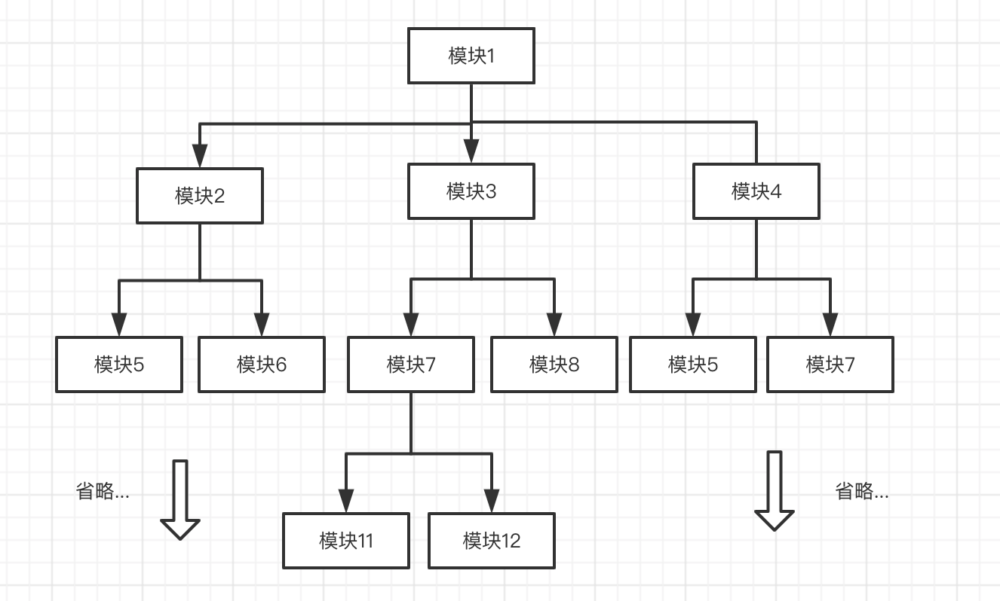
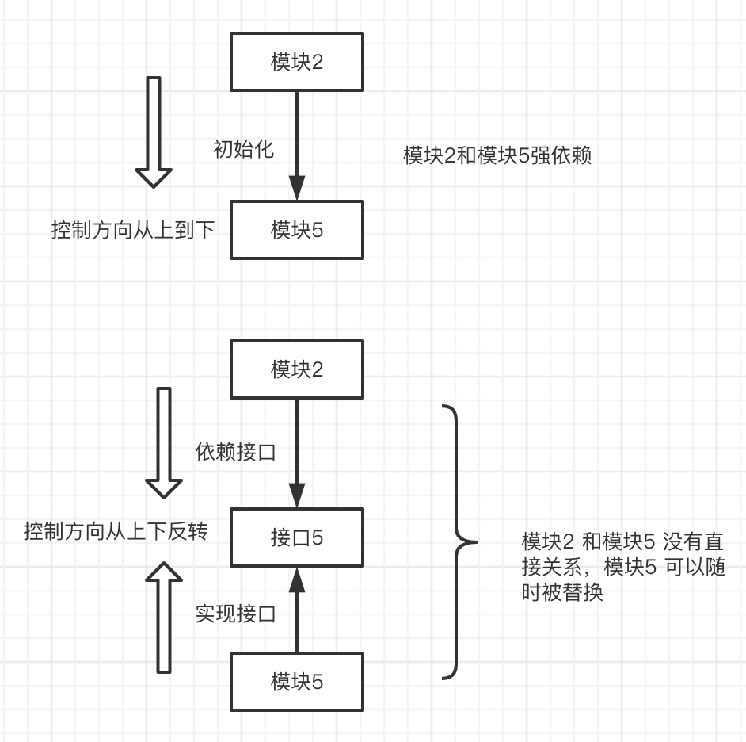

### 隐藏具体实现
上次（[链接：vscode 初探](https://imwangfu.com/blog/vscode-intro-1.html)）我们对 vscode 的基本结构和主要模块的作用进行了分析，如果有同学看过它的源码，会发现想要定位到某个模块的具体实现是不容易的。这是因为 vscode  采用了一种低耦合的模块架构，即在具体编写某个类的过程中，你所依赖的类被有意隐藏了。从架构师的角度，希望每个开发者专注自己负责的模块，不应该关心和了解其他人写好的模块（降低心智成本），但是如果你的模块对另外一个同学有依赖，应该怎么办呢？答案是通过接口提供，这也是面向对象编程的核心，模块依赖接口，屏蔽具体实现。这样的好处是模块与模块之间低耦合。

这样讲比较抽象，我们举个例子，你编写的模块A依赖小明同学写的一个打印功能模块B，而架构师说，你不能直接调用它的代码，必须让小明实现接口 P，你再引入接口 P 即可。然后架构师再让代码运行的时候，小明的打印代码会自动被调用。

后面小明负责的那个打印机被淘汰了，让小王负责实现某个新种类的打印机功能模块 C。你想找小王对接，架构师说，不要找他沟通了，小王的打印模块实现我们之前约定的接口 P 即可，你的代码不用做任何调整，系统会自动在运行时调用小王写的模块 C。

接口 P 的实现可以是 B，也可以是 C，这种表现也叫多态（面向对象中的子类多态）。在大部分语言，比如 c#、java等都提供了这样的概念，有的叫接口、有的叫抽象类。这种用于屏蔽具体实现的概念，在前端开发领域又叫“鸭子类型”，熟悉 vscode 的前提是一定要具备面向对象思维。

### 如何维护海量模块

在 vscode 源码中，模块的数量是成千上万。在多人协作和反复迭代的过程中，vscode 团队如何有效的管理这些对象？答案是 DI（依赖注入），理解它是深入 ```vscode 的核心```。Java Spring 、 Angular 框架有类似的概念， 但在大部分前端开发中不常见。所以在正式接触 vscode 自身实现的 DI 之前，我们循序渐进的介绍下为什么会需要 DI，它解决了什么痛点，做了哪些事情。

我们举个简单例子，实际情况会更复杂复。以下class 代表一个类, 大部分场景也能叫模块，类初始化后我们叫的实例、或者对象，后面这些名词会不加区分。
案例：
class1 依赖 : 2, 3, 4
class2 依赖 : 5, 6,
class3 依赖 : 7, 8
class4 依赖 : 5，7
class7 依赖：11， 12
calss6 依赖： ...

以此类推，在系统中，模块依赖的层级会非常深。



我们给上面这个模型进行编码（伪代码）

``` typescript
// class1依赖 2，3，4
import Class5 from Class5
import Class7 from Class7
import Class2 from Class2
import Class3 from Class3
import Class4 from Class4
class Class1 {
    constructor() {
		// commom start 共同依赖
    this.instance5 = new Class5();
    this.instance7 = new Class7();
    // commom send

    this.instance2 = new Class2(this.instance5);
    this.instance3 = new Class3(this.instance7);

    this.instance4 = new Class4(this.instance5， this.instance7)

	}
}

// class2依赖 5, 6
import Class8 from Class6
class Class2 {
  constructor(instance5) {
    this.instance5 = instance5;
    this.instance6 = new Class6();
	}
}
// class3依赖 7, 8
import Class8 from Class8
class Class3 {
  constructor(instance7) {
    this.instance7 = instance7;
    this.instance8 = new Class8();
  }
}

// class 4 依赖 5，7
import Class5 from Class5
import Class7 from Class7

class Class4 {
  constructor() {
    this.instance7 = new Class5();
    this.instance8 = new Class7();
  }
}

//  class 7 依赖 11，12
import Class11 from Class11
import Class12 from Class12
class Class7 {
  constructor() {
    this.instance11 = new Class11();
    this.instance12 = new Class12();
  }
}

```

通常简单的场景，我们会直接在类内部 new 一个类，作为依赖挂载在属性成员下。

``` typescript

class Class7 {
  constructor() {
    this.instance11 = new Class11();
    // ...参考上面代码
  }
}
```

如上，我们在 class7 中 new Class11，它们的关系是强依赖，即 class 7 在内部引用 class 11 的源代码，同时控制 class 11 的初始化过程。这种依赖会随着迭代变得不可维护，比如某一天 Class11 实现改变了， Class11  需要被替换成其他类，我们仍然需要到 class 7和其他类似的模块中进行修改。

#### 共同依赖

假设如上 instance11 需要同时被其他 classX 所需要呢？我们可以把创建好的 instance11 分别作为参数传给多个被依赖的 class X。


``` typescript
class Class1 {
  /**
    共用依赖 5
    class 2 -> instance5
    class 4 -> instance5
    共用依赖 7
    class 3 -> instance7
    class 4 -> instance7
  */
  constructor() {
    // 在外部初始化
    // commom start 共同依赖
    this.instance5 = new Class5();
    this.instance7 = new Class7();
    // commom send

    this.instance2 = new Class2(this.instance5);
    this.instance3 = new Class3(this.instance7);

    this.instance4 = new Class4(this.instance5， this.instance7)

  }
}
```

在上面伪代码中，instance5 和 instance7 分别是被两个类 class2、3 所依赖的实例，于是，我们找到 class 2 和 class 3 共同向上依赖的类 class1，即在外部提前初始化 instance5，instance7，作为参数传递给 class 2 和 class3下去。


这样你会发现，随着应用的复杂化，会需要小心翼翼，我创建的某个类所依赖的这些实例，它们能否直接在 class 构造函数中直接 new 出来？如果同时被其他类依赖，那我需要去哪里找到这些类呢，又应该在哪写地方初始化这些实例？

#### 循环依赖

另外在依赖逐渐增加的过程，循环依赖的问题非常容易出现。class 2 依赖 class 7, 而 class 7 依赖 class 11 。假设有一个开发在 class 11 中依赖了 class 2 ，那么就成了依赖循环依赖。循环依赖会如果在构建过程没有检测出来，程序运行的时候，会出现引用为空的等bug。


可以想象，在 N * M 依赖复杂的应用中，纯靠开发手工维护类之间的关系，成本非常大，在成千上万个模块中，每个人只编写其中一小模块，在不了解全面的情况下，稍微不小心改动一个点，非常引发灾难性雪崩，而这样的强依赖关系，后期基本无法维护。


#### 解除源码依赖

为了让每个类不依赖其他类的源代码，我们可以把全部实例的初始化放在类的外部进行，就像处理共同依赖那样。比如某个入口函数，主类等。在上面例子中，我们可以这样调整。

 ``` typescript

class Class1 {
  constructor() {
    // 在入口函数全部初始化
    // 需要按先后顺序声明上、中下层的依赖
    this.instance11 = new Class11();
    this.instance12 = new Class12();
    this.instance5 = new Class5();
    // 直接把依赖的示例传入
    this.instance7 = new Class7(this.instance11, this.instance12);


    this.instance2 = new Class2(this.instance5);
    this.instance3 = new Class3(this.instance7);

    this.instance4 = new Class4(this.instance5， this.instance7)

  }
}
// 其他类代码略...
// 每个类可以不需要源码级别的引入依赖 比如 import 语句

 ```

 在最外层初始化依赖的好处是，原本需要通过 import(include/useing)等声明，把依赖进行源码级别的引入，现在变成了，把依赖变成运行时的实例作为参数传入。


现在，我们有了更进一步的维护性、对于每个模块的使用者，再也不用关系依赖模块的源码在哪里。而是接受参数，直接使用即可。

但这种情况还是有一个问题：对于在外层负责初始化模块的同学，他必须要了解整个项目全部模块的细节，分析依赖先后关系，然后在合适的地方创建好它。这是一个不小的体力活，并且容易出错，面对循环依赖等问题也需要仔细排查，每次代码变更少不了这位“大神”的参与，发现有不符合要求的模块，让负责人进行修改。假设某天这位“大神”休假了，那项目可能就非常糟糕。

#### 依赖注入

这样一种工作能不能自动化完成呢？

DI（依赖注入） 框架就是专门做这样一件事的。

也就是说，在大型项目中，我们需要有这样一种机制：
1、模块与模块之间的无源码依赖（这里的模块主要指类）

2、只依赖接口/抽象，不依赖具体实现

3、模块的创建，循环引用、错误等可以自动被捕捉到




最终，我们可以看到的如上图的效果，原本 Class2 对 Class 5 源码级别的依赖。变成 Class2 依赖 InterfaceClass5， 而 Class 5 负责实现 InterfaceClass5 接口即可。这样的一种关系/原则，我们叫做依赖反转（DI只是一种具体实现），可以看到  Class2 向下直接控制 Class5 的方向，变成了 Class5 实现 InterfaceClass5 接口，接口是中间桥梁，Class2 和 class 5 在方向是相反的。（这样讲不知道通俗否，可以结合上面的图片箭头方向理解）

下面是最终代码示例：

``` typescript

class Class2 {
  constructor(@aotuInject priinstance5: InterfaceClass5, @aotuInject instance6: InterfaceClass6) {
    this.instance5 = instance5;
    this.instance6 = instance6;
  }
}
```


Class 2 只需要关心 InterfaceClass5 暴露了什么接口，而具体的实现却被刻意屏蔽了。这个过程由 DI 框架自动负责。


### 结
到这里，我们简单的说明了通过接口抽象、多态等思维在 vscode 设计过程的重要性，它是可维护性的前提。 再通过一个例子介绍了依赖注入能够解决什么问题，需要做什么事情。下面一步，我会把 vscode 中对 DI 的实现详情介绍下。提前预告（剧透）下，利用 typescipt 装饰器，及接口名和装饰描述符保持一致的巧妙设计，非常惊艳，源码在几百行左右。


