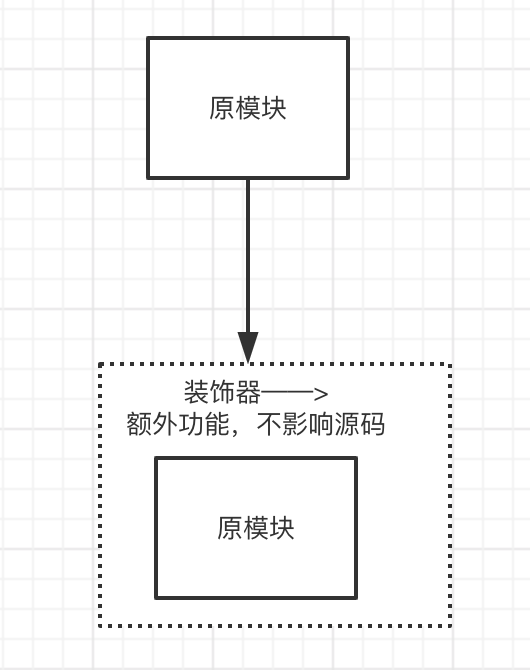
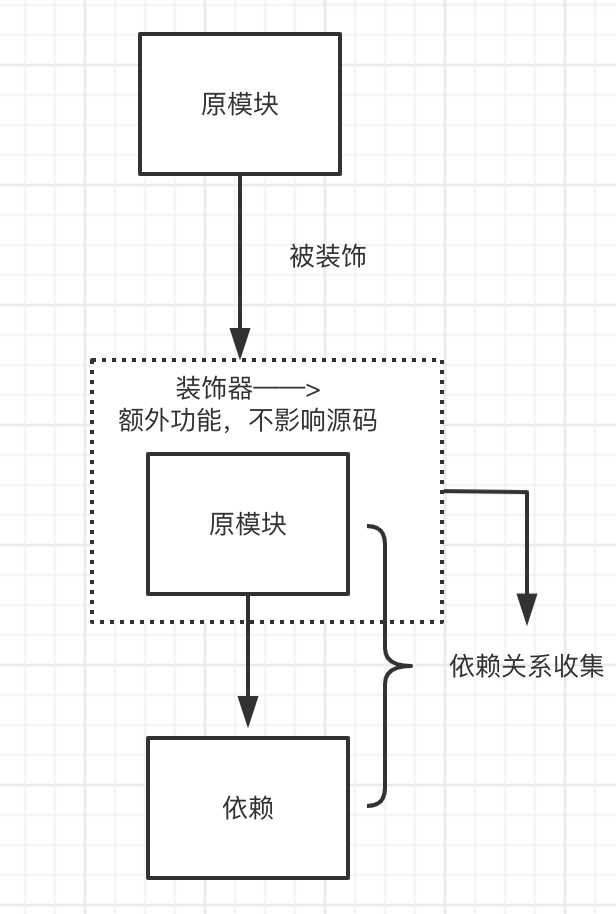
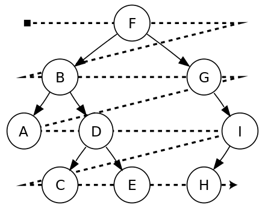
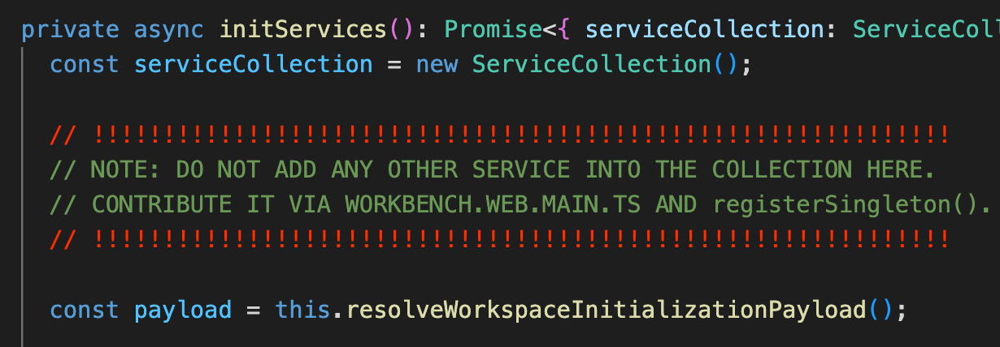

## 前言
[上次](https://imwangfu.com/blog/vscode-di1.html)我们解释了 vscode 这种大型项目设计依赖注入管理海量的模块有什么好处。也提到了 DI 必须有这样一种机制：

1、模块与模块之间的无源码依赖（这里的模块主要指类）

2、只依赖接口/抽象，不依赖具体实现

3、模块的创建，循环引用、错误等可以自动被捕捉到

那么这样的一种机制如何实现呢？ 我们先展示一下 vscode 源码的经典片段

```typescript
// mian.ts
//独立的 app 初始化阶段的文件中
let collection = new ServiceCollection();
let service = new InstantiationService(collection);
collection.set(IService1, new Service1());

// IService1.ts
// 独立的接口文件

let IService1 = createDecorator<IService1>("service1");
interface IService1 {
	readonly _serviceBrand: undefined;
	c: number;
}

// Service1.ts
// Service1 是对 IService1 接口的具体实现
class Service1 implements IService1 {
	declare readonly _serviceBrand: undefined;
	c = 1;
}

// Service1Consumer.ts
// 依赖 IService1 接口的模块

class Service1Consumer {
	constructor(@IService1 service1: IService1) {
		assert.ok(service1);
		assert.equal(service1.c, 1);
	}
}
```

## 装饰器

从上面我们可以看到 Service1Consumer 模块 对 IService1 接口有依赖，通过 @IService1[第一个] 装饰器修饰 service1 ，参数类型也叫 IService1[第二个]。这里的两个 IService1 是同名，但功能不一样的标识，可以想象为函数重载（实际上一个是函数，一个是接口）。为什么要把装饰器和接口名定义成一样的，这里是 vscode 的特别设计，下面再讲。

大部分前端开发都接触过 typescript ，但不一定深入使用过，我先简单介绍下装饰器语法。ts 的装饰器和其他语言类似，比如 python 里面也有。装饰器是给类的声明及成员上通过元编程语法添加标注提供了一种方式。
在 ts 里面有类装饰器、函数装饰器、访问器装饰器、属性装饰器、参数装饰器。vscode 的依赖注入借助的正是参数装饰器。

[参数装饰器](https://www.tslang.cn../handbook/decorators.html)声明在一个参数声明之前（紧靠着参数声明）。 参数装饰器应用于类构造函数或方法声明。

参数装饰器表达式会在运行时当作函数被调用，传入下列 3 个参数：

1. 对于静态成员来说是类的构造函数，对于实例成员是类的原型对象。
2. 成员的名字。
3. 参数在函数参数列表中的索引。

注意   参数装饰器只能用来监视一个方法的参数是否被传入。

在上面 Service1Consumer 声明的时候，装饰器会先被调用，传人参数第一个 Service1Consumer 类的构造函数，第二个 undfined(这里没有成员名字), 第三个 0 参数的索引。

本质上，装饰器是一种不改变原模块的情况下，给对象增加新的功能。vscode 利用这个特性在构造函数中进行标注，触发依赖收集。



## 依赖注入的具体实现

好了，让我们开始实现一个简单依赖注入模型。主要三个过程，依赖收集，依赖储存，最后依赖消费——即自动注入依赖的环节。


#### 依赖储存

为了有一个合适的地方储存收集的依赖，我们必须有储存器 ServiceCollection （在这个源码同名文件中），作为依赖的作用范围， 它的功能很简单，提供一个 Map 字段，添加 set、get、has 三个方法，分别表示设置，获取，是否包含。

```typescript
class ServiceCollection {
	// ...
	constructor(...entries: [ServiceIdentifier<any>, any][]) {
		for (let [id, service] of entries) {
			this.set(id, service);
		}
	}

	set<T>(
		id: ServiceIdentifier<T>,
		instanceOrDescriptor: T | SyncDescriptor<T>
	): T | SyncDescriptor<T> {
		// ...
	}

	has(id: ServiceIdentifier<any>): boolean {
		// ...
	}

	get<T>(id: ServiceIdentifier<T>): T | SyncDescriptor<T> {
		// ...
	}
}
```

如下，储存器只负责接收一对 key、value，分别是 id 标识符和一个具体的依赖 service 。

```typescript

let collection = new ServiceCollection();
// 把依赖初始化提前存起来
collection.set(IService1, new Service1());
let service = new InstantiationService(collection);
// 消费依赖
service.createInstance(Service1Consumer);
```

储存器会一般会在整个应用的关键初始化阶段将依赖添加进去。如果有多个应用上下文，可以创建多个储存器。

#### 收集依赖
依赖在被其他模块消费的时候，它们之间的依赖关系如何创建的呢？


这里装饰器起到桥梁的作用，我们看下详细步骤：

1. 先定义装饰描述符
   `let IService1 = createDecorator<IService1>('service1');`

createDecorator 的功能是传入一个 class 的字符标记，这个字符串是对应唯一类名。

```typescript
export function createDecorator<T>(serviceId: string): ServiceIdentifier<T> {
	if (_util.serviceIds.has(serviceId)) {
		return _util.serviceIds.get(serviceId)!;
	}
  // 返回装饰器
	const id = <any>function (target: Function, key: string, index: number): any {
		if (arguments.length !== 3) {
			throw new Error(
				"@IServiceName-decorator can only be used to decorate a parameter"
			);
		}
		storeServiceDependency(id, target, index, false);
	};
  // serviceId 作为 key 记录下来
	id.toString = () => serviceId;

	_util.serviceIds.set(serviceId, id);
  // 这个 id 返回不会被销毁，因为被 storeServiceDependency 引用了
	return id;
}
```

然后把这个唯一类名作为返回函数的属性通过 toString 记录起来，这个返回函数正式装饰器函数，它接受三个参数。上面的代码利用了 js 的闭包特性，id 是返回给 IService1 的装饰器函数，同时作为它自身内部调用 storeServiceDependency 的一个参数，这个函数调用完毕不会被销毁，而是仍然储存在函数栈中，闭包的基础知识不多做解释。

得到装饰器方法后，它会在哪里被使用呢，哪个模块依赖于 IService1 这个接口（同名接口），那么就在这个模块的构造函数参数中用装饰器符号 @IService1 修饰参数。

1. 声明类和调用装饰器

```typescript
class Service1Consumer {
	constructor(@IService1 service1: IService1) {
		assert.ok(service1);
		assert.equal(service1.c, 1);
	}
}
```


我们看到，现在 Service1Consumer 被声明，装饰器会提前被自动调用。它的 第一个参数 targe 为 Service1Consumer 自身，而它的最后一个参数是参数 service1 的索引。

我们视线转移装饰器方法本身，刚刚讲到 id 被作为闭包变量仍然储存在函数中，装饰器运行的时候 storeServiceDependency 方法负责收集依赖，id 包含 toString 记录的依赖类名，而 target 记录了被依赖的类，index 是作为 targe 类的索引.
``` typescript
// 详细逻辑参考第一步，id 从闭包中获取
storeServiceDependency(id, target, index, false);
```


最终，我们得到了 service1 和 Service1Consumer 的依赖关系映射。

`Service1Consumer.$dependes=id['serviceId']`

到这里，我们已经知道模块的依赖关系是如何被 DI 发现的了，回到最开始埋的疑问，为什么装饰器和接口的使用同名字符 IService1 ？ 这是一种有意巧妙设计，对于接口的设计者来说，需要定义一个接口文件，同时定义这个接口装饰器，默认情况保持一致。

```typescript
export let IService1 = createDecorator<IService1>("service1");
export interface IService1 {
	readonly _serviceBrand: undefined;
	c: number;
}
```

接口的定义只有一个，但有些时候，具体的实现可能有很多。也就是说，我们定义好了接口，可以提供多份具体实现。接口文件默认返回一个同名装饰器，通常这个接口和具体实现是唯一的。对于调用方来说，它只需要定义构造函数的类型为指定接口名，用装饰器装饰参数，指定自动注入的模块，而这个模块正是 `createDecorator<IService1>('service1')` 所标识的内容`service1`，也是通过它自动缓存了依赖关系，默认保持装饰器与接口同名，对调用者，进一步屏蔽了这层背后实现，保持简单透明。vscode 全部模块设计都采用了这样一种方法。


```typescript
// 小王的实现方案1【默认】
export let IService1 = createDecorator<IService1>("service1");
// 小明的另一种实现方案
export let IService2 = createDecorator<IService1>("service2");
// 小华的另一种实现方案
export let IService3 = createDecorator<IService1>("service3");
export interface IService1 {
	readonly _serviceBrand: undefined;
	c: number;
}
```

#### 消费实例
现在，我们已经有被提前储存好的依赖实例，也建立了模块消费者和依赖之间的关系。最后一步就是创建消费者实例。


```typescript
	private _createInstance<T>(ctor: any, args: any[] = [], _trace: Trace): T {

		// 从依赖收集缓存中获取依赖标识
		let serviceDependencies = _util.getServiceDependencies(ctor).sort((a, b) => a.index - b.index);
		let serviceArgs: any[] = [];
		for (const dependency of serviceDependencies) {
			// 通过标识拿到依赖实例
			let service = this._getOrCreateServiceInstance(dependency.id, _trace);
			// ..
			serviceArgs.push(service);
		}
	  // 略 ...

		// 把依赖的示例和参数传进去，然后 new 一个构造函数
		return <T>new ctor(...[...args, ...serviceArgs]);
	}

```

示例的消费有两种方式，第一是调用 createInstance 创建，它会从缓存的依赖关系中找出依赖，再根据储存器中的 key、value 拿到实例对象，作为传给类的构造函数。另外一种下面讨论。

```typescript
/
let collection = new ServiceCollection();
// 把依赖初始化提前存起来
collection.set(IService1, new Service1());
let service = new InstantiationService(collection);
// 消费依赖
service.createInstance(Service1Consumer);
class Service1Consumer {
	constructor(@IService1 service1: IService1) {
    // 依赖被注入
		assert.ok(service1);
		assert.equal(service1.c, 1);
	}
}
```


到这里，我们已经把一个简单的 DI 注入模型进行了实现，通过装饰器建立依赖关系，然后实例化 class 的时候根据依赖标识别从储存器中取依赖注入进去。


## 通过描述符创建（延迟创建）

上面的模型仍然比较简单，依赖被创建，并储存起来的时候，会提前消耗大量内存。真实的场景是希望依赖在真正需要的时候才被自动创建，而非提前实例化。

```typescript
let collection = new ServiceCollection();
let service = new InstantiationService(collection);
// Service1 只是一个类描述符，对象并没有被创建
collection.set(IService1, new SyncDescriptor<IService1>(Service1));
// IDependentService 也是一个类名，它依赖 Service1
collection.set(
	IDependentService,
	new SyncDescriptor<IDependentService>(DependentService)
);

service.invokeFunction((accessor) => {
	// 这里可以取到实例化的对象
	let d = accessor.get(IDependentService);
	assert.ok(d);
	assert.equal(d.name, "farboo");
});
```

如上代码示例，我们的类没有被实例化，而是作为描述符添加到储存器中，这个过程并不会有额外对象创建的内存消耗。在需要的时候，我们再通过 `invokeFunction` 拿到实例化的对象。

期间 IDependentService 对 IService1 有依赖，或者进一步，IService1 也可能有其他更深的依赖，我们希望在调用过程，这些没有被提前实例化的依赖，能过被自动创建出来，然后返回给消费者。这个过程是如何进行的呢？


#### 依赖分析

模块依赖本质上是一颗依赖树，我们可根据模块 F 对其依赖及其子依赖，做一个[广度优先遍历](https://zh.m.wikipedia.org/zh-hans/%E6%A0%91%E7%9A%84%E9%81%8D%E5%8E%86)。



F 模块依赖 B、G 模块，B 模块依赖 A、D 模块以此类推，把遍历出来的模块作为一个节点储存在依赖树之中。

```typescript
const stack = [{ id, desc, _trace }];
// 广度优先遍历
  while (stack.length) {
  // 从最近的依赖节点开始
  const item = stack.pop()!;
  graph.lookupOrInsertNode(item);

  // 依赖深度的上限
  if (cycleCount++ > 1000) {
    throw new CyclicDependencyError(graph);
  }

  // 获取子依赖
  for (let dependency of _util.getServiceDependencies(item.desc.ctor)) {
    let instanceOrDesc = this._getServiceInstanceOrDescriptor(dependency.id);
      const d = {
        id: dependency.id,
        desc: instanceOrDesc,
        _trace: item._trace.branch(dependency.id, true),
      };
      // 储存依赖关系
      graph.insertEdge(item, d);
      // 继续入栈遍历
      stack.push(d);
  }
}
```
上面是简化版的依赖遍历源码，可以结合我写的注释阅读。
#### 依赖创建
拿到依赖关系后，下一步就是按顺序逐个创建依赖，依赖创建的顺序应该是怎么样的呢？自然是要从最末端的叶子节点开始。


因为我们的依赖方向是从上到下，不能循环依赖的，可以先把依赖树转化成一个有序数组，每个数组节点包含 from  和 to，即父节点和子节点的意思。

遍历转换后的有序数组，拿到子节点为 null 的依赖进行优先实例化。


实例化结束后，再从有序数组中删除节点即可。如此反复上面的逻辑，最后直到节点为空，则返回函数。

``` typescript
function () create {
while (true) {
  // 拿到叶子节点
  const roots = graph.roots();
   // 循环依赖检测
  if (roots.length === 0) {
    if (!graph.isEmpty()) {
      throw new CyclicDependencyError(graph);
    }
    break;
  }
  // 创建依赖
  for (const { data } of roots) {

    const instanceOrDesc = this._getServiceInstanceOrDescriptor(data.id);

      // 添加到依赖收集器中
      const instance = this._createServiceInstanceWithOwner(data.id, data.desc.ctor, data.desc.staticArguments, data.desc.supportsDelayedInstantiation, data._trace);
      this._setServiceInstance(data.id, instance);
    // 删除节点
    graph.removeNode(data);
  }
}
return <T>this._getServiceInstanceOrDescriptor(id);
}
```

#### 循环依赖检测

循环依赖的检测实际上在两个地方有处理，第一是上面依赖分析的过程，如果两个依赖是循环的，依赖树会进入无限深度，而依赖深度的上限 为 1000，这种情况会抛出错误，但也可能是应用过于复杂依赖层级达到 1000，错误也会被抛出。

``` typescript
// 参考上面更详细的上下文
 if (cycleCount++ > 1000) {
    throw new CyclicDependencyError(graph);
  }
```

另外一处是依赖创建过程，依赖的叶子节点已经为空，但有序数组中却还有模块的情况：

``` typescript

if (roots.length === 0) {
    if (!graph.isEmpty()) {
      throw new CyclicDependencyError(graph);
    }
    break;
  }

```

理论上，依赖分析阶段只要判定循环引用，已经抛出错误，此处就不可能会被执行，这里额外的检测看上去有点多余。

循环遍历依赖创建对象后，之后的逻辑和前面实例注入类似。


## 其他


#### 单例

vscode 中大量模块是已单例形式创建的， 在入口文件中可以看到。

``` typescript
/// src/vs/workbench/workbench.web.main.ts
registerSingleton(IWorkbenchExtensioManagementService, ExtensionManagementService);
registerSingleton(IAccessibilityService, AccessibilityService, true);
registerSingleton(IContextMenuService, ContextMenuService);
registerSingleton(ITunnelService, TunnelService, true);
registerSingleton(ILoggerService, FileLoggerService);
registerSingleton(IUserDataSyncLogService, UserDataSyncLogService);
registerSingleton(IUserDataSyncStoreService, UserDataSyncStoreService);

```

单例可以理解为全局只初始化一次，vscode 大部分模块，比如日志、标题栏等模块会放置在此。实现方式很简单，在入口把依赖全部 import 进来，然后注册到单例数组，最后在 workbenk 模块工作台中用 getSingletonServiceDescriptors 取出全部注册进依赖储存器中。单例通过描述符注册，所以也是调用时才会被创建。

``` typescript
// 单例对象存放
const _registry = [];
  export function registerSingleton<T, Services extends BrandedService[]>(id: ServiceIdentifier<T>, ctorOrDescriptor: { new(...services: Services): T } | SyncDescriptor<any>, supportsDelayedInstantiation?: boolean): void {
  // 通过描述符创建
  if (!(ctorOrDescriptor instanceof SyncDescriptor)) {
    ctorOrDescriptor = new SyncDescriptor<T>(ctorOrDescriptor as new (...args: any[]) => T, [], supportsDelayedInstantiation);
  }

  _registry.push([id, ctorOrDescriptor]);
  }

// 导出依赖
export function getSingletonServiceDescriptors(): [ServiceIdentifier<any>, SyncDescriptor<any>][] {
  return _registry;
}


/// 文件 src/vs/workbench/browser/workbench.ts
// 全部的单例模块被添加进依赖储存器
const contributedServices = getSingletonServiceDescriptors();
for (let [id, descriptor] of contributedServices) {
  serviceCollection.set(id, descriptor);
}


```
vscode 除了核心模块和不能延迟创建模块，内部扩展组建几乎都是以单例的形式注册的。这是 源码中一个醒目的注释，提醒开发者不要在这里注册依赖。



#### createChild 派生实例

``` typescript

let service = new InstantiationService(new ServiceCollection([IService1, new SyncDescriptor(CtorCounter)]));
service.createInstance(Service1Consumer);


let child = service.createChild(new ServiceCollection([IService2, new Service2()]));
child.createInstance(Service1Consumer);

```

模块中如果想独立于默认依赖的作用范围，可以通过用 createChild 去创建。它仅仅是返回一个新 InstantiationService 实例。

## 结

vscode di 模块的分析就到这里了，主要包括：提前储存依赖，声明装饰器建立依赖关系，最后通过广度优先遍历收集 Descriptor 子依赖，保存到树结构中，循环把对象创建出来，注入到被依赖的模块之中。


