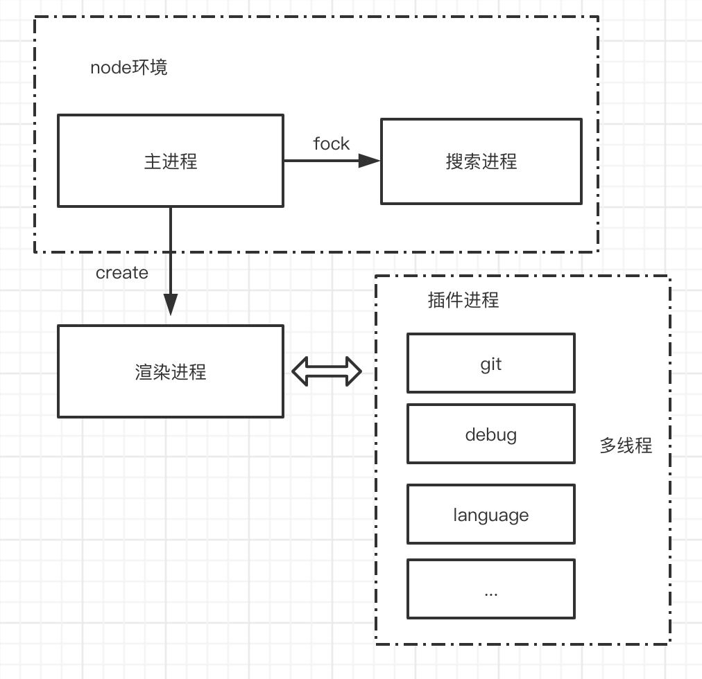
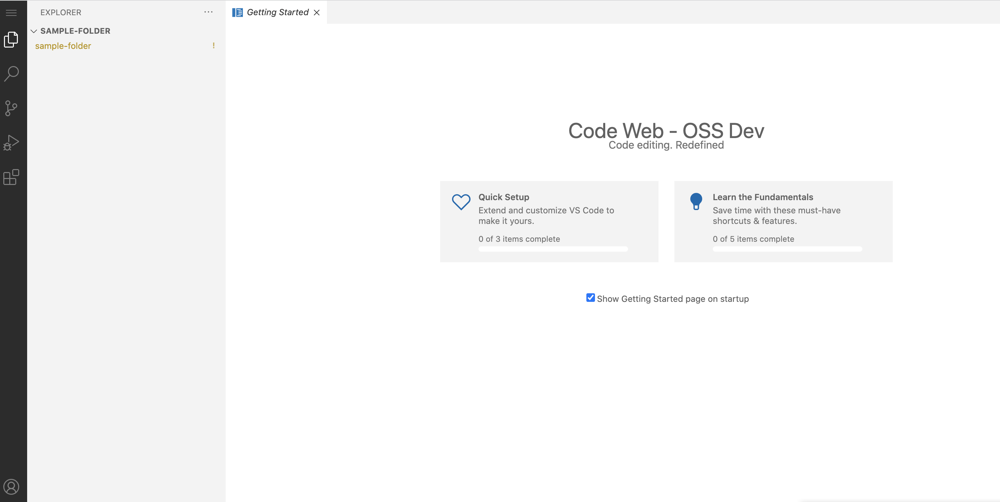
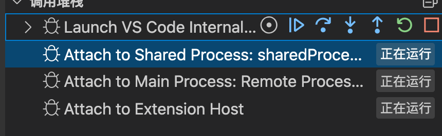

<!--more-->
## 为什么要研究 vscode

vscode 是一款优秀的开源编辑器，从代码复杂度和架构层面，无疑是 web 前端领域最值得学习和研究的目标之一。通过开源代码，我们可以看到，如何组织超过百万行的代码量，保证开发效率和可扩展性。


先简单介绍下这个团队的背景，vscode 的总负责人兼设计师 Erich Gamma, 是《设计模式：可服用面向对象软件基础》的四人帮之一，这本书也奠定了目前我们看到的各种设计模式的理论基础。此外、Erich Gamma还参与设计了 Eclipse，同时开发了 Java 界最著名的单元测试框架 Junit。除了负责人外，其他核心成员在 IBM 一起过去的，有着丰富的编辑器经验，平均年龄大于40，而新加入的成员，大部分是开源社区知名插件高手，比如Gitlengs、Vetur 作者等。

我们有理由相信能够从 vscode 源码中取得丰富的宝藏。


## 多进程架构

为进行跨平台兼容 mac/linux/window，vscode 采用 electorn + web 的技术。从性能角度出发、传统复杂的跨平台客户端，要么是基于 C++ 自研 UI 框架、要么是是基于 C++ Qt框架。vscode 为什么要选择 web 技术实现整个编辑器，我只能从以下几个角度进行推测： Erich 最早到微软的首要任务是设计出一款基于浏览器的在线 Monco Editor, 以便可以方便的集成在 Azure DevOps 等微软其他内部产品，而 Monco 本身设计足够优秀，基于它进行扩展成更复杂的编辑器，可以延续原有经验。 另外一方面，云编辑器是一个趋势，采用 web 架构，可以更好的适应未来的这种云端化（远程 vscode 真的很香）。

### 多进程+多线程

vscode 客户端的主进程是基于 electorn 的宿主环境、搜索模块是 从主进程中创建的node 子进程。整个编辑器视图跑在 electron 提供的 render 进程，渲染层相当于浏览器的 webview。



众所周知，vscode 最为强大最早的是它基于 web 的插件生态。事实上，通过插件扩展编辑器是很常见的做法，曾经流行的开源 ide  eclipse ，也是依靠强大的插件体系而闻名，但 eclipse 最严重的问题之一就是大量第三方插件让 ide 本身变得臃肿不堪。同样 github 官方基于 electron 开发 atom 编辑器，在插件架构下具备强大的自定义能力，插件开发者甚至可以自由修改页面弹出任意内容，但插件卡顿问题一直被大量用户诟病。

我们看到，插件是一只强大的母老虎，在学会利用它的同时，要想着怎么把它关进笼子里。可能出于对曾经业界案例的种种教训，vscode 采取了一种中庸的做法，首先，把插件全部隔离在独立进程，这是保证主进程和渲染进程不被第三方扩展阻塞。另一方面，对插件进程的的行为进行全面抽象，提供主要而可控的 API。atom 的一个设计失败之处就是赋予扩展太大的权利，而 vscode 团队基于它丰富的编辑器开发经验，做了取舍，把对语言的处理、数据的处理当作首要能力、而无关的界面 UI 扩展限制非常严格，因此， vscode 的侧边扩展位 UI 是不能调整的。

vscode 的插件全部约束在了 worker 中，通过多线程的方式执行插件逻辑。这种架构的好处是减少了第三方插件导致的编辑器卡顿。

## 开发与调试

### 快速开发

大部分代码开源，仅仅是把内网的仓库临时备份一份上传到 github。但 vscode 开源的不仅仅是代码，备受业界好评的一点是整个团队直接把对 vscode 的全流程开发通过 github 管理，从需求收集、到 issue 跟进、项目进度管理全部在一个开源、开放式的平台，人人都能参与。介绍这些是为了说明，如果你对大型开源项目的协作感兴趣，完全可以去 github 看下，微软是怎么管理的。

首先克隆整个仓库：

``` bash
 git clone https://github.com/microsoft/vscode.git 
```

然后安装依赖

`yarn` 需要注意，通过 npm i 安装会被 vscode  禁用掉，我们必须先安装 yarn，然后再用 yarn 去安装依赖。

``` bash
npm yarn -g 
yarn
```


#### 启动 web 版本 vscode :

``` bash
yarn web
```

之后会自动构建 vscode 源码，然后自动启用开发端口，打开一个默认浏览器。

正常的话，会看到浏览器打开以下页面：



需要注意的一个坑是：由于打开 web 调试页面，vscode 会首先请求远程的一个地址加载内容，将返回的内容会被当作模拟本地文件。如果你的网络不通，或者没有科学上网的姿势，会一直空白状态。

解决的方案是，启动时在终端挂上代理:

``` bash
export http_proxy=http://127.0.0.1:xxxx
```

对于经常需要参与 github 开源项目的同学，建议首选用代理，不然调适这种类似的开源项目遇到问题会踩坑。

另外一种临时方案，仅仅专门针对目前版本的 vscode 的代码修改其源码。在以下文件是 vscode 获取调适模拟文件的逻辑。
node_modules/gulp-remote-retry-src/index.js，其中 conent 就是从远端加载的数据，你可以把以下的代码 content 变量修改成自己的内容。注释掉远端加载的逻相关辑，即可不用访问外网进行调试。

 ``` javascript
 var file = new File({
	cwd: "/",
	base: options.base,
	path: url,
	contents: new Buffer(JSON.stringify(body)),
});
cb(null, file);
 ```

#### 启动桌面端 vscode

``` bash
 ./scripts/code.sh
```

我们可以用 vscode 去调试 vscode (禁止套娃～)，单击 vscode 的调试按钮，会看到有多个进程的断点调用堆栈。



在调试开发 vscode 之前，我们要理解上面提到的多线程架构，并且知道 vscode 整体文件结构及各个模块的功能，下面是我做的一些梳理。

## 文件结构：

### 基础结构：
vscode 整体代码分为公用、依赖注入服务、独立编辑器内核、工作台，模块异常之多，其模块管理的核心是通过 typescript 装饰器模式实现依赖注入，有机会再具体介绍，对这个概念不熟悉的同学，可以提前了解下相关知识，有助于加深对 vscode 架构的理解。

- base : 提供通用的对象实体和最基础用户界面的 UI  模块
- platform: 为 vscode 定义 service 注入支持（依赖注入封装）和基础 service (服务)
- editor: 独立的可用编辑器模块，可以直接打包成独立的 Monaco 编辑器被外部使用
- workbench: 工作台，可以理解为给基础的 Monaco 编辑器提供一整套外壳框架，比如文件管理器 、状态栏、菜单栏。通过使用 Electron 给 VS Code 提供桌面软件
- code: 这里是整个 VS Code 的入口文件，包括各个平台的 html 和 main 文件


### 平台/环境层级

跨平台是 vscode 设计的特色，我们需要同时兼容浏览器、node、桌面、和沙盒环境，一个模块如果有涉及多个环境，需要进行环境的区分，通过文件夹命名规范进行约束，以下是vscode 环境区分和调用规则：

- common: 这里的源代码只能是基本的 javascript API，可以运行在任何环境下。
  - 可被任何环境依赖
- browser: 这个目录下的 代码可以访问浏览器 API, 比如 DOM
  - 可以依赖环境： common


- node: 调用 nodejs 的APIs 逻辑
  - 可以依赖的环境： common

- electron-sandbox: 能在 electron 沙箱运行的代码，遵循沙箱规则，可以访问 DOM  和部分主进行的 API（按进程通信规范）
  - 可依赖的环境： common, browser

- electron-browser:  能调用 Electron renderer-process 渲染进程 api。
  - 可依赖的模块: common, browser, node
- electron-main: 能调用Electron 主进程 api
  - 可依赖的环境：common、node

上面的规则并没有一种强制校验手段，而是约定大于配置，模块编写的时地共识，在 vscode 注释中可以体现出来。

### 关于 monaco
我们平常所说的 monaco 和 vscode 的其实汽车与发动机的关系。 只不过这个发动机被设计得足够优秀，不仅仅可以给 vscode 使用，同样能给其它牌子的车装上。 在 vs/edit 这个目录下的代码，是可以被独立打包生一个 叫 **monaco-editor-core**  的 npm  包，而这个 包最终作为  **monaco** 的核心依赖。

monaco 被可以把这里看作一个精简版的编辑器，提供了最基础的编辑功能，对外暴露各种 API, 由具体的外部服务决定编辑器的行为，目前市面上很多代码编辑器工具就是基于 monaco。

所以 edit 路径下的代码不能加任何 vscode 专有的功能， 并且只依赖公用服务。

- vs/edit/browser： 可以访问浏览器部分的编辑器的逻辑，里面基本都是对编辑器 UI 组件行为的抽象
- vs/edit/common ：编辑器的核心抽象，符合 common 规范的，能运行在任何环境，里面有编辑器一整天行为模型，视图模型抽象。

上面两个文件基本是 Monaco 编辑器核心 Model 和 view 。
- vs/edit/contrib: 对于编辑器的基础功能，比如查找、悬浮、复制黏贴、格式化、消息等这些独立的实体封装, vscode 统一放在这个目录下。里面基本依赖 vs/edit/browser 和 vs/edit/common 的逻辑。 这些基本 contrib （扩展），是会被整个 vscode 或者独立发布的 Monaco 内置的部分。

- vs/editor/standalone 这里只是用来把核心编辑器独立打包成 Monaco 的一个壳。它不会被任何模块依赖。

### Workbench

上面我们看到了 vs/edit/ 是编辑器核心，可独立发布。但是 vscode 给我们提供的肯定需要是一个功能完整且丰富代码编辑器、应该包括文本搜索、git管理、调试、导航、菜单等功能。而 Workbench 目录下面的模块则承载了这个作用，工作台——对核心编辑器提供一整套组合的功能。另外，它对 monaco 的引用是源码级别的模块依赖，而非 npm 包, 这里可以感受到 monaco 抽象的精妙之处。

- vs//workbench/api vscode 各个运行环境的内部接口，包括主进程、插件进程接口的封装
- vs//workbench/browser vscode 浏览器环境的入口逻辑和基本视图框架定义
- vs//workbench/contrib 对于更上层的 vscode 独立的业务功能封装，vscode 把它抽象成了一个个独立扩展点（contrib），挂载在vscode 基础视图上，比如备份、日志、搜索、调试等。每一个contrib 之前是独立，不应该相互依赖的，他们共用依赖底层的 api 基本视图框架。contrib 像是 vscode 团队用自己对 IDE code 的理解，去 Monaco 的进一步强化和包装。
- vs/workbench/electron-browser electron 桌面环境的入口和基本视图定义
- vs/workbench/electron-sandbox electron 沙箱环境入口和基本视图定义
- vs/workbench/services 这里面的逻辑 vscode 纯业务功能的抽象，它和 contrib 的区别是纯、视图无关的服务。


## 感受

上面就是对 vscode 整体目录结构的一个简单分析，给我的感受差异就是 ***vscode  整体设计其实非常灵活***。

通常大型前端项目，从可维护性的角度纵向角度，会划分比较清晰的层级，并试图通过某种形式对核心模块进行隔离，以减少变化业务对稳定性的破坏。vscode 偏向横行隔离模块，这种灵活的架构可以很方便的进化和扩展，但对开发者来说要求更高，必须熟悉背后机制。


## 冰山一角

目前暂时只是对 vscode 的简单初探，可以肯定的说，我们才刚刚了解它冰山的一角，只远远的窥视其形，它的内部复杂细节，未曾剖析。比如成千上万的 service 和模块如何管理、内存如何管理、 Edit（Monaco）排版与布局设计，怎么支持任意编程语言（Language Server Protocol）的语法高亮和提示，代码调试 service 是怎么运作的 （ Debug Adapter Protocol）？主进程和插件进程通信如何设计（ICP）？大文本性能如何优化等等。期待下次继续深入了解。


