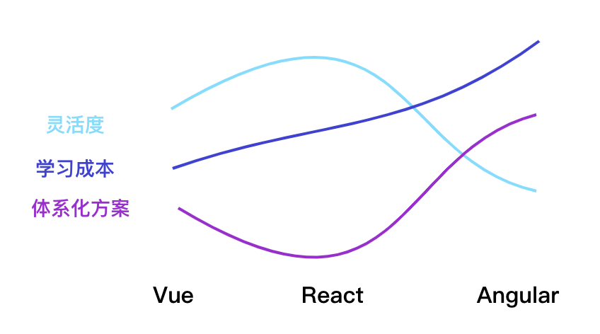

<!--more-->
vue3 的发布已经过去一段时间了，对于第三方开发者而言，其最重要的更新是性能更快、typescript 支持更友好，以及更灵活的组合式API。 

在使用任何前，我们要想清楚三个问题， 是什么（what），为什么（why）和怎么做（how）。web 开发应用框架之间的设计理念差异，将决定它的受众群体和框架的发展方向。

从整体上看，对比 Angular, Vue 更灵活和轻巧，更低的学习培训成本，大型应用与 Typescript 的整合度不如 Angular。对比 React，Vue 的灵活度不如它，但这也是 Vue 所带给人的优势，Vue 给大部分场景提供了一套自成体系的标准解决方案。

所以综上，在前端主流框架三座大山中，Vue 给人呈现出来的感觉是希望给社区提供一套 “低成本”、“灵巧”、但 “实用” 而又 “自成体系”的一整套开发解决方案，而它的开放程度在 React 和 Angular 之间。

Vue 作者在分享中提到过，Vue 3 设计目标之一是提供更多底层功能和适应大型应用的可维护性。

其中对开发者影响最重大，讨论最激烈的是组合式API。
Composition API，基于响应式函数式的 api，允许灵活地在组件之间进行逻辑组合。

不少人会在第一次接触时会容易被这些名词和概念搅浑。我简单的描述梳理下。在通常的 UI 界面开发中，往往是面向对象模型编码，比如一个应用实例作为一个类，实例中层拥有各种 app 启动、页面创建和销毁、数据更新等生命周期，业务逻辑会在这些系统提供的生命周期中进行操作数据，然后更新页面视图。一个页面可能会由多个组件组成，每个组件又都有自己的生命周期，组件之间可以相互引用。组件往往是一个由开发者去抽象的独立模块，如果用面向对象的编码方式表示，组件是一个类，类下面包含描述当前业务逻辑需要的属性，还有各种类方法。

然后在 vue 中，并没有类这个概念，组件由一个大对象组成，这个对象里面的属性会去定义类各生命周期。本质上，这个对象和类功能类似，提供数据的封装和隔离。基于对象组件的组合式开发，可以很方便解决 UI 视图的封装问题。但是有些场景，我们希望组件之间的逻辑能够公用。公用的逻辑分为两种，第一种是和组件实例属性无关的功能（比如工具函数等），这种场景我们可以通过把它提取到单独的 javascript 的模块中即可。另外一种是有状态依赖的业务功能，因为数据发生了变化，我们希望 UI 进行更新。

后面这部分功能因为和响应式状态相绑定，我们没有办法抽离到纯函数中，对于 vue 2，提供了一种解决办法：对象定义的组件也可以通过 extends/minx 继承其他“公用”组件的数据和方法。

这种方式，有两个问题：

第一、minx 可以被多重继承，而多个minx 会出现属性和方法冲突的可能（vue 的设计并没有提供一种 minx 作用域的概念）。这样就会导致编写不同 minx 的时候需要了解其他 minx ，否则容易出现数据相互覆盖现象，让你无从下手找到真正的数据更改源头。

第二、minx 本身无法支持参数传入，导致它的作用有限，这点官方文档中有讲到。

React 是怎么解决这种问题的呢？React 组件由于其 JSX 编写的灵活性，可以通过[高阶组件(Higher-Order Components)](https://react.html.cn/docs/higher-order-components.html?no-cache=1)的形式，本质上是组合模式与函数式结合的一种编码技巧，而 Vue  组件推荐的是 vue 模板文件，而非 JSX，HOC 难以进行运用（虽然官方有提供 JXS，但和 vue 生态并不合）。

HOC 虽然可以解决实例状态逻辑共享问题，但它并非天生，而是一种在一个函数内返回另一个组件的技巧，这样有个问题导致，容易导致组件嵌套层级很深。React 16 提供了一种全新的组件编写思路——React hook ，可以解决这种问题。

Vue3 组合式 API 和它本质上类似。我为什么要讲上面数据状态逻辑复用的问题呢（虽然 hook 并不全是为它服务），因为 hook 和函数的最大区别就是状态，Vue 官方提到的Composition API 设计动机：——“更好的逻辑复用和代码组织”核心就是状态抽离。

hook 是怎么实现把状态做在函数中，同时实现自动响应副作用呢？

es6 的 Proxy 特性可以提供支持（ie 11不兼容），简单来说，可以在执行的时候收集 key 作为依赖，函数作为 value 值储存在 map 中，在 set 的时候触发更新。当然，Vue 在内部实现中更复杂。具体请参考 github 和其他资料。

这样的话，我们可以在一个函数中做到状态和方法的“内聚”，同时又做到了可复用。

以上讨论聊了是什么和为什么的一些思考。这些东西在 vue 文档和 [vuejs/rfcs](https://github.com/vuejs/rfcs/) 中可以了解到更详细的。

怎么做——思考🤔？

事实上，任何一种可复用技术，如果没有被使用者合理的运用，都会导致起到相反的效果。比如 React 出来的时候，你会发现有各种项目写出庞大的不可维护的组件，Redux 出来的时候，有人 把reducer 嵌套无数层等等，这些看上去都是和框架的内容，其实是无关框架的东西。比如架构要抽象和分层，函数要职责单一，对象要依赖倒置等等。在 MVVM 类框架（react/vue）中，我见过大量混乱问题是出现在数据处理层中，框架有提供数据处理工具，却没有提供指导思想，有的会提供完整最佳实践的 demo。当然还有一些无关紧要的争执。

关于数据复用我个人的几点经验：
1、在你使用某个新东西的时候，要。（不要）

2、尽量视图无关

3、组件、函数尽可能些小，一个组件只做一件事

4、在可能的情况下，减少嵌套、不管是函数嵌套还是组件嵌套

5、数据流向要单一，数据的变化要统一，不要出现潜在多个地方可能影响一个数据（比如：缺乏管理的全局事件）。

6、状态共享很危险，最好有明确的指导路径

我一直秉持一种观点，不管各种框架和新技术如何变化、代码设计的基本思想是不会变的，它不取决于，你用原生 js、还是 JQuery，活着是 React,Vue等。框架的目的是为业务开发提供便捷，它在我们的软件只中永远只能起到工具的作用，所以核心的业务要做到和框架解耦。尽管框架总是宣称自己不仅仅是 UI层，提供了各种其他功能，我们要知道这些功能是否可以随时被替换

