chatgpt 的火爆，让 transformer 出圈，对于外行的吸引力也非常之大，很多人不希望仅仅停留在“科普”层，而是真正运行这一架构并理解其背后原理。但真正理解其背后的原理，需要整个体系的知识架构，及对神经网络基本的认知。

我们需要哪些知识呢？ 这取决于你如何学习。基于兴趣探索式学习我觉得是一种更放松和有效的方式。想象你在了解一个汽车的构造原理，化学热能转化和空气动力学等数学公式和证明肯定能帮助你设计出更好的汽车，但是从汽车的业余爱好者角度，理解发动机活塞运转基本原理、并能拆解其引擎盖和车轮，自定义 DIY 、维修、调优等是其目的。当然随着进一步深入热能效率，我们去探索更基本的动力学也是必须的，这取决于你的需求。所以我认为学习最好的方式是拆开你感兴趣的东西，并且先从整体上去理解它，然后再分别挑选感兴趣的细节。

本篇章记录整个学习和理解 transformer关键过程，方便帮助自己和后来的自学者。本篇解构的知识来源包括《人工智能-现代方法》、《BERT 基础教程》、《吴恩达机器学习》等内容，但本篇细节是纯按理解手写，可能有误，还请指正。 理解的思路是从“引擎盖出发”、“动手实践出发”拆分需要理解的内容，并逐一去解构和理解，最终形成对 transformer 的认识之道。

要从零理解 transformer ，并能解构它，首先要能理解基本的人工智能领域顶层分类，再逐步收缩和聚焦到兴趣点。文本从传统程序贯穿到 transformer，字数超 1 W，阅读时间可能会超半个小时。

## 机器学习

传统的程序是按固定条件、按步骤执行指令，这个过程和烹饪一样。先判断水烧开了没，如果水开，则放面条，否则继续等待。


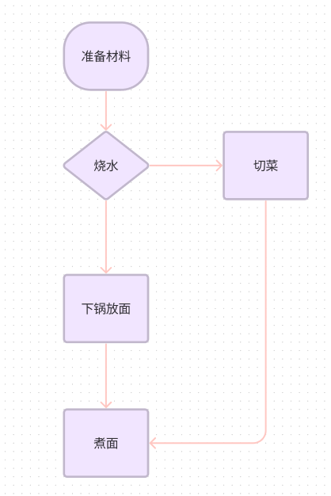


<!--  -->

复杂的程序，不仅仅只有一个判断条件，而是成千上万的循环、判断等逻辑交织而成。即使最复杂的操作系统，也是依赖大量这样的条件判断，程序提前写好的逻辑来决定系统如何行动。这些程序执行的最终结果，对人类而言都是“可解释的”， 即不管程序如何复杂，我们仍然能去找到每个执行逻辑背后的开关，但这样也意味着我们的系统大量依赖人工维护每一处细节。


无数个这样固定在代码里的判断条件和步骤组成了整个程序逻辑。然而环境一旦变化，这些提前与预设的条件都将无法继续产生作用。


而机器学习则不同，它是能用样例学习来不断学习自己以往的经验从而改善自己的行为，并对未来进行预测的过程。

在《人工智能-现代方法》这本书对学习的定义是


> 如果一个智能体通过对世界进行观测来提高它的性能，我们称其为智能体学习（learning）。学习可以是简单的，例如记录一个购物清单，也可以是复杂的，例如爱因斯坦推断关于宇宙的新理论。当智能体是一台计算机时，我们称之为机器学习（machine learning）


这个定义的背后其实最早是来源一个更专业和广泛引用的版本由 Tom M. Mitchell 在其1997年的著作《Machine Learning》中给出。


>“一个程序被认为能从经验E中学习，用于完成任务T，以及性能度量P，如果其在任务T上，根据性能度量P的标准，由于经验E的原因而有所提高。”


上面描述为机器学习提供了一个明确的框架，它强调了三个关键要素：经验（E）、任务（T）和性能度量（P）。在这个定义中，经验通常指的是数据，任务可能是分类、回归、聚类等，而性能度量则是评估学习成果的标准，如准确率、误差率等。Mitchell的定义帮助明确了何时一个程序（或智能体）可以被视为“学习”，并在机器学习和人工智能的研究及应用中发挥了核心作用。


这样一种框架看上去把包括人类在内的智能体学习方式都表达进去了，我们人类正是在不断观测世界，并改变自身行为，最终提高对世界的预测。听上去是不是很神奇，机器竟然也能做这样的事情？ 事实上，我们正朝着这个方向走，只不过，机器一开始学习的领域非常狭窄，比如图像识别、语音识别等。 但一旦达到和人类一样的逻辑推理、思考、自然语言、自主决策等通用智能，这种我们称为 AGI，这也是目前人工智能的理想目标。


这一切可能是如何实现呢？在这之前，我们看下经验到底在机器中如何储存下来。

## 经验的储存分类


机器学习的定义涵盖非常广，神经网络在严格定义上应该属于机器学习，但在我们日常生活会把机器学习和神经网络分离讨论，这是因为神经网络的流行，加上其非常强大，我们在课本、或者属于讨论的时候，而神经网络则被倾向单独分类讨论。机器学习这个术语有时候更倾向表达的是基于非神经网络的机器学习方式。


机器如何才能学习呢？学习的方式有 2 种，参数化学习和非参数化学习。

### ● 原始数据即经验

非参数化学习的经验相当于数据不依赖固定的参数表示，而是以数据原始的形态保存，替代参数，那些保存的数据是用来判断的数据集。 而分类的时候，用固定公式去把新数据和保存的数据集做对比和计算。

举个简单例子，我们把手写字母的 1、2、3、4、5、6..9 的各种经典形状的图收集几百张，处理后存下来，当程序收到一个新的字母 “X”，要判断它是 1-9 哪个字符时。我们可以简单的比较新字母每个像素点坐标和储存的1-9 字母像素坐标之间的距离，看哪些更小，我们找到最小的 K  个字母， 当发现大部分都是 1 的情况，我们就识别出这个字符是 1 。K-NN是这样的方法之一。

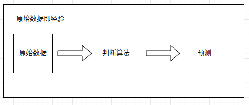


这种方法，适应的学习领域比较垂直，它必须保证新的数据和原始数据集合相似度非常大，对未曾见过的数据类型效果急剧下降。也就是非参数化学习很难达到更通用的能力。

### ● 参数即经验

经验和知识能否不以原始数据的形式储存呢？能，人类就是这样的。大脑百亿级别的神经元和万亿级别的神经元连接就是做这样的事情。我们的神经突触连接结构和连接强度组成了我们的经验。这是理解机器学习和神经网络（transformer）的关键——如何理解经验能以非原始形态的数据储存


想象一下，你每天早上在用手机播放着的一首贝多芬交响曲，它的美妙旋律让你陶醉。这首音乐是以什么形式储存呢，为何能反复播放？因为手机里的音乐文件以二进制的形式编码了每一个音调、音色。不管你的环境如何，音乐总是不变，这类似于非参数化学习方法如何直接利用数据本身。

但有一天，你去演唱会现场听贝多芬交响曲，由几十个人组成的团队同时拉响声音，他们每个人记住了自己的步骤，有的拉弦、有的按大调、有的吹小调。这些不同的声音组合起来，就形成了美妙的音乐。每一个乐手手中的指尖就是“参数”，每个人的参数虽然不同，单独听不能形成音乐，但是现场组合起来却成了贝多芬交响曲这一最终信息。

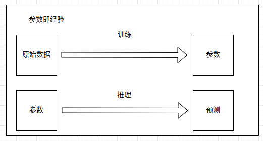

这个例子，我们可以看到，参数化学习，是以“运行时”组合的形式形成最终知识经验。但这个比喻仅供形象的理解，它无法表达完整参数化学习。它和我们的参数化机器学习有一个共同点，它必须提前学习这样知识，间接转换并储存成参数，在需要的时候运行这些参数，再还原成知识。有人把它比喻成压缩，我觉得非常形象。

那从数学上能证明有这样的方法吗？有。

### ● 用数学的函数表达

1.多项式参数

在多项式参数学习中，我们使用多项式来逼近目标函数。一个n阶多项式可以表示为：

```
f(x) = a_0 +  a_1*x + a_2 * x^2 + ... + a_n* x^n
```


其中 a0 ,a1 ,…,an  是多项式的系数，它们是学习过程中需要确定的参数。目标是找到这些参数的值，使得多项式  f(x) 尽可能接近目标函数。传统的机器学习使用的就是大量这样一种方式，比如线性回归等。


2.复合函数参数（神经网络）

神经网络通常是通过多层非线性变换来构建的，每层都可以视为一种复合函数。一个简单的三层神经网络（一个输入层，一个隐藏层，和一个输出层）可以表示为：


```
f(x) = g(b + W_2 *  h(a + W_1 * x))
```


W1  和W2  是权重矩阵，它们是学习过程中需要确定的参数。
a 和 b 是偏置向量，也是需要学习的参数。g 和 h 是一个非线性的激活函数。

复合函数的每一层括号从左向右展开，就是我们常见的经典的神经网络图。可以把每一层理解为一个嵌套进去的复合函数，这个函数内有参数可以调节和控制。


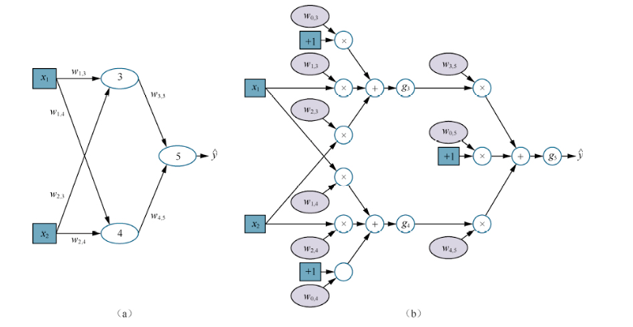

【图源《人工智能-现代方法》】


但多项式和符合函数两者的本质都是输入，经过一个参数巨大、可以调整的函数，最终输出。输出的目的是让函数内的参数贴近（拟合）真实的经验（输入和输出的对应关系）。就像之前的音乐会例子，每个乐队员都要不断学习和调整指法，最终让听众感受到的音乐接近贝多芬交响曲的旋律。


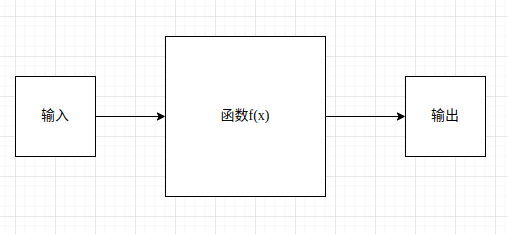


问题来了，如果我们把经验和知识比做一个无限大的连续函数，为什么，能保证无限多参数的多项式和复合函数能找到一些解，无限逼近这些经验呢，是否可能根本不存在这样的解呢？

这里是一个数学问题，数学家已经做了证明，魏尔斯特拉斯逼近定理（Weierstrass Approximation Theorem），证明了多项式可以在一定条件下无限接近任意连续函数。
而根据万能逼近定理（Universal Approximation Theorem），理论上，一个足够大的神经网络可以逼近任何连续函数到任意精度。实际中，神经网络通常比多项式方法更有效，尤其是在处理高维数据和复杂模式时。


也就是在理论上，我们很早就发现了、只要资源无限大、参数无限多、总能够用逼近的方式去无限事物，我们的规律、甚至智能本身也是一种信息，理论上我们就能用无限的参数去逼近。信息保存在参数之中，通过运行时，把它还原出来。


## 神经网络

经过上面的分类，我们应该知道，目前我们想要理解的 transformer  属于参数化学习，且属于神经网络这一类。

神经网络是一类复合函数，这类函数有各种各样的结构，组成了不同的结构模型，前馈网络、残差网络、RNN 循环网络这几个和  transformer 非常相关。

### 理解梯度下降和反向传播

我们前面提到，参数化学习是通过大量参数记录经验，万能逼近定理能证明存在合适的解能无限逼近真实世界。

但是我们却无法证明存在一个公式能求解它，也就是在数学上这个目标函数是不能利用公式直接求解最佳参数，通常叫没有解析解。

没有解析公式的函数，如何找到最佳答案呢？  想象你在做猜数字谜语，出题人提前写好了数字在纸条上，等待你来猜谜。你可以先随便猜写一个答案 “100”，出题人检查后回答：“高了”，于是你继续回答：“0”，出题人回答：“低了”，就这样无限的猜测和尝试中，最终你猜到 了答案为 0.00034.


这个过程我们叫启发式检索，更直接的说法，就是一个一个试呗，对比结果看哪个更接近、合适、更好用。大自然包括整个生物进化都可以看作是这样的启发式算法。

#### 损失函数

我们观察上面这个猜数字游戏，会发现竞猜者判断是否要继续猜测的理由是出题人会告诉你是高了、还是低了。 涉及的具体公式是：

```
相差量 = 实际数字（目标） - 竞猜数字(输出)
```


随着竞猜进行，这个相差量会越来越小，而上面这个公式，在神经网络中，我们叫做损失函数。我们训练的目标就是把损失——即真实的目标和实际输出数据相差量降低到尽可能低。


在神经网络中，会在数学上设计很多这样的损失函数，方便计算实际输出和目标之间的差距。


#### 梯度下降

那对于一个大量层级的神经网络，输入是确定的，输出目标也是确定的，我们如何让函数中的参数找到最合适的值，让这个损失变小？ 早期我们尝试过比较粗暴的做法，人们模仿自然随机选择，生成随机参数，然后把参数套进复合函数，看算出来的结果是不是和目标值更接近，这样不断循环遍历这些参数，最终找到损失尽可能小的参数。这种策略在复杂的网络中通常效率低下，尤其是在面对大型神经网络时。


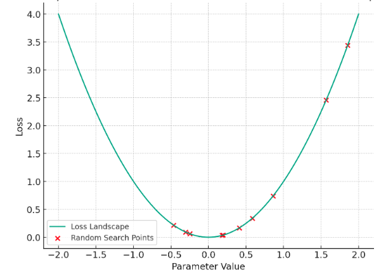


上面的红点可以理解为随机探索的x 参数，当 y 轴值损失越小，说明和预测的目标越接近。然而这种原始的方法肯定非常低效。 有没有更高效的一些方案呢？很早的时候，人们就发现一个函数，如果在 x 点上的斜率是正数，说明接下来 x 的增加会让 y  增长。 如果 x 的斜率是负数，接下来 y  的值会降低，如斜率接近 0 表明在该点，函数的变化率非常小，这通常是函数的极点附近。


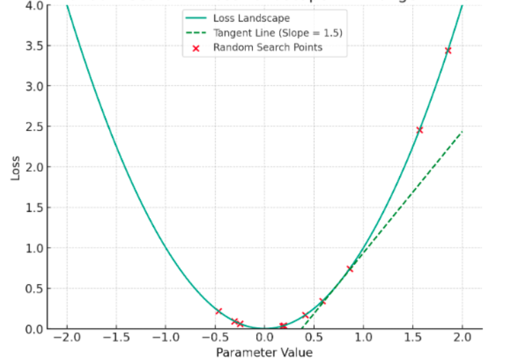

如上所述，右边参数在 1 的斜率是正数，意味着继续增加 X 只会让损失越来越大，我们通过计算损失函数的斜率信息，指导下一次迭代的方向应该是朝着 x 更小的方向进行。这种方式叫梯度下降，梯度就是斜率的平坦程度， 迭代不断继续，这个斜率会越来越低 ，意味着和实际目标越来越接近。 当然真实的损失函数非常复杂，多层网络的手动计算复杂度会更高。

随着算法的逐步改进，人们发现了一些更高效的方案，链式求导的数学方法变得逐渐成熟，在上个世纪末，基于链式求导利用反向传播的过发展得更自动化的。 反向传播就是在多层复合函数计算梯度的过程，从最后一层把斜率向前传播的过程。


### RNN 和序列到序列

#### RNN 
首先我们从 RNN 开始。RNN 中文全称是循环神经网络，最早用于处理自然语言序列的网络，理解它的特点、存在问题是理解后续 transormer的关键之一。

RNN 是基于时间步的循环网络结构：

```
h_t = f(W_hh * h_t-1 + W_xh * x_t  + b_h)
```


h_t-1 是前一个时间步的隐藏状态。用图理解就是网络的参数是共享的，第一次输入一个元素 x1、得到状态z1。接下来继续把上一次状态 z1和新的元素x2作为作为输入再次经过之前层的参数，得到z2，接下来又循环的把 z2和新的输入x3一起经过之前层的参数。这样每次只能接受一个元素、元素是有从头到尾时间顺序的。

这意味着，无论这批元素有多长，网络结构和参数都保持不变。而被循环遍历的这些参数在这一批元素中是共享状态，前面更新的参数，可能会被后面的元素覆盖。


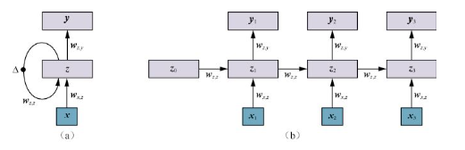

【图源《人工智能-现代方法》】


为什么要这样设计？我们前面说过，从理论上能证明，只要参数足够大，通用网络就能逼近任意连续函数，理想是美好的，现实是残酷的。 早期的神经网络遇到了很多困难，包括如何更有效率的、性能更高的去寻找合适的参数（各种梯度下降优化方案），受制于计算资源和优化方案，我们在通用的前馈网络中很难让机器高效的学习。人为的根据设计“特征”和结构、辅助网络更高效的学习各种样本，是各种结构网络出现的根本原因。

自然语言的一个重要特点是后一个元素依赖前一个元素的表达。比如：“我爱你”，这句话。“你”必须在“我爱”之后，这种前后关系很自然想要了要给网络设计一种“前后关系”的结构。

RNN 的循环遍历，每次执行一个元素，正好满足了语言前后关系的这种特征，让网络能更容易学习到前后时序。并且参数在多次循环中重复利用，也节省了计算和储存资源。


#### 序列到序列

翻译是最典型的序列到序列任务，先给定一个序列['我', '爱', '你']，目标序列是 ['i', 'love', 'you']。

这里的做法就是从源序列开始，计算每个元素的隐藏状态，并把前一个元素的隐藏状态在下一个元素中一起输入，最终 ['我', '爱', '你'] 得到一个输出状态。把源的最终输出状态作于目标序列的输入状态，从 i 开始又依次循环 RNN 。模型经过给定源序列，预测目标序列的训练和参数调整后，最终学习到语言语法和单词的对应关系，逼近真实的翻译任务。

这种基于 RNN 的序列到序列模型，在早期是翻译任务的主要技术路线。但是 RNN  有一个无法很好解决的问题，就是随着文本长度的增加，后面的元素状态会难记住早期的状态，导致长文本上下文翻译不准确。 从现代事后角度，很容易理解的，因为  RNN  的状态参数是共享的，序列越长，同一个参数被更新和使用的频率增加，最新的记忆会更深刻，前面的“记忆”很容易擦除。 这和只有“ 7 秒记忆的鱼” 一样，没有足够参数来容纳上下文状态。


#### RNN  中的注意力机制

为了解决这种问题，RNN 的序列到序列其实也引入了注意力机制。它的做法和前面的差异是。源序列 ['我', '爱', '你'] 得到的不仅仅是一个最终输出状态z3，而是把生成每个词的状态z1、z2、z3保留下来，让目标序列看到。


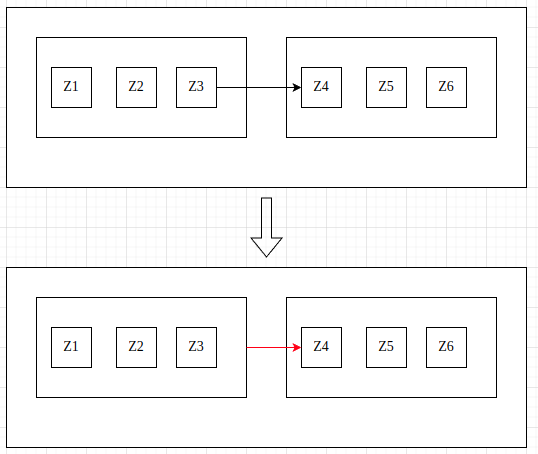


在目标序列 ['i', 'love', 'you'] 开始生成的时候，它不仅仅参考上面的最终状态，也会参考其他前面词（整个源序列）的状态，相当于把历史记忆状态送到最近的时间序列中来。我们通过一些方法让模型学习目标序列和源序列中的哪些词的关系分布（早期注意力算法）。 这种 RNN 的优化方式主要在长上下文中能显著改善，比如几十上百长度的句子，后面的词能够捕获前面的重要的主体，但效果仍然有限。


### 自注意力和 transformer 

本文是讲 transformer，但到目前为之，我们还没有进入主题，对于零基础开始，前面都是必要的铺垫。

即使带注意力机制的RNN，也无法解决一些问题，比如后一个词依赖前一个序列，无法并行训练。其中参数共享虽然能节省资源，但是也意味着更大规模的序列会对参数造成更多次更新，状态层层循环积累过深，限制了模型学习能力。

我们能否在通用的前馈网络模型基础上进行设计，让序列的每个元素平等的、记忆深刻的分布在模型各个参数中。而不是让后面的记忆压缩前面的记忆。

比如：“我前天在深圳世界之窗坐上了过山车，看到一个漂亮的小姐姐，她回头一笑，我忘记不了那天”。

我们放弃 RNN 的前后顺序状态依赖，而是“那天”、“前天”、“深圳”等词都是独立的、同时的进入到网络被记忆和学习。但是前面我们又说过，语言是有前后顺序关系、且上下文的分布影响语言表达。transformer 就是设计了一种让词语可以并行、独立的被模型学习，并且额外提供了一套和 RNN不同的方案，来辅助模型记忆前后词序依赖、上下文分布。


#### 词嵌入理解

自然语言在进入到神经网络之前要被转换成可以数值计算的数值。词嵌入是 一个提前被另一个神经网络训练好的向量词汇表。

为什么不能直接随机的、或者按词语的顺序从0 到N  排列标记成一一映射数字？理论上，这样也可以。但是我们前面说过，即使有万能逼近理论在做支持，我们也要考虑技术实践的性能和效率问题。为了更好的提前捕获词和词之间的关系，我们通常会用神经网络训练一个这样的词汇表，这个词汇表训练好了后，会让相似的词语，在向量数字上处于更接近的位置。简单来说：“国王”、“王后”。这两个通常经常出现在一起，那训练后的词汇表对应的数字也比较接近。并且词汇表还有一些意想不到的特性，比如我们直接拿数字做向量运算计算，会发现：“国王” + "女人" = “王后”。这是一个很神奇的事情，某种程度说明，词嵌入表已经学习到了基本的词分类关系。

词嵌入表一旦训练好是可以公开给其他人复用的，比如我们要使用词嵌入表，不需要从0 开始，而是用别人训练好的表就行，因为一个语言词语关系通常是固定的。

#### 自注意力理解

为什么叫“自注意力”，如果前面的 RNN 注意力是从源序列到目标序列，那么ransformer 的注意力是从源到源、序列到序列整个句子的每一个词都运用，包括自身在内的关系分布。

我们用最早的“我爱你”翻译成“i love you”为例。 在 RNN 中我们会计算目标单词“i” 和源序列的“我”、“爱”、“你”三个单词的状态关系，但不会关注自身单词和自身序列。

但 transformer 中，我们首先会把 “我爱你 ”，整个源序列作为一个整体，计算“我” 和 【“爱”、“你”】的关系“，“爱”和【 “你”、“我”】的关系。 到了目标序列中也是如此，不仅仅计算 “i” 和 '前面中文源序列关系，目标序列中的 'i' 和 和【 love、 you】的关系也会计算。也就算自注意力不仅仅会计算目标序列单词和源的关系。而是计算包括自身序列在内，每个单词和其他任意单词的关系分布。

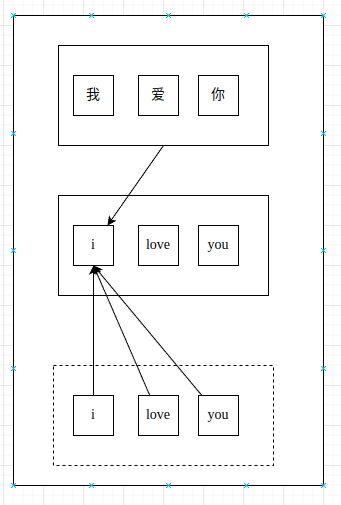


● 计算细节理解（重点）


训练阶段的注意力关系计算过程是这样的，我们先从源序列（编码层）开始，在第一层的编码层首先接受词语，比如“我、爱 、你”，将这些词通过词嵌入转为可以数值计算的词向量（只在第一层有），而词向量通常维度更长，比如几百。我们为了简单假设维度只有 2，它可能是这样子的(数值非真实，随便写的)：

``` javascript
[
  [1,2], // 我
  [1.2,2.1], // 爱
  [0.5,0.6] // 你
]
```

每个词用2个纬度表示，总共有3行，分别代表“我、爱、你”。

接下来会给上面的词嵌入加上位置编码，它是替代 RNN 解决前后语言前后顺序的关键。位置编码是一种特别的函数，经过计算后，可以让上面的向量内部学习从左到右、从前到后语序特征，位置编码是纯函数，而不是需要训练的参数，它是人为施加位置信息到数据中，让模型可以在训练过程辨别（后面会介绍细节）。

带位置编码的向量 Z，接下来会进入自注意力层，这里过程是创建三个矩阵分别是q k v。这三个矩阵一开始是通过Z随机生成的（更接近原始数据），它们的作用是什么呢？它们的目的是记录“我、爱 、你” 中每个词和词的关系。


首先 q k v 是从 Z转换而来，具体是每个 q k v都会对应一个可以调节的参数，q_w 、k_w、  v_w。这个参数分别和Z相乘会得到 q k v矩阵。在一开始这些数值没有任何意义，都是随机的，比如参数。但是后续训练过程会调节，调节到让它符合数据分布规律。


到这里后，估计第一看的人都会蒙逼，没事，希望接下来可以对理解加深有帮助。在最初的时候，会被 q、k、v所迷惑。为什么有这个东西，为什么还有q_w 、k_w、  v_w，为何这个和那个相乘？

我将写下自己理解的过程，首先，“我、爱 、你” 中，我们需要一个变量以 “我” 为主体计算 “爱”与 “你”的关系，也需要一个变量记录 “爱” 为主体，记录 和 “我” 与 “ 你”关系，以此类推，这些计算关系会存放在矩阵中。


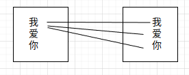


具体如何让它捕获数据关系特征呢，这就是自注意力层的核心。q k v中，我们会让 q 当做查询的矩阵，k当做被查询词的矩阵，既键值。矩阵q 每行向量值和 k 的每列相乘（k被乘是列，其矩阵是转置的），这样q 每个具体的单词分别和包括自身在内的其他单词相乘，得到和他们的关系的信息 D。


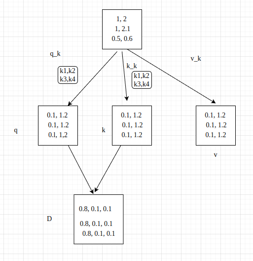


为什么这样相乘就是关系呢？这里乘法只是建立一种数值映射关系， 让 每个词和词之间相互有数值计算关系，相乘是一种方便的方式，最终经过平方根压缩和用softmax转换成关系的概率表示 D（暂忽略这里的数学技巧）。我们的目的是需要一种数学方法，正好可以得到每个单词和单词的概率关系分布。

这里理解的核心是q_k、k_k这几个矩阵参数， 很多教材不会特别讲到这里，q、k是通过这个参数相乘得来，这个参数一开始是可以随机产生，通过它间接生成查询单词和被单词的q和 k 的最终关系 D 。 我们假设 D 它包含了一定的单词关系（实际上，最初因此参数初始化随机，D 肯定关系也是被随机），随着训练经过模型对目标的预测再计算损失并把梯度反向传播回来，这个 q_k 和 k_k等参数会根据梯度被动态调整，调整到预测的目标损失最小为止。也就是我们的关系经过计算以向量 D 的形式呈现，但是调节这个关系的核心是参数，这个参数是可学习的，经过不断训练后才能拟合的。而此刻是随机的。（这是我理解的关键）


 
 包含了词和词的概率关系信息D，接下来和矩阵 v 相乘，因为矩阵 v 没有任何特别处理，它只是简单的参数加权，所以代表了原始单词的信息，把 D 和v加权，相当于把关系信息施加在原始词的向量中，得到 G  。现在我们的G词已经有位置信息、原始信息、和词与词的关系信息了——Attention is All your need。

自始至终，我们通过位置编码和这套 k、v、q的词和词分布关系的计算得到了之前 RNN 需要依赖序列前后状态才能得到的信息，并且这个信息更显著，因为它都是可独立、并行进入到神经网络中。


#### 前馈网络和残差网络

这里不是 transformer 的核心，但是优化的关键。经过上面的自注意力层后，输出的数据会到达一个普通的前馈网络，用于学习特征规律。但是我们训练的过程会有很多难度，比如层数过深，导致梯度难以收敛等。

 残差网络是把经过自注意力层的原始值直接传导到前馈网络，也就是我们的值已经被自注意力层计算过得到了一个新值，但是为了防止原始信息的损失，这个新值会和计算之前的值一起给下个层。从可视化的图来看，就是神经元在网络中跨层连接，这主要是一种实践得来的优化技巧，可以解决训练上的一些困难。

#### 编码器和解码器理解

 transformer  整体是由编码器和解码器组成，而编码器和解码器内部结构是一样的。 从RNN 的角度来看，编码器就是原序列，解码器就是目标序列。比如翻译任务中，被翻译的语言内容先经过解码器，经过层层计算转换网络状态后，作为解码器的目标输入，解码器会预测翻译的目标语言。

编码器组件正是由 上面的注意力层和前馈网络组成一起。编码器和解码器它们都不止一个，会经过很多个相同结构的组件， 目的是尽可能学习到更多的语言规律。


#### 解码器的自回归理解

虽然编码器和解码器在结构上整体一样，但有一个重要的区别： 编码器在运算的过程能知道整个序列，而解码器则是一开始不知道整个序列，依赖自身的输出和之前的词。 因为我们的目的是训练模型让它能在只有历史词的情况下，去预测接下来的词。所以在向量嵌入的时候，会做一种自回归式的掩码处理。

大概逻辑就是从 [我、爱、你] =>  [ i、 *、  *] ， 预测为 [我、爱、你] =>  [ i、 love、  *] ，
最后 [我、爱、你] =>  [ i、 love、 you]。

这样不断递归这个目标的句子，最终训练得到预测的能力。正因为编码器是拥有预测的能力，在实践中，GPT 架构就直接只用 transformer  的解码器，而没有编码器。

 
#### 位置编码理解

在前面的自注意力层理解中，我们省略了位置信息如何编码，这个是 transformer 关键部分。传统的 RNN 是通过时间序列，每一个元素都叠加上一个元素的状态来进行前后关系表达。但在 transformer  模型中并无明显提示位置特征的信息。位置编码就是一种人工外部注入位置信息给向量，让模型自行学习到哪个单词应该在前，哪个应该在后面。

最简单的方式是给每个位置添加一个顺序下标，从1 到N。

``` javascript
[
  [1,2] * 1, // 我
  [1.2,2.1] * 2, // 爱
  [0.5,0.6] * 3// 你
]
```


但这样会有问题，我们的序列不可能是固定长度，如果模型遇到未见过的长度，相当于就失效了。其次无法有效表达同一个位置下，不同维度下标的顺序（比如第一个单词，向量元素 2在 1 后面）。

能否有一种方式，可以适应位置和维度的无限扩大，又同时满足位置移动和维度下标的偏移规律。transformer  提出的基于正弦余弦函数的位置编码，正好具备这样的特征。

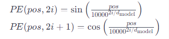

``` python
if i % 2 == 0:
       # 偶数维度
   pos_enc = np.sin(p / (n ** (2 * i / 10000)))
else:
   # 奇数维度
   pos_enc = np.cos(p / (n ** (2 * i / 10000)))

```


其中 p 是位置，i 是维度下标，d 是模型的维度总数。偶数维度下标用正弦，奇数维度下标用余弦。
我们先回顾下正弦函数。

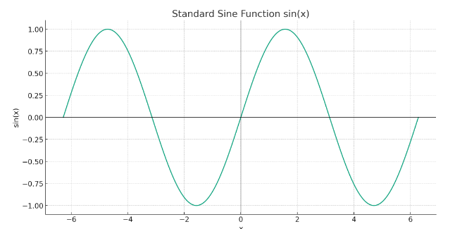

正弦波在 −1 到 1之间波动，并且具备周期性，随着 x 的增加或减少，波形沿x轴移动，但形状和频率保持不变。

实际情况维度总数通常是固定的，变化的量是同一个位置的下标 i ，及不同单词的位置 p。但我们可以假设 p  位置不变，观察函数波会如何变化。


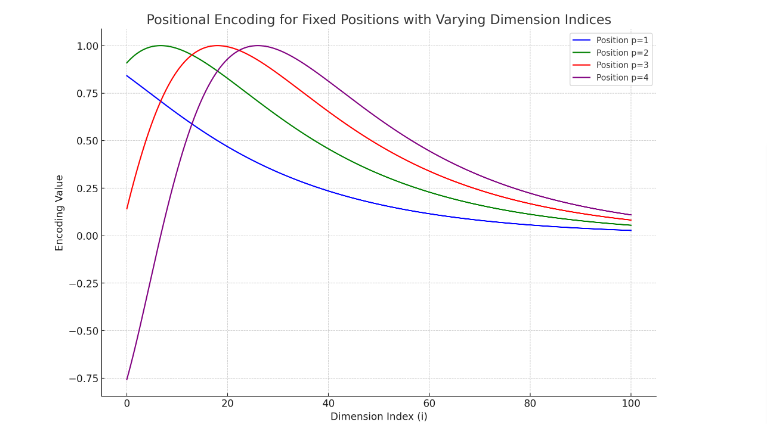


上面横坐标是维度下标 i ，我们绘制了不同位置p1到p4，可以看到同一个位置下，下标增加，值会无限接近 0。因为公式中  i 是分母指数，如果不断增加，会影响波的频率（不断变小），分子会趋向无限大，整个正弦函数结果会无限接近 0。而分子是自变量，变化速率是常数，P 的增加，仅仅让波向右平移。

我们把余弦叠加上去，增加位置：

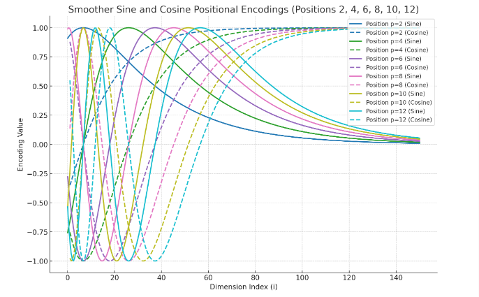

其实这个图 i为负数部分省略了，实际是越往左边，波动越剧烈，频率是随着 i 不断增加而缓和。p  不影响波动，影响平移位置，p  越大，则越往右边移动。通过波的频率控制维度表示下标、波的平移表示 p 位置的移动。由于正弦是周期性的，位置可以无限增加。

还有一个更容易理解的可视化热力图，我们把 i 作为横轴，把 p 作为纵轴，交叉的点代表位置编码的值，由于正弦余弦的位置编码结果必定分布在-1到1 之间，我们可以控制色系，-1 为冷色，1为暖色，观察热力图分布。


这是一个总维度为 200 ，位置和维度下标的热力图。这个图非常像我们平常看图猜测字。

假设给你一个句子：“XXX”。遮挡绝大部分显示如下

图1： 几乎没有人能看出什么句子的位置顺序。
接着把遮挡的部分变小，这个时候有一部分人可以看清楚了。

图2：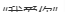

图3：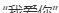

图4：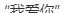

到图4 大部分人能够猜测到是“我爱你”三个字的顺序了。上面的热力图如果只看前面几个维度下标其全部位置的色彩分布，根本看不出句子规律：

<!-- 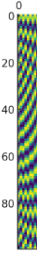 -->


但是一旦看到更多维度，我们就能观察到前后规律变化了。

<!-- 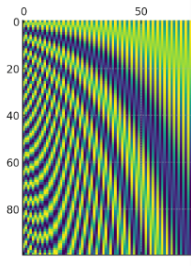 -->


理论上纯正弦函数也能观测到这种位置规律变化。 有人测试和讨论过基于纯正弦，而不是交叉使用余弦的位置编码。但是在文本句子稍微长一点的场景下，效果立马奔溃。其他类似的周期函数，也都不如正选和余弦交替的效果。（参考来源）

【纯正弦热力图-by ai】

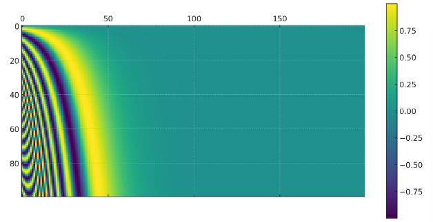


但上面的可视化图都是人类特意处理过的，神经网络并无法看到，但它能从里面的数据模式，识别到位置规律，并且维度下标无奇偶交替的编码会影响性能，真的非常神奇。原文作者也没有解释具体原因，这些是实验性的最佳效果。


## GPT和chatgpt

在上面的编码器部分，解释了很多模型并没有用原始的 transformer 架构， 而是仅仅采用它的解码器。GPT 就是这样的一个典例。GPT 的全称是Generative Pre-trained Transformer，生成式预训练Transformer。

具体怎么做呢？ 就是把大量书籍、网络文本等原始内容作为语料直接分批次让编码器递归的学习，随着训练知识和网络参数的增加，模型在训练过程，参数逐渐学习到了这些语料的语言规律，并能在给定句子的情况下，进行文本续写。

2018年，OpenAI就推出了第一款GPT，但是直到 2022年才被发扬光大。国内其实很多公司早期也做过投入，但都没有成为现象级产品。这里有两个原因，第一个就是算力投入和收入不成正比，初期很少有其他公司全力投入，也看不到这个方向的落地场景。第二个就是 OpenAI 非常坚信这个方向是实现 AGI 的路径，投入的资源非常大，训练的参数在不断变大，从gpt2到 gpt3  上千亿，模型续写能力越来越强，最终熬到现象级产品落地。

chagpt 就是一个在大量预训练文本的基础上，再次进行人类监督微调的落地产品。原始 GPT 训练出来的模型，只是具备语义理解和续写能力，无法遵守和理解人类指令。但是在GPT 训练的基础上，我们给它再次做人为的监督训练，使其预测符合人类指令。

具体而言就是，我们给大量这样的数据： 

[用户：你好]=>[助手：你好，我是 chagpt ，请问需要什么服务？]

[用户：请翻译文本 i am happy 到中文]=>[助手：我很快乐]

[用户：你能讲一个笑话吗]=>[助手：xxxxx]


这些由人类日常生活、工作、价值等组成的对话和指令提前被设计好，在 GPT 模型的基础上进行再次训练，让它拥有学习遵守指令的能力，并且保留了原有内在学习到的知识。这种人类监督对齐的方法，让 GPT 有了聊天能力，这就是 chatgpt 引爆全网的关键。

经过目前一年 LLM开源社区的活跃，目前社区有大量被预训练好的 GPT 模型，也有大量监督对齐的开源语料，很多模型可以在消费级机器上微调和推理。


## 几个重要关参数

GPT 模型中一些常见参数

●维度

我们在模型推理过程中，首先接受到的是纯词组成的自然语言，这些词会被转换成向量形式的词嵌入，通常是每个词有相同的词嵌入维度。上面的例子我们用了 2 个维度，实际中一个词有几百上千，比如 768 个维度组成，简单说就是一个 768 的长度的数组组成一个单词。

●token

 一段话，由几百上千甚至更多的词组成，一个词并不是一个字，而是词嵌入的一系列词对：“你”、“生活”、“我”、“王后”、“”国王”、“”望梅止渴”等。也就是一个词嵌入的词代表一个 token， 每个 token 由一个特定维度大小的向量组成，具体由维度词嵌入训练过程决定（参考上面的维度）。 而一段话到底是多少个 token，看这些词是如何被分割成哪些具体词对，通常确定分成算法下，我们是可以推断出一个段落的 token 数。
那模型一次能接受多少 token 呢？ 在不同模型中，我们会看到支持的上下文不一样，有的是 2048，有的可以是200K 的上下文。这取决于模型在训练的过程每个批次是用最大多少上下文的语料去训练，比如模型如果只训练 2048 这样长度的语料，那学习到的只有 2048 这样长度的上下文关系。如果模型用 200K，一本书这么长的语料塞进一个批次去训练，那模型能学习到的上下文自然更多。越长上下文，训练难度越大，需要更多资源。

●temperature 温度

在上面的编码器和解码器架构中，解码器最终输出预测值，但此时的值是一种向量矩阵，这只是一个模型学习到的网络的中间状态，而没有对应现实中的文本，我们需要把这个状态转为真正的人类可读文本，在解码器结束的时候，会进行这个工作。这里会由一个前馈神经网络进行，它的输入是解码器的向量，输出则是词汇表维度大小的向量，这个词汇表的下标对应了每一个人类的词汇。也就是模型把一个词嵌入维度的向量投射到了一个更大维度的、包含人类词汇表长度的向量中，这个向量我们叫logit向量。 

举个例子，我们假设整个中文的词汇只有 4 个 [ 我 、很  、喜欢,、你  ]。给定[我、喜欢、*]，预测第三个词，编码器输出的向量可能是 [1,2]，最终进行线性前馈网络，转成 [11,22,44,55] logit 向量，在整个中文词表中的关系分布。最终 softmax 函数（一个把词向量转成百分比概率分布的方法）转成[ 0.1、0.1、0.1、0.7]。这些词组成的概率加起来为1， 模型会从前面这个向量中根据概率选择词汇，我们能看到最后一个下标 “你” 的概率为 0.7，大概率会选中这个词。 而 temperature 就是调节这个 softmax 函数缩放大小的一个值，如果温度为 1，意味着和最原始的分布一样，如果温度为 0.5 ，意味着生成的概率会更尖锐，变成 [0.05、0.05、0.9]，可能性更大的词概率变大更高，而可能性更小的词概率变得更小，这样会让输出结果更确定。 反之，温度大于 1，softmax 函数的输出分布概率会更平缓，选词的可能性则更多。

●k_top

在实际的词汇表中，不可能和上面的实例一样，只有 4 个字，真实的场景是会有几万的总词汇。softmax 函数会为每一个词生成概率分布，虽然结果上可能性最大几个词的概率加起来会接近1，其他的数万的词概率并非0，而是非常低的值，比如 0.0001，但这种低概率事件也可能性发生，一旦发生，模型会预测出一个完全无关的词。 为了避免这种低概率事件，我们可以设置一个参数 K  模型只从概率最高的前面K 个单词中选词，K 的设置避免了低概率事件，K 越低，模型每次选择的词变少，K 越多可选数则更多。

●p_top

p_top 和 k_top 的作用类似，规避低概率事件，但计算方法不一样：当前面N 个单词的累计概率如果达到数值 P，那么就终止接下继续的词。


## 理解黑盒


到这里，我们已经把 GPT 的引擎盖剖开并尝试去理解，然而，我们并不能真正解释 chatgpt 的输出。神经网络几乎是一个实践先于理论的学科，我们在通过各种各样的调参、更新算法、不断观测模型预测的结果，最终得到更好的架构。对人类而言，模型的运作原理是透明的，但输出的结果却是不透明的， 这是我们经常被调侃“炼丹”的来源。

现代多层神经网络的参数量多达百亿、千亿、甚至万亿级别，模型在训练的过程是自动根据梯度更新每个参数的权重，这些权重就是模型学习到的部分经验，模型运行的时候，有上亿参数同时被组合运行计算，得到结果。每个参数到底起到怎么样的作用，不同的输入排列组又是呈指数增加，这种复杂度的理解已经超过了人脑能直接理解的范畴，所以，在整个输出结果是无法解释，我们叫“”黑盒”。

既然人类理解不了模型的每个参数起到怎么样的作用，那能不能用 AI 来预测AI ，用一个模型来理解另一个模型的输入输出过程呢？OpenAI 提出的模型监督对齐就是一种这样的技术，用小模型去预测大模型的输出，从而评估哪些参数发生了作用。想到这里，感觉是用一个黑盒去理解另一个黑盒，这是不是同样不可控呢？也许人类进入到一个需要用其他智能辅助自身智能的时代。


## 结

上面99%的文字是按个人的理解手工码的，非 AI 生成（部分图片由 AI 辅助生成）、非直接引用教材。可能存在错字、语句不顺、口语化、不严谨等，仅供参考。主要是方便自己回顾和理解、如果对其他人有帮助再好不过。

——————

参考：

- 《人工智能-现代方法》
- 《BERT 基础教程》
- https://jalammar.github.io/illustrated-transformer/ (非常推荐。作者专门利用可视化来介绍技术，可以收藏，如果能回头看懂这篇，基本就理解了 transformer)
- http://www.bimant.com/blog/transformer-positional-encoding-illustration/
